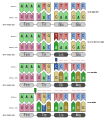

# Introdução

<br>

```{r livrogenpop, echo = FALSE, fig.align = 'center', out.width="400px", fig.cap="O livro _Princípios de Genética de Populações_, dos professores Daniel L. Hartl e Andrew G. Clark, apresenta os princípios básicos da genética e estatística que são relevantes para estudos populacionais e examina as forças evolutivas que afetam a variação genética dos nível molecular ao orgânico"} 

```

<br>

:::reference

Hartl DL, Clark AG. 2010. Princípios de Genética de Populações. 4ª Ed. Artmed, Porto Alegre. 660 p. ISBN: 978-0-87893-3082

:::

<br>

A **Genética de Populações** é uma subárea da Genética que lida com as diferenças dentro e entre as populações.

Compreende a origem, quantidade e distribuição da variação genética presente em populações de organismos, ao longo do tempo e do espaço.

A variação dos genes no tempo e no espaço constitui a base fundamental da mudança evolutiva (microevolução).

Para tal, se baseia em três premissas básicas:

1) O DNA pode replicar

2) O DNA pode mutar e recombinar

3) O DNA interage com o ambiente e produz fenótipos

<br>

```{r microevolucao, echo = FALSE, fig.align = 'center', out.width="800px", fig.cap="A genética de populações estuda a microevolução - mudanças na frequência de um gene em uma população"} 

```

<br>

## O DNA pode replicar

A replicação do DNA permite que um gene, ou sequência de nucleotídeos:

- seja passado de uma geração para a próxima; e 

- exista em múltiplas cópias em diferentes indivíduos.

<br>

```{r mitose, echo = FALSE, fig.align = 'center', out.width="600px", fig.cap="A informação genética contida no DNA é duplicado pela replicação (esquerda) e dividido entre as novas células pela mitose (esquerda)"} 

```

<br>

Os genes possuem uma existência no tempo e no espaço que transcende os indivíduos que temporariamente os carregam.


A existência biológica dos genes no tempo e no espaço é a base física da evolução.

A continuidade de um gene no tempo e através do espaço se manifesta físicamente por meio de uma população de indivíduos se reproduzindo.

Indivíduos não possuem continuidade no tempo e no espaço; indivíduos são eventos únicos que vivem e morrem e não podem evoluir. 

Os genes carregados pelos indivíduos são virtualmente imortais por meio da replicação do DNA.

A evolução é possível somente no nível de uma população se reproduzindo, e não no nível dos indivíduos contidos dentro da população.

<br>

```{r birthdeath, echo = FALSE, fig.align = 'center', out.width="800px", fig.cap="A replicação do DNA permite que a informação genética persista para além da existência dos indvidíduos que a carrega."} 

```

<br>

A genética de populações pode operar em diferentes níveis hierárquicos populacionais dentro de uma espécie.

Comumente ela foca a população local, ou deme, uma coleção intercruzante de indivíduos da mesma espécie que vivem em proximidade suficiente para compartilhar um sistema de cruzamento.

<br>

```{r coalascencia, echo = FALSE, fig.align = 'center', out.width="500px", fig.cap="A continuidade da informação genética ao longo das linhagens reprodutivas, e seus processos de diversificação, apresenta uma estrutura hierárquica temporal - árvore de relações evolutivas. Redesenhado de Leaché et al. ([2009](https://doi.org/10.1073/pnas.0906380106))."} 
knitr::include_graphics("figs/coalascencia.svg")
```

<br>

Uma vez que o deme é uma população que se reproduz, indivíduos são continuamente substituídos por nascimentos e mortes, mas a população local é uma entidade dinâmica que persiste através do espaço e do tempo além dos indivíduos que temporariamente à compõe.

<br>

```{r poptime, echo = FALSE, fig.align = 'center', out.width="400px", fig.cap="As relações do tipo ancestral-descendente entre indivíduos de uma geração com a outra determinam a continuidade temporal das populações."}

```

<br>

:::quote

**Sistema de cruzamento** -- Conjunto de regras por meio das quais indivíduos se organizam para reproduzir sexuadamente.

:::

<br>

Associada a cada população local de indivíduos há uma população local de genes correspondentes, chamada **fundo gênico** (_gene pool_).

O pool gênico pode ter duas definições:

Empiricamente = o conjunto de genes coletivamente partilhado pelos indivíduos de um deme.

Teoricamente = a população potencial de gametas produzidos por todos os indivíduos de um deme.

O pool gênico associado a um deme é descrito mensurando os números e frequências de vários tipos de genes ou combinações de genes no pool.

<br>

```{r demepool, echo = FALSE, fig.align = 'center', out.width="600px", fig.cap="O _pool_ gênico das populações como representação teórica do número de alelos carregados coletivamente pelos indivíduos  de um deme."}

```

<br>

:::quote

**Evolução** -- Mudança ao longo do tempo nas frequências dos genes ou combinações destes no _pool_ gênico das populações. A evolução é uma propriedade emergente das populações de indivíduos que se intercruzantes, que não se manifesta nos próprios indivíduos que as compõem.

:::

<br>

## O DNA pode mutar e recombinar

Evolução requer mudança, que somente pode ocorrer quando existem alternativas. 

Um prérequisito necessário para a evolução é a diversidade genética, cuja fonte última é a mutação.

Há diferentes formas de mutações, as quais criam diversidade na população de genes presentes no pool gênico.

<br>

```{r mutacao, echo = FALSE, fig.align = 'center', out.width="600px", fig.cap="Principais mutações no nível do gene e suas alterações em uma região codificante."}

```

<br>

Mutações criam diversidade alélica.

Alelos são simplesmente formas alternativas de um gene. 

Em alguns casos são focadas regiões do DNA que podem não ser um gene no sentido clássico. O termo haplótipo se refere a uma forma alternativa (sequência específica de nucleotídeos) entre as cópias homólogas de uma região definida do DNA, ou locus gênico.

<br>

```{r cromossomo, echo = FALSE, fig.align = 'center', out.width="600px", fig.cap="O lócus (ou região) gênico em um cromossomo e sua variação alélica."}

```

<br>

A diversidade genética criada pela mutação pode ser amplificada por mecanismos genéticos de recombinação e diploidia. 

A reprodução sexuada e a diploidia podem ser pensadas como mecanismos que criam novas combinações de genes.

Recombinação compreende basicamente os eventos meióticos tanto de crossing-over quanto de segregação independente. 

Mas pode incluir eventos não-meióticos que criam novas combinações de genes nos dos gametas, passível de ser transmitida para as próximas gerações.

A distinção entre mutação e recombinação muitas vezes é borrada uma vez que uma recombinação pode ocorrer dentro de um gene de dessa forma criar novos alelos ou haplótipos.

<br>

```{r meiose, echo = FALSE, fig.align = 'center', out.width="600px", fig.cap="Os principais eventos da meiose e os eventos de recombinação genética (variabilidade)."}

```

<br>

## O DNA interage com o ambiente e produz fenótipos

Um fenótipo é um caráter mensurável de um indivíduo.

No passado, os genes podiam ser identificados somente por meio de seus efeitos no fenótipo. 

O gene era nomeado pelo seu efeito fenotípico, levando a uma equação simplória e errônea entre genes e fenótipos.

<br>

```{r simplephenotype, echo = FALSE, fig.align = 'center', out.width="400px", fig.cap="A relação simplória entre genótipo e fenótipo, tipicamente evocada no imaginário leigo."}
knitr::include_graphics("figs/genotype_phenotype_oversimplified.svg")
```

<br>


As informações contidas no DNA controlam processos dinâmicos, que sempre ocorrem em um contexto ambiental.

É a interação da informação genética com as variáveis ambientais através dos processos de desenvolvimento que geram os fenótipos.

Fenótipos emergem de processos dinâmicos geneticamente influenciados cujos resultados dependem de um contexto ambiental

<br>

```{r dynamicphenotype, echo = FALSE, fig.align = 'center', out.width="800px", fig.cap="A relação dinâmica entre genótipo e fenótipo, a partir da qual associações diretas nem sempre são possíveis."}
knitr::include_graphics("figs/genotype_phenotype_dynamics.svg")
```

<br>

Considere os seguintes fenótipos de um organismo:

- Ser viável $\times$ ser inviável -- o fenótipo da **viabilidade**, a capacidade de um zigoto de completar seu desenvolvimento até a forma adulta.

Uma vez sendo viável:

- Estar-vivo $\times$ Estar-morto -- o fenótipo da **sobrevivência**, a habilidade do indivíduo adulto de sobreviver ao ambiente até se reproduzir.

Uma vez sendo viável e estando vivo:

- Produzir gametas $\times$ não produzir gametas -- o fenótipo da **fecundidade**, a habilidade de um indivíduo adulto vivo de prozuzir gametas capazes de gerar um zigoto.

Uma vez sendo viável, estando vivo e produzindo gametas:

- Gerar uma prole $\times$ não gerar uma prole -- o fenótipo da **fertilidade**, o número de descentes que um indivíduo adulto vivo e fecundo pode produzir no ambiente.

Viabilidade, sobrevivência, fecundidade e fertilidade são quatro fenótipos fundamentais na teoria microevolutiva, uma vez que coletivamente determinam as chances de um indivíduo passar seu DNA para a próxima geração no contexto do ambiente.

O fenótipo coletivo, produzido pelos quatro componentes, é chamado de **adaptabilidade reprodutiva** (ou _fitness_).

<br>

```{r fitness, echo = FALSE, fig.align = 'center', out.width="400px", fig.cap="A adaptabilidade (ou _fitness_) reprodutiva é mede a viabilidade, sobrevivência, fecundidade e fertilidade diferencial dos genótipos."}
knitr::include_graphics("figs/fitness_scheme.svg")
```

<br>

O fenótipo do _fitness_ une a **premissa 3** ("o DNA interage com o ambiente e produz fenótipos") com a **premissa 1** ("o DNA pode replicar"). 

O DNA pode se replicar somente no contexto de um indivíduo viável, sobrevivendo em um ambiente, fecundo e fértil o suficiente para passar seus genes para a próxima geração.

Esta unificação de premissas implica que a probabilidade da replicação do DNA é determinada pela interação do genótipo com o ambiente.

Em uma população de indivíduos geneticamente diversos, possível devido a **premissa 2** ("o DNA pode mutar e recombinar"), é possível que algumas variantes genotípicas irão interagir com o ambiente de forma a produzir mais ou menos atos de replicação de DNA do que outras variantes.

Assim, o ambiente influencia as chances relativas dos vários genótipos de replicar seu DNA.

A influência do ambiente (**premissa 3**) sobre a replicação do DNA (**premissa 1**) em populações geneticamente variáveis (**premissa 2**) é a base da seleção natural, e uma das maiores características emergentes da microevolução: a adaptação ao ambiente.

:::quote

**Adaptação** -- atributos e características dos organismos que os ajuda a sobreviver, reproduzir e deixar descendentes em ambientes específicos.

:::


