# Polimorfismo Genéticos e Marcadores Moleculares

<br>

```{r Erythrura, echo = FALSE, fig.align = 'center', out.width="400px", fig.cap="Uma pequena região gênica controla as mudanças de cor na cabeça dos tentilhões de Gould (_Erythrura gouldiae_). Ilustrado em Des Murs ([1849](https://www.biodiversitylibrary.org/item/109479#page/9/mode/1up))."}
knitr::include_graphics('https://upload.wikimedia.org/wikipedia/commons/7/7d/Erythrura_gouldiae_1849.jpg')
```

<br>

:::reference

Toomey et al. 2018. doi: [10.1098/rspb.2018.1788](https://doi.org/10.1098/rspb.2018.1788)

Kim et al. 2019. doi: [10.1038/s41467-019-09806-6](https://doi.org/10.1038/s41467-019-09806-6)"

:::

<br>

## Mutações $\times$ Polimorfismos 

Uma **mutação** é uma variante nova, tendo aparecido recentemente na linhagem germinativa.

Uma variante é dita mutante quando direta e abertamente causa uma doença e/ou reduz a aptidão.

Um **polimorfismo** é uma variante ancestral em uma população, herdada intacta dos parentais.

Uma variante é dita polimórfica quando não causa doença, é neutra, ou influência levemente características quantitativas.

Uma mutação em uma população pode se tornar um polimorfismo em outra se conferir uma vantagem seletiva e aumentar em freqüência.

Arbitrariamente, mutações e polimorfismos são definidos com base nas suas frequêcnias em uma população, onde:

$${Mutação} < 1 \%$$

<br>

$${Polimorfismo} > 1 \%$$

<br>

A **Genética mendeliana** aborda associações entre Fenótipo e Genótipo, estando restrita a um pequeno número de espécies modelo. Nesta somente um número reduzido de características estão disponíveis para análise por meio de **polimoefismos genéticos**, que comumente estão associadas à características recessivas deletérias.

A **Genética molecular** envolve a análise direta da informação genética, e pode abranger todas as espécies. Nesta está disponível um número enorme de **marcadores moleculares**, permitindo a análise de regiões expressas e não expressas do genoma.

:::quote

**Polimorfismos genéticos** -- A ocorrência em uma população (ou entre populações) de várias formas fenotípicas associadas a alelos de um gene ou homólogos de um cromossomo.

**Marcadores moleculares** -- Todo e qualquer fenótipo molecular oriundo de um gene expresso (RNA ou proteína) ou de um segmento de DNA que corresponde a regiões codificantes ou não de um genoma.

:::

<br>

```{r polymarker, echo = FALSE, fig.align = 'center', out.width="600px", fig.cap="As informações genéticas usadas em estudos populacionais podem ser obtidas a partir de polimorfismos genéticos e marcadores moleculares."}
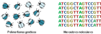
```

<br>


## Dinâmica evolutiva e ecológica dos polimorfismos

<br>

```{r evodinamica, echo = FALSE, fig.align = 'center', out.width="600px", fig.cap="Ao longo das geraçoes (tempo), variantes genéticas podem surgir (I) e desaparecer (III), enquanto sao (IV) ou não (II) estruturadas / influenciadas pelos ambientes (espaço)."}
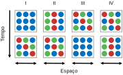
```

<br>

I. Surgimento de novas variantes genéticas (Mutação).

II. Variantes restritas geograficamente se dispersam ao longo dos ambientes (fluxo gênico).

III. Perda de variantes genéticas (deriva / seleção).

IV. Organização da variação ao longo de um gradiente ambiental / geográfico (seleção).


## Evolução dos polimorfismos em diferentes escalas

Na microevolução, marcadores moleculares dizem respeito a variantes genéticas encontradas em populações de uma mesma espécie, sendo utilizadas em genética de populações. 

Na macroevolução, esses marcadores correspodem a regiões gênicas homólogas  (ortólogas) de diferentes espécies, que acúmulam mutações ao longo do tempo, e podem ser utilizados em filogenética.

<br>

:::quote 

**Anagênese** -- Evolução dentro de um ramo evolutivo.

**Cladogênese** -- Evolução entre ramos evolutivos.

::: 

<br>

```{r genearvore, echo = FALSE, fig.align = 'center', out.width="400px", fig.cap="As mudanças evolutivas ao longo das gerações (anagênese) em relação ao processo de diversificação (cladogênese)."}

```

<br>

A evolução de sequências de DNA, e dos produtos por elas codificados, é produto dos padrões e taxas de mudança ao longo do tempo evolutivo.

Assim, diferentes questões podem e devem ser abordadas por diferentes marcadores moleculares. 

Estudos multi-loci evidenciam conflitos e corroboram congruências entre as histórias evolutivas das diferentes regiões gênicas.

```{r geneconflito, echo = FALSE, fig.align = 'center', out.width="800px", fig.cap="Diferentes marcadores 'contam' diferentes histórias evolutivas, que nem sempre estão de acordo com o processo de diversificação."}

```

<br>

## Padrões de herança

A localização genômica de uma região gênica pode determinar diferentes padrões de herança.

- Herança biparental -- genes co-dominantes (contribuição de ambos os sexos) em regiões gênicas nucleares autossômicas e pseudo-autossômicas; essas regiões sofrem recombinação na meiose.

- Herança uniparental -- genes dominantes (contribuiçao de somente um dos sexos) em regiões gênicas nucleares no cromossomo Y (herança patrilinear) e extra-nucleares no DNA mitocondrial (herança matrilinear); essas regiões não sofrem recombinação.

<br>

```{r tiposheranca, echo = FALSE, fig.align = 'center', out.width="800px", fig.cap="Os padrões de herança biparental e uniparental em regiões gênicas autossômicas (nuclear) e mitocondriais (extra-nuclear)."}
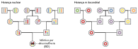
```

<br>

## Taxas de mutação

A função ou estrutura de uma região gênica pode determinar diferentes taxas de mutação.

- Regiões funcionais ou codificantes  -- baicas taxas mutacionais pois sofrem uma pressão de seleção (positivas ou negativas) dependente da importância da função para a célula/organismo. 

- Regiões não-funcionais ou não-codificantes -- apresentam acúmulo de mutações devido às baixas pressões seletivas (neutras).

- Regiões de repetição _in tandem_ -- evolução por derrapagem (_slippage_) da replicacão; mutações dinâmicas a cada ciclo replicativo. 

<br>

```{r relogiomolecular, echo = FALSE, fig.align = 'center', out.width="600px", fig.cap="As taxas de mutação em genes codificantes de proteínas estão relacionadas à função desses genes devido a diferentes pressões de seleção."}
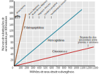
```

<br>

## Marcadores moleculares

A seguir são apresentados os principais marcadores utilizados em genética de populações.

A popularidade desses marcadores ao longo dos anos está diretamente relacionado a relação custo-benefício das metodologias de análise associadas. Com o desenvolvimento de novas metodologias ocorre o barateamento dos custos de análise de última geração, capazes de analisar múltiplos marcadores ao mesmo tempo, e gerar estudos mais compreensivos.

<br>

```{r markeryear, echo = FALSE, fig.align = 'center', out.width="800px", fig.cap="Popularidade ao longo dos anos de diferentes marcadores moleculares na genética de populações desde o surgimento da biologia molecular, no século XX, até o início do século XXI. Ver Schlötterer ([2004](https://doi.org/10.1038/nrg1249)) e Seeb et al. ([2011](https://doi.org/10.1111/j.1755-0998.2010.02979.x))"}
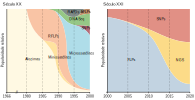
```

<br>

### Aloenzimas

A análise de aloenzimas (ou alozimas) baseia-se na migração diferencial em eletroforese de enzimas com cargas e tamanhos diferentes devido as modificações subjacentes nas sequências de bases desses genes. 

Esses marcadores geralmente envolvem enzimas que desempenham funções muito básicas, podendo ser encontradas em quase todas as formas de vida, sendo asism um método de análise universal.

A detecção da variação genética se baseia na revelação por coloração histoquímica, a partir da qual podem ser visualizadas bandas correspondentes aos fenótipos bioquímicos dessas enzimas.

Como marcadores moleculares, as aloenzimas são co-dominantes.

Os polimorfismos ocorrem necessariamente em regiões codificantes, podendo ser neutros ou com efeitos positivos ou negativos no fenótipo do indivíduo. 

<br>

```{r allozymes, echo = FALSE, fig.align = 'center', out.width="800px", fig.cap="Esquema da eletroforese de marcadores de aloenzimas monoméricas e diméricas e seus genótipos associados. Isoenzimas estão identificadas por cores diferentes. Ver Wendt et al ([2009](https://doi.org/10.1590/S1516-89132009000600016))."}
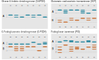
```

<br>

| Vantagens   | Desvantagens |
| :--:        | :--:         |
| Barato      | Requer material fresco ou congelado |
| Protocolos universais | Alguns loci apresentam proteínas instáveis |
|             | Número limitado de marcadores disponíveis |
|             | Potencialmente alvos diretos de seleção (fenótipo bioquímico) |

<br>

### RFLP

Polimorfismos de Tamanho de Fragmento de Restrição

Polimorfismos detectados gerados por digestão enzimática com endonucleases de DNA genômico ou amplificado por PCR. 

Como marcadores moleculares, são tipicamente neutros e podem ser co-dominantes ou dominantes.

Diferentes endonucleases apresentam sítios de ligação e corte do DNA diferentes.

Análise direta de mutações nos sítios de reconhecimento de endonucleases por meio de mudanças no tamanho dos fragmentos gerados em padrões eletroforéticos

<br>

```{r rflp, echo = FALSE, fig.align = 'center', out.width="800px", fig.cap="Polimorfismos de tamanho de fragmentos de restrição (RFLPs). Na esquerda, o mecanismo de clivagem da enzima de Restrição _Eco_RI. Na direita, a digestão _in silico_ do gene 16S do DNA ribossomal de um fitoplasma do subgrupo 16SrII-C usando diferentes enzimas de restrição (PM, marcador de peso molecular)."}
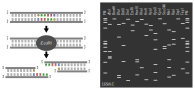
```

<br>

| Vantagens   | Desvantagens |
| :--:        | :--:         |
| Barato      | Baixa reprodutibilidade |
| Grande número de informações que podem ser refinadas posteriormente | Majoritariamente dominante |
|             | Análise, automação e comparações entre estudos difíceis |

<br>

### Sequência de nucleotídeos

Cada posição da sequência pode ser informacional.

As sequências de DNA são marcadores tipicamente neutros e dominantes, que podem ser utilizados para análises populacionais e filogenéticas.

Estas podem definir alelos ou haplótipos, e as posições podem ser usadas para tabular caractéres, onde cada nucleotídeo corresponde a um estado de caráter.

<br>

```{r DNAhaplotypes, echo = FALSE, fig.align = 'center', out.width="400px", fig.cap="Sequência de nucleotídeos de DNA alinhados entre sete indivíduos. "}
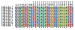
```

<br>

| Vantagens   | Desvantagens |
| :--:        | :--:         |
| Maior nível possível de resolução      | Muito caro |
| Não-tendenciado |   | 
| Facilidade de comparaÇão entre estudos e formação de bancos de dados  |   |

<br>

### SNPs

Polimorfismos de nucleotídeo único ou Polimorfismos de um único nucleotídeo

Representam uma variação de um único par de base em uma região gênica específica, mas alguns autores consideram substituições de poucos nucleotídeos ou mesmo inserções e deleções como SNPs.

Como marcadores moleculares, são co-dominantes.

Estes polimorfismos podem ou não ocorrer em regiões codificantes, podendo ser neutros ou com efeitos positivos ou negativos no fenótipo do indivíduo. 

SNPs são ditos causativos quando alteram a quantidade ou a função de proteínas por ocorrerem em regiões regulatórias e codificantes, ou podem estar ligados a estas, sem efeito no fenótipo. 

SNPs são muito numerosos no genoma (_ca._ 1:300 pb em humanos). Estima-se que 90% da variação genética intraespecífica se deva a estes polimorfismos e que cada indivíduo apresente um arranjo genômico único em relação a eles.

<br>

```{r SNPs, echo = FALSE, fig.align = 'center', out.width="400px", fig.cap="Polimorfismos de nucleotídeo único em uma região do DNA e sua frequência em uma população. "}
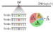
```

<br>

| Vantagens   | Desvantagens |
| :--:        | :--:         |
| Baixa taxa de mutação   | Substancial heterogeidade nas taxas de evolutivas |
| Abundância | Desenvolvimento caro  | 
| Fácil caracterização  | Podem estar tendenciados  |
| Novas abordagens de análise em constante desenvolvimento  |Baixo nível de informação; dependente do número de loci |
| Facilidade de comparaÇão entre estudos e formação de bancos de dados  |   |

<br>


### Microssatelites

Repetições de Sequências Simples (SSRs) ou 
Repetições Curtas em Série (STR)

São regiões gênicas polimórficas que consistem de unidades de sequências curtas de DNA de 2-6 pb repetidas _in tandem_. 

Como marcadores moleculares, são co-dominantes e geralmente neutros.

As frequências de um lócus microssatélite com $n$ repetições geralmente apresentam uma alta variância (evolução por mutações dinâmicas; _slippage_ da replicação) e um forte caráter populacional. 

<br>

Por exemplo, a sequência:

$$\underline{TCCCAAGCTCTTC}CTCTTCCCTAGATCAATACAGACAGAAGACAGGTG\color{red}{GATAGATAGATAGATAGATAGATAGATAGATAGATAGATAGATAGATA}TCATTGAAAGACAAAACAGAGATGGATGATAGATACATGCT\underline{TACAGATGCACAC}$$

tem $12$ repetições do tetranucleotídeo de DNA $\color{red}{GATA}$, ou $\left( {GATA} \right)_{12}$.

<br>

A depender do número de nucleotídeos na unidade de repetição, os microssatélites são formados por repetições de:

${Dinucleotídeo} \rightarrow \left( {CA} \right)_{n}$

${Trinucleotídeo} \rightarrow \left( {GCC} \right)_{n}$

${Tetranucleotídeo} \rightarrow \left( {AATG} \right)_{n}$

${Pentanucleotídeo} \rightarrow \left( {AGAAA} \right)_{n}$

${Hexanucleotídeo} \rightarrow \left( {AGTACA} \right)_{n}$

<br>

A análise multi-loci de microssatélites permite inferências em nível individual (_fingerprinting_) e possui aplicações como marcadores para estudos de parentesco e populacionais.

<br>

```{r microsatellites, echo = FALSE, fig.align = 'center', out.width="800px", fig.cap="Os microssatélites evoluem sobretudo por mutações de derrapagem da replicação (esquerda), o que promove a instabilidade do número de repetições nessas regiões (direita)."}
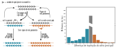
```

<br>

<br>

| Vantagens   | Desvantagens |
| :--:        | :--:         |
| Altamente informativo   | Alta taxa de mutação |
| Baixo nível de tendenciamento | Comportamento mutacional complexo  | 
| Novas abordagens de análise em constante desenvolvimento | Pouco abundantes |
| Facilidade de comparaÇão entre estudos e formação de bancos de dados | Automação e comparações entre estudos difíceis  |

<br>


## Tipo de dados

<br>

```{r mainmarkers, echo = FALSE, fig.align = 'center', out.width="800px", fig.cap="Comparação entre os principais marcadores moleculares tradicionalmente usados em genética de populações."}
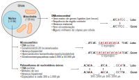
```

<br>


## Bancos de dados públicos

**_NCBI - GenBank_**

https://www.ncbi.nlm.nih.gov/genbank/

<br>

**_SNP Database_**

https://www.ncbi.nlm.nih.gov/projects/SNP/

<br>

**_Barcode of Life Data Systems_**

http://www.boldsystems.org/

<br>

**_1000 Genomes Project_**

http://www.internationalgenome.org/

