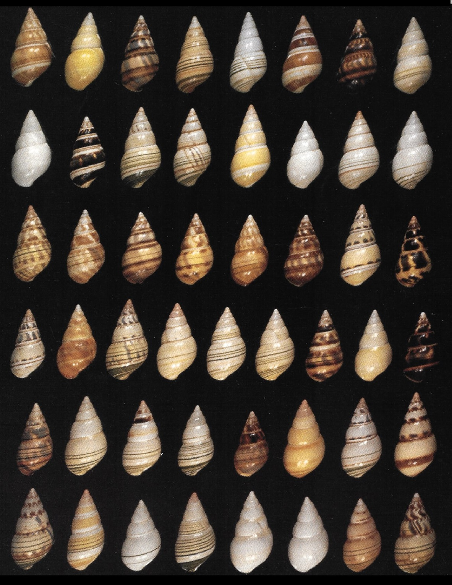

# Variação e Diversidade Genética

<br>

```{r liguus, echo = FALSE, fig.align = 'center', out.width="400px", fig.cap="A distribuição de alelos e a baixa diversidade genética no caramujo da Flórida (_Liguus fasciatus_) apóia a visão de uma única espécie parcialmente autofecundante que se diversificou na Flórida após um único evento fundador. Ver Hillis et al ([1991](https://doi.org/10.1093/oxfordjournals.jhered.a111087))"} 

```

<br>

## Genética mendeliana $\times$ Genética de populações

A **genética mendeliana** estuda o comportamento de um ou mais loci gênicos em cruzamentos simples.

Nesta, dois parentais intercruzantes contribuem cada com um alelo por locus, e Os resultados esperados são proporções mendelianas das características fenotípicas.

<br>

```{r mendeliano, echo = FALSE, fig.align = 'center', out.width="600px", fig.cap="Exemplos de proporções mendelianas em características co-dominantes (1:2:1) e dominantes (3:1)."} 
knitr::include_graphics("figs/traços_mendelianos.svg")
```

<br>

Por outro lado, a **genética de populações** visa estudar o comportamento de um ou mais loci gênicos em múltiplos cruzamentos, _i. e._, em proporções populacionais.

Para tal, as informações genéticas do **_pool_ gênico** de um ou mais **demes** constituindo **unidades panmíticas** são analisados a partir de **amostras** populacionais. 

<br>

:::quote

**_pool_ gênico** --  (Unidade genética) Todos os alelos em um ou mais loci gênicos.
	
**deme** -- (Unidade ecológica ou demográfica) Grupo de indivíduos em uma dada área geográfica.

**unidade panmítica** -- (Unidade reprodutiva) Grupo de indivíduos intercruzantes ao acaso.

**amostra** -- (Unidade estatística) Subconjunto de tamanho $n$ de uma população de tamanho $N$, a partir do qual  parâmatros são estimados, e inferências são feitas. 

:::

<br>

## Frequências genotípicas

Considere um locus autossômico diplóide com dois alelos $A$ e $a$, sem dominância. 

Em uma população $N$, deixe ser o número de indivíduos dos genótipos $AA = x$, $Aa = y$ e $aa = z$, de forma que:

$$x + y + z = N$$

<br>

Logo, as frequências genotípicas observadas na população serão:

- para os homozigotos dominates ($AA$):

$$f_{Obs}(AA) = \frac{x}{N}$$

<br>

- para os heterozigotos ($Aa$):

$$f_{Obs}(Aa) = \frac{y}{N}$$

<br>

- e para os homozigotos recessivos ($aa$):

$$f_{Obs}(aa) = \frac{z}{N}$$

<br>

## Frequências alélicas

As frequências alélicas (ou gênicas) podem ser definidas como:

\begin{equation} 
f(A) = p = \frac{2x + y}{2N} = f(AA) + ½f(Aa)
  (\#eq:freqp)
\end{equation} 

<br>

e

\begin{equation} 
f(a) = q = \frac{2z + y}{2N} = f(aa) + ½f(Aa)
  (\#eq:freqq)
\end{equation} 

<br>

De forma que,

\begin{equation} 
p + q = 1
  (\#eq:poolgene)
\end{equation} 

<br>

As frequências $p$ e $q$ são convenções, intercambiáveis em relação aos alelos $A$ e $a$.
	
Contudo, $q$ é geralmente usado para alelos recessivos, mutantes, raros ou desvantajosos.

<br>

:::quote

**Dominante e recessivo** -- propriedades fenotípicas.

**Selvagem e mutante** -- propriedades ontológicas.

**Comum e raro** -- propriedades estatísticas.

**Vantajoso e desvantajoso** -- propriedades evolutivas.

:::

<br>

\linebreak

## Generalização das frequências genotípicas e alélicas

Considere um locus autossômico diplóide com $i$ alelos, sem dominância. 

As frequências genotípicas observadas são:

$$f_{Obs}(A_1A_1) = \frac{N_{A_1A_1}}{N}$$

<br>

$$f_{Obs}(A_1A_2) = \frac{N_{A_1A_2}}{N}$$
<br>

$$...$$

<br>

$$f_{Obs}(A_1A_i) = \frac{N_{A_1A_i}}{N}$$
<br>

$$...$$
<br>

$$f_{Obs}(A_iA_i) = \frac{N_{A_iA_i}}{N}$$

As frequências alélicas serão:

$$f(A_1)  = a_1 =   f(A_1A_1) + ½ f(A_1A_2) + … + ½ f(A_1A_i)$$

<br>

$$f(A_2)  = a_2 =   f(A_2A_2) + ½ f(A_1A_2) + … + ½ f(A_2A_i)$$

<br>

$$...$$

<br>

$$f(A_i)  = a_i =   f(A_iA_i) + ½ f(A_1A_i) + … + ½ f(A_iA_i)$$
De forma que:

$$a_1 \ + a_2 \ + \ ... \ + \ a_i = 1$$

<br>

## Heterozigoside

A heterozigosidade (ou heterozigose) observada ($H_{Obs}$) de uma população é a freqüência de heterozigotos em um dado locus gênico.

Dada as definições de frequências [genotípicas][Frequências genotípicas] e [alélicas][Frequências genotípicas], para um lócus bialélico, temos que:  

$$H_{Obs} = \frac{y}{N} = f(Aa) =  1 – f(AA) – f(aa)$$

<br>

Esta estimativa é muito útil para avaliarmos a diversidade genética de uma população natural, uma vez que uma alta heterozigosidade quase sempre está relacionada a uma alta variabilidade genética, e vice-versa.
 

A heterozigosidade observada ($H_{Obs}$) é geralmente contrastada com a expectativa da heterozigosidade dado o [princípio de Hardy-Weinberg][Princípio de Hardy-Weinberg].

Essa heterozigosidade esperada ($H_{Esp}$) pelo princípio de Hardy-Weinberg pode ser interpretada como a probabilidade de que um indivíduo seja heterozigoto para um determinado locus gênico (ver [Modelando o princípio de Hardy-Weinberg]{Modelando o princípio de Hardy-Weinberg})

Sendo,

$$H_{Esp} = 2pq =  1 – p^2 – q^2$$

<br>

Quando $H_{Obs} \neq H_{Esp}$, forças evolutivas podem estar atuando nas populações.

<br>

## Diversidade gênética

<br>

```{r zea, echo = FALSE, fig.align = 'center', out.width="800px", fig.cap="O milho (_Zea mays_) foi domesticado pela primeira vez por povos indígenas no sul do México há cerca de 10.000 anos e espalhado para as Américas. A maioria desses grãos tradicionais corre o risco de ser perdido e esquecido. Uma parcela significativa de diversidade no milho é devida à recombinação genética."} 
knitr::include_graphics('https://pbs.twimg.com/media/DdziLo1U0AEPdfJ.png')
```

:::reference

Matsuoka et al. 2002. doi: [10.1073/pnas.052125199](https://doi.org/[10.1073/pnas.052125199)

Vigouroux et al. 2003. doi: [10.1093/molbev/msg156](https://doi.org/10.1093/molbev/msg156)

Piperno 2011. doi: [10.1086/659998](https://doi.org/10.1086/659998)

:::

<br>

Na linguagem comum, a variabilidade genética e a diversidade genética são erroneamente consideradas sinônimos entre si. 

A **variabilidade genética** é a variação nos alelos dos genes ou nas sequências de DNA no pool gênico de uma espécie ou população. Isso se expressa em termos de formas alternativas no fenótipo. 

A **Diversidade genética**, por outro lado, é um termo amplo que abrange toda a variabilidade que ocorre entre os diferentes genótipos relacionados a uma única espécie ou entre espécies. 

Como definido por Swingland ([2013](https://doi.org/10.1016/B978-0-12-384719-5.00009-5)), diversidade genética é a variação de características hereditárias presentes em uma população da mesma espécie; podendo essa variação se expressar na forma de alterações na morfologia, anatomia, comportamento fisiológico ou características bioquímicas. 

A diversidade genética pode ser medida contando o número de genes diferentes em um pool gênico. Por sua vez, a variação genética só pode ocorrer e não pode ser medida, podendo ser considerada como unidade básica da diversidade genética. 

<br>

```{r setXeY, echo = FALSE, fig.align = 'center', out.width="400px", fig.cap="Exemplo de dois conjuntos com diferentes níveis de variação e diversidade. Quando há variação nos elementos ($A$, $B$, $C$ e $D$), o conjunto ($X$ e $Y$) é mais diverso"} 
knitr::include_graphics("figs/setZ_ABCD.svg")
```

<br>

Alguns autores consideram a diversidade genética ($D$) de um locus como a heterozigosidade esperada (H_{Esp}) daquele lócus, _i. e._, a proporção de genótipos heterozigotos dada a expectativa do princípio de Hardy-Weinberg.

Nesse sentido, a diversidade genética é composta de dois parâmetros:

- o número de alelos na população, e

- a abundância (ou uniformidade) dos alelos.

<br>

### Exemplo 

Se uma população consiste em um excesso de homozigotos para diferentes alelos, isso leva a uma baixa heterozigose observada, mas não afeta a heterozigose esperada.

| População 2                                         |  População 2                                        |
|                    :---:                            |                   :---:                             |
| $P_1 = \left\{ AA, BB, CC, DD \right\}$             | $P_2 = \left\{ AB, AB, AB, AB \right\}$             |
| $f(A) = f(B) = f(C) = f(D) = 0.25$                  | $f(A) = f(B) = 0.50$                                |
| $H_{Obs} = 0.00$                                    | $H_{Obs} = 1.00$                                    |
| $H_{Esp} = 1 – 4(0.25)^2 = 0.75$                    | $H_{Esp}  = 1 – 2(0.5)^2 = 0.50$                    |

<br>

Assim, se uma população apresenta um excesso de homozigotos para diferentes alelos, isso leva a uma baixa heterozigosidade observada, mas não afeta a heterozigose esperada.

<br>

## Determinantes da diversidade genética

<br>

### Extratégias reprodutivas

<br>

```{r diversitylifestrategy, echo = FALSE, fig.align = 'center', out.width="400px", fig.cap="Animais estrategistas r são mais polimórficos do que estrategistas K. A correlação negativa apresentada no gráfico reflete uma compensação entre a quantidade e o tamanho da prole. Ver Ellegreen & Galtier ([2016](https://doi.org/10.1038/nrg.2016.58))."} 
knitr::include_graphics('https://media.springernature.com/full/springer-static/image/art%3A10.1038%2Fnrg.2016.58/MediaObjects/41576_2016_Article_BFnrg201658_Fig1_HTML.jpg')
```

<br>

Uma forte correlação foi relatada entre diversidade genética e características da história de vida das espécies, como massa corporal, longevidade e, surpreendentemente, estratégia reprodutiva.

Espécies altamente fecundas que liberam um grande número de ovos pequenos no ambiente (por exemplo, mexilhões, ouriços e minhocas; os chamados **r-estrategistas**) são muito mais polimórficos do que espécies que produzem um pequeno número de descendentes relativamente grandes e fornecem cuidados parentais (por exemplo, pinguins, cupins e cavalos-marinhos; chamados **K-estrategistas**)

<br>

:::reference

Rominguier et al. (2014). doi: [10.1038/nature13685](https://doi.org/10.1038/nature13685)

:::

<br>

### Ligação gênica

<br>

```{r diversitylinkage, echo = FALSE, fig.align = 'center', out.width="800px", fig.cap="Efeito da seleção ligada na diversidade genética (nucleotídica) em torno dos genes ou outros elementos funcionais. As linhas contínuas indicam a variação local no nível de diversidade nucleotídica, e as linhas tracejadas indicam a diversidade média em toda a região em questão.  Ver Ellegreen & Galtier ([2016](https://doi.org/10.1038/nrg.2016.58))."} 
knitr::include_graphics('https://media.springernature.com/lw685/springer-static/image/art%3A10.1038%2Fnrg.2016.58/MediaObjects/41576_2016_Article_BFnrg201658_Fig3_HTML.jpg')
```

<br>

Em regiões com uma alta densidade de alvos de seleção (a), a seleção ligada é generalizada e reduz significativamente a diversidade em comparação com regiões com uma densidade mais baixa de alvos de seleção (b). Quando a taxa de recombinação é alta (c), o efeito da seleção ligada torna-se menos prevalente, permitindo a manutenção de altos níveis de diversidade naquela região.

Ambos os aspectos contribuem para a heterogeneidade dentro do genoma ao gerar vales de diversidade reduzida nas proximidades dos loci selecionados.

<br>

:::reference

Cutter & Payseur (2013). doi: [10.1038/nrg3425](https://doi.org/10.1038/nrg3425)

:::

<br>

## Medidas de Diversidade em loci diplóides

<br>

### Nível de polimorfismo

Nível de polimorfismo ($P$)

\begin{equation} 
P = \frac{n_p}{K}
  (\#eq:polimorfism)
\end{equation} 

<br>

Onde, 
$n_p$ é o número de loci gênicos polimórficos observados, e
$K$ é o número total de loci gênicos examinados.

<br>

Exemplo,


|     |Loc 1 |Loc 2 |Loc 3 |Loc 4 |Loc 5 |Loc 6 |Loc 7 |Loc 8 |  
| :-- | :--: | :--: | :--: | :--: | :--: | :--: | :--: | :--: |
|Ind 1|<span style="color: green;">AA</span>|<span style="color: blue;">CC</span>|<span style="color: blue;">C</span><span style="color: goldenrod;">G</span>|<span style="color: green;">AA</span>|<span style="color: red;">T</span>G|<span style="color: green;">A</span><span style="color: goldenrod;">G</span>|<span style="color: red;">TT</span>|<span style="color: green;">AA</span>|
|Ind 2|<span style="color: green;">AA</span>|<span style="color: blue;">CC</span>|<span style="color: blue;">C</span><span style="color: goldenrod;">G</span>|<span style="color: green;">AA</span>|<span style="color: blue;">C</span><span style="color: goldenrod;">G</span>|<span style="color: green;">A</span><span style="color: goldenrod;">G</span>|<span style="color: red;">TT</span>|<span style="color: green;">AA</span>| 
|Ind 3|<span style="color: green;">A</span><span style="color: red;">T</span>|<span style="color: blue;">CC</span>|<span style="color: goldenrod;">GG</span>|<span style="color: green;">AA</span>|<span style="color: blue;">C</span><span style="color: goldenrod;">G</span>|<span style="color: goldenrod;">GG</span>|<span style="color: red;">TT</span>|<span style="color: green;">AA</span>| 
|Ind 4|<span style="color: green;">A</span><span style="color: red;">T</span>|<span style="color: blue;">CC</span>|<span style="color: goldenrod;">GG</span>|<span style="color: green;">AA</span>|<span style="color: goldenrod;">GG</span>|<span style="color: green;">AA</span>|<span style="color: red;">TT</span>|<span style="color: green;">A</span><span style="color: blue;">C</span>| 
|Ind 5|<span style="color: red;">TT</span>|<span style="color: blue;">CC</span>|<span style="color: blue;">C</span><span style="color: goldenrod;">G</span>|<span style="color: green;">AA</span>|<span style="color: blue;">C</span><span style="color: red;">T</span>|<span style="color: green;">AA</span>|<span style="color: red;">TT</span>|<span style="color: green;">A</span><span style="color: blue;">C</span>| 
|     |  |  |  |  |  |  |  |  |  
|  | **Poli** | Mono | **Poli** | Mono | **Poli** | **Poli** | Mono | **Poli** |

<br>

$$P = \frac{5}{8} = 0.625$$

<br>

### Riqueza alélica

Riqueza alélica ($A$) é o número de alelos polimórficos observados em um locus gênico.

<br>

Exemplo,


|     |Loc 1 |Loc 2 |Loc 3 |Loc 4 |Loc 5 |Loc 6 |Loc 7 |Loc 8 |  
| :-- | :--: | :--: | :--: | :--: | :--: | :--: | :--: | :--: |
|Ind 1|<span style="color: green;">AA</span>|<span style="color: blue;">CC</span>|<span style="color: blue;">C</span><span style="color: goldenrod;">G</span>|<span style="color: green;">AA</span>|<span style="color: red;">T</span>G|<span style="color: green;">A</span><span style="color: goldenrod;">G</span>|<span style="color: red;">TT</span>|<span style="color: green;">AA</span>|
|Ind 2|<span style="color: green;">AA</span>|<span style="color: blue;">CC</span>|<span style="color: blue;">C</span><span style="color: goldenrod;">G</span>|<span style="color: green;">AA</span>|<span style="color: blue;">C</span><span style="color: goldenrod;">G</span>|<span style="color: green;">A</span><span style="color: goldenrod;">G</span>|<span style="color: red;">TT</span>|<span style="color: green;">AA</span>| 
|Ind 3|<span style="color: green;">A</span><span style="color: red;">T</span>|<span style="color: blue;">CC</span>|<span style="color: goldenrod;">GG</span>|<span style="color: green;">AA</span>|<span style="color: blue;">C</span><span style="color: goldenrod;">G</span>|<span style="color: goldenrod;">GG</span>|<span style="color: red;">TT</span>|<span style="color: green;">AA</span>| 
|Ind 4|<span style="color: green;">A</span><span style="color: red;">T</span>|<span style="color: blue;">CC</span>|<span style="color: goldenrod;">GG</span>|<span style="color: green;">AA</span>|<span style="color: goldenrod;">GG</span>|<span style="color: green;">AA</span>|<span style="color: red;">TT</span>|<span style="color: green;">A</span><span style="color: blue;">C</span>| 
|Ind 5|<span style="color: red;">TT</span>|<span style="color: blue;">CC</span>|<span style="color: blue;">C</span><span style="color: goldenrod;">G</span>|<span style="color: green;">AA</span>|<span style="color: blue;">C</span><span style="color: red;">T</span>|<span style="color: green;">AA</span>|<span style="color: red;">TT</span>|<span style="color: green;">A</span><span style="color: blue;">C</span>|  
|     |  |  |  |  |  |  |  |  |  
| $A$ | **2** | **1** | **2** | **1** | **3** | **2** | **1** | **2** |

<br>

### Número médio de alelos

Número médio de alelos por locus ($\bar{A}$)

<br>

\begin{equation} 
\bar{A} = \frac{ \sum_{i=1}^{i} {A_i} }{K}
  (\#eq:alellemedian)
\end{equation} 

<br>

Onde,
$A_i$ é o número de alelos polimórficos observados no $i$-nésimo locus gênico, e
$k$ é o número de loci gênicos examinados.

<br>

Exemplo,


|     |Loc 1 |Loc 2 |Loc 3 |Loc 4 |Loc 5 |Loc 6 |Loc 7 |Loc 8 |  
| :-- | :--: | :--: | :--: | :--: | :--: | :--: | :--: | :--: |
|Ind 1|<span style="color: green;">AA</span>|<span style="color: blue;">CC</span>|<span style="color: blue;">C</span><span style="color: goldenrod;">G</span>|<span style="color: green;">AA</span>|<span style="color: red;">T</span>G|<span style="color: green;">A</span><span style="color: goldenrod;">G</span>|<span style="color: red;">TT</span>|<span style="color: green;">AA</span>|
|Ind 2|<span style="color: green;">AA</span>|<span style="color: blue;">CC</span>|<span style="color: blue;">C</span><span style="color: goldenrod;">G</span>|<span style="color: green;">AA</span>|<span style="color: blue;">C</span><span style="color: goldenrod;">G</span>|<span style="color: green;">A</span><span style="color: goldenrod;">G</span>|<span style="color: red;">TT</span>|<span style="color: green;">AA</span>| 
|Ind 3|<span style="color: green;">A</span><span style="color: red;">T</span>|<span style="color: blue;">CC</span>|<span style="color: goldenrod;">GG</span>|<span style="color: green;">AA</span>|<span style="color: blue;">C</span><span style="color: goldenrod;">G</span>|<span style="color: goldenrod;">GG</span>|<span style="color: red;">TT</span>|<span style="color: green;">AA</span>| 
|Ind 4|<span style="color: green;">A</span><span style="color: red;">T</span>|<span style="color: blue;">CC</span>|<span style="color: goldenrod;">GG</span>|<span style="color: green;">AA</span>|<span style="color: goldenrod;">GG</span>|<span style="color: green;">AA</span>|<span style="color: red;">TT</span>|<span style="color: green;">A</span><span style="color: blue;">C</span>| 
|Ind 5|<span style="color: red;">TT</span>|<span style="color: blue;">CC</span>|<span style="color: blue;">C</span><span style="color: goldenrod;">G</span>|<span style="color: green;">AA</span>|<span style="color: blue;">C</span><span style="color: red;">T</span>|<span style="color: green;">AA</span>|<span style="color: red;">TT</span>|<span style="color: green;">A</span><span style="color: blue;">C</span>| 
|     |  |  |  |  |  |  |  |  |  
| $A$ | **2** | **1** | **2** | **1** | **3** | **2** | **1** | **2** |

<br>

$$\bar{A} = \frac{2+1+2+1+3+2+1+2}{8} = \frac{14}{8} = 1.75$$

<br>

### Número efetivo de alelos

O número efetivo de alelos ($A_e$) é O número de alelos igualmente frequentes que seriam necessários para atingir a mesma heterozigosidade esperada na população estudada, de forma que:

<br>

\begin{equation} 
A_e  =  \frac{1}{1-H_{Esp}}  = \frac{1}{\sum {p_i^2}}
  (\#eq:alelleeffective)
\end{equation} 

<br>

Onde,
$p_i$ é a frequência do $i$-nésimo alelo em um locus gênico. 

<br>

Exemplo,

:::table

|     |Loc 1 |Loc 2 |Loc 3 |Loc 4 |Loc 5 |Loc 6 |Loc 7 |Loc 8 |  
| :-- | :--: | :--: | :--: | :--: | :--: | :--: | :--: | :--: |
|Ind 1|<span style="color: green;">AA</span>|<span style="color: blue;">CC</span>|<span style="color: blue;">C</span><span style="color: goldenrod;">G</span>|<span style="color: green;">AA</span>|<span style="color: red;">T</span>G|<span style="color: green;">A</span><span style="color: goldenrod;">G</span>|<span style="color: red;">TT</span>|<span style="color: green;">AA</span>|
|Ind 2|<span style="color: green;">AA</span>|<span style="color: blue;">CC</span>|<span style="color: blue;">C</span><span style="color: goldenrod;">G</span>|<span style="color: green;">AA</span>|<span style="color: blue;">C</span><span style="color: goldenrod;">G</span>|<span style="color: green;">A</span><span style="color: goldenrod;">G</span>|<span style="color: red;">TT</span>|<span style="color: green;">AA</span>| 
|Ind 3|<span style="color: green;">A</span><span style="color: red;">T</span>|<span style="color: blue;">CC</span>|<span style="color: goldenrod;">GG</span>|<span style="color: green;">AA</span>|<span style="color: blue;">C</span><span style="color: goldenrod;">G</span>|<span style="color: goldenrod;">GG</span>|<span style="color: red;">TT</span>|<span style="color: green;">AA</span>| 
|Ind 4|<span style="color: green;">A</span><span style="color: red;">T</span>|<span style="color: blue;">CC</span>|<span style="color: goldenrod;">GG</span>|<span style="color: green;">AA</span>|<span style="color: goldenrod;">GG</span>|<span style="color: green;">AA</span>|<span style="color: red;">TT</span>|<span style="color: green;">A</span><span style="color: blue;">C</span>| 
|Ind 5|<span style="color: red;">TT</span>|<span style="color: blue;">CC</span>|<span style="color: blue;">C</span><span style="color: goldenrod;">G</span>|<span style="color: green;">AA</span>|<span style="color: blue;">C</span><span style="color: red;">T</span>|<span style="color: green;">AA</span>|<span style="color: red;">TT</span>|<span style="color: green;">A</span><span style="color: blue;">C</span>| 
|     |  |  |  |  |  |  |  |  |  
| $f(\color{green}{A})$ | 0.60 | -- | -- | 1.00 | -- | 0.60 | -- | 0.80 |
| $f(\color{red}{T})$ | 0.40 | -- | -- | -- | 0.20 | -- | 1.00 | -- |
| $f(\color{blue}{C})$ | -- | 1.00 | 0.30 | -- | 0.30 | -- | -- | 0.20 |
| $f(\color{goldenrod}{G})$ | -- | -- | 0.70 | -- |0.50 | 0.40 | -- | -- |
| $H_{Esp}$ | 0.48 | 0.00 | 0.42 | 0.00 | 0.62 | 0.48 | 0.00 | 0.32 |
| $A_{e}$ | **1.92** | **1.00** | **1.72** | **1.00** | **2.63** | **1.92** | **1.00** | **1.47** |

:::

<br>

## Medidas de Diversidade em loci haplóides

### Número de haplótipos

Número de haplótipos ($h$) é o número de haplótipos diferentes observados.

<br>

Exemplo,

:::table

||1|2|3|4|5|6|7|8|9|10|11|12|13|14|15|16|17|18|
|:-- |:--:|:--:|:--:|:--:|:--:|:--:|:--:|:--:|:--:|:--:|:--:|:--:|:--:|:--:|:--:|:--:|:--:|:--:|:--:|:--:
|Ind 1|<span style="color: green;"> A </span>|<span style="color: green;"> A </span>|<span style="color: blue;"> C </span>|<span style="color: blue;"> C </span>|<span style="color: blue;"> C </span>|<span style="color: goldenrod;"> G </span>|<span style="color: green;"> A </span>|<span style="color: green;"> A </span>|<span style="color: red;"> T </span>|<span style="color: goldenrod;"> G </span>|<span style="color: green;"> A </span>|<span style="color: goldenrod;"> G </span>|<span style="color: red;"> T </span>|<span style="color: red;"> T </span>|<span style="color: green;"> A </span>|<span style="color: green;"> A </span>|<span style="color: green;"> A </span>|<span style="color: green;"> A </span>|
|Ind 2|<span style="color: green;"> A </span>|<span style="color: green;"> A </span>|<span style="color: blue;"> C </span>|<span style="color: blue;"> C </span>|<span style="color: blue;"> C </span>|<span style="color: goldenrod;"> G </span>|<span style="color: green;"> A </span>|<span style="color: green;"> A </span>|<span style="color: red;"> T </span>|<span style="color: goldenrod;"> G </span>|<span style="color: green;"> A </span>|<span style="color: goldenrod;"> G </span>|<span style="color: red;"> T </span>|<span style="color: red;"> T </span>|<span style="color: green;"> A </span>|<span style="color: green;"> A </span>|<span style="color: green;"> A </span>|<span style="color: green;"> A </span>|
|Ind 3|<span style="color: green;"> A </span>|<span style="color: red;"> T </span>|<span style="color: blue;"> C </span>|<span style="color: blue;"> C </span>|<span style="color: goldenrod;"> G </span>|<span style="color: goldenrod;"> G </span>|<span style="color: green;"> A </span>|<span style="color: green;"> A </span>|<span style="color: blue;"> C </span>|<span style="color: goldenrod;"> G </span>|<span style="color: goldenrod;"> G </span>|<span style="color: goldenrod;"> G </span>|<span style="color: red;"> T </span>|<span style="color: red;"> T </span>|<span style="color: green;"> A </span>|<span style="color: green;"> A </span>|<span style="color: goldenrod;"> G </span>|<span style="color: red;"> T </span>|
|Ind 4|<span style="color: green;"> A </span>|<span style="color: red;"> T </span>|<span style="color: blue;"> C </span>|<span style="color: blue;"> C </span>|<span style="color: goldenrod;"> G </span>|<span style="color: goldenrod;"> G </span>|<span style="color: green;"> A </span>|<span style="color: green;"> A </span>|<span style="color: goldenrod;"> G </span>|<span style="color: goldenrod;"> G </span>|<span style="color: green;"> A </span>|<span style="color: green;"> A </span>|<span style="color: red;"> T </span>|<span style="color: red;"> T </span>|<span style="color: green;"> A </span>|<span style="color: blue;"> C </span>|<span style="color: green;"> A </span>|<span style="color: red;"> T </span>|
|Ind 5|<span style="color: green;"> A </span>|<span style="color: red;"> T </span>|<span style="color: blue;"> C </span>|<span style="color: blue;"> C </span>|<span style="color: goldenrod;"> G </span>|<span style="color: goldenrod;"> G </span>|<span style="color: green;"> A </span>|<span style="color: green;"> A </span>|<span style="color: goldenrod;"> G </span>|<span style="color: goldenrod;"> G </span>|<span style="color: green;"> A </span>|<span style="color: green;"> A </span>|<span style="color: red;"> T </span>|<span style="color: red;"> T </span>|<span style="color: green;"> A </span>|<span style="color: blue;"> C </span>|<span style="color: green;"> A </span>|<span style="color: red;"> T </span>|

:::

<br>

Desta forma, temos:

- **Haplótipo X** -- Haplótipo observado nos indivíduos 1 e 2;

- **Haplótipo Y** -- Haplótipo observado no indivíduo 3; e

- **Haplótipo Z** -- Haplótipo observado nos indivíduos 4 e 5;

<br>

E assim,

$$h = 3$$
<br>

### Número de sítios segregantes

Número de sítios segregantes ($S$) é o número de sítios observados que apresentam variação (polimórficos).

<br>

Exemplo,

:::table

||1|2|3|4|5|6|7|8|9|10|11|12|13|14|15|16|17|18|
|:-- |:--:|:--:|:--:|:--:|:--:|:--:|:--:|:--:|:--:|:--:|:--:|:--:|:--:|:--:|:--:|:--:|:--:|:--:|:--:|:--:
|Ind 1|<span style="color: green;"> A </span>|<span style="color: green;"> A </span>|<span style="color: blue;"> C </span>|<span style="color: blue;"> C </span>|<span style="color: blue;"> C </span>|<span style="color: goldenrod;"> G </span>|<span style="color: green;"> A </span>|<span style="color: green;"> A </span>|<span style="color: red;"> T </span>|<span style="color: goldenrod;"> G </span>|<span style="color: green;"> A </span>|<span style="color: goldenrod;"> G </span>|<span style="color: red;"> T </span>|<span style="color: red;"> T </span>|<span style="color: green;"> A </span>|<span style="color: green;"> A </span>|<span style="color: green;"> A </span>|<span style="color: green;"> A </span>|
|Ind 2|<span style="color: green;"> A </span>|<span style="color: green;"> A </span>|<span style="color: blue;"> C </span>|<span style="color: blue;"> C </span>|<span style="color: blue;"> C </span>|<span style="color: goldenrod;"> G </span>|<span style="color: green;"> A </span>|<span style="color: green;"> A </span>|<span style="color: red;"> T </span>|<span style="color: goldenrod;"> G </span>|<span style="color: green;"> A </span>|<span style="color: goldenrod;"> G </span>|<span style="color: red;"> T </span>|<span style="color: red;"> T </span>|<span style="color: green;"> A </span>|<span style="color: green;"> A </span>|<span style="color: green;"> A </span>|<span style="color: green;"> A </span>|
|Ind 3|<span style="color: green;"> A </span>|<span style="color: red;"> T </span>|<span style="color: blue;"> C </span>|<span style="color: blue;"> C </span>|<span style="color: goldenrod;"> G </span>|<span style="color: goldenrod;"> G </span>|<span style="color: green;"> A </span>|<span style="color: green;"> A </span>|<span style="color: blue;"> C </span>|<span style="color: goldenrod;"> G </span>|<span style="color: goldenrod;"> G </span>|<span style="color: goldenrod;"> G </span>|<span style="color: red;"> T </span>|<span style="color: red;"> T </span>|<span style="color: green;"> A </span>|<span style="color: green;"> A </span>|<span style="color: goldenrod;"> G </span>|<span style="color: red;"> T </span>|
|Ind 4|<span style="color: green;"> A </span>|<span style="color: red;"> T </span>|<span style="color: blue;"> C </span>|<span style="color: blue;"> C </span>|<span style="color: goldenrod;"> G </span>|<span style="color: goldenrod;"> G </span>|<span style="color: green;"> A </span>|<span style="color: green;"> A </span>|<span style="color: goldenrod;"> G </span>|<span style="color: goldenrod;"> G </span>|<span style="color: green;"> A </span>|<span style="color: green;"> A </span>|<span style="color: red;"> T </span>|<span style="color: red;"> T </span>|<span style="color: green;"> A </span>|<span style="color: blue;"> C </span>|<span style="color: green;"> A </span>|<span style="color: red;"> T </span>|
|Ind 5|<span style="color: green;"> A </span>|<span style="color: red;"> T </span>|<span style="color: blue;"> C </span>|<span style="color: blue;"> C </span>|<span style="color: goldenrod;"> G </span>|<span style="color: goldenrod;"> G </span>|<span style="color: green;"> A </span>|<span style="color: green;"> A </span>|<span style="color: goldenrod;"> G </span>|<span style="color: goldenrod;"> G </span>|<span style="color: green;"> A </span>|<span style="color: green;"> A </span>|<span style="color: red;"> T </span>|<span style="color: red;"> T </span>|<span style="color: green;"> A </span>|<span style="color: blue;"> C </span>|<span style="color: green;"> A </span>|<span style="color: red;"> T </span>|
|$S$|0|**1**|0|0|**1**|0|0|0|**1**|0|**1**|**1**|0|0|0|**1**|**1**|**1**|

:::

E assim,

$$S = 8$$

<br>

### Número de sítios invariáveis

Número de sítios invariáveis ($I$) é o número de sítios observados que não apresentam variação (constantes). 

<br>

Exemplo,

:::table

||1|2|3|4|5|6|7|8|9|10|11|12|13|14|15|16|17|18|
|:-- |:--:|:--:|:--:|:--:|:--:|:--:|:--:|:--:|:--:|:--:|:--:|:--:|:--:|:--:|:--:|:--:|:--:|:--:|:--:|:--:
|Ind 1|<span style="color: green;"> A </span>|<span style="color: green;"> A </span>|<span style="color: blue;"> C </span>|<span style="color: blue;"> C </span>|<span style="color: blue;"> C </span>|<span style="color: goldenrod;"> G </span>|<span style="color: green;"> A </span>|<span style="color: green;"> A </span>|<span style="color: red;"> T </span>|<span style="color: goldenrod;"> G </span>|<span style="color: green;"> A </span>|<span style="color: goldenrod;"> G </span>|<span style="color: red;"> T </span>|<span style="color: red;"> T </span>|<span style="color: green;"> A </span>|<span style="color: green;"> A </span>|<span style="color: green;"> A </span>|<span style="color: green;"> A </span>|
|Ind 2|<span style="color: green;"> A </span>|<span style="color: green;"> A </span>|<span style="color: blue;"> C </span>|<span style="color: blue;"> C </span>|<span style="color: blue;"> C </span>|<span style="color: goldenrod;"> G </span>|<span style="color: green;"> A </span>|<span style="color: green;"> A </span>|<span style="color: red;"> T </span>|<span style="color: goldenrod;"> G </span>|<span style="color: green;"> A </span>|<span style="color: goldenrod;"> G </span>|<span style="color: red;"> T </span>|<span style="color: red;"> T </span>|<span style="color: green;"> A </span>|<span style="color: green;"> A </span>|<span style="color: green;"> A </span>|<span style="color: green;"> A </span>|
|Ind 3|<span style="color: green;"> A </span>|<span style="color: red;"> T </span>|<span style="color: blue;"> C </span>|<span style="color: blue;"> C </span>|<span style="color: goldenrod;"> G </span>|<span style="color: goldenrod;"> G </span>|<span style="color: green;"> A </span>|<span style="color: green;"> A </span>|<span style="color: blue;"> C </span>|<span style="color: goldenrod;"> G </span>|<span style="color: goldenrod;"> G </span>|<span style="color: goldenrod;"> G </span>|<span style="color: red;"> T </span>|<span style="color: red;"> T </span>|<span style="color: green;"> A </span>|<span style="color: green;"> A </span>|<span style="color: goldenrod;"> G </span>|<span style="color: red;"> T </span>|
|Ind 4|<span style="color: green;"> A </span>|<span style="color: red;"> T </span>|<span style="color: blue;"> C </span>|<span style="color: blue;"> C </span>|<span style="color: goldenrod;"> G </span>|<span style="color: goldenrod;"> G </span>|<span style="color: green;"> A </span>|<span style="color: green;"> A </span>|<span style="color: goldenrod;"> G </span>|<span style="color: goldenrod;"> G </span>|<span style="color: green;"> A </span>|<span style="color: green;"> A </span>|<span style="color: red;"> T </span>|<span style="color: red;"> T </span>|<span style="color: green;"> A </span>|<span style="color: blue;"> C </span>|<span style="color: green;"> A </span>|<span style="color: red;"> T </span>|
|Ind 5|<span style="color: green;"> A </span>|<span style="color: red;"> T </span>|<span style="color: blue;"> C </span>|<span style="color: blue;"> C </span>|<span style="color: goldenrod;"> G </span>|<span style="color: goldenrod;"> G </span>|<span style="color: green;"> A </span>|<span style="color: green;"> A </span>|<span style="color: goldenrod;"> G </span>|<span style="color: goldenrod;"> G </span>|<span style="color: green;"> A </span>|<span style="color: green;"> A </span>|<span style="color: red;"> T </span>|<span style="color: red;"> T </span>|<span style="color: green;"> A </span>|<span style="color: blue;"> C </span>|<span style="color: green;"> A </span>|<span style="color: red;"> T </span>|
|$I$|**1**|0|**1**|**1**|0|**1**|**1**|**1**|0|**1**|0|0|**1**|**1**|**1**|0|0|0|

:::

<br>

E assim,

$$I = 10$$

<br>


### Número total de mutações

Número total de mutações ($\eta$; ${Eta}$}) ([Fu & Li 1993](https://doi.org/10.1093/genetics/133.3.693)), também referido como o número mínimo de mutações ([Tajima 1996](https://doi.org/10.1093/genetics/143.3.1457)), é definido como:

<br>

\begin{equation} 
\eta  =  \sum_i^m s_i
  (\#eq:eta)
\end{equation} 

<br>

Onde,
$s_i$ é o número de diferentes nucleotídeos no $i$-nésimo sítio menos um.

<br>

Exemplo,

:::table

||1|2|3|4|5|6|7|8|9|10|11|12|13|14|15|16|17|18|
|:-- |:--:|:--:|:--:|:--:|:--:|:--:|:--:|:--:|:--:|:--:|:--:|:--:|:--:|:--:|:--:|:--:|:--:|:--:|:--:|:--:
|Ind 1|<span style="color: green;"> A </span>|<span style="color: green;"> A </span>|<span style="color: blue;"> C </span>|<span style="color: blue;"> C </span>|<span style="color: blue;"> C </span>|<span style="color: goldenrod;"> G </span>|<span style="color: green;"> A </span>|<span style="color: green;"> A </span>|<span style="color: red;"> T </span>|<span style="color: goldenrod;"> G </span>|<span style="color: green;"> A </span>|<span style="color: goldenrod;"> G </span>|<span style="color: red;"> T </span>|<span style="color: red;"> T </span>|<span style="color: green;"> A </span>|<span style="color: green;"> A </span>|<span style="color: green;"> A </span>|<span style="color: green;"> A </span>|
|Ind 2|<span style="color: green;"> A </span>|<span style="color: green;"> A </span>|<span style="color: blue;"> C </span>|<span style="color: blue;"> C </span>|<span style="color: blue;"> C </span>|<span style="color: goldenrod;"> G </span>|<span style="color: green;"> A </span>|<span style="color: green;"> A </span>|<span style="color: red;"> T </span>|<span style="color: goldenrod;"> G </span>|<span style="color: green;"> A </span>|<span style="color: goldenrod;"> G </span>|<span style="color: red;"> T </span>|<span style="color: red;"> T </span>|<span style="color: green;"> A </span>|<span style="color: green;"> A </span>|<span style="color: green;"> A </span>|<span style="color: green;"> A </span>|
|Ind 3|<span style="color: green;"> A </span>|<span style="color: red;"> T </span>|<span style="color: blue;"> C </span>|<span style="color: blue;"> C </span>|<span style="color: goldenrod;"> G </span>|<span style="color: goldenrod;"> G </span>|<span style="color: green;"> A </span>|<span style="color: green;"> A </span>|<span style="color: blue;"> C </span>|<span style="color: goldenrod;"> G </span>|<span style="color: goldenrod;"> G </span>|<span style="color: goldenrod;"> G </span>|<span style="color: red;"> T </span>|<span style="color: red;"> T </span>|<span style="color: green;"> A </span>|<span style="color: green;"> A </span>|<span style="color: goldenrod;"> G </span>|<span style="color: red;"> T </span>|
|Ind 4|<span style="color: green;"> A </span>|<span style="color: red;"> T </span>|<span style="color: blue;"> C </span>|<span style="color: blue;"> C </span>|<span style="color: goldenrod;"> G </span>|<span style="color: goldenrod;"> G </span>|<span style="color: green;"> A </span>|<span style="color: green;"> A </span>|<span style="color: goldenrod;"> G </span>|<span style="color: goldenrod;"> G </span>|<span style="color: green;"> A </span>|<span style="color: green;"> A </span>|<span style="color: red;"> T </span>|<span style="color: red;"> T </span>|<span style="color: green;"> A </span>|<span style="color: blue;"> C </span>|<span style="color: green;"> A </span>|<span style="color: red;"> T </span>|
|Ind 5|<span style="color: green;"> A </span>|<span style="color: red;"> T </span>|<span style="color: blue;"> C </span>|<span style="color: blue;"> C </span>|<span style="color: goldenrod;"> G </span>|<span style="color: goldenrod;"> G </span>|<span style="color: green;"> A </span>|<span style="color: green;"> A </span>|<span style="color: goldenrod;"> G </span>|<span style="color: goldenrod;"> G </span>|<span style="color: green;"> A </span>|<span style="color: green;"> A </span>|<span style="color: red;"> T </span>|<span style="color: red;"> T </span>|<span style="color: green;"> A </span>|<span style="color: blue;"> C </span>|<span style="color: green;"> A </span>|<span style="color: red;"> T </span>|
|   | | | | | | | | | | | | | | | | | | |
|$s$|0|**1**|0|0|**1**|0|0|0|**2**|0|**1**|**1**|0|0|0|**1**|**1**|**1**|

:::

<br>

E assim,

$$\eta = 10$$

<br>

### Diversidade haplotípica

Diversidade haplotípica ($Hd$) representa a probabilidade de que dois indivíduos amostrados aleatoriamente apresentam haplótipos diferentes, de forma que:

<br>

\begin{equation} 
Hd  =  \frac{N}{N-1} \left( 1 - \sum{p_i^2} \right)
  (\#eq:haplotypediversity)
\end{equation} 

<br>

Onde, 
$N$ é o tamanho da amostra, e 
$p_i$ é a frequência do $i$-nésimo haplótipo.

<br>

Exemplo,

Dados os haplótipos observados no exemplo anterior, temos que:

| | Hap X | Hap Y | Hap z |
| :-- | :--: | :--: | :--: |
|Ind 1|$\checkmark$|--|--| 
|Ind 2|$\checkmark$|--|--|
|Ind 3|--|$\checkmark$|--|
|Ind 4|--|--|$\checkmark$|
|Ind 5|--|--|$\checkmark$|
| | | | | 
|$p$ |**0.4**|**0.2**|**0.4**| 

<br>

E assim,

$$Hd = \frac{5}{4-1} \left( 1 - 0.4^2 + 0.2^2 + 0.4^2 \right) = 1.25 \cdot 0.64 = 0.8$$
<br>

Observe que a probabilidade de um par de indivíduos amostrados aleatoriamente na população apresentar uma dada combinação haplotípica é dada pela matrix:

<br>

| | Hap X | Hap Y | Hap z |
| :-- | :--: | :--: | :--: |
|**Hap X**|$\color{red}{p_X^2}$|$p_Xp_Y$|$p_Xp_Z$| 
|**Hap Y**|$p_Xp_Y$|$\color{red}{p_Y^2}$|$p_Yp_Z$|
|**Hap Z**|$p_Xp_Z$|$p_Yp_Z$|$\color{red}{p_Z^2}$|

<br>

Assim, as chances de dois indivíduos quaisquer apresentarem:

- Haplótipos iguais $\rightarrow$ $\color{red}{p_X^2 + p_Y^2 + p_Z^2}$; e

- Haplótipos diferentes $\rightarrow$ $2p_Xp_Y + 2p_Xp_Z + 2p_Yp_Z = 1 - \left( \color{red}{p_X^2 + p_Y^2 + p_Z^2} \right)$.

<br>

### Número médio de diferenças nucleotídicas

Número médio de diferenças nucleotídicas (k) ([Tajima 1983](https://doi.org/10.1093/genetics/105.2.437)) é definido como:

\begin{equation} 
k = \frac { \sum_{i<j}^{} k_{ij} } { \binom{n}{2} }
  (\#eq:nucleotidedifferences)
\end{equation}

<br> 

Onde, 
$k_{ij}$ é o número de nucleotídeos diferentes entre as $i$-nésima e $j$-nésima sequência de nucleotídeos, e 
$n$ é o número de sequências sendo comparadas.

<br>

Exemplo,

Dadas as $n=5$ sequências do exemplo anterior, as comparações par-a-par entre elas serão:

|     | Ind 1 | Ind 2 | Ind 3 | Ind 4 | Ind 5 |
| :-- | :--:  | :--:  | :--:  | :--:  | :--:  |
|**Ind 1**|--     |       |       |       |       |
|**Ind 2**|$k_{12}$|--     |       |       |       |
|**Ind 3**|$k_{13}$|$k_{23}$|--     |       |       |
|**Ind 4**|$k_{14}$|$k_{24}$|$k_{34}$|--     |       |
|**Ind 5**|$k_{15}$|$k_{25}$|$k_{35}$|$k_{45}$|--     |

<br>

De forma que o número total de comparações será:

$$\binom{5}{2}=10$$

<br>

Assim, tomemos como exemplo a comparação entre as sequências dos indivíduos 2 e 3.

Onde,

:::table

||1|2|3|4|5|6|7|8|9|10|11|12|13|14|15|16|17|18|
|:-- |:--:|:--:|:--:|:--:|:--:|:--:|:--:|:--:|:--:|:--:|:--:|:--:|:--:|:--:|:--:|:--:|:--:|:--:|:--:|:--:|
|Ind 2|<span style="color: green;"> A </span>|<span style="color: green;"> A </span>|<span style="color: blue;"> C </span>|<span style="color: blue;"> C </span>|<span style="color: blue;"> C </span>|<span style="color: goldenrod;"> G </span>|<span style="color: green;"> A </span>|<span style="color: green;"> A </span>|<span style="color: red;"> T </span>|<span style="color: goldenrod;"> G </span>|<span style="color: green;"> A </span>|<span style="color: goldenrod;"> G </span>|<span style="color: red;"> T </span>|<span style="color: red;"> T </span>|<span style="color: green;"> A </span>|<span style="color: green;"> A </span>|<span style="color: green;"> A </span>|<span style="color: green;"> A </span>|
|Ind 3|<span style="color: green;"> A </span>|<span style="color: red;"> T </span>|<span style="color: blue;"> C </span>|<span style="color: blue;"> C </span>|<span style="color: goldenrod;"> G </span>|<span style="color: goldenrod;"> G </span>|<span style="color: green;"> A </span>|<span style="color: green;"> A </span>|<span style="color: blue;"> C </span>|<span style="color: goldenrod;"> G </span>|<span style="color: goldenrod;"> G </span>|<span style="color: goldenrod;"> G </span>|<span style="color: red;"> T </span>|<span style="color: red;"> T </span>|<span style="color: green;"> A </span>|<span style="color: green;"> A </span>|<span style="color: goldenrod;"> G </span>|<span style="color: red;"> T </span>|
|   | | | | | | | | | | | | | | | | | | |
|$k$|0|**1**|0|0|**1**|0|0|0|**1**|0|**1**|0|0|0|0|0|**1**|**1**|

:::

<br>

Logo,

$$k_{23} = 6$$

<br>

Desta forma, as diferenças de nucleotídeos entre os pares de sequências serão:

|     | Ind 1 | Ind 2 | Ind 3 | Ind 4 | Ind 5 |
| :-- | :--:  | :--:  | :--:  | :--:  | :--:  |
|**Ind 1**|--     |       |       |       |       |
|**Ind 2**|0|--     |       |       |       |
|**Ind 3**|6|6|--     |       |       |
|**Ind 4**|6|6|5|--     |       |
|**Ind 5**|6|6|5|0|--     |

<br>

E assim

$$k = \frac{\left( 0+6+6+6+6+6+6+5+5+0 \right)}{10}=4.6$$

<br>

### Diversidade nucleotídica 

Diversidade nucleotídica  ($\pi$; $Pi$) ou número médio de substituições por sítio de nucleotídeo, é definida como:

<br>

\begin{equation} 
\pi = \frac { \sum_{i<j}^{} \pi_{ij} } { \binom{n}{2} }
  (\#eq:nucleotidediversity)
\end{equation}

<br> 

Onde, 
$\pi_{ij}$ é a proporção de nucleotídeos diferentes entre as $i$-nésima e $j$-nésima sequência de nucleotídeos, e 
$n$ é o número de sequências sendo comparadas.

<br>

A diversidade nucleotídica pode ser estimada a partir do número médio de diferenças nucleotídicas ($k$) de forma que:

<br>

$$ \pi = \frac {k} {L} $$

<br>

Onde, 
$L$ é o tamanho do haplótipo em pares de bases.

<br>

Exemplo,

Dadas as $n=5$ sequências do exemplo anterior, as comparações par-a-par entre elas serão:

|     | Ind 1 | Ind 2 | Ind 3 | Ind 4 | Ind 5 |
| :-- | :--:  | :--:  | :--:  | :--:  | :--:  |
|**Ind 1**|--     |       |       |       |       |
|**Ind 2**|$\pi_{12}$|--     |       |       |       |
|**Ind 3**|$\pi_{13}$|$\pi_{23}$|--     |       |       |
|**Ind 4**|$\pi_{14}$|$\pi_{24}$|$\pi_{34}$|--     |       |
|**Ind 5**|$\pi_{15}$|$\pi_{25}$|$\pi_{35}$|$\pi_{45}$|--     |

<br>

De forma que o número total de comparações será:

$$\binom{5}{2}=10$$

<br>

Assim, tomemos como exemplo a comparação entre as sequências dos indivíduos 2 e 3.

Onde,

:::table

||1|2|3|4|5|6|7|8|9|10|11|12|13|14|15|16|17|18|
|:-- |:--:|:--:|:--:|:--:|:--:|:--:|:--:|:--:|:--:|:--:|:--:|:--:|:--:|:--:|:--:|:--:|:--:|:--:|:--:|:--:|
|Ind 2|<span style="color: green;"> A </span>|<span style="color: green;"> A </span>|<span style="color: blue;"> C </span>|<span style="color: blue;"> C </span>|<span style="color: blue;"> C </span>|<span style="color: goldenrod;"> G </span>|<span style="color: green;"> A </span>|<span style="color: green;"> A </span>|<span style="color: red;"> T </span>|<span style="color: goldenrod;"> G </span>|<span style="color: green;"> A </span>|<span style="color: goldenrod;"> G </span>|<span style="color: red;"> T </span>|<span style="color: red;"> T </span>|<span style="color: green;"> A </span>|<span style="color: green;"> A </span>|<span style="color: green;"> A </span>|<span style="color: green;"> A </span>|
|Ind 3|<span style="color: green;"> A </span>|<span style="color: red;"> T </span>|<span style="color: blue;"> C </span>|<span style="color: blue;"> C </span>|<span style="color: goldenrod;"> G </span>|<span style="color: goldenrod;"> G </span>|<span style="color: green;"> A </span>|<span style="color: green;"> A </span>|<span style="color: blue;"> C </span>|<span style="color: goldenrod;"> G </span>|<span style="color: goldenrod;"> G </span>|<span style="color: goldenrod;"> G </span>|<span style="color: red;"> T </span>|<span style="color: red;"> T </span>|<span style="color: green;"> A </span>|<span style="color: green;"> A </span>|<span style="color: goldenrod;"> G </span>|<span style="color: red;"> T </span>|
|   | | | | | | | | | | | | | | | | | | |
|$\pi$|0|$\frac{1}{18}$|0|0|$\frac{1}{18}$|0|0|0|$\frac{1}{18}$|0|$\frac{1}{18}$|0|0|0|0|0|$\frac{1}{18}$|$\frac{1}{18}$|

:::

<br>

Logo,

$$\pi_{23} = \frac {6}{18} = 0.333$$

<br>

Desta forma, as diferenças de nucleotídeos entre os pares de sequências serão:

|     | Ind 1 | Ind 2 | Ind 3 | Ind 4 | Ind 5 |
| :-- | :--:  | :--:  | :--:  | :--:  | :--:  |
|**Ind 1**|--     |       |       |       |       |
|**Ind 2**|0|--     |       |       |       |
|**Ind 3**|0.333|0.333|--     |       |       |
|**Ind 4**|0.333|0.333|0.277|--     |       |
|**Ind 5**|0.333|0.333|0.277|0|--     |

<br>

E assim

$$\pi = \frac{\left( 0+0.333+0.333+0.333+0.333+0.333+0.333+0.277+0.277+0 \right)}{10} \approx 0.255$$

<br>

## Exercícios

### Exercício 1 - Frequências gênicas e genotípicas

O gene [$CCR5$](https://www.ncbi.nlm.nih.gov/gene/1234) codifica um membro da família de receptores de beta quimiocina. Esta proteína é expressa por células T e macrófagos, e é conhecida por ser um importante co-receptor para vírus macrófagos-trópicos, incluindo HIV, para entrar nas células hospedeiras. Alelos defeituosos deste gene, como o alelo $\Delta 32$ que porta uma deleção, foram associados à resistência à infecção pelo HIV-1, em contraste com alelos selvagens ($wt$) funcionais ([Solloch et al., 2017](https://doi.org/10.1016/j.humimm.2017.10.001)). 

<br>

```{r tableA04X, echo = FALSE}
A04Xwtwt <- c(96, 510, 81, 215, 77, 176, 56)
A04Xwtdel <- c(20, 58, 21, 20, 6, 18, 6)
A04Xdeldel <- c(1, 2, 2, 2, 0, 0, 0)
dataA04X <- data.frame(A04Xwtwt, A04Xwtdel, A04Xdeldel)
rownames(dataA04X) <- c("Argentina", "Brasil", "Chile", "Colômbia", "Equador", "Peru", "Venezuela")
knitr::kable(dataA04X, align = "ccc", booktabs = TRUE, col.names = c("$wt/wt$", "$wt/$Δ32", "Δ32$/$Δ32"), caption = "Número de indivíduos dos genótipos envolvendo alelos selvagem ($wt$) e mutante (Δ32) do gene $CCR5$ em países da América do Sul", "html")
```

<br>

Preencha a tabela abaixo com os valores das frequências genotípicas observadas e das frequências alélicas ($p$ e $q$) nas populações estudadas.


|População|$f(wt/wt)$|$f(wt/\Delta32)$|$f(\Delta32/\Delta32)$|$p = f(wt)$|$q = f(\Delta32)$|
|:--|:--:|:--:|:--:|:--:|:--:|
|Argentina||||||
|Brasil||||||
|Chile||||||
|Colômbia||||||
|Equador||||||
|Peru||||||
|Venezuela||||||

<br>


### Exercício 2 - Haplótipos mitocondriais

<br>
```{r vermetid, echo = FALSE, fig.align = 'center', out.width = "600px", fig.cap="Colônia do gastrópode vermetídeo *Petaloconchus varians*."} 
knitr::include_graphics('https://live.staticflickr.com/3113/2896274877_aca485064d_b.jpg')
```
<br>


A comparação de uma região de 636 pares de bases (pb) do gene citocromo c oxidase, subunidade 1 do DNA mitocondrial (*cox1*) do gastrópode vermetídeo formador de recifes *Petaloconchus varians*, entre indivíduos (IND) de duas populações da Venezuela (VEN) e do Rio de Janeiro (RIO), produziu a seguinte matriz de dados de sequência de nucleotídeos ([Breves et al., 2022](https://doi.org/10.1093/mollus/eyac030)):

<br>

:::table

|IND|POP|21|54|109|162|204|222|228|264|276|324|336|342|390|427|465|477|489|492|499|522|525|552|556|585|630|
|:--|:--:|:--:|:--:|:--:|:--:|:--:|:--:|:--:|:--:|:--:|:--:|:--:|:--:|:--:|:--:|:--:|:--:|:--:|:--:|:--:|:--:|:--:|:--:|:--:|:--:|:--:|
|01|VEN|<span style="color: goldenrod;"> G </span>|<span style="color: green;"> A </span>|<span style="color: red;"> T </span>|<span style="color: green;"> A </span>|<span style="color: red;"> T </span>|<span style="color: green;"> A </span>|<span style="color: green;"> A </span>|<span style="color: red;"> T </span>|<span style="color: red;"> T </span>|<span style="color: blue;"> C </span>|<span style="color: red;"> T </span>|<span style="color: red;"> T </span>|<span style="color: red;"> T </span>|<span style="color: blue;"> C </span>|<span style="color: green;"> A </span>|<span style="color: green;"> A </span>|<span style="color: green;"> A </span>|<span style="color: goldenrod;"> G </span>|<span style="color: blue;"> C </span>|<span style="color: red;"> T </span>|<span style="color: red;"> T </span>|<span style="color: blue;"> C </span>|<span style="color: red;"> T </span>|<span style="color: green;"> A </span>|<span style="color: red;"> T </span>|
|02|VEN|.|.|.|.|.|.|.|.|<span style="color: blue;"> C </span>|.|.|.|<span style="color: blue;"> C </span>|.|.|.|.|.|.|.|<span style="color: blue;"> C </span>|.|.|.|.|
|03|VEN|.|.|.|<span style="color: goldenrod;"> G </span>|.|.|.|.|.|.|.|.|.|.|.|.|.|.|.|.|.|.|.|.|.|
|04|VEN|.|<span style="color: red;"> T </span>|.|.|.|.|<span style="color: goldenrod;"> G </span>|.|.|.|.|<span style="color: blue;"> C </span>|.|.|.|.|.|.|<span style="color: red;"> T </span>|.|.|<span style="color: red;"> T </span>|<span style="color: blue;"> C </span>|<span style="color: goldenrod;"> G </span>|.|
|05|VEN|.|<span style="color: red;"> T </span>|.|.|.|.|.|.|.|.|.|.|.|.|.|.|.|.|.|.|.|<span style="color: red;"> T </span>|<span style="color: blue;"> C </span>|<span style="color: goldenrod;"> G </span>|.|
|06|RIO|.|<span style="color: red;"> T </span>|.|.|.|.|.|.|.|.|.|.|.|.|.|.|.|.|.|.|.|<span style="color: red;"> T </span>|<span style="color: blue;"> C </span>|<span style="color: goldenrod;"> G </span>|.|
|07|RIO|.|<span style="color: red;"> T </span>|<span style="color: blue;"> C </span>|.|.|.|.|.|.|.|.|.|.|.|<span style="color: goldenrod;"> G </span>|.|<span style="color: goldenrod;"> G </span>|.|.|.|.|<span style="color: red;"> T </span>|.|<span style="color: goldenrod;"> G </span>|.|
|08|RIO|.|<span style="color: red;"> T </span>|.|.|.|.|.|<span style="color: green;"> A </span>|.|<span style="color: red;"> T </span>|.|.|.|.|.|.|.|.|.|.|.|.|.|.|<span style="color: green;"> A </span>|
|09|RIO|<span style="color: green;"> A </span>|<span style="color: red;"> T </span>|.|.|<span style="color: blue;"> C </span>|<span style="color: red;"> T </span>|.|.|.|.|.|.|.|.|.|<span style="color: blue;"> C </span>|.|.|.|.|.|.|.|<span style="color: goldenrod;"> G </span>|.|
|10|RIO|.|<span style="color: red;"> T </span>|.|.|.|.|.|.|.|.|<span style="color: blue;"> C </span>|.|.|<span style="color: red;"> T </span>|.|.|.|<span style="color: green;"> A </span>|.|<span style="color: blue;"> C </span>|.|<span style="color: red;"> T </span>|<span style="color: blue;"> C </span>|<span style="color: goldenrod;"> G </span>|.|

:::

<br>


Preencha a tabela abaixo com os valores de:


|População|$h$|$Hd$|$S$|$I$|$η$|$k$|$\pi$|
|:--|:--:|:--:|:--:|:--:|:--:|:--:|:--:|
|Venezuela||||||||
|Rio de Janeiro||||||||
|**Total**||||||||


