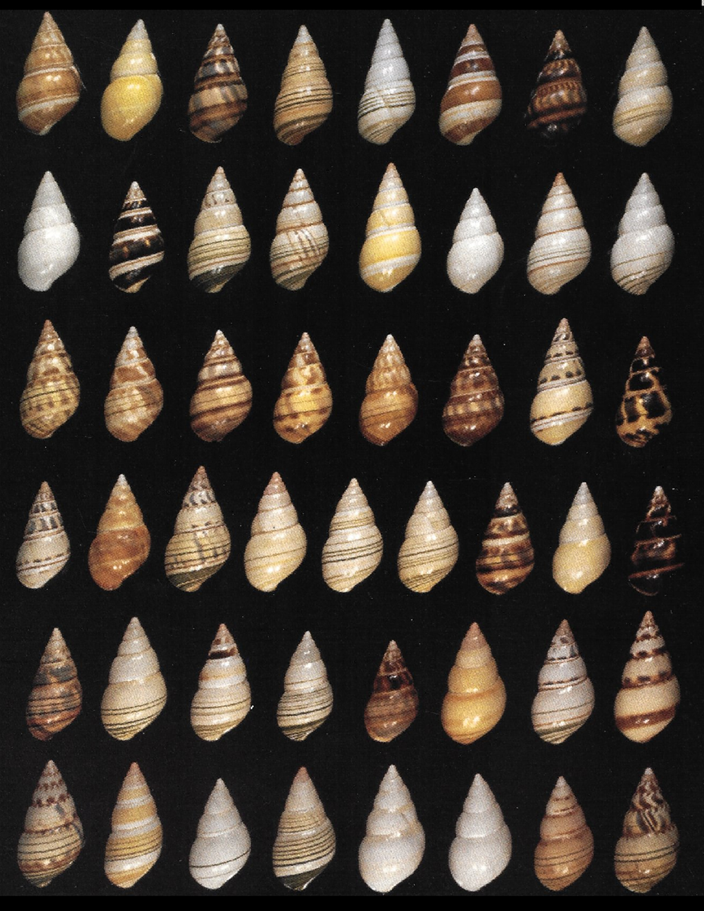

# Variação e Diversidade Genética

<br>

```{r liguus, echo = FALSE, fig.align = 'center', out.width="400px", fig.cap="A distribuição de alelos e a baixa diversidade genética no caramujo da Flórida (_Liguus fasciatus_) apóia a visão de uma única espécie parcialmente autofecundante que se diversificou na Flórida após um único evento fundador. Ver Hillis et al ([1991](https://doi.org/10.1093/oxfordjournals.jhered.a111087))"} 

```

<br>

## Genética mendeliana $\times$ Genética de populações

A **genética mendeliana** estuda o comportamento de um ou mais loci gênicos em cruzamentos simples.

Nesta, dois parentais intercruzantes contribuem cada com um alelo por locus, e Os resultados esperados são proporções mendelianas das características fenotípicas.

<br>

```{r mendeliano, echo = FALSE, fig.align = 'center', out.width="600px", fig.cap="Exemplos de proporções mendelianas em características co-dominantes (1:2:1) e dominantes (3:1)."} 
knitr::include_graphics("figs/traços_mendelianos.svg")
```

<br>

Por outro lado, a **genética de populações** visa estudar o comportamento de um ou mais loci gênicos em múltiplos cruzamentos, _i. e._, em proporções populacionais.

Para tal, as informações genéticas do **_pool_ gênico** de um ou mais **demes** constituindo **unidades panmíticas** são analisados a partir de **amostras** populacionais. 

<br>

:::quote

**_pool_ gênico** --  (Unidade genética) Todos os alelos em um ou mais loci gênicos.
	
**deme** -- (Unidade ecológica ou demográfica) Grupo de indivíduos em uma dada área geográfica.

**unidade panmítica** -- (Unidade reprodutiva) Grupo de indivíduos intercruzantes ao acaso.

**amostra** -- (Unidade estatística) Subconjunto de tamanho $n$ de uma população de tamanho $N$, a partir do qual  parâmatros são estimados, e inferências são feitas. 

:::

<br>

## Frequências genotípicas

Considere um locus autossômico diplóide com dois alelos $A$ e $a$, sem dominância. 

Em uma população $N$, deixe ser o número de indivíduos dos genótipos $AA = x$, $Aa = y$ e $aa = z$, de forma que:

$$x + y + z = N$$

<br>

Logo, as frequências genotípicas observadas na população serão:

- para os homozigotos dominates ($AA$):

$$f_{Obs}(AA) = \frac{x}{N}$$

<br>

- para os heterozigotos ($Aa$):

$$f_{Obs}(Aa) = \frac{y}{N}$$

<br>

- e para os homozigotos recessivos ($aa$):

$$f_{Obs}(aa) = \frac{z}{N}$$

<br>

## Frequências alélicas

As frequências alélicas (ou gênicas) podem ser definidas como:

\begin{equation} 
f(A) = p = \frac{2x + y}{2N} = f(AA) + ½f(Aa)
  (\#eq:freqp)
\end{equation} 

<br>

e

\begin{equation} 
f(a) = q = \frac{2z + y}{2N} = f(aa) + ½f(Aa)
  (\#eq:freqq)
\end{equation} 

<br>

De forma que,

\begin{equation} 
p + q = 1
  (\#eq:poolgene)
\end{equation} 

<br>

As frequências $p$ e $q$ são convenções, intercambiáveis em relação aos alelos $A$ e $a$.
	
Contudo, $q$ é geralmente usado para alelos recessivos, mutantes, raros ou desvantajosos.

<br>

:::quote

**Dominante e recessivo** -- propriedades fenotípicas.

**Selvagem e mutante** -- propriedades ontológicas.

**Comum e raro** -- propriedades estatísticas.

**Vantajoso e desvantajoso** -- propriedades evolutivas.

:::

<br>

\linebreak

## Generalização das frequências genotípicas e alélicas

Considere um locus autossômico diplóide com $i$ alelos, sem dominância. 

As frequências genotípicas observadas são:

$$f_{Obs}(A_1A_1) = \frac{N_{A_1A_1}}{N}$$

<br>

$$f_{Obs}(A_1A_2) = \frac{N_{A_1A_2}}{N}$$
<br>

$$...$$

<br>

$$f_{Obs}(A_1A_i) = \frac{N_{A_1A_i}}{N}$$
<br>

$$...$$
<br>

$$f_{Obs}(A_iA_i) = \frac{N_{A_iA_i}}{N}$$

As frequências alélicas serão:

$$f(A_1)  = a_1 =   f(A_1A_1) + ½ f(A_1A_2) + … + ½ f(A_1A_i)$$

<br>

$$f(A_2)  = a_2 =   f(A_2A_2) + ½ f(A_1A_2) + … + ½ f(A_2A_i)$$

<br>

$$...$$

<br>

$$f(A_i)  = a_i =   f(A_iA_i) + ½ f(A_1A_i) + … + ½ f(A_iA_i)$$
De forma que:

$$a_1 \ + a_2 \ + \ ... \ + \ a_i = 1$$

<br>

## Heterozigoside

A heterozigosidade (ou heterozigose) observada ($H_{Obs}$) de uma população é a freqüência de heterozigotos em um dado locus gênico.

Dada as definições de frequências [genotípicas][Frequências genotípicas] e [alélicas][Frequências genotípicas], para um lócus bialélico, temos que:  

$$H_{Obs} = \frac{y}{N} = f(Aa) =  1 – f(AA) – f(aa)$$

<br>

Esta estimativa é muito útil para avaliarmos a diversidade genética de uma população natural, uma vez que uma alta heterozigosidade quase sempre está relacionada a uma alta variabilidade genética, e vice-versa.
 

A heterozigosidade observada ($H_{Obs}$) é geralmente contrastada com a expectativa da heterozigosidade dado o [princípio de Hardy-Weinberg][Princípio de Hardy-Weinberg].

Essa heterozigosidade esperada ($H_{Esp}$) pelo princípio de Hardy-Weinberg pode ser interpretada como a probabilidade de que um indivíduo seja heterozigoto para um determinado locus gênico (ver [Modelando o princípio de Hardy-Weinberg]{Modelando o princípio de Hardy-Weinberg})

Sendo,

$$H_{Esp} = 2pq =  1 – p^2 – q^2$$

<br>

Quando $H_{Obs} \neq H_{Esp}$, forças evolutivas podem estar atuando nas populações.

<br>

## Diversidade gênética

Na linguagem comum, a variabilidade genética e a diversidade genética são erroneamente consideradas sinônimos entre si. 

A **variabilidade genética** é a variação nos alelos dos genes ou nas sequências de DNA no pool gênico de uma espécie ou população. Isso se expressa em termos de formas alternativas no fenótipo. 

A **Diversidade genética**, por outro lado, é um termo amplo que abrange toda a variabilidade que ocorre entre os diferentes genótipos relacionados a uma única espécie ou entre espécies. 

Como definido por Swingland ([2013](https://doi.org/10.1016/B978-0-12-384719-5.00009-5)), diversidade genética é a variação de características hereditárias presentes em uma população da mesma espécie; podendo essa variação se expressar na forma de alterações na morfologia, anatomia, comportamento fisiológico ou características bioquímicas. 

A diversidade genética pode ser medida contando o número de genes diferentes em um pool gênico. Por sua vez, a variação genética só pode ocorrer e não pode ser medida, podendo ser considerada como unidade básica da diversidade genética. 

<br>

```{r setXeY, echo = FALSE, fig.align = 'center', out.width="400px", fig.cap="Exemplo de dois conjuntos com diferentes níveis de variação e diversidade. Quando há variação nos elementos ($A$, $B$, $C$ e $D$), o conjunto ($X$ e $Y$) é mais diverso"} 
knitr::include_graphics("figs/setZ_ABCD.svg")
```

<br>

Alguns autores consideram a diversidade genética ($D$) de um locus como a heterozigosidade esperada (H_{Esp}) daquele lócus, _i. e._, a proporção de genótipos heterozigotos dada a expectativa do princípio de Hardy-Weinberg.

Nesse sentido, a diversidade genética é composta de dois parâmetros:

- o número de alelos na população, e

- a abundância (ou uniformidade) dos alelos.

<br>

### Exemplo 

Se uma população consiste em um excesso de homozigotos para diferentes alelos, isso leva a uma baixa heterozigose observada, mas não afeta a heterozigose esperada.

| População 2                                         |  População 2                                        |
|                    :---:                            |                   :---:                             |
| $P_1 = \left\{ AA, BB, CC, DD \right\}$             | $P_2 = \left\{ AB, AB, AB, AB \right\}$             |
| $f(A) = f(B) = f(C) = f(D) = 0.25$                  | $f(A) = f(B) = 0.50$                                |
| $H_{Obs} = 0.00$                                    | $H_{Obs} = 1.00$                                    |
| $H_{Esp} = 1 – 4(0.25)^2 = 0.75$                    | $H_{Esp}  = 1 – 2(0.5)^2 = 0.50$                    |

<br>

Assim, se uma população apresenta um excesso de homozigotos para diferentes alelos, isso leva a uma baixa heterozigosidade observada, mas não afeta a heterozigose esperada.

<br>

## Determinantes da diversidade genética

<br>

### Extratégias reprodutivas

Animais estrategistas r são mais polimórficos do que estrategistas K. A correlação negativa apresentada no gráfico reflete uma compensação entre a quantidade e o tamanho da prole. 

https://media.springernature.com/m685/springer-static/image/art%3A10.1038%2Fnrg.2016.58/MediaObjects/41576_2016_Article_BFnrg201658_Fig1_HTML.jpg

### Ligação gênica

Efeito da seleção ligada na diversidade genética (nucleotídica) em torno dos genes ou outros elementos funcionais. 

Nos painéis inferiores, as linhas contínuas indicam a variação local no nível de diversidade nucleotídica, e as linhas tracejadas indicam a diversidade média em toda a região em questão. 

Em regiões com uma alta densidade de alvos de seleção (a), a seleção ligada é generalizada e reduz significativamente a diversidade em comparação com regiões com uma densidade mais baixa de alvos de seleção (b). Quando a taxa de recombinação é alta (c), o efeito da seleção ligada torna-se menos prevalente, permitindo a manutenção de altos níveis de diversidade naquela região.

https://media.springernature.com/lw685/springer-static/image/art%3A10.1038%2Fnrg.2016.58/MediaObjects/41576_2016_Article_BFnrg201658_Fig3_HTML.jpg

## Medidas de Diversidade em loci diplóides

### Nível de polimorfismo

Nível de polimorfismo (P)

P = np / nt

Onde, 
np = número loci polimórficos observados, e
nt  = número total de loci examinados.

Exemplo,

### Riqueza alélica

Riqueza alélica (A)

Onde, 
A = número de alelos polimórficos observados em cada loci.

Exemplo,

### Número médio de alelos

Número médio de alelos por locus (n)

n = ∑ ni / K

Onde,
K = número de loci gênicos examinados, e
ni = número de alelos polimórficos observados no i-nésimo locus gênico. 

Exemplo,

### Número efetivo de alelos

Número efetivo de alelos (Ae)

Ae  =  1 / (1 − HEsp)  =  1 / ∑ pi2

Onde,
pi = frequência do i-nésimo alelo em um locus gênico. 

## Medidas de Diversidade em loci haplóides

### Número de haplótipos

Número de haplótipos (h)

Onde, 
h = número de haplótipos diferentes observados.

Exemplo,

### Diversidade haplotípica

Diversidade haplotípica (Hd)

Hd = (N / N − 1) * (1 − ∑pi2)

Onde, 
N = tamanho da amostra, e
pi = frequência do i-nésimo haplótipo.

Exemplo,

### Número de sítios segregantes

Número de sítios segregantes ou polimórficos (S)

Onde, 
S = número de sítios polimórficos observados.

Exemplo,

### Número de sítios invariantes

Número de sítios invariantes (I)

Onde, 
I = número de sítios invariantes observados.

Exemplo,

### Número total de mutações

Número total de mutações (η; Eta)

Onde, 
η = número de sítios de nucleotídeos nos quais as bases menos frequentes são observadas.

Exemplo,

### Número médio de diferenças nucleotídicas

Número médio de diferenças nucleotídicas (k)

k = ∑ ∑ kij / (  )

Onde, 
kij = número de nucleotídeos diferentes entre as i-nésima e j-nésima sequência de nucleotídeos.

Exemplo,

### Diversidade nucleotídica 

Diversidade nucleotídica ou número médio de substituições por sítio de nucleotídeo (π; pi) 

π = ∑ ∑ πij / (n_2)

Onde, 
πij = proporção de nucleotídeos diferentes entre as i-nésima e j-nésima sequência de nucleotídeos.


Exemplo,

Note que a diversidade nucleotídica (π) pode ser estimada da seguinte forma:

π = k / L

Onde, 
k = número médio de diferenças nucleotídicas
L = o tamanho, em pares de bases, do haplótipo (se todos indivíduos apresentarem sequências com o mesmo tamanho)


