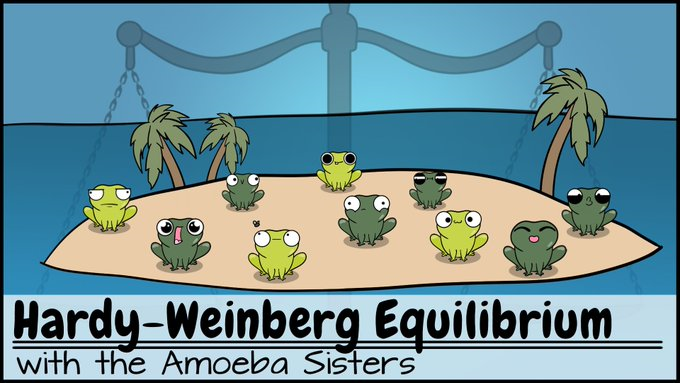
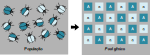
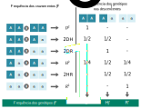
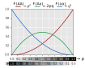
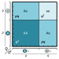

# Princípio de Hardy-Weinberg

.\linebreak

```{r amoebahw, echo = FALSE, fig.align = 'center', out.width="600px", fig.cap="A natureza probabilística princípio de Hardy-Weinberg torna a análise de cenários evolutivos enganosamente difícil para os alunos, bem como para professores que não são especificamente treinado em análises quantitativas. Veja este vídeo [aqui](https://www.youtube.com/watch?v=7S4WMwesMts)"}

```

.\linebreak


:::reference

Mertens 1992. doi: [10.2307/4449417](https://doi.org/10.2307/4449417)

Masel 2012. doi: [10.1002/bies.201100178](https://doi.org/10.1002/bies.201100178)

Brewer & Gardner 2013. doi: [10.1525/abt.2013.75.7.6](https://doi.org/10.1002/bies.201100178)

:::

.\linebreak

## Hardy e Weinberg

.\linebreak
```{r hardy, echo = FALSE, fig.align = 'right', out.width = "300px", fig.cap="[Geoffrey H. Hardy](https://en.wikipedia.org/wiki/G._H._Hardy) (1877-1947), matemático inglês."} 
knitr::include_graphics('https://upload.wikimedia.org/wikipedia/commons/3/35/Ghhardy%4072.jpg')
```

.\linebreak

```{r weinberg, echo = FALSE, fig.align = 'right', out.width = "300px", fig.cap="[Wilhelm Weinberg]() (1862-1937), médico alemão."} 
knitr::include_graphics('https://assets.sutori.com/user-uploads/image/5ebbe88a-0058-4307-bf1b-8236eb3793ca/0d0f9915fa3e3b8b91c7584f4b7fe06c.jpeg')
```
.\linebreak

Desenvolvido independentemente por G. H. Hardy e Wilhelm Weinberg, no início de 1900, o **princípio de Hardy-Weinberg** (PHW) é a pedra angular da genética de populações, e consiste em um modelo matemático que relaciona frequências alélicas a frequências genotípicas.

De acordo com o princípio (ou equilíbrio, modelo, teorema e lei) de Hardy-Weinberg, as freqüências gênicas e genótípicas em uma população permanecerão constantes, de geração em geração, desde que respeitadas suas premissas teóricas.

Como a maioria dos modelos, o princípio de Hardy-Weinberg é uma simplificação das complexidades do mundo real, mas tem um surpreendente poder explicativo.

As premissas subjacentes ao princípio de Hardy-Weinberg são:

- Organismos diplóides

- Reprodução sexual

- Gerações não-sobrepostas

- Acasalamento aleatório

- Tamanho infinito da população

- Frequências alélicas iguais entre os sexos

- Ausência de forças evolutivas 

:::quote
**Força evolutiva** -- Incluindo, mas não limitado a, deriva genética, escolha de parceiro, acasalamento seletivo, seleção natural, seleção sexual, mutação, fluxo gênico, impulso meiótico, carona genética, gargalo populacional, efeito fundador e endogamia.
:::

## Demostração do modelo

Considere um lócus com dois alelos $A$ e $a$ no _pool_ gênico de uma população.

.\linebreak
```{r poppool, echo = FALSE, fig.align = 'center', out.width = "800px", fig.cap="Representação do _pool_ gênico de uma população."} 

```
.\linebreak

Assim, as frequências dos indivíduos dos diferentes genótipos da população na geração atual ($F_0$), são: 

- $D$, para os homozigotos dominantes ($AA$);

- $H$, para os heterozigotos ($Aa$); e

- $R$, para os homozigotos recessivos ($aa$).

De forma que $D+H+R=1$.

Das as premissas do princípio de Hardy-Weinberg, todos Os possíveis cruzamentos (união de gametas) entre esses indivíduos serão observados.

Por exemplo, a chance de dois indivíduos heterozigotos se cruzarem na população é igual a chance do parental masculino pertencer àquele genótipo ($M_H$), multiplicado pela chance do parental feminino pertencer também àquele genótipo ($F_H$), ou seja: 

$$Pr_{cruzamento(M_H \times F_H)} = H \cdot H = H^2$$

.\linebreak

Por outro lado, a chance de um cruzamento entre parentais de genótipos diferentes depende, é igual a chance do parental masculino ser, por exemplo, homozigoto dominante ($M_D$), multiplicada pela chance do parental feminino ser, por exemplo, heterozigoto dominante ($F_H$), adicionada a chance inversa, na qual o parental masculino é heterozigoto ($M_H$) e o parental feminino é homozigoto dominante ($F_D$), ou seja:

$$Pr_{cruzamento(M_D \times F_H \ or \ M_H \times F_D)} = \left( D \cdot H \right) + \left( H \cdot D \right) = 2DH$$

.\linebreak
```{r cruzapop, echo = FALSE, fig.align = 'center', out.width = "800px", fig.cap="Os cruzamentos entre os indivíduos dos diferentes genótipos da população na geração atual ($F_0$) determinarão os genótipos dos descentes, e assim, a frequência dos genótipos na próxima geração ($F_1$)."} 

```
.\linebreak

Desta forma, a frequência dos genótipos na próxima geração ($F_1$) será resultado da frequência de formação dos genótipos a partir desses cruzamentos, se forma que:

- para os homozigotos dominantes:

$$D' = D^2 + \frac {2DH}{2} + \frac {H^2}{4} = \left( D + \frac {H}{2} \right)^2$$

.\linebreak

- para os heterozigotos:

$$H' = \frac {2DH}{2} + 2DR + \frac {H^2}{2} + \frac {2HR}{2} = 2 \left( D + \frac {H}{2} \right) \left( R + \frac {H}{2} \right)$$

.\linebreak

- e para os homozigotos recessivos:

$$R' = R^2 + \frac {2HR}{2} + \frac {H^2}{4} = \left( R + \frac {H}{2} \right)^2$$

.\linebreak

### O princípio de Hardy-Weinberg dado o _pool_ gênico

Como visto no capítulo anterior (seção (ref)), a frequência dos alelos no _pool_ gênico, podem ser expressas por meio das frequências genotípicas, tal que:

$$F(A) = p = D + \frac {H}{2}$$

.\linebreak

e 

$$F(a) = q = R + \frac {H}{2}$$

.\linebreak

Substituindo esses termos nas equações anteriores, teremos, para a geração seguinte:

- a frequência dos homozigotos dominantes:

$$D'=p^2$$

- a frequência dos heterozigotos:

$$H'=2pq$$

- a frequência dos homozigotos recessivos:

$$R'=q^2$$

Sabendo que as frequências dos alelos $A$ e $a$ correspondem a totalizade do _pool_ gênico, de forma que: 

$$p + q = 1$$

É fácil constatar, a partir da demonstração anterior, que as frequências do genótipos na geração seguinte corresponde a um **Binômio de Newton**., que representa as chances de encontros (combinação) dos alelos do _pool_ gênico em dupla carga (diploidia).

De forma que:

$$\left( p + q \right)^2 = p^2 +2pq + q^2 = 1$$

.\linebreak
```{r hwgraph, echo = FALSE, fig.align = 'center', out.width = "600px", fig.cap = "Uma população que siga as premissas do princípio de Hardy-Weinberg apresenta genótipos previstos de acordo com o modelo $(p + q)^2$"}

```
.\linebreak

Por exemplo, dadas as frequências alélicas $F(A) = p = 0.6$ e $F(a) = q = 0.4$, as freqüências genotípicas esperadas pela princípio de Hardy-Weinberg serão:

- para os homozigotos dominantes:

$$F_{Esp}(AA) = p^2 = (0.6)^2 = 0.6 \times 0.6 = 0.36$$

.\linebreak

- para os heterzigotos:

$$F_{Esp}(Aa) = 2pq = 2 \times 0.6 \times 0.4 = 0.48$$

.\linebreak

- para os homozigotos recessivos:

$$F_{Esp}(aa) = q^2 = (0.4)^2 = 0.4 \times 0.4 = 0.16$$

.\linebreak

A expectativa das frequências genotípicas dado um _pool_ gênico pode ser vista também por meio de um quadrado de Punnett se os lados dos quadrados são proporcionais as frequências dos alelos. Desta forma, as freqüências genotípicas corresponderão às áreas dos retângulos formados pelos cruzamentos dos gametas.

.\linebreak
```{r hwpunnet, echo = FALSE, fig.align = 'center', out.width = "400px", fig.cap = "Quadrado de Punnet para um _pool_ gênico com 2 alelos ($p+q=1$)."}

```
.\linebreak


### Generalização para três alelos


### Generalização para quatro alelos


### Generalização para $n$ alelos


### Generalização para triploidia


## Exercícios


### Exercício 1 -- As ervilhas de Mendel


### Exercício 2 -- Tremoço-anão

.\linebreak
```{r lnanus, echo = FALSE, fig.align = 'center', out.width = "400px", fig.cap="Polimorfismo da coloração das flores no tremoço-anão (_Lupinus nanus_)."} 
knitr::include_graphics('https://www.bolster.eu/media/images/5620_dbweb.jpg')
```
.\linebreak

O tremoço-anão (_Lupinus nanus_), uma planta silvestre nativa dos estados unidos, normalmente apresenta flores azuis, mas plantas com flores rosa são ocasionalmente observadas em populações selvagens. A cor da flor é controlada em um único locus, com o alelo rosa completamente recessivo ao alelo azul.

O estudo de Harding ([1970](https://doi.org/10.1111/j.1558-5646.1970.tb01744.x)) nas cordilheiras da Califórniana, revelou os seguintes dados para uma dada população:

.\linebreak
```{r tableB05, echo = FALSE}
B05azul <- c(3291)
B05rosa <- c(25)
B05N <- c(3316)
dataB05 <- data.frame(B05azul, B05rosa, B05N)
rownames(dataB05) <- c("**Indivíduos**")
knitr::kable(dataB05, align = "ccc", booktabs = TRUE, col.names = c("Flores azuis", "Flores rosas", "N"), caption = "Frequências fenotípicas para o polimorfismo de cor das flores do tremoço-anão (_Lupinus nanus_) de uma população da Planície Espanhola, Califórnia, EUA.")
```
.\linebreak

- Quais são as frequências genotípicas esperadas para essa população, assumindo que ela segue o princípio de Hardy-weinberg?

.\linebreak

### Exercício 3 -- Albinismo em humanos

.\linebreak
```{r familialbino, echo = FALSE, fig.align = 'center', out.width = "600px", fig.cap="As crianças Vijay, 25, Ramkishan, 19, e Shankar, 24 (fila de trás), juntamente com as filhas Pooja, 18 (esquerda) e Deepa, 21 (direita) herdaram o albinismo de seus pais Rosetauri e Mani Pullan (centro)."} 
knitr::include_graphics('https://i.pinimg.com/originals/aa/a9/c4/aaa9c48bc7d6a49b0633733558515844.jpg')
```
.\linebreak

O albinismo oculocutâneo tirosinase-positivo (OCA, tipo II; [OMIM 203200](https://www.omim.org/entry/203200)) é um distúrbio autossômico recessivo no qual a biossíntese do pigmento melanina é reduzida na pele, cabelos e olhos.

A prevalência deste distúrbio varia largamente entre as diversas populações humanas.

.\linebreak
```{r tableC05, echo = FALSE}
C05prev <- c("1:36.000", "1:10.000", "1:3.900", "1:2.833", "1:1.100", "1:140")
C05ref <- c("[Lee et al. 1994](https://doi.org/10.1056/NEJM199402243300803 )", " '' ", "[Kromberg & Jenkins 1982](https://pubmed.ncbi.nlm.nih.gov/7064008/), [1984](https://doi.org/10.1017/S0021932000014838)", "[Kagore & Lund 1995](http://dx.doi.org/10.1136/jmg.32.11.859)", "[Okoro 1975](https://doi.org/10.1111/j.1365-2133.1975.tb03116.x)", "[Woolf 1965](https://pubmed.ncbi.nlm.nih.gov/14255554/); [Woolf & Dukepoo 1969](https://doi.org/10.1126/science.164.3875.30)")
dataC05 <- data.frame(C05prev, C05ref)
rownames(dataC05) <- c("**Estados Unidos (geral)**", "**Estados Unidos (afro-americanos)**", "**South Africa (negros)**", "**Zimbabwe (Harare)**", "**Nigeria (Ibo)**", "**Jemez (ameríndios)**")
knitr::kable(dataC05, align = "cr", booktabs = TRUE, col.names = c("Prevalência", "Referência"), caption = "Prevalência de albinismo tipo 2 em diferentes populações humanas")
```
.\linebreak


Assumindo que esta deficiência seja devida a um único gene autossômico recessivo, e que as populações abaixo estejam em equilíbrio de Hardy-Weinberg: 

- Qual a proporção esperada de pessoas portadoras? 

.\linebreak

### Exercício 4 -- 


