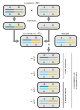

# Desequilíbrio de Ligação

<br>

```{r LDsorghum, echo = FALSE, fig.align = 'center', out.width="600px", fig.cap="O desequilíbrio de ligação decai com a distância física entre as regiões gênicas, como mostrado pela correlação (r2) nos diversos cromossomos do sorgo (Sorghum bicolor). Perceba que raças tradicionais (RT, _Landraces_) apresentam uma taxa de decaimento maior do que linhagens endocruzantes recombinantes (LER, _RILS_). Ver Hu et al [2019](https://doi.org/10.3835/plantgenome2018.06.0044)."} 
knitr::include_graphics('https://acsess.onlinelibrary.wiley.com/cms/asset/72da5c7a-6c96-450d-b9d1-20d9e0bad237/tpg2plantgenome2018060044-fig-0003-m.jpg')
```

<br>

:::quote

**Linhagem Endocruzante Recombinante** -- Um organismo com cromossomos que incorporam um conjunto essencialmente permanente de eventos de recombinação entre cromossomos herdados de duas ou mais linhagens endocruzantes.

**Raça Tradicional** -- Uma variedade tradicional domesticada e adaptada localmente de uma espécie de animal ou planta que se desenvolveu ao longo do tempo, por meio da adaptação ao seu ambiente natural e cultural de agricultura ou pastorícia, e devido ao isolamento de outras populações da espécie.

:::

<br>

## Ligação gênica

A ligação gênica é a tendência de genes localizados no mesmo cromossomo serem herdados em conjunto durante a meiose. 

Genes ditos estarem geneticamente ligados correspondem a loci que estão perto um do outro, sendo menos susceptíveis de ser separados em diferentes cromátides por recombinação genética.

Considera-se recombinação genética toda e qualquer produção de uma nova combinação de alelos em dois ou mais loci gênicos. Em organismos diplóides, isto se dá principalmente por meio do mecanismo de _crossing over_.

Assim sendo, a proporção de descendentes que sofreram um evento de recombinação entre dois loci gênicos é medida pela *taxa de recombinação genética* ($r$).

<br>

Desta forma que, os descendentes herdarão cromossomos:

- iguais ao de um dos parentais, em uma taxa $1 − r$; ou

- que são uma recombinação dos cromossomos dos parentais, em uma taxa $r$.

<br>

Uma vez que a recombinação por _crossing over_ só ocorre entre os dois cromossomos homólogos pareados da tétrade na meiose, o maior valor que a taxa de recombinação genética pode alcançar é igual a $1/2$, que é igual o mesmo que chance de encontro de alelos em loci em cromossomos diferentes, _i. e._, segregando independentemente.

<br>

```{r tester, echo = FALSE, fig.align = 'center', out.width="400px", fig.cap="Medição empírica da taxa de recombinação -- Linhagens parentais ($F_0$) puras são cruzadas para produzir indivíduos heterozigotos no dois loci gênicos (diíbridos), cuja variação entre os alelos esteja ligada nos cromossomos parentais (_cis_), os quais são cruzados com uma outra linhagem pura (testador) para quantificar os tipos parentais e recombinantes produzidos."} 

```

<br>

## Frequências haplotípicas

<br>

:::quote

Haplótipo -- **1**. coleção de alelos específicos em um agrupamento de genes fortemente ligados em um cromossomo, que provavelmente serão herdados juntos; **2**. um conjunto de alelos de polimorfismo de nucleotídeo único (SNP) ligados que tendem a sempre ocorrer juntos, _i.e._, que estão associados estatisticamente.

:::

<br>

Considere os haplótipos produzidos por dois loci gênicos $A$ e $B$, com dois alelos cada, com taxa de recombinação $r$ entre si.

A gametogênese dos indivíduos do genótipo $AB/ab$ produzirá os seguintes haplótipos:

<br>

| Haplótipo   | Frequência     | Tipo             |
| :---:       | :---:          | :---:            |
| $AB$        | $(1-r)/2$      | Parental         |
| $ab$        | $(1-r)/2$      | Parental         |
| $Ab$        | $r/2$          | **Recombinante** |
| $aB$        | $r/2$          | **Recombinante** |

<br>

Enquanto que a gametogênese de um genótipo $Ab/aB$ produzirá os seguintes haplótipos:

<br>

| Haplótipo   | Frequência     | Tipo             |
| :---:       | :---:          | :---:            |
| $AB$        | $r/2$          | **Recombinante** |
| $ab$        | $r/2$          | **Recombinante** |
| $Ab$        | $(1-r)/2$      | Parental         |
| $aB$        | $(1-r)/2$      | Parental         |

<br>

Sendo a frequência observada dos haplótipos dos loci gênicos $A$ e $B$:

<br>

| Haplótipo   | Frequência   |
| :---:       | :---:        |
| $AB$        | $p_{AB}$     |
| $ab$        | $p_{ab}$     |
| $Ab$        | $p_{Ab}$     |
| $aB$        | $p_{aB}$     |

<br>

De forma que,

$$p_{AB} + p_{ab} + p_{Ab} + p_{aB} = 1$$

<br>

Note que estas são frequências relativas, que determinam as frequências alélicas:

<br>

| Alelo      | Frequência                    |
| :---:      | :---:                         |
| $A$        | $p_{A} = p_{AB} + p_{Ab}$     |
| $a$        | $p_{A} = p_{ab} + p_{aB}$     |
| $B$        | $p_{A} = p_{AB} + p_{aB}$     |
| $b$        | $p_{A} = p_{ab} + p_{Ab}$     |

<br>

:::quote

**Acoplamento gênico** -- Quando ambos os alelos do tipo selvagem estão em um cromossomo homólogo, e ambos os alelos mutantes estão no outro (_e. g._, $AB/ab$). Também conhecido como configuração _cis_. 

**Repulsão gênica** -- Quando um alelo do tipo selvagem e um alelo mutante estão em um cromossomo homólogo, e o oposto no outro (_e. g._, $Ab/aB$). Também conhecido como configuração _trans_. 

:::

<br>

## coeficiente de desequilíbrio de ligação

O termo desequilíbrio de ligação (LD, _linkage disequilibrium_) foi usado pela primeira vez por Lewontin e Kojima ([1960](https://doi.org/10.1111/j.1558-5646.1960.tb03113.x)) para indicar uma associação não-aleatória de alelos em dois ou mais loci. 

Dado suficiente tempo evolutivo... 

- a ocorrência de eventos de recombinação aleatória em um cromossomo resultará em uma distribuição de equilíbrio de alelos em cada locus; e

- a frequência de um alelo em particular em um determinado locus será independente da frequência de alelos em outros loci ligados.

Nesse sentido, seria alcançado um equilíbrio de ligação, e a frequência do haplótipo entre um par de alelos será igual ao produto das frequências alélicas individuais, de forma que:

<br>

$$p_{AB} = p_{A} \cdot p_{B}$$

<br>

Assim sendo, o desequilíbrio de ligação é definido como a diferença entre a frequência observada de uma combinação particular de alelos em dois loci gênicos e a frequência esperada para a associação aleatória (esperada no equilíbrio). 

<br>

$$D_{AB} = p_{AB} - p_{A}p_{B}$$

<br>

A medida $D_{AB}$ é o **coeficiente de desequilíbrio de ligação**.

O coeficiente de desequilíbrio de ligação é definido para um par específico de alelos, no caso $A$ e $B$, e não depende de quantos outros alelos estão nos dois loci -- cada par de alelos tem seu próprio coeficiente.

Na ausência de forças evolutivas, o coeficiente de desequilíbrio de ligação ($D$) convergirá para zero ao longo do tempo (atingindo o equilíbrio de ligação), e o tempo ($t$), em termos de número de gerações, que levará para tal convergência ocorrer irá depender da magnitude da taxa de recombinação ($r$) entre os dois loci.

Assim, a taxa de recombinação irá mudar a frequência do haplótipo da próxima geração ($p_{AB}'$) de forma que:

<br>

$$p_{AB}' = \left( 1-r \right) p_{AB} + rp_{A}p_{B}$$

<br>

onde $(1-r)$ e $r$ são as chances de formação de haplótipos não-recombinantes e recombinantes, respectivamente.

A equação acima pode ser reescrita (_viz._, subtraindo $p_{A}p_{B}$ dos dois lados) como:

<br>

$$p_{AB}' - p_{A}p_{B} = \left( 1-r \right) \left( p_{AB} - p_{A}p_{B} \right)$$

<br>

Sendo $D_{AB}$ o coeficiente de desequilíbrio da geração atual, e $D_{AB}'$ o coeficiente de desequilíbrio da próxima geração, temos então que:

<br>

$$D_{AB}' = \left( 1-r \right) D_{AB}$$

<br>

Desta forma, para qualquer par de alelos em dois loci gênicos ligados, de uma geração para a seguinte, temos:

<br>

$$D_{t+1} = \left( 1-r \right) D_{t}$$

<br>

E assim, partir desta, temos:

<br>

$$D_{t} = \left( 1-r \right)^t D_{0}$$

<br>

Logo, se $t → ∞$, então $D_t → 0$.

<br>

```{r LDgraph, echo = FALSE, warning = FALSE, fig.align = 'center', out.width = "600px", fig.cap="O coeficiente de desequilíbrio de ligação ($D$) ao longo das gerações sob diferentes taxas de recombinação ($r$)."} 
library("ggplot2")
library("latex2exp")
ggplot(data.frame(x = c(0, 25)), aes(x = x)) + 
  stat_function(fun = function(x) 0.25*(1-0)^x, color = "firebrick2", lwd = 1) +
  stat_function(fun = function(x) 0.25*(1-0.01)^x, color = "chocolate", lwd = 1) +
  stat_function(fun = function(x) 0.25*(1-0.05)^x, color = "royalblue3", lwd = 1) +
  stat_function(fun = function(x) 0.25*(1-0.1)^x, color = "green4", lwd = 1) +
  stat_function(fun = function(x) 0.25*(1-0.5)^x, color = "deepskyblue3", lwd = 1) +
  labs(x = "Geração", y = "Coeficiente de \ndesequilíbrio de ligação") + 
  annotate(geom='text', x=24, y=0.24, parse = TRUE, color="firebrick2", label=TeX("$r=0$")) +
  annotate(geom='text', x=24, y=0.18, parse = TRUE, color="chocolate", label=TeX("$r=0.01$")) +
  annotate(geom='text', x=24, y=0.09, parse = TRUE, color="royalblue3", label=TeX("$r=0.05$")) +
  annotate(geom='text', x=24, y=0.04, parse = TRUE, color="green4", label=TeX("$r=0.1$")) +
  annotate(geom='text', x=20, y=0.01, parse = TRUE, color="deepskyblue3", label=TeX("$r=0.5$"))
```

<br>

O coeficiente de desequilíbrio de ligação é usado geralmente para indicar que dois genes estão fisicamente ligados.

No entanto, a detecção de um desequilíbrio de ligação não assegura a existência de ligação gênica ou falta de equilíbrio, podendo alternativamente refletir:

<br>

A ocorrência de LD pode refletir... 

- no genoma, como um todo:

	- histórias populacionais, 
	
	- sistemas de acasalamento,
	
	- padrões de subdivisão geográfica

-e em regiões gênicas específicas:

	- seleção natural, 
	
	- convergência gênica, 
	
	- mutação, 
	
	- e outras forças que promovem mudança nas nas freqüências gênicas.

<br>

Como esses fatores afetam o equilíbrio de ligação entre um par particular de locos ou em uma região genômica depende das taxas locais de recombinação.

<br>

## coeficiente de desequilíbrio de ligação normalizado

O coeficiente de desequilíbrio de ligação ($D$) nem sempre é uma medida conveniente, porque o seu intervalo de valores possíveis depende das frequências dos alelos a que se refere.

Isso dificulta a comparação do nível de desequilíbrio de ligação entre diferentes pares de alelos.

<br>

O coeficiente de desequilíbrio de ligação pode ser normalizado ($D'$) se dividindo-o pela diferença máxima teórica entre as frequências de haplótipos observadas e esperadas como:

<br>

\begin{equation}
D’ = \frac{D}{D_{max}}
(\#eq:dnorm)
\end{equation}

<br>

Onde,

<br>

\begin{equation}
D_{max} = \min
\begin{cases} 
\left \{p_A(1-p_B) , (1 – p_A)p_B \right \} & \text{se } D > 0 \\
\left \{p_Ap_B , (1 – p_A)(1 – p_B) \right \} & \text{se } D < 0 \\
\end{cases}
(\#eq:dmax)
\end{equation}

<br>

## Coeficiente de correlação

Uma forma alternativa de expressar o desequilíbrio de ligação entre pares de alelos é por meio do coeficiente de correlação ($r^2$), expresso como:

<br>

$$r^2 = \frac{(D_{AB}^2)}{p_A(1-p_A)p_B(1-p_B)}$$

<br>

As medidas do coeficiente de correlação $r^2$ e do coeficiente de correlação normalizado $D'$ têm seus intervalos de valores limitados, e não abrangem todos os valores de $0$ a $1$ para todos os pares de loci.

O valor máximo de $r^2$ depende das frequências alélicas nos dois loci sendo comparados, e só pode variar totalmente de $0$ a $1$ quando as frequências alélicas em ambos os loci são iguais, $p_A = p_B$, se $D_{AB} > 0$, ou quando as frequências alélicas têm a relação $p_{A}=1-P_{B}$, se $D_{AB} < 0$.

Por sua vez, $D'$ sempre poderá ter um valor máximo teórico de $1$, mas seu valor mínimo para dois loci será igual a $| r |$ para esses loci.

<br>

:::reference

Lewontin 1964. doi: [10.1093/genetics/49.1.49](https://doi.org/10.1093/genetics/49.1.49)

Hill & Robertson 1968. [10.1007/BF01245622](https://doi.org/10.1007/BF01245622) 

Slatkin 2008. [10.1038/nrg2361](https://doi.org/10.1038/nrg2361)

Smith 2020. doi: [10.1016/j.tpb.2020.02.005](https://doi.org/10.1016/j.tpb.2020.02.005)

:::

<br>

## Exercícios

<br>

### Exercício 1 -- Ligação gênica em SNPs

Considere os sequintes Polimorfismos de nucleotídeo único (SNPs) abaixo:

<br>

```{r tableD05, echo = FALSE}
D05SNP1 <- c("A/A", "A/G", "A/G", "A/A", "G/G")
D05SNP2 <- c("C/C", "C/T", "C/T", "C/C", "T/T")
D05SNP3 <- c("A/A", "A/A", "A/C", "A/A", "C/C")
D05SNP4 <- c("T/T", "G/G", "T/G", "G/G", "G/T")
dataD05 <- data.frame(D05SNP1, D05SNP2, D05SNP3, D05SNP4)
rownames(dataD05) <- c("**Indivíduo 1**", "**Indivíduo 2**", "**Indivíduo 3**", "**Indivíduo 4**", "**Indivíduo 5**")
knitr::kable(dataD05, align = "cccc", booktabs = TRUE, col.names = c("SNP1", "SNP2", "SNP3", "SNP4"), caption = "Polimorfismos de nucleotídeo único (SNPs) em quatro loci gênicos hipotéticos.", "html")
```

<br>

- Qual é o coeficiente de desequilíbrio de ligação normalizado ($D'$) entre esses loci gênicos?

- Qual é o coeficiente de correlação ($r^2$) entre esses loci gênicos?

