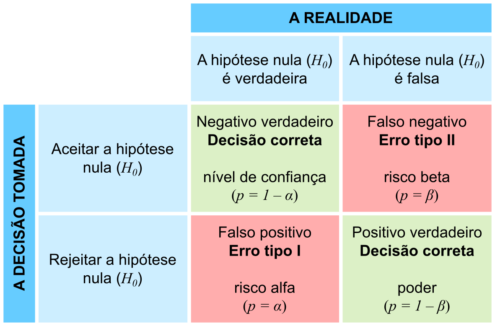

# Testes de Significância

## Significância estatística

Em qualquer experimento ou observação que envolva obter uma amostra de uma população, sempre há a possibilidade de que um efeito observado tenha ocorrido devido apenas ao erro de amostragem. 

Em um teste estatístico de hipótese, um resultado tem significância estatística quando é muito improvável que tenha ocorrido dada a hipótese nula.

Mas se a probabilidade de um efeito observado for menor que (ou igual a) o nível de significância assumido para o estudo, um investigador pode concluir que o efeito reflete os parâmetros de toda a população, rejeitando assim a hipótese nula.

>O termo significância não implica importância, e o termo significância estatística não é o mesmo que significância para pesquisa, teórica ou prática. 

Mais precisamente:

- o nível de significância de um estudo ($\alpha$) é a probabilidade de o estudo rejeitar a hipótese nula, dado que a hipótese nula foi assumida como verdadeira; e

- o valor-p de um resultado ($p$) é a probabilidade de obter um resultado pelo menos tão extremo, dado que a hipótese nula é verdadeira. 

Assim, quando $p\le\alpha$, o resultado é então estatisticamente significativo pelos padrões do estudo.

O nível de significância de um estudo é escolhido antes da coleta de dados e é normalmente definido como 5% (mas podendo ser muito mais baixo dependendo da área de estudo ou tipo de pesquisa, ver a seguir)

Sempre que houver incerteza, existe a possibilidade de cometer um erro. 

Uma vez que testes estatíticos tratam de escolher entre duas proposições concorrentes, chamadas de **Hipótese nula** ($H_0$) e **Hipótese alternativa** ($H_1$), a possibilidade de erro estatístico é parte integrante dos testes de hipóteses. 

Se o resultado do teste corresponder à realidade, então uma decisão correta foi tomada. No entanto, se o resultado do teste não corresponder à realidade, então ocorreu um erro. 

Existem duas situações em que a decisão tomada a partir de um teste estatístico está errada:

**Erro tipo I** — É a probabilidade a probabilidade de rejeitar a hipótese nula (H0) dada que ela seja verdadeira. Esse erro é denotado por \alpha, e é conhecido também como nível de significância ou risco alfa.
O nível de significância de um teste definido como 0,05 (5%) implica que é aceitável ter uma probabilidade de 5% de rejeitar incorretamente a hipótese nula verdadeira. 

**Erro tipo II** — É a probabilidade de aceitar a hipótese nula ($H_0$) dada que ela é falsa. Esse erro é denotado por \beta, e é também conhecido como risco beta.

Fazendo analogia à um tribunal, onde todos são inocentes ($H_0$) até que se prove ao contrário ($H_1$):

- um erro do tipo I corresponde à condenação de um réu inocente; e

- um erro do tipo II corresponde à absolvição de um criminoso.

Esses dois tipos de erro são compensados entre si: para qualquer conjunto de amostra, o esforço para reduzir um tipo de erro geralmente resulta no aumento do outro tipo de erro.

```{r fig:erro_estatistico, echo = FALSE, out.width="80%", fig.cap="Relações entre verdade/falsidade da hipótese nula e resultados de um teste statístico."} 

```

## Testes de ajuste do chi-quadrado

O teste do qui-quadrado de Pearson ($χ^2$; [Pearson 1900](https://doi.org/10.1080/14786440009463897)) é um teste estatístico aplicado a conjuntos de dados categóricos para avaliar a probabilidade de que qualquer diferença observada entre os conjuntos tenha surgido por acaso.

Ele testa uma hipótese nula declarando que a distribuição de freqüência de certos eventos observados em uma amostra é consistente com uma distribuição teórica específica. 

Os eventos considerados devem ser mutuamente exclusivos e ter probabilidade total igual a 1.

### Um exemplo simples

Um exemplo simples é a hipótese de que um dado comum de seis lados é "justo" (ou seja, todos os seis resultados são igualmente prováveis de ocorrer).


**Os dados de Weldon**

[Raphael Weldon](https://en.wikipedia.org/wiki/Raphael_Weldon) foi um biólogo evolucionista inglês e fundador da biometria. Ele foi o editor co-fundador do periódico Biometrika, com Francis Galton e Karl Pearson.

Em 1894, Weldon lançou um conjunto de 12 dados 26.306 vezes, e registrou o número de 5s ou 6s (que considerou um sucesso). 

Ele coletou os dados em parte, "para julgar se as diferenças entre uma série de frequências de grupo e uma lei teórica, considerada como um todo, eram ou não mais do que poderiam ser atribuídas às flutuações fortuitas da amostragem aleatória". 

Weldon observou que 5s ou 6s ocorreram com mais frequência do que o esperado*.

Os dados de dados de Weldon foram usados por Karl Pearson em seu artigo pioneiro sobre a estatística qui-quadrado, e ele hipotetizou que o desvio se devia à  construção dos dados da época (a face com 6 e 5 pontos seria mais leve do que as faces opostas, que tem apenas 1e 2 pontos).

```{marginfigure fig:weldon, echo = FALSE, out.width="80%", fig.cap="W. F. Raphael Weldon (1860-1906)"} 
}
```


