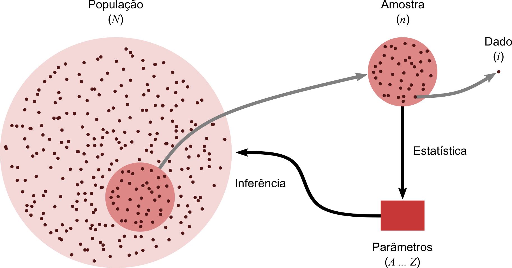
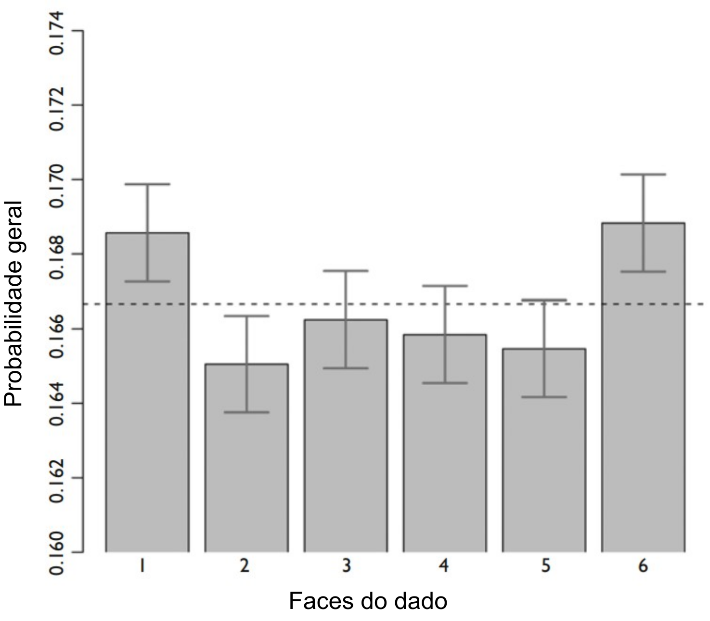
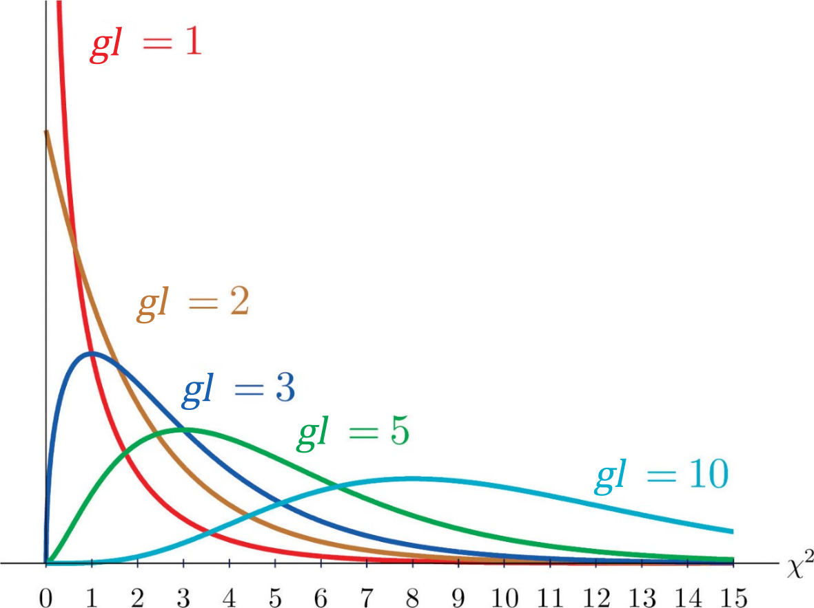
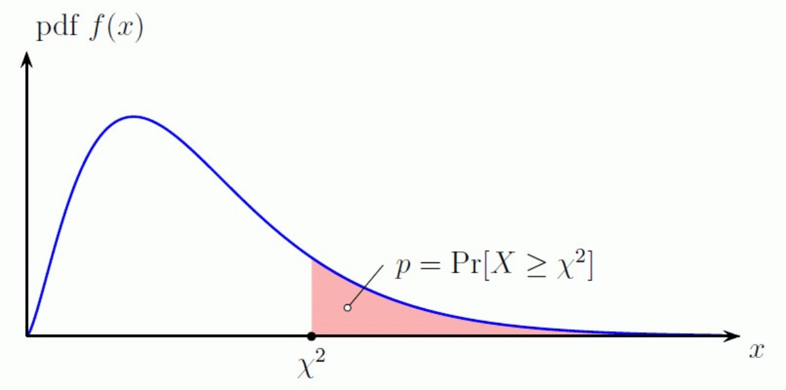

# Testes de Significância

## Significância estatística

Em qualquer experimento ou observação que envolva obter uma amostra de uma população, sempre há a possibilidade de que um efeito observado tenha ocorrido devido apenas ao erro de amostragem. 

Em um teste estatístico de hipótese, um resultado tem significância estatística quando é muito improvável que tenha ocorrido dada a hipótese nula.

>O termo significância não implica importância, e o termo significância estatística não é o mesmo que significância para pesquisa, teórica ou prática. 

.\linebreak
```{r infestat, echo = FALSE, fig.align = 'center', out.width="600px", fig.cap="A inferência estatística é o ato de generalizar de uma amostra para uma população, a partir de dados obtidos desta, com um calculado nível de certeza."} 

```
.\linebreak

Mas se a probabilidade de um efeito observado for menor que (ou igual a) o nível de significância assumido para o estudo, um investigador pode concluir que o efeito reflete os parâmetros de toda a população, rejeitando assim a hipótese nula.

Mais precisamente:

- o nível de significância de um estudo ($\alpha$) é a probabilidade de o estudo rejeitar a hipótese nula, dado que a hipótese nula foi assumida como verdadeira; e

- o valor-p de um resultado ($p$) é a probabilidade de obter um resultado pelo menos tão extremo, dado que a hipótese nula é verdadeira. 

Assim, quando $p\le\alpha$, o resultado é então estatisticamente significativo pelos padrões do estudo.

O nível de significância de um estudo é escolhido antes da coleta de dados e é normalmente definido como 5% (mas podendo ser muito mais baixo dependendo da área de estudo ou tipo de pesquisa, ver a seguir)

Sempre que houver incerteza, existe a possibilidade de cometer um erro. 

Uma vez que testes estatíticos tratam de escolher entre duas proposições concorrentes, chamadas de **Hipótese nula** ($H_0$) e **Hipótese alternativa** ($H_1$), a possibilidade de erro estatístico é parte integrante dos testes de hipóteses. 

Se o resultado do teste corresponder à realidade, então uma decisão correta foi tomada. No entanto, se o resultado do teste não corresponder à realidade, então ocorreu um erro. 

Existem duas situações em que a decisão tomada a partir de um teste estatístico está errada:

**Erro tipo I** — É a probabilidade a probabilidade de rejeitar a hipótese nula (H0) dada que ela seja verdadeira. Esse erro é denotado por \alpha, e é conhecido também como nível de significância ou risco alfa.
O nível de significância de um teste definido como 0,05 (5%) implica que é aceitável ter uma probabilidade de 5% de rejeitar incorretamente a hipótese nula verdadeira. 

**Erro tipo II** — É a probabilidade de aceitar a hipótese nula ($H_0$) dada que ela é falsa. Esse erro é denotado por \beta, e é também conhecido como risco beta.

Fazendo analogia à um tribunal, onde todos são inocentes ($H_0$) até que se prove ao contrário ($H_1$):

- um erro do tipo I corresponde à condenação de um réu inocente; e

- um erro do tipo II corresponde à absolvição de um criminoso.

Esses dois tipos de erro são compensados entre si: para qualquer conjunto de amostra, o esforço para reduzir um tipo de erro geralmente resulta no aumento do outro tipo de erro.

.\linebreak
```{r errostipos, echo = FALSE, fig.align = 'center', out.width="600px", fig.cap="Relações entre verdade/falsidade da hipótese nula e resultados de um teste statístico."} 
knitr::include_graphics("figs/09/erro_estatistico.png")
```
.\linebreak

## Testes de ajuste do chi-quadrado

O teste do qui-quadrado de Pearson ($χ^2$; [Pearson 1900](https://doi.org/10.1080/14786440009463897)) é um teste estatístico aplicado a conjuntos de dados categóricos para avaliar a probabilidade de que qualquer diferença observada entre os conjuntos tenha surgido por acaso.

Ele testa uma hipótese nula declarando que a distribuição de freqüência de certos eventos observados em uma amostra é consistente com uma distribuição teórica específica. 

Os eventos considerados devem ser mutuamente exclusivos e ter probabilidade total igual a 1.
.\linebreak

### Um exemplo simples

Um exemplo simples é a hipótese de que um dado comum de seis lados é "justo" (ou seja, todos os seis resultados são igualmente prováveis de ocorrer).

.\linebreak
```{r dados, echo = FALSE, fig.align = 'center', out.width="200px", fig.cap="Em um dado perfeito (sem viés), a chance de cada lado cair com a face para cima é igual a $1/6$."} 
knitr::include_graphics("figs/09/dice.png")
```
.\linebreak

#### Os dados de Weldon

.\linebreak
```{r weldon, echo = FALSE, fig.align = 'right', out.width = "300px", fig.cap="[W. F. Raphael Weldon](https://en.wikipedia.org/wiki/Raphael_Weldon) (1860-1906), biólogo evolucionista inglês."} 
knitr::include_graphics('https://upload.wikimedia.org/wikipedia/commons/c/c7/Weldon_Walter_F_R.jpg')
```
.\linebreak

Raphael Weldon foi um dos fundadores da biometria, e editor e co-fundador do periódico Biometrika (juntamente com Francis Galton e Karl Pearson).

Em 1894, Weldon lançou um conjunto de 12 dados 26.306 vezes, e registrou o número de 5s ou 6s (que considerou um sucesso). 

Ele coletou os dados em parte, "para julgar se as diferenças entre uma série de frequências de grupo e uma lei teórica, considerada como um todo, eram ou não mais do que poderiam ser atribuídas às flutuações fortuitas da amostragem aleatória". 

Weldon observou que 5s ou 6s ocorreram com mais frequência do que o esperado*.

Os dados de dados de Weldon foram usados por Karl Pearson em seu artigo pioneiro sobre a estatística qui-quadrado, e ele hipotetizou que o desvio se devia à  construção dos dados da época (a face com 6 e 5 pontos seria mais leve do que as faces opostas, que tem apenas 1e 2 pontos).


#### Os dados de Labby

.\linebreak
```{r labbym, echo = FALSE, fig.align = 'right', out.width = "300px", fig.cap="Zacariah Labby e [máquina de rolar dados](https://ehttps://www.youtube.com/watch?v=95EErdouO2w)."} 

```
.\linebreak

Em [2009](https://doi.org/10.1007/s00144-009-0036-8), Zacariah Labby da Universidade de Chicago, repetiu o experimento de Weldon.

Como parte de um projeto para um curso de História da Estatística, ele construiu uma máquina para lançar dados e contar automaticamente os pontos em cada dado. 

O processo de geração de imagem contínua demorou cerca de 20 segundos por rolagem.


Cada dia havia ∼150 imagens para processar manualmente. Nesse ritmo, o experimento de Weldon foi repetido em pouco mais de seis dias inteiros.

Os dados resultantes permitiram que Labby repetisse as investigações originais de Weldon e Pearson, bem como se aprofundasse na análise.

Labby não observou o mesmo fenômeno que Weldon observou (frequência mais alta de 5s e 6s).

A automação permitiu que Labby coletasse mais dados do que Weldon em 1894, em vez de registrar “sucessos” e “falhas”, Labby registrou o número individual de pontos em cada dado.


.\linebreak
```{r labbyg, echo = FALSE, fig.align = 'center', out.width = "400px", fig.cap="Probabilidade de observar cada face de um dado em 12 ralagens, em um total de 26.306 rolagens ([Labby 2009](https://doi.org/10.1007/s00144-009-0036-8))."} 

```
.\linebreak

### Teste do qui-quadrado de Pearson

O valor da estatística $\chi^2$ é:

$$\chi^2=\displaystyle\sum_{i-1}^{n}\frac{(O_i-E_i)^2}{E_i} $$

Onde, $n$ é o número total de observações, $O_i$ é o número de observações do tipo $i$, e $E_i$ é a contagem esperada (teórica) do tipo $i$. 

A estatística do qui-quadrado pode então ser usada para calcular um valor-p comparando o valor da estatística a uma distribuição qui-quadrada. 


### Graus de liberdade

A distribuição qui-quadrada tem apenas um parâmetro denominado **grau de liberdade** ($gl$), que influencia o formato, o centro e a extensão da distribuição.

Grau de liberdade faz referência ao número de maneiras independentes pelas quais um sistema dinâmico pode se mover, sem violar qualquer restrição imposta a ele. 

Em outras palavras, o número de graus de liberdade pode ser definido como o número mínimo de coordenadas independentes que podem especificar a posição do sistema completamente.

Matematicamente, grau de liberdade é o número de dimensões do domínio de um vetor aleatório, ou essencialmente o número de componentes "livres“, isto é, quantos componentes precisam ser conhecidos antes que o vetor seja totalmente determinado.

.\linebreak
```{r gl, echo = FALSE, fig.align = 'center', out.width = "400px", fig.cap="Os graus de liberdade ($gl$) de um corpo rígido são definidos como o número de movimentos independentes que ele possui."} 

```
.\linebreak


Cada grau de liberdade apresenta um função densidade de probabilidade, onde os valores de $\chi^2$ (eixo x) apresentam diferentes frequências (eixo y).

.\linebreak
```{r glgraph, echo = FALSE, fig.align = 'center', out.width = "400px", fig.cap="Função densidade de probabilidade de cinco distribuições de qui-quadrado com diferentes graus de liberdade ($gl$)."} 

```
.\linebreak

A partir da função densidade de probabilidade, é possível calcular a probabilidade p de um evento cujo valor de $\chi^2$  é conhecido.

.\linebreak
```{r glprob, echo = FALSE, fig.align = 'center', out.width = "400px", fig.cap="A probabilidade de observar valores maiores ou iguals a estatística $\\chi^2$ é cumulativa à função densidade de probabilidade ($pdf$, _probability density function_)."} 

```
.\linebreak

No teste de ajuste do qui-quadrado o número de graus de liberdade é igual ao número classes de observações ($k$) menos 1 menos o número parâmetros independentes estimados para o modelo ($p$).

$$gl=k-1-p$$

.\linebreak
```{r, echo = FALSE}
chi_table <- read.csv("tables/chi_square.csv", sep=",", check.names = FALSE)
knitr::kable(chi_table, align = "cccccccccc", booktabs = TRUE, caption = "Tabela de distribuição de qui-quadrado", "html")
```
.\linebreak

### Testando a significância do Princípio de Hardy-Weinberg

O teste de ajuste do qui-quadrado pode ser utilizado para saber se uma população segue o Princípio de Hardy-Weinberg, _i.e._, para saber se esta está em equilíbrio.

Para tal, utilizamos a estatística $\chi^2$ para estimar a significância do desvio entre:

- o número observado de indivíduos de um determinado genótipo (obtidos a partir dos dados); e 

- o número esperado de indivíduos daquele genótipo de acordo com o o Princípio de Hardy-Weinberg (estimado a partir do modelo).

E o número de graus de liberdade dependerá do número de genótipos e alelos presentes no modelo do estudo.

De forma que, para um dado locus gênicos,$k$ é o número de genótipos, e $p$ é o número de alelos, diminuído em um.


#### Graus de liberdade com dois alelos


#### Graus de liberdade com três alelos


#### Graus de liberdade com $n$ alelos

Assim temos que:

\begin{equation} 
  gl = (\text{# genótipos}) – 1 − (\text{# alelos} – 1)
\end{equation} 

De forma que: 

\begin{equation} 
gl = (\text{# genótipos}) - (\text{# alelos})
\end{equation} 

#### Exemplo

```{r, echo = FALSE}
Genotipo <- c("Individuos")
BB <- c(1469)
Bb <- c(138)
bb <- c(5)
N <- c(1612)
data09 <- data.frame(Genotipo,BB,Bb,bb,N)
knitr::kable(data09, align = "ccccc", booktabs = TRUE, caption = "Polimorfismo de cor na asa da traça de tigre escarlate
(_Callimorpha dominula_)", "html")
```


