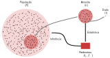
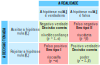
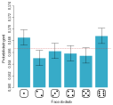
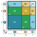
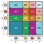
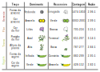

# Testes de Significância

<br>
```{r infestat, echo = FALSE, fig.align = 'center', out.width="600px", fig.cap="A inferência estatística é o ato de generalizar de uma amostra para uma população, a partir de dados obtidos desta, com um calculado nível de certeza."} 

```
<br>

## Significância estatística

Em qualquer experimento ou observação que envolva obter uma amostra de uma população, sempre há a possibilidade de que um efeito observado tenha ocorrido devido apenas ao erro de amostragem. 

Em um teste estatístico de hipótese, um resultado tem significância estatística quando é muito improvável que tenha ocorrido dada a hipótese nula.

O termo significância não implica importância, e o termo significância estatística não é o mesmo que significância para pesquisa, teórica ou prática. 

Mas se a probabilidade de um efeito observado for menor que (ou igual a) o nível de significância assumido para o estudo, um investigador pode concluir que o efeito reflete os parâmetros de toda a população, rejeitando assim a hipótese nula.

Mais precisamente:

- o nível de significância de um estudo ($\alpha$) é a probabilidade de o estudo rejeitar a hipótese nula, dado que a hipótese nula foi assumida como verdadeira; e

- o valor-p de um resultado ($p$) é a probabilidade de obter um resultado pelo menos tão extremo, dado que a hipótese nula é verdadeira. 

Assim, quando $p\le\alpha$, o resultado é então estatisticamente significativo pelos padrões do estudo.

O nível de significância de um estudo é escolhido antes da coleta de dados e é normalmente definido como 5% (mas podendo ser muito mais baixo dependendo da área de estudo ou tipo de pesquisa, ver a seguir)

Sempre que houver incerteza, existe a possibilidade de cometer um erro. 

Uma vez que testes estatíticos tratam de escolher entre duas proposições concorrentes, chamadas de **Hipótese nula** ($H_0$) e **Hipótese alternativa** ($H_1$), a possibilidade de erro estatístico é parte integrante dos testes de hipóteses. 

Se o resultado do teste corresponder à realidade, então uma decisão correta foi tomada. No entanto, se o resultado do teste não corresponder à realidade, então ocorreu um erro. 

Existem duas situações em que a decisão tomada a partir de um teste estatístico está errada:

**Erro tipo I** — É a probabilidade a probabilidade de rejeitar a hipótese nula (H0) dada que ela seja verdadeira. Esse erro é denotado por \alpha, e é conhecido também como nível de significância ou risco alfa.
O nível de significância de um teste definido como 0,05 (5%) implica que é aceitável ter uma probabilidade de 5% de rejeitar incorretamente a hipótese nula verdadeira. 

**Erro tipo II** — É a probabilidade de aceitar a hipótese nula ($H_0$) dada que ela é falsa. Esse erro é denotado por \beta, e é também conhecido como risco beta.

Fazendo analogia à um tribunal, onde todos são inocentes ($H_0$) até que se prove ao contrário ($H_1$):

- um erro do tipo I corresponde à condenação de um réu inocente; e

- um erro do tipo II corresponde à absolvição de um criminoso.

Esses dois tipos de erro são compensados entre si: para qualquer conjunto de amostra, o esforço para reduzir um tipo de erro geralmente resulta no aumento do outro tipo de erro.

<br>
```{r errostipos, echo = FALSE, fig.align = 'center', out.width="600px", fig.cap="Relações entre verdade/falsidade da hipótese nula e resultados de um teste statístico."} 

```

<br>

:::reference
Sokal & Rohlf 2011. ISBN: 978-0716786047
 
Dancey et al. 2012. ISBN: 978-1849203364
 
Herzog et al. 2019. doi: [10.1007/978-3-030-03499-3](https://doi.org/10.1007/978-3-030-03499-3)
:::

<br>


## Testes de ajuste do chi-quadrado

O teste do qui-quadrado de Pearson ($χ^2$; [Pearson 1900](https://doi.org/10.1080/14786440009463897)) é um teste estatístico aplicado a conjuntos de dados categóricos para avaliar a probabilidade de que qualquer diferença observada entre os conjuntos tenha surgido por acaso.

Ele testa uma hipótese nula declarando que a distribuição de freqüência de certos eventos observados em uma amostra é consistente com uma distribuição teórica específica. 

Os eventos considerados devem ser mutuamente exclusivos e ter probabilidade total igual a 1.

<br>

### Um exemplo simples

Um exemplo simples é a hipótese de que um dado comum de seis lados é "justo" (ou seja, todos os seis resultados são igualmente prováveis de ocorrer).

<br>
```{r dados, echo = FALSE, fig.align = 'center', out.width="200px", fig.cap="Em um dado perfeito (sem viés), a chance de cada lado cair com a face para cima é igual a $1/6$."} 

```
<br>

#### Os dados de Weldon

<br>
```{r weldon, echo = FALSE, fig.align = 'right', out.width = "300px", fig.cap="[W. F. Raphael Weldon](https://en.wikipedia.org/wiki/Raphael_Weldon) (1860-1906), biólogo evolucionista inglês."} 
knitr::include_graphics('https://upload.wikimedia.org/wikipedia/commons/c/c7/Weldon_Walter_F_R.jpg')
```
<br>

Raphael Weldon foi um dos fundadores da biometria, e editor e co-fundador do periódico Biometrika (juntamente com Francis Galton e Karl Pearson).

Em 1894, Weldon lançou um conjunto de 12 dados 26.306 vezes, e registrou o número de 5s ou 6s (que considerou um sucesso). 

Ele coletou os dados em parte, "para julgar se as diferenças entre uma série de frequências de grupo e uma lei teórica, considerada como um todo, eram ou não mais do que poderiam ser atribuídas às flutuações fortuitas da amostragem aleatória". 

Weldon observou que 5s ou 6s ocorreram com mais frequência do que o esperado*.

Os dados de dados de Weldon foram usados por Karl Pearson em seu artigo pioneiro sobre a estatística qui-quadrado, e ele hipotetizou que o desvio se devia à  construção dos dados da época (a face com 6 e 5 pontos seria mais leve do que as faces opostas, que tem apenas 1e 2 pontos).

<br>

#### Os dados de Labby

<br>
```{r labbym, echo = FALSE, fig.align = 'right', out.width = "300px", fig.cap="Zacariah Labby e [máquina de rolar dados](https://ehttps://www.youtube.com/watch?v=95EErdouO2w)."} 
knitr::include_graphics("figs/Zacariah_Labby.png")
```
<br>

Em [2009](https://doi.org/10.1007/s00144-009-0036-8), Zacariah Labby da Universidade de Chicago, repetiu o experimento de Weldon.

Como parte de um projeto para um curso de História da Estatística, ele construiu uma máquina para lançar dados e contar automaticamente os pontos em cada dado. 

O processo de geração de imagem contínua demorou cerca de 20 segundos por rolagem.


Cada dia havia ∼150 imagens para processar manualmente. Nesse ritmo, o experimento de Weldon foi repetido em pouco mais de seis dias inteiros.

Os dados resultantes permitiram que Labby repetisse as investigações originais de Weldon e Pearson, bem como se aprofundasse na análise.

Labby não observou o mesmo fenômeno que Weldon observou (frequência mais alta de 5s e 6s).

A automação permitiu que Labby coletasse mais dados do que Weldon em 1894, em vez de registrar “sucessos” e “falhas”, Labby registrou o número individual de pontos em cada dado.

<br>
```{r labbyg, echo = FALSE, fig.align = 'center', out.width = "400px", fig.cap="Probabilidade de observar cada face de um dado em 12 ralagens, em um total de 26.306 rolagens ([Labby 2009](https://doi.org/10.1007/s00144-009-0036-8))."} 

```
<br>

### Teste do qui-quadrado de Pearson

O valor da estatística $\chi^2$ é:

\begin{equation} 
\chi^2=\displaystyle\sum_{i-1}^{n}\frac{(O_i-E_i)^2}{E_i} 
  (\#eq:quiquadrado)
\end{equation} 

Onde, $n$ é o número total de observações, $O_i$ é o número de observações do tipo $i$, e $E_i$ é a contagem esperada (teórica) do tipo $i$. 

A estatística do qui-quadrado pode então ser usada para calcular um valor-p comparando o valor da estatística a uma distribuição qui-quadrada. 

<br>

### Graus de liberdade

A distribuição qui-quadrada tem apenas um parâmetro denominado **grau de liberdade** ($gl$), que influencia o formato, o centro e a extensão da distribuição.

Grau de liberdade faz referência ao número de maneiras independentes pelas quais um sistema dinâmico pode se mover, sem violar qualquer restrição imposta a ele. 

Em outras palavras, o número de graus de liberdade pode ser definido como o número mínimo de coordenadas independentes que podem especificar a posição do sistema completamente.

Matematicamente, grau de liberdade é o número de dimensões do domínio de um vetor aleatório, ou essencialmente o número de componentes "livres“, isto é, quantos componentes precisam ser conhecidos antes que o vetor seja totalmente determinado.

<br>
```{r gl, echo = FALSE, fig.align = 'center', out.width = "400px", fig.cap="Os graus de liberdade ($gl$) de um corpo rígido são definidos como o número de movimentos independentes que ele possui."} 

```
<br>

Cada grau de liberdade apresenta um função densidade de probabilidade, onde os valores de $\chi^2$ (eixo x) apresentam diferentes frequências (eixo y).

<br>
```{r glgraph, echo = FALSE, warning = FALSE, fig.align = 'center', out.width = "600px", fig.cap="Função densidade de probabilidade de cinco distribuições de qui-quadrado com diferentes graus de liberdade."} 
library("ggplot2")
library("latex2exp")
ggplot(data.frame(x = c(0, 15)), aes(x = x)) + 
  stat_function(fun = dchisq, args = list(df = 1), color = "firebrick2", lwd = 1) +
  stat_function(fun = dchisq, args = list(df = 2), color = "chocolate", lwd = 1) +
  stat_function(fun = dchisq, args = list(df = 3), color = "royalblue3", lwd = 1) +
  stat_function(fun = dchisq, args = list(df = 5), color = "green4", lwd = 1) +
  stat_function(fun = dchisq, args = list(df = 9), color = "deepskyblue3", lwd = 1) +
  labs(x = "Qui-quadrado", y = "Densidade de probabilidade") + 
  annotate(geom='text', x=1, y=0.9, parse = TRUE, color="firebrick2", label=TeX("$gl=1$")) +
  annotate(geom='text', x=1.5, y=0.35, parse = TRUE, color="chocolate", label=TeX("$gl=2$")) +
  annotate(geom='text', x=2.7, y=0.25, parse = TRUE, color="royalblue3", label=TeX("$gl=3$")) +
  annotate(geom='text', x=4.8, y=0.18, parse = TRUE, color="green4", label=TeX("$gl=5$")) +
  annotate(geom='text', x=7.5, y=0.15, parse = TRUE, color="deepskyblue3", label=TeX("$gl=10$"))
  
```
<br>

A partir da função densidade de probabilidade, é possível calcular a probabilidade p de um evento cujo valor de $\chi^2$  é conhecido.

<br>
```{r glprob, echo = FALSE, warning = FALSE, fig.align = 'center', out.width = "600px", fig.cap="Função densidade de probabilidade de cinco distribuições de qui-quadrado com diferentes graus de liberdade."} 
library("ggplot2")
library("latex2exp")
ggplot(data.frame(x = c(0, 15)), aes(x = x)) + 
  stat_function(fun = dchisq, geom = "area", args = list(df = 5), fill = "lightgreen", xlim = c(7, 15)) +
  stat_function(fun = dchisq, geom = "line", args = list(df = 5), colour = "green4", lwd = 1) +
  labs(x = "Qui-quadrado", y = "Densidade de probabilidade") + 
  annotate(geom='text', x=9, y=.015, parse = TRUE, color="black", label=TeX("$p = Pr \\left [ X \\geq \\chi^2 \\right ]$"))

```
<br>

No teste de ajuste do qui-quadrado o número de graus de liberdade é igual ao número classes de observações ($k$) menos 1 menos o número parâmetros independentes estimados para o modelo ($p$).

\begin{equation} 
gl=k-1-p
  (\#eq:gl)
\end{equation} 

<br>
```{r, echo = FALSE}
library(kableExtra)
chi_table <- read.csv("tables/chi_square.csv", sep=",", check.names = FALSE)
knitr::kable(chi_table, align = "cccccccccc", booktabs = TRUE, caption = "Tabela de distribuição de qui-quadrado", "html")
```
<br>

## Testando a significância do Princípio de Hardy-Weinberg

O teste de ajuste do qui-quadrado pode ser utilizado para saber se uma população segue o Princípio de Hardy-Weinberg, _i.e._, para saber se esta está em equilíbrio.

Para tal, utilizamos a estatística $\chi^2$ para estimar a significância do desvio entre:

- o número observado de indivíduos de um determinado genótipo (obtidos a partir dos dados); e 

- o número esperado de indivíduos daquele genótipo de acordo com o o Princípio de Hardy-Weinberg (estimado a partir do modelo).

E o número de graus de liberdade dependerá do número de genótipos e alelos presentes no modelo do estudo.

De forma que, para um dado locus gênicos,$k$ é o número de genótipos, e $p$ é o número de alelos, diminuído em um.

<br>

#### Graus de liberdade com dois alelos

Considerando um lócus gênico com dois alelos $A$ e $B$, cujas frequências $p+q=1$.

<br>
```{r gl2alelos, echo = FALSE, fig.align = 'center', out.width = "400px", fig.cap="Quadrado de Punnett para 2 alelos"} 
knitr::include_graphics("figs/punnett_2alelles.svg")
```
<br>

Temos:

**Classes de observações** -- Os três genótipos possíveis: $AA$, $Aa$ e $aa$.

$$k=3$$

<br>

**Parâmetros independentes** -- A frequência alélica independente $F(A)=p$, pois $F(a)=q=1-p$.

$$p=1$$

<br>

**Graus de liberdade** -- Considerando que $gl=3-1-1$.

$$gl=1$$

<br>

#### Graus de liberdade com três alelos

Considerando um lócus gênico com três alelos $A$, $B$ e $C$, cujas frequências $p+q+r=1$.

<br>
```{r gl3alelos, echo = FALSE, fig.align = 'center', out.width = "400px", fig.cap="Quadrado de Punnett para 3 alelos"} 

```
<br>

Temos:

**Classes de observações** -- Os seis genótipos possíveis: $AA$, $BB$, $CC$, $AB$, $AC$ e $BC$

$$k=6$$

<br>

**Parâmetros independentes** -- As frequências alélicas independentes $F(A)=p$ e $F(B)=q$, pois $F(C)=r=1-p-q$.

$$p=2$$

<br>

**Graus de liberdade** -- Considerando que $gl=6-1-2$.

$$gl=3$$


<br>

#### Graus de liberdade com quatro alelos

Considerando um lócus gênico com três alelos $A$, $B$, $C$ e $D$ cujas frequências $p+q+r+s=1$.

<br>
```{r gl4alelos, echo = FALSE, fig.align = 'center', out.width = "400px", fig.cap="Quadrado de Punnett para 4 alelos"} 

```
<br>

Temos:

**Classes de observações** -- Os dez genótipos possíveis: $AA$, $BB$, $CC$, $DD$, $AB$, $AC$, $AD$, $BC$, $BD$ e $CD$.

$$k=10$$

<br>

**Parâmetros independentes** -- As frequências alélicas independentes $F(A)=p$, $F(B)=q$ e $F(C)=r$, pois $F(D)=s=1-p-q-r$.

$$p=3$$

<br>

**Graus de liberdade** -- Considerando que $gl=6-1-3$.

$$gl=6$$
<br>

#### Graus de liberdade com $i$ alelos

Considerando um lócus gênico com $i$ alelos $A1$, $A2$, ..., $Ai$, cujas frequências $p_1+p_2+...+p_i=1$.

Temos:

**Classes de observações** -- Os genótipos possíveis dada a combinação par-a-par em um lócus diplóide.

$$k=\binom{i}{2} = \frac{n!}{k!\left ( n-k \right )!}$$

<br>


**Parâmetros independentes** -- O número de alelos $i$ menos um. 

$$p=i-1$$

<br>

**Graus de liberdade** -- Considerando que $gl=\binom{i}{2}-1-(i-1)$.

\begin{equation} 
gl = (\text{# genótipos}) - (\text{# alelos})
\end{equation} 

<br>

## Tabela de contingência (RxC)

Uma tabela de contingência (também conhecida como tabulação cruzada) é um tipo de tabela em formato de matriz que exibe a distribuição de frequência das variáveis (Pearson 1904).

Elas fornecem uma imagem básica da inter-relação entre duas variáveis e podem ajudar a encontrar interações entre elas. 

<br>
```{r tabelarc, echo = FALSE, fig.align = 'center', out.width = "300px", fig.cap="Tabela de contingência (2x2)"} 

```
<br>


### Razão de chances

A medida mais simples de associação para uma tabela de contingência 2 × 2 é a razão de chances ($OR$, _odds ratio_). 

Dados dois eventos, $A$ e $B$, a razão de chances é definida como a razão das chances de $A$ na presença de $B$ e as chances de $A$ na ausência de $B$, ou equivalentemente (devido à simetria), a razão das chances de $B$ na presença de $A$ e as chances de $B$ na ausência de $A$. 

Dois eventos são independentes se $OR=1$; se $OR>1$, os eventos estão associados positivamente; e se $OR<1$, os eventos estão associados negativamente.

A razão de chances tem uma expressão simples em termos de probabilidades; dada a distribuição de probabilidade conjunta:

\begin{equation} 
OR = \frac{p_00\cdot p_11}{p_01\cdot p_10}
  (\#eq:or)
\end{equation} 

### Frequências haplotípicas observadas

As relações entre as frequências haplotípicas e as frequências alélicas podem ser ilustradas por uma tabela de contingência entre pares de alelos de dois loci gênicos:


<br>
```{r freqhapobs, echo = FALSE, fig.align = 'center', out.width = "350px", fig.cap="Relação entre frequências haplotípicas e alélicas"} 

```
<br>

### Frequências haplotípicas esperadas

A expectativa, de acordo com o princípio de Hardy-Weinberg, é que os alelos nos dois loci gênicos se combinem aleatoriamente, e assim, as frequências dos haplótipos seriam igual ao produto das frequências alélicas individuais.

<br>
```{r freqhapesp, echo = FALSE, fig.align = 'center', out.width = "350px", fig.cap="Relação entre frequências haplotípicas e alélicas"} 

```
<br>


### Testado a significância de tabelas de contingência

Assim é possível estimar a significância da associação entre pares de alelos, expressa em uma tabela de contingência, por meio da estatística χ2.

Esse teste é uma maneira de determinar a significância do desequilíbrio de ligação entre um par de alelos ligados.

Assim, temos:

**Valores observados** -- As frequências dos haplótipos $p_A$, $p_a$, $p_b$ e $p_b$. 
**Valores esperados** -- As frequências das associações $p_A p_B$, $p_A p_b$, $p_a p_B$ e $p_a p_b$. 

**Classes de observações** -- Os quatro haplótipos possíveis: $AB$, $Ab$, $aB$ e $aa$.

$$k=4$$

<br>

**Parâmetros independentes** -- As duas frequências alélicas independentes $F(A)=p_A$ e $F(B)=p_B$, pois $F(a)=p_a=1-p_A$ e $F(b)=p_b=1-p_B$.


$$p=2$$

<br>

**Graus de liberdade** -- Considerando que $gl=4-1-2$.

$$gl=1$$

<br>


### Alternativa: Teste exato de Fisher

O teste exato de Fisher é válido para todos os tamanhos de amostra, e se torna exato no limite à medida que o tamanho da amostra cresce até o infinito, como acontece com muitos testes estatísticos.

Fisher ([1922](https://doi.org/10.2307/2340521)) mostrou que condicionalmente nas margens da tabela de contingência (ver Figura \@ref(fig:tabelarc)), $a$ é distribuído de forma hipergeométrica com $a+c$ retiradas de uma população, sendo destes $a+b$ sucessos e $c+d$ fracassos.

Assim, a probabilidade de obter tal conjunto de valores é dada por:

\begin{equation}
   p = \frac{\binom{a+b}{a}\binom{c+d}{c}}{\binom{n}{a+c}}=\frac{\binom{a+b}{b}\binom{c+d}{d}}{\binom{n}{b+d}}=\frac{ \left( a+b \right)! \left( c+d \right)! \left( a+c  \right)! \left( b+d  \right)! }{a! \ b! \  c! \ d! \ n!}
  (\#eq:testefisher)
\end{equation}

De forma que, se os totais marginais (ou seja, $a + b$, $c + d$, $a + c$ e $b + d$ são conhecidos, resta apenas um único grau de liberdade ($gl$): o valor e.g. de um {\displaystyle a} a é suficiente para deduzir os outros valores. 

Agora, $p = p ( a )$ é a probabilidade de que $a$ elementos sejam positivos em uma seleção aleatória (sem substituição) de $a + c$ de um conjunto maior contendo $n$ elementos no total, dos quais $a + b$, que é precisamente a definição da distribuição hipergeométrica.

Apesar do teste de Fisher fornecer valores de $p$ exatos, alguns autores argumentam que este é conservador, ou seja, que sua taxa de rejeição real está abaixo do nível de significância nominal.

<br>

## Exercícios

<br>

### Exercício 1 -- Ervilhas de Mendel

Considere as frequências fenotípicas dos traços das ervilhas ervilhas (_Pisum_ spp.) estudadas por Mendel mostradas na Figura \@ref(fig:peatrait).

<br>
```{r peatrait, echo = FALSE, fig.align = 'center', out.width = "600px", fig.cap="Os sete traços fenotípicos das ervilhas (_Pisum_ spp.) cujos padrões de herança foram estudados por Mendel ([1865](http://www.mendelweb.org/Mendel.html))."} 

```
<br>

- Os traços fenotípicos das ervilhas de Mendel seguem as esperadas frequências mendelianas ($3:1$)?

<br>

### Exercício 2 -- Traça de tigre escarlate

<br>
```{r callimorpha, echo = FALSE, fig.align = 'center', out.width = "800px", fig.cap="Polimorfismo de cor na asa da traça de tigre escarlate (_Callimorpha dominula_)."} 
knitr::include_graphics('https://slideplayer.com/slide/13126368/79/images/7/Figure+26.2+Early+evolutionary+geneticists+were+forced+to+rely+on+the+phenotypic+traits+that+had+a+simple+genetic+basis..jpg')
```
<br>

Considere os dados abaixo:

<br>
```{r tableA09, echo = FALSE}
A09BB <- c(1469)
A09Bb <- c(138)
A09bb <- c(5)
A09N <- c(1612)
data0901 <- data.frame(A09BB, A09Bb, A09bb, A09N)
rownames(data0901) <- c("**Indivíduos**")
knitr::kable(data0901, align = "cccc", booktabs = TRUE, col.names = c("BB", "Bb", "bb", "N"), caption = "Frequências genotípicas observadas em uma população de traça de tigre escarlate (_Callimorpha dominula_) para o polimorfismos de cor das asas.", "html")
```
<br>

- Essa população segue o princípio de Hardy-Weinberg?

<br>

### Exercício 3 -- Urso de Kermode

<br>
```{r kermode, echo = FALSE, fig.align = 'center', out.width = "600px", fig.cap="Um filhote de urso de Kermode se aconchegando com seu irmão (Colúmbia Britânica)."} 
knitr::include_graphics('https://img.peapix.com/eeb011ee41bc4e618088779e9a966227.jpg?attachment&modal')
```
<br>


Nas ilhas costeiras da Colúmbia Britânica, muitos membros da subespécie urso de preto, urso de Kermode (_Ursus americanus kermodei_), são brancos (tradicionalmente chamados de ursos espirituais). 

Esses ursos não são híbridos com ursos polares, nem são albinos, eles são homozigotos para uma mudança recessiva no gene $MC1R$, com indivíduos homozigotos mutantes ($GG$) sendo brancos e indivíduos portando o alelo selvagem ($AA$ e $AG$) sendo negros. Considere as frequências genotípicas observadas abaixo:

<br>
```{r tableB09, echo = FALSE}
B09AA <- c(83)
B09AG <- c(28)
B09GG <- c(21)
B09N <- c(132)
data0902 <- data.frame(B09AA, B09AG, B09GG, B09N)
rownames(data0902) <- c("**Indivíduos**")
knitr::kable(data0902, align = "cccc", booktabs = TRUE, col.names = c("AA", "AG", "GG", "N"), caption = "Frequências dos genótipos para o polimorfismo MC1R em populações das ilhas da Colúmbia Britânica do urso de Kermode (_Ursus americanus kermodei_).")
```
<br>

- Este polimorfismo segue o princípio de Hardy-Weinberg?

<br>

### Exercício 4 -- Equilíbrio de LIgação

O estudo de uma variação em um sítio de restrição $EcoRI$ na região do gene álcool desidrogenase ($Adh$) em moscas-da-fruta capturadas em um mercado na Holanda ([Cross & Birley 1986](https://doi.org/10.1007/BF00499097)) revelou os seguintes dados:

<br>
```{r tableC09, echo = FALSE}
C09Ecoplus <- c(22, 4)
C09Ecominus <- c(3, 5)
data0903 <- data.frame(C09Ecoplus, C09Ecominus)
rownames(data0903) <- c("$Adh^F$", "$Adh^S$")
knitr::kable(data0903, "html", align = "cc", col.names = c("$EcoRI^+$", "$EcoRI^-$"), booktabs = TRUE, escape = FALSE, caption = "Frequências dos haplótipos entre o gene álcool desidrogenase ($Adh$) e um sítio de restrição ($EcoRI$) 3.5 kb à jusante do mesmo.")
```
<br>

- As regiões gênicas $EcoRI$ e $Adh$ estão em equilíbrio de ligação?


