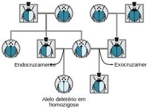
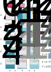
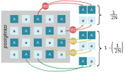
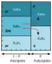
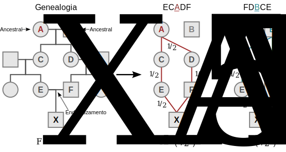
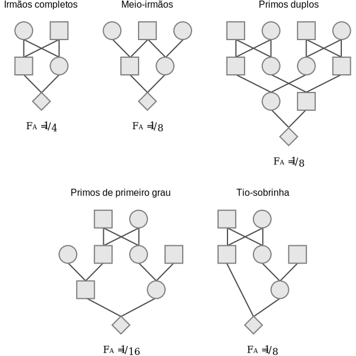
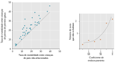

# Endogamia

<br>

```{r habsburg, echo = FALSE, fig.align = 'center', out.width="600px", fig.cap="O casamento entre nobres foi usado como um método de formar alianças políticas entre as elites. Com o tempo, devido ao número relativamente limitado de consortes em potencial, o pool gênico de muitas famílias governantes tornou-se progressivamente menor, até que todos as realezas européias estivessem relacionadas."}
knitr::include_graphics('https://www.thesun.co.uk/wp-content/uploads/2019/12/DD-COMPOSITE-HABSBURG-JAW-V2.jpg')
```

<br>

:::reference

Ceballos & Álvarez 2013. doi: [10.1038/hdy.2013.25](https://doi.org/10.1038/hdy.2013.25)

Vilas et al. 2019. doi: [10.1080/03014460.2019.1687752](https://doi.org/10.1080/03014460.2019.1687752)

:::

<br>

## Endocruzamentos $\times$ exocruzamentos

Endogamia é a produção de descendentes do cruzamento de indivíduos ou organismos relacionados geneticamente (endocruzamentos), o que leva a um aumento da frequência de genótipos homozigotos em relação a frequência esperada em cruzamentos aleatórios.

A homozigose de alelos raros (a maioria recessivos) pode levar ao aparecimento de traços deletérios (_viz._, depressão endogâmica).

<br>

```{r inbreedinggenealogy, echo = FALSE, fig.align = 'center', out.width="600px", fig.cap="Endocruzamentos aumentam as chances de encontro de alelos raros deléterios."}

```

<br>

## Causas de endogamia

<br>

### Endogamia intencional

<br>

#### Estoques de laboratório

O endocruzamento sucessivo de animais tem sido usado para estabelecer linhagens genéticas "puras" para a pesquisa científica. Os experimentos conduzidos nesses assuntos são valiosos porque a variação genética não pode distorcer os resultados.

<br>

:::reference

Rader 2004. ISBN: [9780691016368](https://www.goodreads.com/book/show/434281.Making_Mice)

Taft et al. 2006. doi: [10.1016/j.tig.2006.09.010](https://doii.org/10.1016/j.tig.2006.09.010)

:::

<br>

#### Estoques para melhoramento animal e vegetal

Em animais domésticos, o endocruzamento geralmente resulta em uma troca em que uma característica desejável é ampliada às custas de outra.

Por exemplo, a endogamia de gado leiteiro holandês (_Holstein-Frísia_) levou ao aumento da produção de leite, mas as vacas são mais difíceis de criar.

<br>

:::reference

Zenger et al. 2007. doi: 10.1111/j.1365-2052.2006.01543.x [link](https://doii.org/10.1111/j.1365-2052.2006.01543.x ) 

Utsunomiya et al. 2013. doi: 10.1371/journal.pone.0064280 [link](https://doii.org/10.1371/journal.pone.0064280)

Mrode et al. 2019. doi: 10.1371/journal.pone.0064280 [link](https://doii.org/10.1371/journal.pone.0064280)

:::

<br>

### Endogamia acidental

A endogamia também vai surgir acidentalmente na natureza, sobretudo quando os cruzamentos se desviarem do acasalamento aleatório, como por conta de:

- Populações pequenas

- Acasalamento preferencial

- Autofertilização

<br>

## Freqüências genotípicas sob endogamia

Considere as sucessivas gerações de autofertilização em uma linhagem híbrida, cujas frequências alélicas iniciais $p$ e $q$ sejam idênticas.

As frequências genotípicas não estarão em equilíbrio de Hardy-Weinberg pois ao longo de algumas gerações irá existir uma deficiência de heterozigotos e um excesso de homozigotos. 

Após $n$ gerações de autofertilização, teremos:

- A frequência dos heterozigotos será 

$$\frac {1}{2^n}$$

<br>

- A frequência dos homozigotos será $\frac {1}{2^n}$; e

$$\frac {1- \frac {1}{2^n}}{2}$$
<br>

```{r inbreedingfertilization, echo = FALSE, fig.align = 'center', out.width="400px", fig.cap="Endocruzamentos aumentam as chances de encontro de alelos raros deléterios."}

```

<br>


## Coeficiente de endogamia

A quantidade de endogamia em uma população pode ser medida pela redução na heterozigosidade.

O **Coeficiente de Endogamia** ($F$) compara a proporção real de genótipos heterozigotos ($H_{Obs}$) com proporção genótipos heterozigotos esperada caso a população cruze aleatoriamente ($H_{Esp}$), de forma que:

<br>

\begin{equation} 
  F=\frac{H_{Esp} - H_{Obs}}{H_{Esp}}
  (\#eq:endogamia)
\end{equation} 

<br>

que é o mesmo que:

<br>

$$F=1 -  \frac{H_{Obs}}{H_{Esp}}$$


<br>

O coeficiente de endogamia ($F$) pode ser interpretado como a probabilidade de que dois alelos em um determinado locus sejam aleatoriamente idênticos por descendência (IBD).

**Não há endogamia ...**

... quando a população se reproduz ao acaso, pois $H_{Obs}=H_{Esp}$, e assim:

$$F=0$$

<br>

**Há endogamia completa ...**

... quando não há heterozigotos na população, pois $H_{Obs}=0$, e assim: 

$$F=1$$

<br>

**Há endogamia parcial ...**

... quando há heterozigotos na população, mas menos do que o esperado ao acaso, pois $H_{Obs}\ne0$ e $H_{Obs}<H_{Esp}$, e assim: 

$$0<F<1$$

<br>

**Também não há endogamia ...**

... quando há excesso de heterozigotos na população, pois .

<br>


## Freqüências genotípicas sob endogamia

Assumindo que, para um locus dialélico, que $H_{Esp} = 2pq$, podemos então definir a frequência real do genótipo heterozigoto em uma população endogâmica nos termos do coeficiente de endogamia, de forma que:

$$F = \frac {H_{Esp} - H_{Obs}}{H_{Esp}} = \frac {2pq - H}{2pq}$$
Assim, temos que:

$$f(Aa) = H = 2pq - 2pqF$$

<br>

```{r inbreedinggraph, echo = FALSE, warning = FALSE, fig.align = 'center', out.width = "600px", fig.cap="Frequência real do genótipo heterozigoto em uma população endogâmica."} 
library("ggplot2")
library("latex2exp")
ggplot(data.frame(x = c(0, 1)), aes(x = x)) + 
  stat_function(fun = function(x) x*(1-x)*(1-0), color = "firebrick2", lwd = 1) +
  stat_function(fun = function(x) x*(1-x)*(1-0.2), color = "chocolate", lwd = 1) +
  stat_function(fun = function(x) x*(1-x)*(1-0.4), color = "green4", lwd = 1) +
  stat_function(fun = function(x) x*(1-x)*(1-0.6), color = "deepskyblue3", lwd = 1) +
  stat_function(fun = function(x) x*(1-x)*(1-0.8), color = "royalblue3", lwd = 1) +
  labs(x = "Frequência do alelo p", y = "Frequência do genótipo heterozigoto") + 
  annotate(geom='text', x=0.5, y=0.24, parse = TRUE, color="firebrick2", label=TeX("$F=0$")) +
  annotate(geom='text', x=0.5, y=0.185, parse = TRUE, color="chocolate", label=TeX("$F=0.2$")) +
  annotate(geom='text', x=0.5, y=0.14, parse = TRUE, color="green4", label=TeX("$F=0.4$")) +
  annotate(geom='text', x=0.5, y=0.09, parse = TRUE, color="deepskyblue3", label=TeX("$F=0.6$")) +
  annotate(geom='text', x=0.5, y=0.04, parse = TRUE, color="royalblue3", label=TeX("$F=0.8$"))
```

<br>

Perceba que a frequência do genótipo heterozigoto sob endogamia é descrescida em uma parcela $2pqF$ da expectativa $2pq$ de cruzamento aleatório, parcela essa que, como visto anteriormente, será acrescida nos procionalmente aos genótipos homozigotos.

Isso pode ser demonstrado assumindo a frequência real de heterozigotos em uma população endogâmica a partir do cálculo das frequências alélicas.

Assim, teremos para o alelo $A$:

<br>

$$ f(A) = p = D + \frac{1}{2}H = p^2 + \frac{1}{2}(2pq - 2pqF)$$

<br>

A fórmula acima pode ser reescrita, assumindo que $pq=p(1-p)=p-p^2$, de forma que:

<br>

$$f(AA) = p^2 = p - pq + pqF = p^2 +pqF$$

E para o alelo $a$:

<br>

$$ f(a) = q = R + \frac{1}{2}H = q^2 + \frac{1}{2}(2pq - 2pqF)$$

<br>

E assumindo que $pq=q(1-q)=q-q^2$, de forma que:

e

<br> 

$$f(aa) = q^2 = q - pq + pqF = q^2 +pqF$$


## Autozigotos e alozigotos

Na fecundação, podemos categorizar os zigotos em **autozigotos** ou **alozigotos** a depender da origem dos alelos em um locus gênico.

<br>

:::quote

**Autozigotos** — formado por dois alelos que se originam de um ancestral comum por meio de acasalamento não-aleatório, i.e., **idênticos por descendência** (IBD).

**Alozigotos** — formado por dois alelos que provêm de diferentes fontes (até onde a descendência pode ser estabelecida), ou **idênticos por estado** (IBS).

:::

<br>

A chance de formação de autozigotos em uma geração depende da chance de encontros de gametas no _pool_ gênico, que intrinsecamente depende do tamanho da amostra, de forma que:

\begin{equation}
  P(Autozigotos)=\frac{1}{2N_e}
  (\#eq:autozigotos)
\end{equation}

Todos os demais cruzamentos resultam em alozigotos, sejam eles heterozigotos ou homozigotos idênticos por estado, de forma que:

\begin{equation} 
   P(Alozigotos)= 1-\left(\frac{1}{2N_e}\right)
   (\#eq:alozigotos)
\end{equation} 

<br>

```{r autozigotos, echo = FALSE, fig.align = 'center', out.width="600px", fig.cap="Formação de homozigotos autozigotos e alozigotos no _pool_ gênico. Somente alelos idênticos por descendência (IBD, vermelho) formam autozigotos, uma vez que alelos idênticos por estado (IBS, amarelo) formam alozigotos, assim como os heterozigotos (verde)."}

```

<br>


<br>

```{r punnetinbreeding, echo = FALSE, fig.align = 'center', out.width="400px", fig.cap="Frequências genotípicas a partir das chances de formação de alozigotos e autozigotos dado o coeficiente de endogamia $F$ da população."}

```

<br>


## Endogamia em genealogias

O coeficiente de endogamia também pode ser utilizado para expressar a probabilidade de encontro de alelos idênticos por descendência (IBD) em uma prole de endocruzamento em genealogias.

Assim, o coeficiente de endogamia de um indivíduo $X$ da genealogia é dado pelo grau de parentesco entre seus parentais até o(s) ancestral(is) em comum, de forma que:

- Se o(s) ancestral(is) em comum não é(são) endogâmico(s):

<br>

$$F_X = \sum \left( \frac{1}{2} \right)^n$$

<br>

Onde 
$n$ é o grau de separação entre os parentais até o ancestral em comum (ver Figuras \@ref(fig:Fpedigree) e \@ref(fig:Fpedigreeexamples)).

- Se o(s) ancestral(is) em comum é(são) endogâmico(s):

<br>

$$F_X = \sum \left( \frac{1}{2} \right)^n \cdot \ \left( 1 + F_A \right)$$
<br>

Onde 
$F_A$ é o coeficiente de endogamia do ancentral comum.

<br>

```{r Fpedigree, echo = FALSE, fig.align = 'center', out.width="800px", fig.cap="O coeficiente de endogamia ($F$) de um indivíduo é determinado pela chance de identidade por descendência (IBD) de genes herdados de um ou mais ancestrais comuns na sua genealogia."}

```

<br>

```{r Fpedigreeexamples, echo = FALSE, fig.align = 'center', out.width="600px", fig.cap="Diferentes coeficientes de endogamia ($F$) em função das relaçoes de parentesco entre indivíduos em uma genealogia."}

```

<br>

## Endogamia ao longo das gerações

Como visto anteriormente, a chance de formação de autozigotos em uma geração depende do tamanho efetivo da população ($N_e$).

Seja $\Delta F$ a variação no coeficiente de endogamia de uma geração para a outra, temos que:

$$\Delta F = \frac{1}{2N_e}$$
Assim, o coeficiente de endogamia na geração atual $t$ seria dado pela endogamia produzida na formação de autozigotos nessa e pela endogamia que já existia na geração anterior $t-1$ herdada pelos alozigotos, de forma que:

<br>

$$F_t = \frac{1}{2N_e} + \left( 1- \frac{1}{2N_e} \right)F_{t-1}$$

<br>

ou

<br>

$$F_t = \Delta F + \left( 1- \Delta F \right)F_{t-1}$$

<br>


Assim, o coeficiente de endogamia na geração seguinte $t+1$, pode ser expresso como:

<br>

$$F_{t+1} = \Delta F + \left( 1- \Delta F \right)F_{t}$$
<br>

As equações acima, aplicadas de forma recorrente, podem ser usadas para estimar o coeficiente de endogamia produzido em função do número de gerações $t$ decorridas, de forma que:

$$F_t = 1 - \left( 1- \frac{1}{2N_e} \right)^t$$

<br>

Desta forma, dado tempo suficiente, _i. e._, $t \rightarrow \infty$), todas as populações finitas, irão eventualmente se tornar completamente endogâmicas. 

<br>

```{r inbreedinggeneration, echo = FALSE, warning = FALSE, fig.align = 'center', out.width = "600px", fig.cap="O coeficiente de endogamia ao longo das gerações em populações com diferentes tamanhos populacionaisFrequência real do genótipo heterozigoto em uma população endogâmica."} 
library("ggplot2")
library("latex2exp")
ggplot(data.frame(x = c(0, 50)), aes(x = x)) + 
  stat_function(fun = function(x) 1-(1-(1/(2*10)))^x, color = "firebrick2", lwd = 1) +
  stat_function(fun = function(x) 1-(1-(1/(2*20)))^x, color = "chocolate", lwd = 1) +
  stat_function(fun = function(x) 1-(1-(1/(2*50)))^x, color = "green4", lwd = 1) +
  stat_function(fun = function(x) 1-(1-(1/(2*100)))^x, color = "deepskyblue3", lwd = 1) +
  stat_function(fun = function(x) 1-(1-(1/(2*500)))^x, color = "royalblue3", lwd = 1) +
  labs(x = "Gerações", y = "Coeficiente de endogamia") + 
  annotate(geom='text', x=49, y=0.97, parse = TRUE, color="firebrick2", label=TeX("$N_e=10$")) +
  annotate(geom='text', x=49, y=0.76, parse = TRUE, color="chocolate", label=TeX("$N_e=20$")) +
  annotate(geom='text', x=49, y=0.44, parse = TRUE, color="green4", label=TeX("$N_e=50$")) +
  annotate(geom='text', x=49, y=0.27, parse = TRUE, color="deepskyblue3", label=TeX("$N_e=100$")) +
  annotate(geom='text', x=49, y=0.09, parse = TRUE, color="royalblue3", label=TeX("$N_e=500$")) +
  coord_cartesian(ylim = c(0,1))
```

<br>


## Depressão endogâmica

A **depressão endogâmica** é a redução da aptidão de uma determinada população devido à endogamia, a qual envolve dois mecanismos.
 
1. O aparecimento de características desvantajosas através do encontro de alelos recessivos deletérios na descendência de um cruzamento endogâmico; e

2. O aumento da aptidão dos heterozigotos.

Quando dois indivíduos relacionados se acasalam, a probabilidade de alelos recessivos deletérios emparelhados com a prole resultante é maior quando comparada a quando os indivíduos não relacionados se acasalam. 

Assim, é possível estimar o **risco relativo** de um indivíduo em herdar alelos idênticos por descendência, dada simplesmente a razão entre a frequência do genótipo homozigoto dado o coeficiente de endogamia da população e a a frequência genotípica esperada sob cruzamento aleatório.

Considerando que a estimativa de risco relativo é predominantemente utilizada para genes recessivos, temos que:

<br>

$${Risco \ Relativo} = \frac{ q^2 \left( 1-F \right) + qF }{ q^2 }$$

<br>

Por exemplo, na população humana, foi demonstrado que a taxa de mortalidade infantil é 4% maior em nascimentos de pais que são primos de primeiro grau do que em nascimentos de pais não aparentados, enquanto em aves, O fracasso da eclosão dos ovos tende a aumentar com o coeficiente de endogamia dos pais (Figura /@ref(fig:inbreedingdepression)) 

<br>

```{r inbreedingdepression, echo = FALSE, fig.align = 'center', out.width="800px", fig.cap="Depressão endogâmica em humanos (esquerda; [Bittles & Neel 1994](https://doi.org/10.1038/ng1094-117)) e pássaros _Parus major_ (direita; [Noordwijk et al. 1981](https://doi.org/10.1007/BF00349183))."}

```

<br>

## Evitando a endogamia

A hipótese da evitação da endogamia postula que certos mecanismos se desenvolvem dentro de uma espécie, ou dentro de uma dada população de uma espécie, como resultado da seleção natural e sexual, a fim de prevenir a reprodução entre indivíduos relacionados naquela espécie ou população. 

Embora a endogamia possa impor certos custos evolucionários, a abstenção de endogamia, que limita o número de parceiros potenciais para um determinado indivíduo, pode infligir custos de oportunidade. 

<br>

### Reconhecimento de parentesco

O reconhecimento de parentesco é o mecanismo pelo qual os indivíduos identificam e evitam o acasalamento com membros intimamente relacionados.

Por exemplo, os genes do complexo principal de histocompatibilidade (MHC) podem e são usados para discriminar entre indivíduos aparentados e não-relacionados

Desta forma, esses mecanismos favorecem acasalamentos heteroespecíficos. 

<br>

### Dispersão

A dispersão é adotada por algumas espécies como forma de separar os parentes próximos e evitar a endogamia.

Contudo, movimentos de longa distância podem acarretar riscos de mortalidade e custos energéticos.

<br>

### Maturação sexual tardia

A maturação sexual tardia da prole na presença dos pais é outro mecanismo pelo qual os indivíduos evitam a endogamia. 

Cenários de maturação atrasada podem envolver a remoção do genitor original do sexo oposto, como é o caso de leoas que exibem estro mais cedo após a substituição de seus pais por novos machos.

<br>

### Cópulas extra-par

Em várias espécies, as fêmeas se beneficiam ao acasalar com vários machos, produzindo assim mais descendentes de maior diversidade genética e potencialmente de qualidade. 

Fêmeas que estão ligadas a um macho de baixa qualidade genética, como pode ser o caso de endogamia, são mais propensas a se envolver em cópulas extrapar para melhorar seu sucesso reprodutivo e a capacidade de sobrevivência de sua prole.

<br>

:::reference

Pusey & Wolf 1996. doi: [10.1016/0169-5347(96)10028-8](http://dx.doi.org/10.1016/0169-5347(96)10028-8)

Manning et al. 1992. doi: [10.1038/360581a0](https://doi.org/10.1038/360581a0)

Szulkin & Sheldon 2008. doi: [10.1098/rspb.2007.0989](http://dx.doi.org/10.1098/rspb.2007.0989)

O’Riain et al. 2000. doi: [10.1007%2Fs002650000249](https://doi.org/10.1007%2Fs002650000249)

Petrie & Kempenaers 1998. doi: [10.1016/S0169-5347(97)01232-9](https://doi.org/10.1016/S0169-5347(97)01232-9)

:::

<br>

## Exercícios
