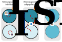

# Estruturação Populacional

<br>

```{r Aphelocoma, echo = FALSE, fig.align = 'center', out.width="400px", fig.cap="A integração de dados detalhados de dispersão, linhagem e genômica possibilitou uma compreensão bastante completa de como a dispersão molda os padrões de diversidade genética em escalas espaciais curtas em gaio-dos-arbustos da Flórida (Aphelocoma coerulescens), em que o isolamento por distância ocorre como resultado da dispersão limitada sobre escalas de tempo contemporâneas. Veja [Aguillon et al. 2017](https://doi.org/10.1371/journal.pgen.1006911)."}
knitr::include_graphics('https://gcbias.files.wordpress.com/2017/09/plos_cover_image.jpg')
```

<br>

## Variação genética em populações subdivididas

A estrutura genética de uma população pode ser amplamente definida como a quantidade e distribuição da variação genética dentro e entre populações.


De forma geral, uma estrutura genética irá decorrer de qualquer desvio do acasalamento aleatório, incluindo:

- Endogamia

- Acasalamento seletivo

- Subdivisão geográfica

<br>

A estruturação geográfica das populações por sua vez irão decorrer de:
 
- barreiras ao fluxo gênico

- limites de dispersão

- filopatria

<br>	
	
Seja como for, os organismos não se reproduzem aleatoriamente e tendem a permanecer próximos de onde nasceram. 

Nestas circunstâncias, as diferenças genéticas e fenotípicas podem se acumular entre as populações. 

Essas diferenças podem levar, ao longo de várias gerações, ao isolamento reprodutivo e, por fim, à especiação. 


## Efeito Wahlund

<br>

```{r wahlund, echo = FALSE, fig.align = 'right', out.width = "300px", fig.cap="[Sten Wahlund]() (1901 – 1976), geneticista e político sueco."} 
knitr::include_graphics('https://dms-cf-05.dimu.org/image/032wZ1NqR4JC')
```
<br>

O efeito Wahlund é uma redução na heterozigosidade em uma população causada pela estruturação populacional.

Se duas ou mais subpopulações têm diferentes frequências alélicas, a heterozigosidade global é reduzida, mesmo que as próprias subpopulações estejam em equilíbrio de Hardy-Weinberg.

<br>

Considere duas subpopulações A e B, ambas em equilíbrio de Hardy-Weinberg:

<br>

| População A | População B | 
| :--:        | :--:        |
|$N(AA) = x_A = 49$|$N(AA) = x_B = 16$|
|$N(Aa) = y_A = 42$|$N(Aa) = y_B = 48$|
|$N(aa) = z_A = 9$|$N(aa) = z_B = 36$|

<br>

Assim, as frequências alélicas dos alelos $A$ e $a$ em cada população serão:

<br>

| População A | População B | 
| :--:        | :--:        |
|$f(A) = p_A = 0.7$|$f(AA) = p_B = 0.4$|
|$f(a) = q_A = 0.3$|$f(a) = q_B = 0.6$|

<br>

Contudo, podemos considerar que as subpopulações A e B integram uma única população M, onde teremos que:


<br>

$N_{Obs}(AA) = x_A + x_B = 65$

$N_{Obs}(Aa) = y_A + y_B = 90$

$N_{Obs}(aa) = z_A + z_B = 45$

<br>

E suas frequências alélicas na população M serão:


$\bar{p} = \frac{p_A + p_B}{2} = 0.55$

$\bar{q} = \frac{q_A + q_B}{2} = 0.45$

<br>

Assim, dada a expectativa do princípio de Hardy-Weinberg, o número de indivíduos de cada genótipo para a população M será:

<br>

$N_{Esp}(AA) = N_M\cdot p_M^2 = 200 \cdot 0.55^2 \approx 60.5$

$N_{Esp}(Aa) = N_M\cdot 2p_Mq_M = 2 \cdot 0.55 \cdot 0.45 \approx 99$

$N_{Esp}(aa) = N_M\cdot q_M^2 = 200 \cdot 0.45^2 \approx 40.5$

<br>

Observam-se assim uma quantidade menor de heterozigotos na população M (e correspondentemente mais homozigotos) do que o esperado pelo cruzamento aleatório.

Tal redução na heterozigosidade pode ser estimada pelo coeficiente de endogamia $F$, como visto anteriormente (\@ref(eq:endogamia)), de forma que:

<br>

$$F_M = 1 - \frac{N_{Obs}(Aa)}{N_{Esp}(Aa)} = 1 - \frac{90}{99} \approx 0.091$$

<br>

Assim, pode-se dizer que subdivisão populacional é responsável por cerca de 9,1% de diferenciação genética entre as subpopulações A e B.

<br>

De forma geral, a heterozigosidade em uma população subdividida é dada pela média das suas subpopulações 1 e 2, de forma que:

<br>

$$H = \frac{2p_1q_1 + 2p_2q_2}{2}$$

<br>

Que é o mesmo que:

<br>

$$H = p_1q_1 + p_2q_2$$

<br>

Sendo $q = 1-p$, teremo:

<br>

$$H = p_1(1-p_1) + p_2(1-p_2)$$

<br>

Assim, é fácil provar que a heterozigosidade da população subdividida ($H$) será sempre menor do que a heterozigosidade esperada da população total ($2\bar{p}\bar{q}$), a não ser que as frequências alélicas nas duas subpopulações sejam iguais ($p_1 = p_2$), _i. e._, que não haja estruturação subpopulacional.

<br>

## Heterozigosidade em níveis demográficos

É possível porém estimar a frequência esperada de heterozigotos em diferentes níveis demográficos quando as populações estão subdivididas.

Supondo que os indivíduos sejam amostrados a partir de um número $k$ de locais diferentes, a heterozigosidade pode ser estimada nos seguintes níveis:

<br>

- **Heterozigosidade individual ($H_I$)**

Também chamada de heterozigosidade observada ($H_{Obs}$), a heterozigosidade individual é estimada como a fração de heterozigotos na amostra em uma determinada localidade, de forma que:

<br>

$$H_I = \frac{\sum{N_{ij}}}{N}$$

<br>

Onde 
$N_{ij}$ é o número de indivíduos do genétipo heterozigoto do $i$-nésimo e $j$-nésimo alelos, e 
$N$ é o tamanho da subpopulação.

<br>

A heterozigosidade individual pode ser interpretada como uma medida da _heterozigosidade média de todos os genes de um indivíduo_ ou como _a probabilidade de observar um heterozigoto em um locus específico_.

<br>

- **Heterozigose subpopulacional ($H_S$)**

A heterozigose subpopulacional é a proporção de heterozigosidade esperada em uma subpopulação amostrada específica, e pode ser estimada como a heterozigosidade esperada ($H_{Esp}$) média em todos os $k$ locais amostrados, de forma que:

<br>

$$H_S = \frac{1}{k}\cdot\sum_{i=1}^k{2p_iq_i}$$

<br>

Onde 
$p_i$ é $q_i$ são as frequências alélicas do $i$-nésimo local amostrado.

<br>

Para tal, assume-se que cada uma das localidades amostradas sigam o princípio de Hardy-Weinberg.

<br>

- **Heterozigosidade total ($H_T$)**

A heterozigosidade total é a heterozigosidade em todo o conjunto de dados; é a heterozigosidade esperada se todos os dados fossem mesclados e acasalados como uma única população panmítica, definida como:

<br>

$$H_T = 2\bar{p}\bar{q}$$

<br>

Onde 
$\bar{p}$ e $\bar{q}$ são as frequências alélicas médias entre todos os $k$ locais de amostragem.

<br>

```{r hetrozigosedemography, echo = FALSE, fig.align = 'center', out.width="800px", fig.cap="A heterozigosidade em populações subdivididas.."}

```

<br>

Assim, se os padrões subjacentes de acasalamento entre populações subdivididas restringirem o fluxo gênico, então essas estimativas de heterozigosidade irão mudar. 

<br>

**Não há estruturação geográfica ...**


... quando todas as subpopulações se misturam livremente, havendo essencialmente uma única população panmica, independente da quantidade de endogamia que realmente esteja ocorrendo nos locais individualmente, e assim:

<br>

$$H_S = H_T$$


<br>

Contudo, no outro extremo:

**Haverá estruturação geográfica ...**

... quando as subpopulações estão geneticamente isoladas umas das outras, e cada local está divergindo de acordo com sua própria história evolutiva, e neste caso:

<br>

$$H_S \ne H_T$$

<br>

## Estatísticas $F$ de Wright

As estatísticas $F$ (também conhecidas como índices de fixação) foram desenvolvidas por Sewall Wright na década de 1920 para comparar os níveis de heterozigosidade observada e esperada em termos do princípio de Hardy-Weinberg, de forma que, se um local está produzindo heterozigotos em uma proporção consistente com a expectativa de Hardy-Weinberg, então não há endogamia naquele deme ([Wright 1950](https://doi.org/10.1038/166247a0)).

<br>

Assim, o coeficiente de endogamia $F$ visto anteriormente (Equação \@ref(eq:edogamia)) corresponde ao primeiro nível demográfico, uma vez que a heterozigose dos indivíduos ($H_I$) é examinada em relação a heterozigosidade da subpopulação ($H_S$), de forma que:

<br>

$$F_{IS} = \frac{H_S-H_I}{H_S}=1-\frac{H_I}{H_S}$$

<br>

Os valores desse parâmetro são:

- positivos ($F_{IS}>0$) quando observa-se menos heterozigotos do que a expectativa de Hardy-Weinberg; e

- negativos ($F_{IS}<0$) quando observa-se mais heterozigotos do que a expectativa de Hardy-Weinberg.


As estatísticas $F$ (também conhecidas como **índices de fixação**) foram desenvolvidas por Sewall Wright que estava interessado em endogamia em gado. 

<br>

No próximo nível demográfico, pode-se examinar a heterozigosidade da subpopulação ($H_S$) em relação ao conjunto total de dados ($H_T$), de forma que:

$$F_{ST} = \frac{H_T-H_S}{H_T}=1-\frac{H_S}{H_T}$$

<br>

Este parâmetro mede a redução na heterozigosidade da subpopulação em relação a todo o conjunto de dados, onde teremos:

- **Ausência de isolamento** -- Quando as subpopulações foram geneticamente idênticas; e

- 
$$F_{ST}=1$$.

<br>

**Isolamento completo ...**

... quando as subpopulações foram geneticamente únicas, e assim:

<br>

$F_{ST}=1$.

<br>

```{r fixationindex, echo = FALSE, fig.align = 'center', out.width="800px", fig.cap="A estrutura das populações e o índice de fixação ($F_{ST}$) em populações panmíticas e isoladas."}

```

<br>

Para completar, podemos examinar a heterozigosidade individual ($H_I$) em relação ao conjunto total de dados ($H_T$), de forma que:

<br>

$$F_{IT} = \frac{H_T-H_I}{H_T}=1-\frac{H_I}{H_T}$$

<br>

Este parâmetro não é usado com frequência, pois os indivíduos são endogâmicos em relação às subpopulações nas quais são encontrados, e não em relação a totalidade do conjunto de dados. 

<br>

Os três parâmetros têm a seguinte relação:

$$1-F_{IT} = \left( 1-F_{IS} \right ) \left( 1-F_{ST} \right)$$

<br>

Onde 
$1-F_{IT}$ corresponde a probabilidade geral de identidade por descendência (IBD), ou o desvio geral do princípio de Hardy-Weinberg (PHW), 
$1-F_{IS}$ corresponde a probabilidade de IBD dentro de um indivíduo, ou o desvio do PHW devido à endogamia dentro das populações, e
$1-F_{ST}$ corresponde probabilidade de IDB entre dois indivíduos em uma subpopulação, ou desvio do PHW devido à diferenciação subpopulacional.

<br>

## Isolamento por distância

Isolamento por distância (IBD*) é um termo usado para se referir ao acúmulo de variação genética local sob dispersão geograficamente limitada.

Como populações locais são pequenas em comparação com a população total, e a reprodução ocorre apenas dentro da população local, há uma restrição da probabilidade de indivíduos se acasalarem. 

Indivíduos dentro da subpopulação são vizinhos no sentido de que seus gametas tendem a se unir com maior probabilidade, aumentando a endogamia dentro da subpopulação. 

* *Note que a mesma sigla IBD também é usada para outro conceito importante em genética de populações* viz., *identidade por descendência*.

<br>

O isolamento por distância é geralmente o modelo mais simples para a causa do isolamento genético entre as populações. 

Isso porque a probabilidade de dispersão decresce com a distância física, o que contribui para a diferenciação genética local. 

<br>

:::reference

White et al. 2010. doi: [10.1098/rspb.2009.2214](https://doi.org/10.1098/rspb.2009.2214)

Paradis et al 1998. doi: [10.1046/j.1365-2656.1998.00215.x](https://doi.org/10.1046/j.1365-2656.1998.00215.x)

Monteiro et al. 2014. doi: [10.1371/journal.pntd.0003167](https://doi.org/10.1371/journal.pntd.0003167)

Kanitz et al. 2018. doi: [10.1371/journal.pone.0192460](https://doi.org/10.1371/journal.pone.0192460)

:::

<br>

### Teste de Mantel

O teste de Mantel ([Mantel 1967](https://pubmed.ncbi.nlm.nih.gov/6018555); [Mantel & Valand 1970](https://doi.org/10.2307/2529108 )) é um teste estatístico extremamente versátil que tem muitos usos, incluindo análise espacial. 

Este teste examina a relação entre duas matrizes quadradas (geralmente matrizes de distância) $X$ e $Y$. 

Os valores dentro de cada matriz ($X_{ij}$ ou $Y_{ij}$) representam uma relação entre os pontos $i$ e $j$. 

No caso do isolamento por distância, a relação representada pelas matrizes a serem testadas seriam distâncias genéticas e geográficas entre as amostras. 

Por definição, as diagonais de ambas as matrizes deverão sempre ser preenchidas com zeros, uma vez que correspodendem a comparações de um indivíduo com ele mesmo..

<br>

### Correlação de Mantel estandardizada

A estatística de Mantel ($Z_M$) básica é simplesmente a soma dos produtos dos elementos correspondentes das matrizes, onde:

<br>

$$Z_M = \sum\sum X_{ij}Y_{ij} $$
<br>

Como $Z$ pode assumir qualquer valor, dependendo da natureza exata de $X$ e $Y$, geralmente usa-se a correlação de Mantel normalizada ($r_M$), calculada como a correlação entre os elementos de pares de $X$ e $Y$, de forma que:

<br>

$$r_M = \left( \frac{1}{n-1} \right) \sum \sum \frac{\left(X_{ij}-\bar{X}\right)}{\sigma_X}\frac{\left(Y_{ij}-\bar{Y}\right)}{\sigma_Y} $$

<br>

Onde 
$\bar{X}$ e $\bar{y}$ são os valores médios, e
${\sigma_X}$ e ${\sigma_Y}$ são os valores de desvio-padrão dos parâmetros de $X$ e $Y$, respectivamente.

<br>

A estatística varia de $-1 \leq r_M \leq +1$, 


<br>

```{r mantelcorrel, echo = FALSE, fig.align = 'center', out.width="800px", fig.cap="A correlação de Mantel entre matrizes de distâncias genéticas e geográficas permite avaliar se as populações se diferenciam por isolamento por distância (IBD)."}
knitr::include_graphics("figs/mantel_correlation.svg")
```

<br>

### Significância do teste de Mantel

A sigificância do teste de Mantel é estimada por meio de um teste de randomização (Monte Carlo)

O procedimento se dá em cinco passos:

1. A partir dos dados $X$ e $Y$, calcular a correlação de Mantel normalizada $r_M(XY)$, a qual será usada como valor de referência no teste;

2. Permutar aleatoriamente as linhas e colunas correspondentes de uma das matrizes, por exemplo na matriz $X$, obtendo a matriz $X^*$ (processo chamado de permutação de matriz);

3. Após a permutação dos dados $X^*$ e $Y$, calcular a correlação de Mantel normalizada $r_M(X^*Y)$, obtendo o valor $r_M^*$ da estatística sob permutação; 

4. Repetir os passos 2 e 3 um grande número de vezes (_e.g._, 999 ou 9999) para obter $n$ réplicas da distribuição de $r_M^*$ sob permutação, adicionando o valor de referência  $r_M(XY)$ à distribuição (a permuta e recompilação várias vezes para gerar uma distribuição de referência);

5. Para um teste unicaudal, envolvendo a cauda superior, _i. e._, para saber se as distâncias nas matrizes estão positivamente correlacionadas, calcular a probabilidade (valor-p) como a proporção de valores $r_M^*$ maiores ou iguais ao valor de referência $r_M(XY)$ em relação ao número $n$ de réplicas mais um (o valor original), de forma que:

$$valor\text{-}p = \frac{n(r_M^* \geq r_M)}{n+1}$$

<br>

## Exercícios


