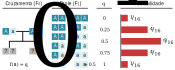
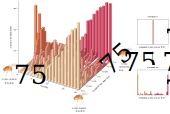
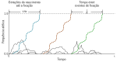
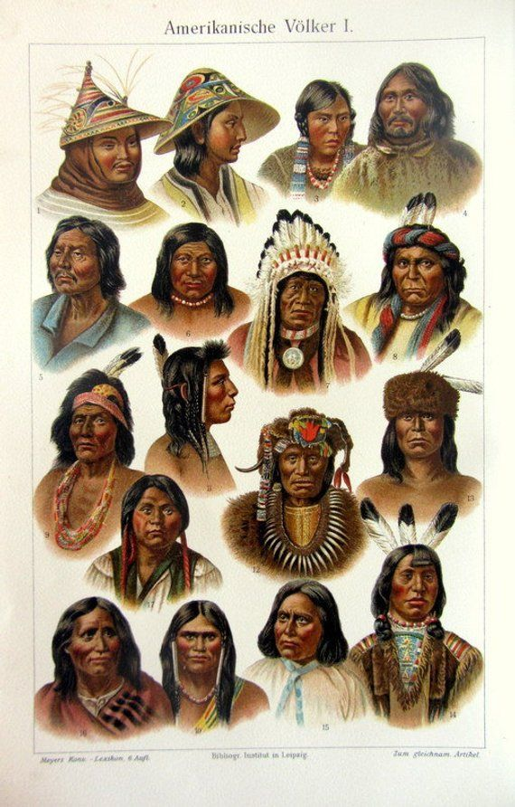

# Deriva Genética

<br>

```{r sealhunt, echo = FALSE, fig.align = 'center', out.width="600px", fig.cap="O elefante marinho do norte (_Mirounga angustirostris_) foi caçado implacavelmente na década de 1890, a ponto de se acreditar que o número de sua população caiu para 20 no final do século XIX. Desde então, sua população aumentou para dezena de milhares de indivíduos, mas seus genes ainda carregam as marcas desse gargalo."}
knitr::include_graphics('https://upload.wikimedia.org/wikipedia/commons/thumb/2/24/Killing_fur_seals%2C_St_Paul_Island.jpg/1024px-Killing_fur_seals%2C_St_Paul_Island.jpg')
```

<br>

:::reference

Weber et al. 2000. doi: [10.1016/S0960-9822(00)00759-4](https://doi.org/10.1016/S0960-9822(00)00759-4)

Hoelzel et al. 2020. doi: [10.1046/j.1420-9101.2002.00419.x](https://doi.org/10.1046/j.1420-9101.2002.00419.x)

:::

<br>

## Deriva genética aleatória

Uma vez que populações reais não são infinitas, as frequências alélicas se modificam de uma geração para a seguinte em decorrência do acaso, _i. e._, devido a **erros de amostragem**.

<br>

Considere dois indivíduos ($N = 2$), diplóides ($2n$), heterozigotos ($Cc$) reproduzindo sexuadamente, e com o tamanho populacional constante (produzindo dois filhos, _i. e._, cada indivíduo substituindo a si mesmo).

<br>

```{r driftN2, echo = FALSE, fig.align = 'center', out.width="800px", fig.cap="Probabilidade de mudança na frequência alélica em uma população população de tamanho finito e constante ($N=2$) dado o ruzamento entre dois indivíduos heterozigotos na geração parental ($F_0$)."}

```

<br>

A frequência do alelo recessivo pode sofrer uma mudança em relação à geração parental ($F_0$) dependendo da composição genotípica da prole ($F_1$), que depende simplesmente do acaso.

Assim, teremos que:

**Não haverá evolução ...**

... quando $q_1 = q_0$, com probabilidade igual a $\frac{6}{16}$.

<br>

**Haverá evolução ...**

.. quando $q_1 \ne q_0$, com probabilidade $1-\frac{6}{16}$, sendo a chance de aumento ou diminuição da frequência alélica proporcionalmente igual, $\frac{5}{16}$ cada, uma vez que a distribuição é simétrica.

<br>

Se uma população é infinita, não haverá erros de amostragem, e assim a frequência alélica de um determinado alelo na geração inicial $p_0$ será igual a frequência desse alelo na geração seguinte $p_1$, e permanecerá constante por conta do princípio de Hardy-Weinberg. 


E a mudança na frequência alélica geracional em populações infinitas ($\Delta p$) será:

<br>

$$\Delta p = p_1 - p_0 = 0$$

<br>

Contudo, Se uma população é finita, nem todos os cruzamentos possíveis de serem obsarvados no _pool_ gênico irão de fato ocorrer por conta de efeitos estocásticos, de forma que a frequência alélica $p_0$ em uma geração não será igual a frequência $p_1$ da próxima geração. 

E a mudança na frequência alélica geracional em populações finitas ($\Delta p$) será:

<br>

$$\Delta p = p_1 - p_0 \ne 0$$

<br>

Como a deriva genética decorre de erros de amostragem, cada população irá evoluir de forma diferente (considerando tamanhos populacionais iguais). 

<br>

## Prevendo o acaso 

<br>

```{r hungtington, echo = FALSE, fig.align = 'center', out.width="600px", fig.cap="A Doença de Huntington, uma desordem neurodegenerativa herdada por um alelo dominante de expanção de repetição CAG no gene da huntingtina, pode chegar a uma prevalença de até 2,2 em 100 mil habitantes em populações Afrikaner. A herança desse traço pode ser traçado de volta a quatro famílias dos 344 colonos holandeses que chegaram na África do Sul em 1658."}
knitr::include_graphics('https://upload.wikimedia.org/wikipedia/commons/3/3f/Charles_Bell_-_Jan_van_Riebeeck_se_aankoms_aan_die_Kaap.jpg')
```

<br>

:::reference

Hayden et al. 1980. PMID: [6447365](https://pubmed.ncbi.nlm.nih.gov/6447365/)

Greeff 2020 doi: [10.1111/j.1469-1809.2007.00363.x](https://doi.org/10.1111/j.1469-1809.2007.00363.x)

Hollfelder et al. 2020. doi: [10.1186/s12915-020-0746-1](https://doi.org/10.1186/s12915-020-0746-1)

:::

<br>

A deriva genética resulta de erros de amostragem que surgem sobretudo quando os gametas se unem para produzir descendentes, sobretudo quando a população é pequena, onde um número limitado de gametas se unem para produzir os indivíduos da próxima geração. O acaso influencia quais alelos estão presentes nesta amostra limitada e, desta forma, os erros de amostragem podem levar a mudanças na frequência alélica. 

Como os desvios das razões esperadas são aleatórios, a direção do acaso é imprevisível. 

<br>

Considere um locus gênico com dois alelos, $A$ e $a$, com frequências alélicas $p+q=1$, uma geração $t$ qualquer de uma população de tamanho $N$, com $2N$ gametas em seu _pool_ gênico, de forma que o número de alelos $A$ na população seja igual $2pN$.

A probabilidade exata de que o número de alelos $A$ permaneça igual a $2pN$ após uma geração de amostragem aleatória pode ser estimada pela fórmula geral para a distribuição binomial, onde $P$ é a probabilidade de $k$ sucessos dado a probabilidade $p$ de sucesso em $n$ eventos, de forma que:

<br>

\begin{equation} 
  P \left( k | p, n\right) = \binom{n}{k} \cdot p^k \cdot q^{n-k}
  (\#eq:binomial)
\end{equation} 

<br>

O parâmetro $\binom{n}{k}$ é o número total de combinações que os $k$ sucessos podem se apresentar no universo $n$ de eventos, de forma que:

<br>

\begin{equation} 
  \binom{n}{k} = \ ^nC_k =  \frac {n!}{k! \left( n-k \right)!}
  (\#eq:combinacao)
\end{equation} 


De forma geral,  
$n!$ é o fator que inicia a contagem do número de maneiras pelas quais o evento pode ocorrer, 
$k!$ é o fator que encerra a contagem do número de maneiras pelas quais o evento pode ocorrer, e 
$\left( n-k \right)!$ é o fator que remove eventos duplicados (_i. e._, em diferentes arranjos).

Perceba que, na formulação da probabilidade binomial, $q$ é a probabilidade de fracasso, onde $q = 1-p$.

<br>

Assim, em uma população de tamanho amostral $N=10$, e logo um _pool_ gênico com $2N=20$ gametas, com uma frequência alélica $p=0.8$...

... a probabilidade de que a frequência do alelo $A$ permaneça inalterada na próxima geração, _i. e._, que seja igual à $2pN = 16$, será:

<br>

$$
\begin{aligned}
P \left( 16 | 0.8, 20\right)
&= \binom{20}{16} \cdot 0.8^{16} \cdot0.2^{4} \\
&= \frac {20!}{16! \cdot 4!} \cdot 0.8^{16} \cdot0.2^{4}  \\
&\approx \frac {2.43290 \times 10^{18}}{2.09228 \times 10^{13} \cdot 24} \cdot 0.02815 \cdot 0.00160 \\
&\approx 4845 \cdot ×0,000045 \\
&\approx 0,21820 
\end{aligned}
$$ 

<br>

## A magnitude do acaso

<br>

```{r buri1956, echo = FALSE, fig.align = 'center', out.width="800px", fig.cap="O experimento clássico de Peter Buri ([1956](https://doi.org/10.1111/j.1558-5646.1956.tb02864.x)) sobre a dinâmica de duas mutações diferentes, $bw^{75}$ e $bw$) em um gene que influencia a cor dos olhos de 107 populações de _Drosophila melanogaster_, com 8 machos e 8 fêmeas em cada frasco de cultura."}

```

<br>

Embora é mais provável que as freqüências alélicas mudem de uma geração para outra, na verdade, é a magnitude da mudança que importa.

A probabilidades de frequências alélicas de uma geração para a próxima em populações de tamanhos variados mostra que a amplitude da distribuição diminui à medida que o tamanho da população aumenta.

<br>

```{r binomial, echo = FALSE, warning = FALSE, fig.align = 'center', out.width = "800px", fig.cap="Probabilidade binomial da mudança na frequência alélica ($p$) em uma geração por deriva dos alelos dado diferentes tamanhos populacionals ($N$). Note que a amplitude da distribuição diminui à medida que o tamanho da população aumenta."} 
library("ggplot2")
library("latex2exp")
library("patchwork")
X5 = seq(from = 0, to = 10, length = 11)
Y5 = dbinom(x = 0:10, size = 10, prob = 0.5)
Z5 = X5/10

X50 = seq(from = 0, to = 100, length = 101)
Y50 = dbinom(x = 0:100, size = 100, prob = 0.5)
Z50 = X50/100

X500 = seq(from = 0, to = 1000, length = 1001)
Y500 = dbinom(x = 0:1000, size = 1000, prob = 0.5)
Z500 = X500/1000

df10 <- data.frame(alelos = X5, prob = Y5, freq = Z5)

df100 <- data.frame(alelos = X50, prob = Y50, freq = Z50)

df1000 <- data.frame(alelos = X500, prob = Y500, freq = Z500)

ggplot(df10, aes(x=freq, y = prob)) +
  geom_line(aes(y = prob), size = 1, color = "firebrick2") +
  labs(x = "Frequência do alelo \nna próxima geração", y = "Probabilidade") +
  theme(legend.position="none") +
  annotate(geom='text', x=0.1, y=0.235, parse = TRUE, color="firebrick2", label=TeX("$N=10$")) +
ggplot(df100, aes(x=freq, y = prob)) +
  geom_line(aes(y = prob), size = 1, color = "royalblue3") +
  labs(x = "Frequência do alelo \nna próxima geração", y = "Probabilidade") +
  theme(legend.position="none") +
  annotate(geom='text', x=0.13, y=0.076, parse = TRUE, color="royalblue3", label=TeX("$N=100$")) +
ggplot(df1000, aes(x=freq, y = prob)) +
  geom_line(aes(y = prob), size = 1, color = "green4") +
  labs(x = "Frequência do alelo \nna próxima geração", y = "Probabilidade") +
  theme(legend.position="none") +
  annotate(geom='text', x=0.18, y=0.024, parse = TRUE, color="green4", label=TeX("$N=1000$"))
```

<br>

E assim também diminui, à medida que o tamanho da população aumenta, a quantidade de mudança devido a erros de amostragem. 

A direção da mudança é imprevisível -- as frequências alélicas aumentam e diminuem estocasticamente ao longo do tempo. 

Quando a mudança ocorre, a amostragem para produzir a próxima geração será centralizada no novo valor de frequência alélica $p$, com uma variância (dispersão) estimada de:

<br>

$$var(p) = \frac{p \left( 1-p \right)}{2N_e}$$
<br>

Como em um jogo com dados, em qualquer locus, a deriva pode sortir alelos a partir de uma geração para a seguinte até um alelo ser totalmente fixado ou perdido. O tempo necessário para que isso ocorra depende das freqüências iniciais dos alelos e, é claro, do tamanho da população.

Assim, a cada geração, uma população que tenha um alelo fixado (e.g., $p=1$) ou perdido (e.g., $p=0$) permanecerá desta forma uma vez que a variação genética foi exaurida ($q = 1-p = 0$ ou $q = 1-p = 1$, respectivamente), a menos que novos alelos surjam por mutação ou entrem na população por migração. 

Por outro lado, uma população que permanece com um locus segregante (e.g., $0<p<1$) irá produzir uma dispersão nas freqüências alélicas na geração seguinte, que por sua vez terão novamente alelos fixados para locos alternativos, enquanto outros permanecerão segregantes. 

<br>

À medida que passa o tempo, uma fração cada vez menor de locos continuarão segregantes. E após um número suficiente de gerações, a maioria dos locos terão um alelo fixado. 

Em populações maiores, o espalhamento progressivo das freqüências alélicas e o acúmulo de locos fixados ocorrem mais lentamente. 

```{r binomialpopsize, echo = FALSE, warning = FALSE, fig.align = 'center', out.width = "800px", fig.cap="Probabilidade binomial da mudança na frequência alélica ($p$) em uma geração por deriva dos alelos dado diferentes tamanhos populacionals ($N$). Note que a amplitude da distribuição diminui à medida que o tamanho da população aumenta."} 
library("ggplot2")
library("latex2exp")
library("patchwork")
drift <- read.csv("tables/drift.csv", sep=",", check.names = FALSE, header = TRUE)
ggplot(drift, aes(x=generation)) +
  geom_line(aes(y = N10_L01), size = 1, color = "#d53e4f") +
  geom_line(aes(y = N10_L02), size = 1, color = "#f46d43") +
  geom_line(aes(y = N10_L03), size = 1, color = "#fdae61") +
  geom_line(aes(y = N10_L04), size = 1, color = "#fee08b") +
  geom_line(aes(y = N10_L05), size = 1, color = "#fffdbf") +
  geom_line(aes(y = N10_L06), size = 1, color = "#e6f598") +
  geom_line(aes(y = N10_L07), size = 1, color = "#abdda4") +
  geom_line(aes(y = N10_L08), size = 1, color = "#66c2a5") +
  geom_line(aes(y = N10_L09), size = 1, color = "#3288bd") +
  geom_line(aes(y = N10_L10), size = 1, color = "#5e4fa2") +
  labs(x = "Geração", y = "Frequência alélica") +
  theme(legend.position="none") +
  xlim(0, 30) +
  ylim(0, 1) +
  annotate(geom='text', x=15, y=1, parse = TRUE, color="black", label=TeX("$N=10$")) +
ggplot(drift, aes(x=generation)) +
  geom_line(aes(y = N500_L01), size = 1, color = "#d53e4f") +
  geom_line(aes(y = N500_L02), size = 1, color = "#f46d43") +
  geom_line(aes(y = N500_L03), size = 1, color = "#fdae61") +
  geom_line(aes(y = N500_L04), size = 1, color = "#fee08b") +
  geom_line(aes(y = N500_L05), size = 1, color = "#fffdbf") +
  geom_line(aes(y = N500_L06), size = 1, color = "#e6f598") +
  geom_line(aes(y = N500_L07), size = 1, color = "#abdda4") +
  geom_line(aes(y = N500_L08), size = 1, color = "#66c2a5") +
  geom_line(aes(y = N500_L09), size = 1, color = "#3288bd") +
  geom_line(aes(y = N500_L10), size = 1, color = "#5e4fa2") +
  labs(x = "Geração", y = "Frequência alélica") +
  theme(legend.position="none") +
  xlim(0, 30) +
  ylim(0, 1) +
  annotate(geom='text', x=15, y=1, parse = TRUE, color="black", label=TeX("$N=500$"))

```

<br>

O tempo médio necessário para a fixação de um alelo, como mostrado por Kimura e Ohta ([1969](https://doi.org/10.1093%2Fgenetics%2F61.3.763)), depende do tamanho da população e da frequência do alelo, de forma que:

<br>

$$\bar{t}_1\left(p\right) = - \frac{1}{p} \left[ 4N_e \left( 1-p \right) \ln \left( 1-p \right) \right] $$
<br>

Assim, para um alelo que tenha acabado de surgir na população, com frequência mínima $p = \frac{1}{2N} \rightarrow 0 $, temos:

<br>

$$\bar{t}_1\left(p \rightarrow 0\right) = 4N_e $$

<br>

```{r fixationtime, echo = FALSE, fig.align = 'center', out.width="800px", fig.cap="O tempo médio necessário para a fixação de um alelo depende do tamanho da população e da frequência do alelo, como mostrado por Kimura e Ohta ([1969](https://doi.org/10.1093%2Fgenetics%2F61.3.763))."}

```

<br>

Outra maneira de pensar a deriva genética é considerar a taxa na qual a variação é perdida. 

Dada a heterozigosidade inicial da população $H_0$, a heterozigosidade após $t$ gerações $H_t$ pode ser calculada como:

<br>

$$H_t = \left( 1- \frac{1}{2N_e}   \right)^t \cdot H_0 $$

<br>

Espera-se que a heterozigosidade diminua, a cada geração, em uma fração $\frac{1}{2N_e}$. 

Assim, quanto menor o tamanho efetivo ($N_e$) da população, mais rápida a heterozigosidade será perdida.

<br>

```{r heterodrift, echo = FALSE, warning = FALSE, fig.align = 'center', out.width = "600px", fig.cap="A heterozigosidade de uma população finita tende a diminuir a cada geração."} 
library("ggplot2")
library("latex2exp")
ggplot(data.frame(x = c(0, 200)), aes(x = x)) + 
  stat_function(fun = function(x) 0.5*(1-(1/(2*10)))^x, color = "firebrick2", lwd = 1) +
  stat_function(fun = function(x) 0.5*(1-(1/(2*20)))^x, color = "chocolate", lwd = 1) +
  stat_function(fun = function(x) 0.5*(1-(1/(2*50)))^x, color = "royalblue3", lwd = 1) +
  stat_function(fun = function(x) 0.5*(1-(1/(2*200)))^x, color = "green4", lwd = 1) +
  stat_function(fun = function(x) 0.5*(1-(1/(2*1000)))^x, color = "deepskyblue3", lwd = 1) +
  labs(x = "Geração", y = "Heterozigosidade") + 
  xlim(0, 200) +
  ylim(0, 0.5) +
  annotate(geom='text', x=100, y=0.02, parse = TRUE, color="firebrick2", label=TeX("$N_e=10$")) +
  annotate(geom='text', x=100, y=0.08, parse = TRUE, color="chocolate", label=TeX("$N_e=20$")) +
  annotate(geom='text', x=100, y=0.22, parse = TRUE, color="royalblue3", label=TeX("$N_e=50$")) +
  annotate(geom='text', x=100, y=0.42, parse = TRUE, color="green4", label=TeX("$N_e=200$")) +
  annotate(geom='text', x=100, y=0.5, parse = TRUE, color="deepskyblue3", label=TeX("$N_e=1000$"))
```

<br>

Em suma:

- As frequências alélicas flutuam aleatoriamente de uma geração para outra;

- Eventualmente, alelos iniciais são fixado e outros são perdidos;

- A heterozigosidade esperada diminui ao longo do tempo;

- A taxa de desvio está diretamente relacionada ao tamanho efetivo da população.

<br>

## Gargalo populacional

<br>

```{r cheetah, echo = FALSE, fig.align = 'center', out.width="600px", fig.cap="Os guepardos africanos (_Acinonyx jubatus_) passaram por dois principais eventos de gargalo populacional: um a cerca de 10.000 anos atrás, na era do gelo, e outro a aproximadamente 200 anos atrás, durante o imperialismo das potências européias. Com isso, os guepardos atuais são mais parecidos geneticamente do que ratos Wistar, com menos de 1% de variação genética."}
knitr::include_graphics('https://cdn.britannica.com/s:700x500/01/152301-050-1EF6EBB4/Cheetah.jpg')
```

<br>

:::reference

O’Brien et al. 1987. doi: [10.1073/pnas.84.2.508](https://doi.org/10.1073/pnas.84.2.508)

Menotti-Raymond & O'Brien 1993. doi: [10.1073/pnas.90.8.3172](https://doi.org/10.1073/pnas.90.8.3172)

Dobrynin et al 2015. doi: [10.1186/s13059-015-0837-4](https://doi.org/10.1186/s13059-015-0837-4)

:::

<br>

Gargalo da população ou gargalo genético é uma redução acentuada no tamanho de uma população devido a eventos ambientais  ou atividades humanas.

Tais eventos podem reduzir a variação no pool genético de uma população; a partir de então, uma população menor, com menor diversidade genética, continua a passar genes para futuras gerações de descendentes por meio da reprodução sexual.

Como a população pode se recuperar após o gargalo, precisamos levar em conta essa mudança ao longo do tempo na medida de N, principalmente devido a perda de heterozigotos por deriva gênica.

Assim o tamanho efetivo da população ($N_e$) é a média harmônica dos tamanhos populacionais a cada geração, de forma que:

<br>

$$N_e = \frac{t}{ \sum_{i=1}^t \frac{1}{N_i} } $$

<br>

Onde 
$N_i$ é o tamanho da população na $i$-nésima geração, e
$t$ é o número de gerações decorridas.

<br>

```{r table1101, echo = FALSE}
bottleneckt1 <- c(1000, 1000, 1000)
bottleneckt2 <- c(1000, 250, 250)
bottleneckt3 <- c(1000, 1000, 250)
bottleneckt4 <- c(1000, 1000, 250)
bottleneckt5 <- c(1000, 1000, 1000)
bottleneckNe <- c(1000, 625, 357.1)
data1101 <- data.frame(bottleneckt1, bottleneckt2, bottleneckt3, bottleneckt4, bottleneckt5, bottleneckNe)
rownames(data1101) <- c("Constante", "Gargalo (curto)", "Gargalo (longo)")
knitr::kable(data1101, "html", align = "cccccc", col.names = c("$t_1$", "$t_2$", "$t_3$", "$t_4$", "$t_5$", "$N_e$"), booktabs = TRUE, escape = FALSE, caption = "Tamanho efetivo da população ($N_e$) entre três populações com diferentes histórias demográficas ao longo das gerações ($t$).")
```
<br>


## Efeito fundador

<br>

```{r amerindios, echo = FALSE, fig.align = 'center', out.width="400px", fig.cap= "Índios sul e centro-americanos colonizaram essas áreas a partir do norte desde a Sibéria, até o final da última Idade do Gelo. A maioria dessas pessoas descende de um pequeno grupo de fundadores intimamente relacionado, e são em quase totalidade pertencentes ao tipo sanguíneo O+. Retirado de Meyers Großes Konversations, Lexikon 6, Auflage."}

```

<br>
  
:::reference

Halverson & Bolnick 2008. doi: [10.1002/ajpa.20887](https://doi.org/10.1002/ajpa.20887)

Estrada-Mena et al. 2009. doi: [10.1002/ajpa.21204](https://doi.org/10.1002/ajpa.20887)

Bégat et al. 2015. doi: [10.1371/journal.pone.0132211](https://doi.org/10.1002/ajpa.20887)

:::

<br>

O efeito fundador é a perda de variação genética que ocorre quando uma nova população é estabelecida por um número muito pequeno de indivíduos de uma população maior.

Nestes casos um pequeno grupo de migrantes que não é geneticamente representativo da população da qual eles vieram se estabelece em uma nova área. 

<br>

## Simulando a deriva genética

<br>

Veja como simular a deriva genética passo-a-passo [aqui][Simulações em genética de populações].

<br>

## Exercícios

<br>

### Exercício 1 -- Probabilidades

<br>

Em uma pequena população com 20 indivíduos foi verificado que quatro indivíduos eram portadores de um alelo recessivo $a$ em um determinado lócus gênico autossômico.

Qual a probabilidade de que, na próxima geração, o alelo $a$:

- Matenha a sua frequência atual?

- Seja perdido?

- Seja completamente fixado?

- Seja ainda menos frequente do que o alelo dominante $A$?  

<br>

### Exercício 2 -- O camundongo e o elefante

<br>

Uma espécie animal diplóide, que se reproduz sexuadamente, apresenta uma população com 1000 indivíduos. A análise de um locus gênico autossômico revelou a presença de dois alelos polimórficos igualmente frequentes e que a população se encontra atualmente em equilíbrio de Hardy-Weinberg. 

Na ausência de forças evolutivas, qual seria o coeficiente de endogamia desta população daqui a dez mill anos se esta espécie fosse:

- O camundongo doméstico (_Mus musculus_), com um tempo médio de geração de 1 a 2 anos?

- O elefante africano (_Loxodonta africana_), com um tempo médio de geração de 25 anos?

<br>

Ainda, quanto maior seria a endogamia nessas populações se elas tivessem passado por um gargalo populacional que tivesse reduzido o tamanho das populações em 90%:

- Nos últimos 20 anos?

- Nos últimos 200 anos?

- Nos últimos 2000 anos?
