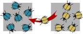
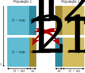
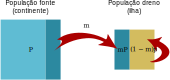

# Migração e Fluxo Gênico

<br>

```{r apricot, echo = FALSE, fig.align = 'center', out.width="800px", fig.cap="A Grande Muralha da China tem servido como uma barreira física ao fluxo gênico entre subpopulações de plantas separadas por mais de 600 anos, como por exemplo para o damasqueiro tibetano (_Prunus armeniaca_), em floração. Foto: runchinamarathon.com/images (2014)"}

```

<br>

:::reference

Su et al. 2003. doi: [10.1038/sj.hdy.6800237](https://doi.org/10.1038/sj.hdy.6800237)

:::

<br>

## Migração $\times$ Fluxo gênico 

Como visto anteriormente, quando populações se encontram estruturadas, as subpopulações irão divergir por deriva genética. 

Cabe assim à migração promover o cruzamento de indivíduos de um deme com os de outro, e logo, o fluxo de genes entre as subpopulações. 

Contudo, a migração faz referência geralmente à indivíduos juvenis e adultos, e não necessariamente inclui o intercruzamento de indivíduos de populações diferentes (_e. g._,, pássaros migratórios).

Enquanto o fluxo gênico requer necessariamente que haja intercruzamento, o qual é também promovido por dispersão de larvas, sementes e gametas.

<br>

```{r bettlemigration, echo = FALSE, fig.align = 'center', out.width="600px", fig.cap="A migração de indivíduos entre subpopulações promove o fluxo gênico."}

```

<br>


:::quote

**Migração** -- O movimento de membros de uma espécie para um ambiente diferente.

**Fluxo gênico** -- A transferência da variação genética de uma população para outra.

:::

<br>

## Modelando a migração

Conside um modelo simples onde duas populações locais trocam genes ao permutar uma proporção $m$ do total de seus indivíduos a cada geração reciprocamente.


Assim, em um lócus com dois alelos $A$ e $a$, teremos...

- ... na população 1:

<br>

$$f(A,Pop\ 1) = p_1$$ 

e

$$f(a,Pop\ 1) = q_1$$ 
<br>

- ... e na população 2:

<br>

$$f(A,Pop\ 2) = p_2$$ 

e

$$f(a,Pop\ 2) = q_2$$ 
<br>

Assim, a frequência $p'$ do alelo $A$ na próxima geração dependerá da fraçao $m$ de migrantes trocada entre as duas populações, de forma que...

- ... na população 1:

<br>

$$p'_1 = (1-m)p_1 + mp_2$$ 
<br>

- ... e na população 2:

<br>

$$p'_2 = (1-m)p_2 + mp_1$$ 

<br>

Onde 
$m$ é a fração de migrantes entre as duas populações, e 
$1-m$ é a a fração de não-migrantes.

<br>

```{r migration2way, echo = FALSE, fig.align = 'center', out.width="600px", fig.cap="A frequência alélica $p$ após uma geração com uma taxa de migração recíproca $m$ entre duas populações."}

```

<br>

A mudança nas frequências gênicas promovida pelo fluxo gênico dependerá assim da fração $m$ de migrantes e da diferença prévia existente entre as frequências gênicas $p_1$ e $p_2$ das populações, de forma que...

- ... na população 1:

<br>

$$
\begin{aligned}
\Delta p_1
&= p’_1 –  p_1 \\
&= (1 – m)p_1 + mp_2 \ – \ p_1 \\
&= p_1 – mp_1 + mp_2 \ – \ p_1 \\
&= mp_2 \ – \  mp_1 \\
&= m(p_2 \ – \ p_1)
\end{aligned}
$$ 
<br>

- ... e na população 2:

$$
\begin{aligned}
\Delta p_2
&= p’_2 –  p_2 \\
&= (1 – m)p_2 + mp_1 \ – \ p_2 \\
&= p_2 – mp_2 + mp_1 \ – \ p_2 \\
&= mp_1 \ – \  mp_2 \\
&= m(p_1 \ – \ p_2)
\end{aligned}
$$ 
<br>

Desta maneira, a migração será uma força evolutiva (promeverá mudança nas frequências gênicas), quando:

- $m > 0$ -- _i. e._ , há fluxo gênico (_viz._, as populações locais não estão totalmente isoladas); e

- $p_1 \neq p_2$ -- _i. e._, há divergência genética entre as populações locais (o que quase sempre irá ocorrer, uma vez que as subpopulações são finitas e possuem uma história evolutiva prévia, _viz._, deriva genética).

<br>

Assim, quando $p_1 = 0$ e $p_2 > 0$, O fluxo gênico introduzirá nova variação genética na população 1, uma vez que $p’_1  =  mp_2$

Neste sentido o fluxo gênico atuará localmente como um processo criativo, semelhante à mutação, mas mais expressivo do que esta, pois geralmente $m \gg µ$ (ver taxa de mutação em [#Mutação]).

<br>

## Migração ao longo do tempo

O fluxo gênico entre populações geneticamente distintas promove mudança nas frequências gênicas (evolução).

Contudo, esta mudança ocorre em uma direção específica.

Assim, se...

- ...na população 1

<br>

$$
\begin{aligned}
p'_1
&= (1-m)p_1 + mp_2 \\
&= p_1 - mp_1 + mp_2 \\
&= p_1 - (mp_1 - mp_2) \\
&= p_1 - m(p_1 - p_2)
\end{aligned}
$$ 

<br>

- ... e na população 2:

- ...na população 1

<br>

$$
\begin{aligned}
p'_2
&= (1-m)p_2 + mp_1 \\
&= p_2 - mp_2 + mp_1 \\
&= p_2 + (mp_1 - mp_2) \\
&= p_2 + m(p_1 - p_2)
\end{aligned}
$$ 

E se chamarmos $d$ a diferença entre as frequências gênicas das duas populações em uma dada geração, de forma que:

<br>

$$ d = p_1 - p_2$$
<br>

Então teremos que:

$$p'_1 = p_1 - md$$

e

$$p'_2 = p_2 + md$$

Assim, a diferença entre as frequências gênicas das duas populações na geração seguinte $d'$, será:

<br>

$$
\begin{aligned}
d'
&= p’_1 \ – \ p’_2 \\
&= (p_1 - md) - (p_2 + md) \\
&= p_1 - md - p_2 - md \\
&= p_1 - p_2 - 2md
\end{aligned}
$$
<br>

Assim, se $ d = p_1 - p_2$, logo teremos que:

<br> 

$$
\begin{aligned}
d'
&= d - 2md \\
&= d(1-2m) 
\end{aligned}
$$

<br>

Desta forma, o fluxo gênico entre as populações, quando $m>0$, leva à redução da diferença entre as frequências alélicas das subpopulações, proporcional a taxa de migração $m$, uma vez que $d'<d$.

Logo, após $t$ gerações de migração, temos que:

<br>

$$d_t = d(1 – 2m)^t$$

<br>

Assim:

- $d_t \to 0$, quando $t \to \infty$;

- e $d = 0$, quando $p_1 = p_2 = 0.5$


<br>

```{r migration2graph, echo = FALSE, warning = FALSE, fig.align = 'center', out.width = "600px", fig.cap="O fluxo gênico entre duas populações levará ao equilíbrio das frequências alélicas proporcionalmente a taxa de migracão $m$."} 
library("ggplot2")
library("latex2exp")
ggplot(data.frame(x = c(0, 50)), aes(x = x)) + 
  stat_function(fun = function(x) 1 - (1-(1*(1-(2*0.05))^x))/2, color = "firebrick2", lwd = 1) +
  stat_function(fun = function(x) 0 + (1-(1*(1-(2*0.05))^x))/2, color = "royalblue3", lwd = 1) +
  labs(x = "Geração", y = "Frequência alélica") + 
  xlim(0, 50) +
  ylim(0, 1) +
  annotate(geom='text', x=25, y=0.7, parse = TRUE, color="firebrick2", label=TeX("$População \\ 1$")) +
  annotate(geom='text', x=25, y=0.3, parse = TRUE, color="royalblue3", label=TeX("$População \\ 2$"))
```

<br>

O fluxo gênico pode ser visto como o ponto que conecta as populações:

- Em **curto prazo**, o fluxo gênico atua como uma força evolutiva criadora, pois introduz novas variantes alélicas em populações locais divergentes ou mesmo em espécies próximas por meio de **hibridização** e **introgressão**. 

- Em **longo prazo**, o fluxo gênico atua como uma força evolutiva conservadora, pois restringe a diferenciação gênica entre populações, promovendo a **conectividade** e **mistura**.

## O modelo fonte-dreno

No modelo fonte-dreno, também conhecido como continentes-ilha, o fluxo gênico ocorre unidirecionalmente, a partir de uma grande população (fonte) para uma menor (dreno). 

Desta forma, a introdução de alelos vindos da população fonte afeta a freqüência alélica na população dreno, mas não ao contrário. 

<br>

Como a população fonte não recebe migrantes da população dreno, ou, se o faz, a diferença no tamanho das duas populações torna a fração de migrantes desprezível, teremos que a frequência $P$ do alelo $A$ não é alterada pelo fluxo gênico, e permanecerá constante de uma geração para a outra.

Contudo, na população dreno, a frequência $p$ do alelo $A$ na próxima geração será influenciada pela fração $m$ de migrantes oriundos da população fonte, de forma que:

<br>

$$p_1 = (1 – m)p_0 + mP$$


<br>

```{r migration2way, echo = FALSE, fig.align = 'center', out.width="600px", fig.cap="A frequência alélica $p$ após uma geração com uma taxa de migração unidirecional $m$ pa população fonte para a população dreno."}

```

<br>

Como a frequência $P$ não muda, podemos prever que:

<br>

$$p_2 = (1 – m)p_1 + mP$$

$$p_3 = (1 – m)p_2 + mP$$

$$...$$

<br>

E assim, em termos gerais, a frequência $p$ do alelo $A$ na população dreno após $t$ gerações será:

<br>

$$p_t = (p_0 - P)(1 - m)^t+ P$$

<br>


De forma que $p_t \to P$, quando $t \to \infty$.

<br>

```{r migration1graph, echo = FALSE, warning = FALSE, fig.align = 'center', out.width = "600px", fig.cap="O fluxo gênico da população fonte para a população dreno promoverá, após certo tempo, dada a taxa de migracão $m$, a substituiçào dos alelos na última."} 
library("ggplot2")
  library("latex2exp")
ggplot(data.frame(x = c(0, 50)), aes(x = x)) + 
  stat_function(fun = function(x) 0.2, color = "firebrick2", lwd = 1) +
  stat_function(fun = function(x) 0.2 + (1 - 0.2)*(1 - 0.1)^x, color = "royalblue3", lwd = 1) +
  labs(x = "Geração", y = "Frequência alélica") + 
  xlim(0, 50) +
  ylim(0, 1) +
  annotate(geom='text', x=25, y=0.10, parse = TRUE, color="firebrick2", label=TeX("$População \\ fonte$")) +
  annotate(geom='text', x=25, y=0.40, parse = TRUE, color="royalblue3", label=TeX("$População \\ dreno$"))
```

<br>

## O modelo de ilhas

O modelo de ilha é uma modelagem mais complexa da migraÇão, onde todas $n$ populações estão conectadas através de uma taxa de migração $m$ constante. 

A maneira mais simples de modelar esse tipo de sistema é considerar que os migrantes compreendem um grande reservatório de migrantes, que são distribuídos para todas as populações. 

Se $\bar{p}$ é a frequência alélica média global, o conjunto de migrantes pode ser considerado como tendo também essa frequência alélica. 

Sendo assim, a frequência $p$ do alelo $A$ na $i$-nésima população na próxima geração será:

<br>

$$p_{i,t+1} = (1-m)p_{i, t} + m\bar{p}$$ 

<br>

## Equilíbrio entre fluxo gênico e deriva gênica

O fluxo gênico atua reduzindo a probabilidade de identidade por descendência (IBD), uma vez que um alelo introduzido de fora de uma população significa que não haverá ancestralidade comum dentro da população. 

Usando o índice de fixação ($F_{ST}$) como a medida do progresso da deriva genética, _i.e._, como a probabilidade de identidade por descendência em subpopulações relativas à metapopulação total, podemos expressar assim probabilidade total de identidade por descendência em populações migrantes.

Como visto anteriormente, em uma dada geração $t$, o coeficiente de endogamia ($F$) será:

<br>

$$F_t = \frac{1}{2N_e} + \left( 1- \frac{1}{2N_e} \right)F_{t-1}$$

<br>

Assumindo que a migração traz genes inteiramente não relacionados de outras populações, com probabilidade $m$: 

- $(1 – m)$ -- é a chance de que um alelo qualquer em uma geração não ter surgido por migração, e 

- $(1 – m)^2$ -- é a chance de que nenhum dos dois alelos combinados em uma fecundação tenha imigrado nessa geração. 

<br>

Assim, depois de contabilizar a possibilidade de migração, a probabilidade geral de identidade por descendência na geração tempo $t$ será:

<br>

$$F_t = \left[ \frac{1}{2N_e} + \left( 1- \frac{1}{2N_e} \right)F_{t-1} \right] \left( 1-m\right)^2$$

<br>

Como o tamanho efetivo da população $N_e$ e a taxa de migração $m$ são os dois únicos parâmetros para determinar o coeficiente de endogamia $F$ conforme acima, é bastante claro que os efeitos combinados da deriva genética e da migração devem tender a algum tipo de valor de equilíbrio.

Sendo o coeficiente de endogamia de equilíbrio $\hat{F}$, onde $\hat{F} = F_t = F_{t-1}$, teremos que:

- se $N$ e $m$ são pequenos, a deriva supera a migração, e $\hat{F} \approx 1$, mas

- se $N$ e $m$ são grandes, a migração irá homogeneizar as frequências dos genes mais rapidamente do que a deriva, e $\hat{F} \approx 0$.

E assim, o coeficiente de endogamia de equilíbrio $\hat{F}$ será:

<br>

$$\hat{F} = \left[ \frac{1}{2N_e} + \left( 1- \frac{1}{2N_e} \right)\hat{F} \right] \left( 1-m\right)^2$$

<br>

Assintoticamente à taxa de migração $m$, _i. e._, assumindo que o valor de $m$ é pequeno o suficiente para que $m^2 \sim 0$, teremos que:

$$ (1 - m)^2 \sim 1-2m$$

<br>

E assim, após várias simplificações algébricas da equação anterior (veja [aqui][#Provas]), teremos que:

<br>

$$\hat{F} \sim  \frac{1-2m}{4N_em+1-2m} $$

<br>

Desde que $2m \ll Nm$ e $2m \ll 1$, teremos a relação aproximada:

<br>

$$\hat{F} \sim  \frac{1}{4N_em+1} $$

<br>

Quando o índice de fixação ($F_{ST}$) é conhecido, podemos expressá-lo como:

<br>

$$F_{ST} \sim  \frac{1}{4N_em+1} $$

<br>

e 

<br>

$$N_em \sim  \frac{ \frac{1}{F_{ST}}-1}{4} $$

<br>

Neste contexto, $N_em$ representa o **número efetivo de migrantes** em uma população. 

Por esse motivo, algumas pessoas passaram a ver estimativas de $N_em$ como medidas de "fluxo gênico", quando, na verdade, $N_em$ não mede fluxo gênico, o que é dado efetivamente pela taxa de migração $m$.

O que $N_em$ realmente irá medir é a "tendência de produzir $F_{ST}$  sob deriva aleatória”, desde que as suposições bastante irrealistas do modelo de ilha sejam cumpridas. 

Assim:

- Se $N_em > 1$, há fluxo gênico suficiente para negar os efeitos da deriva genética, e manter a conectividade entre as populações, mas

- Se $N_em > 4$, então as populações locais podem ser consideradas pertencer a uma única população panmítica.

<br>

```{r fixationmigration, echo = FALSE, warning = FALSE, fig.align = 'center', out.width = "600px", fig.cap="O índice de fixação ($F_{ST}$) é uma função não-linear do número efetivo de migrantes ($N_em$). Ver Whitlock & McCauley ([1999](https://doi.org/10,1038/sj.hdy.6884960))."} 
library("ggplot2")
library("latex2exp")
ggplot(data.frame(x = c(0, 20)), aes(x = x)) + 
  stat_function(fun = function(x) 1/(x+1), color = "royalblue3", lwd = 2) +
  labs(x = "Número efetivo de migrantes", y = "Índice de fixação") + 
  xlim(0, 20) +
  ylim(0, 1)
```

<br>

## Exercícios

<br>

### Exercício 1 -- Duas subpopulações quaisquer

Suponha que existam duas subpopulações, $X$ e $Y$, com frequencias gênicas iniciais de um alelo $A$ iguais a $p_{0,X}=0.2$ e $p_{0,Y}=0.8$, respectivamente, sendo que $1\%$ dos indivíduos em uma subpopulação em qualquer geração são migrantes.

Desta forma, calcule a frequência alélica nas duas populações após...

- ... 5 gerações.

- ... 25 gerações.

- ... 100 gerações.

### Exercício 2 -- Aranha do deserto

Os indivíduos de uma espécie de aranha do deserto (_Agelenopsis aperta_) apresentam características comportamentais de base genética que os adaptam às pressões seletivas de diferentes ambientes:

- As aranhas de terras áridas, com baixa pressão de predação e baixa disponibilidade de presas, são muito territoriais e não discriminam a presa.

- As aranhas de floresta ribeirinha, com alta pressão de predação por pássaros e abundância de presas, são pouco territoriais e discriminam entre itens de presa com maior ou menor retorno energético.

Indivíduos de uma população de floresta ribeirinha do Arizona que é cercada por populações de áreas áridas, apresentam uma mistura de comportamentos de áreas áridas e ribeirinhas.

Esses comportamentos de áreas áridas podem ser considerados mal-adaptados a um ambiente ribeirinho, onde os locais de teia são abundantes, as presas são abundantes e as pressões de predação são altas. 

Estaria o fluxo gênico mantendo esses comportamentos mal-adaptativos na população ribeirinha do Arizona?

Usando os dados abaixo de isoenzimas isoenzimas para cinco populações locais da aranha do deserto (uma população da floresta ribeirinha e quatro populações próximas de habitats mais áridos), obtidos por Riechert ([1993](https://doi.org/10.1007/BF00183792)): 

<br>

| Locus | $F_{ST}$ |
| :--: | :--: |
| PGI1 | 0.020 |
| PGM1 | 0.023 |
| EST1 | 0.021 |
| MDH2 | 0.032 |
| IDH1 | 0.019 |
| GOT2 | 0.031 |
| αGPD1 | 0.029 |
| SOD1 | 0.145 |
| LDH1 | 0.012 |
| MDH1 | 0.141 |
| GAM1 | 0.063 |
| HEX1 | 0.034 |
| GOT1 | 0.033 |
| FUM2 | 0.129 |

<br>

O que pode-se concluir? 

<br>


