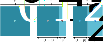

# Mutação

<br>

```{r neutraltheory, echo = FALSE, fig.align = 'center', out.width="600px", fig.cap="Os padrões de polimorfismo de proteínas vistos na natureza são consistentes com a visão de que a maioria dos polimorfismos e diferenças fixas entre as espécies são fortemente deletérios ou seletivamente neutros. Esta proposta foi chamada de teoria neutra da evolução molecular. Retirado de Casillas & Barbadilla ([2017](https://doi.org/10.1534/genetics.119.302623))"}
knitr::include_graphics('https://academic.oup.com/view-large/figure/326573189/1003fig2.jpeg')
```

<br>

:::reference

Kimura 1968. doi: [10.1038/217624a0](https://doi.org/10.1038/217624a0)

Ohta 1973. doi: [10.1038/246096a0](https://doi.org/10.1038/217624a0)

:::

<br>

A mutação é uma força evolutiva uma vez que promove uma mudança nas frequências gênicas ao longo do tempo. 

Por exemplo, considere uma população com de tamanho $N = 1000$ indivíduos, todos homozigotos em um locus gênico com o alelo $A$. 

Uma mutação que ocorra em um desses alelos, produzindo um único novo alelo $a$, mudará a frequência $p$ do alelo $A$ de uma geração $t$ para a outra $t+1$ , onde:

<br>

$$p_t = \frac{2N}{2N} = 1 $$

e

$$ p_{t+1} = \frac{2N-1}{2N} = 0.9995$$

<br>

Evidentemente, esta é uma mudança muito pequena, mas ainda assim é uma mudança evolutiva. 

<br>

A mutação é a fonte última de toda a variação genética, pois é ela que introduz novos alelos em uma população.

Embora a evolução não seja possível sem as mutações, a evolução não é simplesmente o acúmulo de mutações ao longo do tempo. 

A mutação, por si só, introduz novas variantes genéticas em uma população, o que não é possível de promover grandes mudanças gênicas ao longo do tempo evolutivo.

Outras forças evolutivas (_i. e._, seleção, deriva, e fluxo gênico) atuam sobre variantes mutantes, fazendo com que a mudança nas frequências alélicas seja mais expressiva. 

<br.

## Modelando as mutações

Modelos de mutação são caracterizações conceituais de como o processo de mutação resulta no desenvolvimento de novos estados alélicos. 

Neste ponto, não leva-se em conta as conseqüências de adaptabilidade dessas alterações. 

### Mutação direta

Considere o modelo mais simples de mutação, no qual um alelo $A$ em um dado locus tem a chance de se transformar em um alelo $a$ a cada geração. 

Esta é a única forma de mutação possível neste modelo (apenas um alelo mutante), e a mutação é irreversível (um alelo $a$ não pode sofrer mutação de volta para um alelo $A$). 

A chance desta mutação acontecer depende da taxa de mutação geracional $\mu$, onde:

<br>

$$ A \overset{\mu}{\rightarrow} a$$

<br>

Como a mutação é aleatória, essa taxa representa a probabilidade de mutação por locus por geração. Assim, embora o número real de mutações em qualquer geração possa variar em quantidade, a taxa de mutação é uma estimativa da probabilidade média de aparecimento de mutações durante longos períodos de tempo.

Logo, de uma geração $t_0$ para a outra $t_1$, assumindo que $f(A, t_0) = p_0$ e $ f(a, t_0) = q_0$, e $ f(A, t_1) = p_1$ e $ f(a, t_1) = q_1$,teremos:

<br>

$$ p_1 = p_0(1- \mu)$$ 

e

$$ q_1 = q_0 + p_0 \mu$$ 

Na segunda geração, se a taxa de mutação $\mu$ é constante, teremos que:

<br>

$$
\begin{aligned}
p_2
&= \color{red}{p_1}(1- \mu) \\
&= \color{red}{p_0(1- \mu)}(1- \mu) \\
&= p_0(1- \mu)^2 \\
&= p_0 - 2p_0\mu + p_0\mu^2
\end{aligned}
$$ 

e

$$
\begin{aligned}
q_2
&= \color{blue}{q_1} + \color{red}{p_1} \mu \\
&= \color{blue}{q_0 + p_0 \mu}+\color{red}{p_0(1- \mu)} \mu \\
&= \color{green}{q_0} + 2p_0\mu - p_0\mu^2 \\
&= \color{green}{1-p_0} + 2p_0\mu - p_0\mu^2 \\
&= 1 - \left( p_0 - 2p_0\mu + p_0\mu^2 \right) \\
&= 1 - p_2
\end{aligned}
$$ 

<br>

<br>

```{r mutation1way, echo = FALSE, fig.align = 'center', out.width="800px", fig.cap="NO modelo de mutação direta, a taxa de mutação geracional $μ$ promove o aumento do alelo $a$ em detrimento do alelo $A$."}

```

<br>

Assim, após $t$ gerações de mutações com taxa $\mu$, 

A frequencia $p_t$ do alelo $A$ será:

<br>

$$ p_t = p_0 \left( 1 - \mu \right)^t $$

<br>

E a frequencia $q_t$ do alelo $a$ será:

<br>

$$ q_t = 1 - p_t$$

<br>

```{r mutation1graph, echo = FALSE, warning = FALSE, fig.align = 'center', out.width = "600px", fig.cap="A mutação do alelo $A$ para o alelo $a$ promoverá uma mudança evolutiva cuja direção é a diminuiçãao da frequência alélica $p$ (e aumento da frequência alélica $q$) proporcionalmente à taxa de mutação $\mu$."} 
library("ggplot2")
  library("latex2exp")
ggplot(data.frame(x = c(0, 1000000)), aes(x = x)) + 
  stat_function(fun = function(x) 1*(1-0.0001)^x, color = "firebrick2", lwd = 1) +
  stat_function(fun = function(x) 1*(1-0.00001)^x, color = "chocolate", lwd = 1) +
  stat_function(fun = function(x) 1*(1-0.000001)^x, color = "royalblue3", lwd = 1) +
  stat_function(fun = function(x) 1*(1-0.0000001)^x, color = "deepskyblue3", lwd = 1) +
  stat_function(fun = function(x) 1*(1-0.00000001)^x, color = "green4", lwd = 1) +
  labs(x = "Geração", y = "Frequência do alelo A") + 
  xlim(0, 1000000) +
  ylim(0, 1) +
  annotate(geom='text', x=100000, y=0.10, parse = TRUE, color="firebrick2", label=TeX("$μ=10^{-4}")) +
  annotate(geom='text', x=250000, y=0.25, parse = TRUE, color="chocolate", label=TeX("$μ=10^{-5}$")) +
  annotate(geom='text', x=500000, y=0.70, parse = TRUE, color="royalblue3", label=TeX("$μ=10^{-6}")) +
  annotate(geom='text', x=800000, y=0.85, parse = TRUE, color="deepskyblue3", label=TeX("$μ=10^{-7}$")) +
  annotate(geom='text', x=950000, y=0.95, parse = TRUE, color="green4", label=TeX("$μ=10^{-8}$"))
```

<br>

### Mutaçao reversa

Sob um modelo de mutação reversível, além das mutações do alelo $A$ para a alelo $a$, também há a ocorrência de mutações que transformam o alelo $a$ de volta para o alelo $A$.

Desta forma, para que ocorra mudança nas frequências alélicas de uma geração para outra, é necessário que as taxas de mutação de um alelo para o outro sejam diferentes uma da outra (balanço mutacional diferente de zero).

Sendo $\mu$ a taxa de mutação do alelo $A$ para um alelo $a$, temos também agora a probabilidade de um alelo $a$ mutar para o alelo $A$, que irá depender de uma nova taxa de mutação $\nu$, de forma que:

<br>

$$A \mathrel{\mathop{\rightleftharpoons}^{\mathrm{\mu}}_{\mathrm{\nu}}} a$$

<br>

Logo, de uma geração $t_0$ para a outra $t_1$, assumindo que $f(A, t_0) = p_0$ e $ f(a, t_0) = q_0$, e $ f(A, t_1) = p_1$ e $ f(a, t_1) = q_1$,teremos:

br>

$$ p_1 = p_0(1- \mu) + q_o \nu$$ 

e

$$ q_1 = q_0(1- \nu) + p_0 \mu$$ 

<br>

Sendo 
$ p_0(1- \mu) $ e $ q_0(1- \nu) $ a proporção dos alelos $A$ e $a$ respectivamente que não sofreram mutação, e 
$ p_0 \mu $ e $ q_o \nu $ a proporção de alelos $A$ que, por mutação, viraram $a$, e vice-versa. 


<br>


```{r mutation2way, echo = FALSE, fig.align = 'center', out.width="600px", fig.cap="NO modelo de mutação reversa, as taxas de mutação geracional $μ$ e $\nu$ promovem o surgimento de novos alelos de ambos of tipos, cujo balanço dependerá dessas taxas e das frequências dos alelos naquela geração."}
knitr::include_graphics("figs/mutation_bidirectional.svg")
```

<br>

### Equilíbrio das taxas de mutação

<br>

Seja $\Delta p$ a mudança evolutiva na frequência $p$ do alelo $A$ de uma geração $t$ para a seguinte $t+1$, teremos que:

$$
\begin{aligned}
\Delta p
&= p_{t+1} - p_t \\
&= p_t(1- \mu) + q_t \nu - p_t \\
&= p_t - p_t \mu + q_t \nu - p_t \\
&= q_t \nu - p_t \mu
\end{aligned}
$$ 

Ou seja, no modelo de mutação reversa, a mudança evolutiva dependerá do balanço entre a proporção de alelos perdidos pela mutação direta (_e. g._, $ A \overset{\mu}{\rightarrow} a$) e de alelos criados pela mutação reversa (_e. g._, $ A \overset{\nu}{\leftarrow} a$).

A mudança evolutiva geracional na frequência do alelo $A$ pode ser determinada independentemente da frequência do alelo $a$ uma vez que $p+q=1$, de forma que:

<br>

$$
\begin{aligned}
\Delta p
&= p_{t+1} - p_t \\
&= p_t(1- \mu) + \color{red}{q_t} \nu - p_t \\
&= p_t(1- \mu) + \color{red}{(1-p_t)} \nu - p_t \\
&= p_t - p_t \mu + \nu - p_t \nu - p_t \\
&= \nu - p_t \mu + - p_t \nu \\
&= \nu - p_t (\mu + \nu)
\end{aligned}
$$ 

<br>

Desta forma, é possível verificar que a mudança evolutiva dependerá da magnitudade da taxa de mutação "criadora" do alelo e das taxas globais de mutação que atuam modificando a frequência daquele alelo.


Dada a magnitudade das taxa de mutação direta e reversa, $\mu$ e $\nu$, e das freqüências alélicas na população, é possível que haja um balanço nulo entre a quantidade de alelos "criados" e "destruídos" por mutação em uma geração, e assim, a frequência $p$ de um determinado alelo tenda a uma freqüência $\hat{p}$ de equilíbrio, onde:

<br>

$$ \hat{p} = p_{t+1} = p_t $$

<br>

Uma população que atinja tal equilíbrio entre o aparecimento de mutações diretas e reversas, para todos os efeitos, não mais sofrerá mudança nas frequências alélicas, uma vez que:

<br>

$$ \Delta \hat{p} = 0 $$

<br>

Assim, é possível estimar a frequência de equlíbrio $\hat{p}$ do alelo $A$, pois embora as frequências alélicas estejam em equilibrio, este é um equilíbrio dinâmico dado o balanço das taxas de mutação geracional, onde:

<br>

$$ \Delta \hat{p} = \nu - \hat{p} (\mu + \nu) $$


E desta forma, teremos que:

<br>


$$ \nu - \hat{p} (\mu + \nu) = 0 $$

$$\hat{p} (\mu + \nu) =  \nu $$

$$\hat{p}  =  \frac{\nu}{(\mu + \nu)} $$

<br>

Similarmente, a frequência de equlíbrio $\hat{q}$ do alelo $a$ será:

$$\hat{q}  =  \frac{\mu}{(\mu + \nu)} $$
<br>

Assim, no modelo de mutação reversa, a frequência de equlíbrio de um alelo será a razão entre a taxa de formação daquele alelo e a taxa global de mutação atuando sobre aquele alelo.

Note que $ \hat{p} \to 0$, quando $ \mu \gg \nu $.

Note também que, no equilíbrio:

<br>

$$ \Delta \hat{p} = 0 = \hat{q} \nu - \hat{p} \mu$$

Logo, as frequências alélicas de equilíbrio se manterão proporcionais às taxa relativas de mutação direta e reversa, de forma que:

<br>

$$ \hat{q} \nu - \hat{p} \mu = 0 $$

$$\hat{p} \mu =  \hat{q} \nu $$

$$\frac{\mu}{\nu} = \frac{\hat{q}}{\hat{p}} $$

<br>

E dado que $\hat{p} + \hat{q} = 1$ ...

- ... a frequência de equlíbrio $\hat{p}$ do alelo $A$ será:

<br>

$$\hat{p} + \color{red}{\hat{q}} = 1$$

$$\hat{p} + \color{red}{\frac{\hat{p}\mu}{\nu}} = 1$$

$$\hat{p} \left( 1 + \frac{\mu}{\nu} \right) = 1$$

$$\hat{p} = \frac{1}{\left( 1 + \frac{\mu}{\nu} \right)}$$
<br>


- ... e a frequência de equlíbrio $\hat{q}$ do alelo $a$ será:

<br>

$$\hat{q} + \color{red}{\hat{p}} = 1$$

$$\hat{q} + \color{red}{\frac{\hat{q}\nu}{\mu}} = 1$$

$$\hat{q} \left( 1 + \frac{\nu}{\mu} \right) = 1$$

$$\hat{q} = \frac{1}{\left( 1 + \frac{\nu}{\mu} \right)}$$
<br>

### Mutações ao longo do tempo

Após $t$ gerações de mutações reversíveis, com taxas $\mu$ e $\nu$, teremos que...

- ... a frequencia $p_t$ do alelo $A$ será:

<br>

$$ p_t = p_{t-1} \left( 1 - \mu \right) + \left( 1 - p_{t-1} \right) \nu$$

<br>

- ... a frequencia $q_t$ do alelo $a$ estimada apartir dessa, de forma que:

<br>

$$ q_t = 1 - p_t $$

<br>

Como a mudança evolutiva a cada geração dependerá do balanço entre as taxas formação de alelos dos dois tipos, uma função geral de que dependa somente das taxas de mutação e das frequências alélicas iniciais não é possível.

Contudo, na ausência de outras forças evolutivas, todas as populações sofrendo efeito de mutações reversíveis tenderão ao estado de equilíbrio.


Assim, sabendo o quanto falta para a população alcançar o equilíbrio, em termos da distância da freqüência alélica inicial da população da freqüência alélica de equilíbrio, e o quanto que as mutações conseguem ou não promover mudança evolutiva a cada geração, será possível estimar a frequência alélicas $p$ em qualquer geração $t$, de forma que:


<br>

$$ p_t = \frac{\nu}{(\mu + \nu)} + \left( p_0 - \frac{\nu}{(\mu + \nu)} \right) \left(1- \mu - \nu \right)^t$$

<br>

Onde 
$\frac{\nu}{(\mu + \nu)}$ é a frequência de equilíbrio $\hat{p}$, 
$p_0$ é a frequência alélica inicial, quando $t=0$, 
$1- \mu - \nu$ é a proporção de alélos que não sofre mudança evolutiva por mutação, e
$t$ é o tempo em número de gerações decorridas.

<br>

```{r mutation2graph, echo = FALSE, warning = FALSE, fig.align = 'center', out.width = "600px", fig.cap="Na ausência de outras forças evolutivas, todas as populações sofrendo efeito de mutações reversíveis tenderão a um estado de equilíbrio."} 
library("ggplot2")
library("latex2exp")
library("patchwork")
ggplot(data.frame(x = c(0, 50000)), aes(x = x)) + 
  stat_function(fun = function(x) ((0.00001/(0.0001+0.00001)) + (1 - (0.00001/(0.0001+0.00001)))*(1-0.0001-0.00001)^x), color = "firebrick2", lwd = 1) +
  stat_function(fun = function(x) ((0.00001/(0.0001+0.00001)) + (0.75 - (0.00001/(0.0001+0.00001)))*(1-0.0001-0.00001)^x), color = "chocolate", lwd = 1) +
  stat_function(fun = function(x) ((0.00001/(0.0001+0.00001)) + (0.5 - (0.00001/(0.0001+0.00001)))*(1-0.0001-0.00001)^x), color = "green4", lwd = 1) +
  stat_function(fun = function(x) ((0.00001/(0.0001+0.00001)) + (0.25 - (0.00001/(0.0001+0.00001)))*(1-0.0001-0.00001)^x), color = "deepskyblue3", lwd = 1) +
  stat_function(fun = function(x) ((0.00001/(0.0001+0.00001)) + (0 - (0.00001/(0.0001+0.00001)))*(1-0.0001-0.00001)^x), color = "royalblue3", lwd = 1) +
  labs(x = "Geração", y = "Frequência alélica") + 
  xlim(0, 50000) +
  ylim(0, 1) +
  annotate(geom='text', x=25000, y=1, parse = TRUE, color="black", label=TeX("$μ = 10^{-5} \\ e \\ ν = 10^{-4}$")) +
  ggplot(data.frame(x = c(0, 50000)), aes(x = x)) + 
  stat_function(fun = function(x) ((0.0001/(0.0001+0.00001)) + (1 - (0.0001/(0.0001+0.00001)))*(1-0.0001-0.00001)^x), color = "firebrick2", lwd = 1) +
  stat_function(fun = function(x) ((0.0001/(0.0001+0.00001)) + (0.75 - (0.0001/(0.0001+0.00001)))*(1-0.0001-0.00001)^x), color = "chocolate", lwd = 1) +
  stat_function(fun = function(x) ((0.0001/(0.0001+0.00001)) + (0.5 - (0.0001/(0.0001+0.00001)))*(1-0.0001-0.00001)^x), color = "green4", lwd = 1) +
  stat_function(fun = function(x) ((0.0001/(0.0001+0.00001)) + (0.25 - (0.0001/(0.0001+0.00001)))*(1-0.0001-0.00001)^x), color = "deepskyblue3", lwd = 1) +
  stat_function(fun = function(x) ((0.0001/(0.0001+0.00001)) + (0 - (0.0001/(0.0001+0.00001)))*(1-0.0001-0.00001)^x), color = "royalblue3", lwd = 1) +
  labs(x = "Geração", y = "Frequência alélica") + 
  xlim(0, 50000) +
  ylim(0, 1) +
  annotate(geom='text', x=25000, y=1, parse = TRUE, color="black", label=TeX("$μ = 10^{-4} \\ e \\ ν = 10^{-5}$"))
  
```

<br>

## Mutação e Endogamia

A endogamia será influenciada pelas taxas de mutação, uma vez que a mutação influenciará o nível de autozigosidade.

Se endogamia produzida de uma geração para outra é expressada como:

<br>

$$F_t = \frac{1}{2N_e} + \left( 1- \frac{1}{2N_e} \right)F_{t-1}$$

<br>

Com a ocorrência de mutações, o modelo de endogamia não será simétrico.

Assumindo que uma mutação irá alterar o estado dos alelos entregues para a próxima geração, com probabilidade $\mu$: 

- $(1 – \mu)$ -- é a chance de que um alelo qualquer em uma geração não ter sofrido mutação, e 

- $(1 – \mu)^2$ -- é a chance de que nenhum dos dois alelos combinados em uma fecundação tenha sofrido mutação nessa geração. 

<br>

Como somentes genótipos que não sofreram mutação podem produzir gametas autozigóticos, e portanto podem contribuir para o aumento da endogamia, podemos reformular a estimativa de endogamia esperada sob mutação, de forma que:


<br>

$$\hat{F} = \left[ \frac{1}{2N_e} + \left( 1- \frac{1}{2N_e} \right)\hat{F} \right] \left( 1-\mu \right)^2$$

<br>

Assim, enquanto o endocruzamento reduz a heterozigosidade, as mutações em populações endogâmicas irão promover o aumento da heterozigosidade, ao criar variantes alélicas _de novo_ em genótipos previamente homozigotos em sua maioria, proporcionalmente à taxa de mutação $\mu$. 

Ao longo do tempo, espera-se que seja alcançado um equilíbrio na endogamia, promovido pelo antagonismo entre o endocruzamento e as mutações.


```{r inbreedingmutation, echo = FALSE, warning = FALSE, fig.align = 'center', out.width = "600px", fig.cap="Uma vez que as mutações introduzem alelos novos na população, a probabilidade de encontro de alelos idênticos por descendência será menor nessas populações, e a endogamia ao longo das gerações irá crescer em uma taxa menor do que se não houvesse mutações."} 
## Dependências
library("ggplot2")
library("latex2exp")

## Parâmetros
T <- 1:100        ## Gerações
F <- 0            ## Coeficiente de endogamia inicial
mu <- 1/1000      ## Taxa de mutação
Ne <- 10          ## Tamanho efetivo da população
F0 <- rep(0,100)  ## Endogamia sem mutação
F1 <- rep(0,100)  ## Endogamia com mutação
IBD <- 1/(2*Ne)   ## Probabilidade de formação de autozigotos

## Modelo
for( t in 2:max(T)){
  F0[t] <- IBD + (1-IBD)*F0[t-1]
  F1[t] <- (IBD + (1-IBD)*F1[t-1]) * (1-mu)^2
}

## Gráfico
data1301 <- data.frame(T, F0, F1)
ggplot(data = data1301, aes(x = T)) +
  geom_line(aes(y = F0), color = "royalblue3", lwd = 1) +
  geom_line(aes(y = F1), color = "green4", lwd = 1) +
  labs(x = "Geração", y = "Coeficiente de endogamia") +
  xlim(0, 100) +
  ylim(0, 1) +
  annotate(geom='text', x=50, y=1, parse = TRUE, color="royalblue3", label=TeX("$μ = 0$")) +
  annotate(geom='text', x=50, y=0.8, parse = TRUE, color="green4", label=TeX("$μ = 10^{-4}$"))
```


Dada a expectativa de equilíbrio em relação à endogamia com base no tamanho efetivo da população ($N_e$) e na taxa de mutação ($\mu$) podemos verificar o nível de endogamia no equilíbrio ($\hat{F}$) como:

<br>

$$ \hat{F} = F_{t} = F_{t-1}$$

<br>

E assim, no equilíbrio:

<br>

$$ \Delta \hat{F} = 0$$
<br>

Assintoticamente à taxa de mutação $\mu$, _i. e._, assumindo que o valor de $\mu$ é pequeno o suficiente para que $\mu^2 \sim 0$, teremos que:

<br>

$$ (1 - \mu)^2 \sim 1-2\mu$$

<br>

E assim, após várias simplificações algébricas da equação anterior (veja [aqui][#Provas]), teremos que:

<br>

$$\hat{F} \sim  \frac{1-2\mu}{4N_e\mu+1-2\mu} $$

<br>

Desde que $2\mu \ll N_e\mu$ e $2\mu \ll 1$, teremos a relação aproximada:

<br>

$$\hat{F} \sim  \frac{1}{4N_e\mu+1} $$

<br>

Para organismos diplóides, $ 4N_e\mu = \theta$, que é a medida da **variação genética molecular**, e desta forma:

<br>

$$ \hat{F} \sim \frac{1}{1+\theta} $$

<br>

Como qualquer genótipo que não é homozigoto deve ser heterozigoto, a heterozigosidade no equilíbrio mutação-deriva ($\hat{H}$) pode ser definida como:

<br>

$$
\begin{aligned}
\hat{H}
&= 1 - \color{blue}{\hat{F}} \\
&= 1 - \color{blue}{\frac{1}{4N_e\mu+1}} \\
&= \frac{4N_e\mu}{4N_e\mu+1} \\
&= \frac{\theta}{\theta+1} 
\end{aligned}
$$ 

<br>

## Exercícios

### Exercício 1 -- Mudança evolutiva em $t$ gerações

Se partirmos de uma população sem mutações na qual $p_0 = 0.5$, quantas gerações $t$ são necessárias para alcançar $p_t = 0.4$, assumindo uma taxa de mutação direta $\mu = 10^{-6}$ e uma taxa de mutação reversa $\nu = 10^{-9}$.

:::quote

Você lembra como trabalhar com logaritmos?

Logaritmo do produto -- $ \log_\color{red}{a} \left( \color{blue}{b}\cdot \color{green}{c} \right) = \log_\color{red}{a} \left( \color{blue}{b} \right) + \log_\color{red}{a} \left( \color{green}{c} \right)$

Logaritmo do quociente -- $ \log_\color{red}{a} \left( \frac {\color{blue}{b}}{\color{green}{c}} \right) = \log_\color{red}{a} \left( \color{blue}{b} \right) - \log_\color{red}{a} \left( \color{green}{c} \right)$

Logaritmo da potência -- $ \log_\color{red}{a} \left( \color{blue}{b}^\color{green}{c} \right) = \color{green}{c} \cdot \log_\color{red}{a} \left( \color{blue}{b} \right) $

:::

### Exercício 2 -- Componente flagelar em _Salmonella_

A bacteria Salmonella enterica possui um mecanismo de controle genético que regula a produção de duas formas alternativas de um componente proteico do flagelo celular, controladas por dois alelos: $A$, para o componente flagelar de “fase específica”, e $a$, para o componente flagelar de “fase de grupo”. A mudança de $A \to a$ tem uma taxa de mutação de $\mu = 8.6 \times 10^{-4}$ por geração, e a mudança de $a \to A$ tem uma taxa de mutação $\nu = 4.7 \times 10^{-3}$ por geração. 

Note que essas taxas são ordens de magnitude maiores do que as taxas de mutação tipicamente observadas em outros genes. A razão é que as mudanças $A \leftrightharpoons a$ não resulta de uma mutação no sentido convencional, mas de uma recombinação intracromossômica, como demonstrado por Simon e colaboradores ([1980](https://doi.org/10.1126/science.6251543)). Em termos formais, entretanto, podemos tratar esse sistema como um que permite mutação reversível. 

Stocker ([1949](https://doi.org/10.1017/s002217240001473x)) estabeleceu culturas destas bactérias com frequências do alelo $A$ igual a $p_0 = 0$, e verificou que sua frequência aumentou para $p_{30} = 0.16$ e para $p_{700} = 0.85$. Quando cultivou bactérias com frequências do alelo $A$ igual a $p_0 = 1$, a frequência do alelo diminui para $p_{388} = 0.88$ e para $p_{700} = 0.86$. 

Com base nesses dados:

a. Calcule a frequência de equilíbrio $\hat{p}$ esperada para o alelo $A$.

b. O valores observados por Stocker ([1949](https://doi.org/10.1017/s002217240001473x)) concordam com os estimados a partir das taxas de mutações de Simon e colaboradores ([1980](https://doi.org/10.1126/science.6251543))? 


