# Seleção Natural

<br>

```{r aedesresistance, echo = FALSE, fig.align = 'center', out.width="600px", fig.cap="O controle químico do mosquito _Aedes aegypti_ vem dependendo principalmente de inseticidas piretróides, que interagem com o canal de sódio controlado por voltagem no sistema nervoso do animal. Mutações de substituição em sítios específicos da proteína conferem ao mosquito resistência ao inseticida, sendo estas conhecidas como mutações kdr (do inglês, _knockdown resistance_). Retirado de Linss et al ([2014](https://doi.org/10.1186/1756-3305-7-25)."}
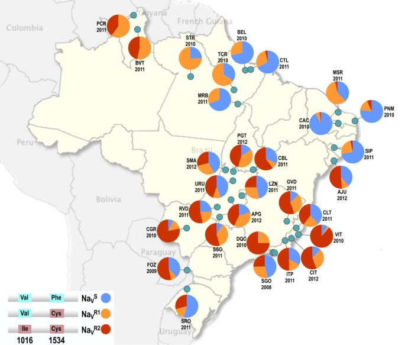
```

<br>

:::reference

Soderlund & Knipple 2003. doi: [10.1016/S0965-1748(03)00023-7](https://doi.org/10.1016/S0965-1748(03)00023-7)

Melo-Costa et al. 2020. doi: [10.1038/s41598-020-70029-7](https://doi.org/10.1038/s41598-020-70029-7)

:::

<br>

## Aptidão reprodutiva absoluta

Algumas diferenças podem melhorar as chances de um indivíduo sobreviver, se reproduzir e deixar mais descendes. Se os traços que dão a estes indivíduos uma vantagem adaptativa também são hereditários, estes serão passados dos genitores para os descendentes, o que levará a uma aptidão reprodutiva (ou _fitness_) diferencial. Mesmo que a vantagem adaptativa seja muito pequena, ao longo de muitas gerações, qualquer característica hereditária vantajosa tornar-se-á dominante na população.

<br>

```{r bettlesprey, echo = FALSE, fig.align = 'center', out.width="800px", fig.cap="Genótipos que conferem maior sucesso reprodutivo aos indivíduos tenderão a suplantar os de menor sucesso reprodutivo ao longo do tempo pelo mecanismo da seleção natural."}
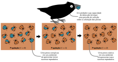
```

<br>

Ao modelar a seleção natural, a aptidão (ou _fitness_) reprodutiva de um genótipo se refere à sua contribuição para (ou a probabilidade de) sobrevivência ($l$), fecundidade e fecundabilidade ($m$), fertilidade ($n$) e viabilidade ($o$) dos indivíduos daquele genótipo.

<br>

```{r bettlescycle, echo = FALSE, fig.align = 'center', out.width="600px", fig.cap="."}
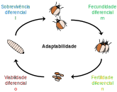
```

<br>

Se considerarmos o potencial efeito desses parâmetros no sucesso repodutivo de cada genótipo formado pelos alelos $1$ e $2$ em uma dada geração $t$, teremos:

<br>

| Genótipo | Número de\n indivíduos| Sobrevivência | Fecundidade | Fertilidade | Viabilidade | 
| :---: | :---: | :---: | :---: | :---: | :---: |
| $D(11)$ | $p^2N_t$ | $\color{blue}{l_{11}}$ | $\color{green}{m_{11}}$ | $\color{goldenrod}{n_{11}}$ | $\color{red}{o_{11}}$ |
| $H(12)$ | $2pqN_t$ | $\color{blue}{l_{12}}$ | $\color{green}{m_{12}}$ | $\color{goldenrod}{n_{12}}$ |$\color{red}{o_{12}}$ | 
| $R(22)$ | $q^2N_t$ | $\color{blue}{l_{22}}$ | $\color{green}{m_{22}}$ | $\color{goldenrod}{n_{22}}$ |$\color{red}{o_{22}}$ |

<br>

Assim, o número esperado de indivíduos de um determinado genótipo na próxima geração, dado o seu sucesso reprodutivo será...

... para o genótipo homozigoto dominante $D(11)$:

$$ D_{t+1} = p^2 N_t \color{blue}{l_{11}} \color{green}{m_{11}} \color{goldenrod}{n_{11}} \color{red}{o_{11}}$$

<br>

... para o genótipo heterozigoto $H(12)$:

$$ H_{t+1} = 2pq N_t \color{blue}{l_{12}} \color{green}{m_{12}} \color{goldenrod}{n_{12}} \color{red}{o_{12}}$$

<br>

... e para o genótipo homozigoto recessivo $R(22)$:

$$ R_{t+1} = q^2 N_t \color{blue}{l_{22}} \color{green}{m_{22}} \color{goldenrod}{n_{22}} \color{red}{o_{22}}$$

<br>

E desta forma, a resultante do produto dos parâmetros $l$, $m$, $n$ e $o$ corresponderá ao valor da aptidão reprodutiva absoluta ($W$) da cada genótipo, onde:

$$\color{blue}{l_{11} m_{11} n_{11} o_{11}} = \color{blue}{W_{11}}$$

$$ \color{green}{l_{12} m_{12} n_{12} o_{12}} = \color{green}{W_{12}}$$

$$ \color{red}{l_{22} m_{22} n_{22} o_{22}} = \color{red}{W_{22}}$$ 

<br>

## Aptidão reprodutiva relativa

As medidas de aptidão reprodutiva absoluta podem variar consideravelmente entre as diferentes linhagens evolutivas, sendo assim mais prático utilizar uma medida padronizada desses valores. 

Ao dividir a aptidão reprodutiva absoluta  de cada genótipo pela aptidão máxima observada entre todos os genótipos, convertemo-os assim em uma medida de aptidão reprodutiva relativa ($w$), definidos como:

<br>

$$\color{blue}{w_{11}}= \frac{\color{blue}{l_{11} m_{11} n_{11} o_{11}}}{\max\left(l_{ij} m_{ij} n_{ij} o_{ij} \right)} = \frac{ \color{blue}{W_{11}}}{W_{\max}}$$

<br>

$$\color{green}{w_{12}}= \frac{ \color{green}{l_{12} m_{12} n_{12} o_{12}}}{\max\left(l_{ij} m_{ij} n_{ij} o_{ij} \right)} = \frac{ \color{green}{W_{12}}}{W_{\max}}$$

<br>

$$\color{red}{w_{22}}= \frac{ \color{red}{l_{22} m_{22} n_{22} o_{22}}}{\max\left(l_{ij} m_{ij} n_{ij} o_{ij} \right)} = \frac{ \color{red}{W_{22}}}{W_{\max}}$$

<br>

## Modelando uma geração de seleção

Dada aptidão reprodutiva relativa de cada genótipo e a expectitiva de cruzamento ao acaso do princípio de Hardy-Weinberg, podemos definir a expectativa das frequências genotípicas após uma geração de seleção natural geração como sendo ... 

... para o alelo $1$:  

$$ 
\begin{aligned}
p_{t+1} 
&= \frac{p^2 N_t \color{blue}{w_{11}} + pq N_t \color{green}{w_{12}}}{p^2 N_t \color{blue}{w_{11}} + 2pq N_t \color{green}{w_{12}} + q^2 N_t \color{red}{w_{22}}} \\
\\
&= \frac{N_t \left( p^2 \color{blue}{w_{11}} + pq \color{green}{w_{12}} \right)}{N_t \left( p^2 \color{blue}{w_{11}} + 2pq \color{green}{w_{12}} + q^2 \color{red}{w_{22}}\right)} \\
\\
&= \frac{p^2 \color{blue}{w_{11}} + pq \color{green}{w_{12}}}{p^2 \color{blue}{w_{11}} + 2pq \color{green}{w_{12}} + q^2 \color{red}{w_{22}}}
\end{aligned}
$$
<br>

... e para o alelo $2$:  

$$ 
\begin{aligned}
q_{t+1} 
&= \frac{q^2 N_t \color{red}{w_{22}} + pq N_t \color{green}{w_{12}}}{p^2 N_t \color{blue}{w_{11}} + 2pq N_t \color{green}{w_{12}} + q^2 N_t \color{red}{w_{22}}} \\
\\
&= \frac{N_t \left( q^2 \color{red}{w_{22}} + pq \color{green}{w_{12}} \right)}{N_t \left( p^2 \color{blue}{w_{11}} + 2pq \color{green}{w_{12}} + q^2 \color{red}{w_{22}}\right)} \\
\\
&= \frac{q^2 \color{red}{w_{22}} + pq \color{green}{w_{12}}}{p^2 \color{blue}{w_{11}} + 2pq \color{green}{w_{12}} + q^2 \color{red}{w_{22}}}
\end{aligned}
$$

<br>

Assim, cada genótipo irá contribuir com genes para a próxima geração ponderadamente a sua aptidão reprodutiva relativa, e a soma da contribuição ponderada de todos os genótipos é definida como a aptidão reprodutiva média
da população ($\bar{w}$), de forma que:

<br>

$$\bar{w} = p^2 w_{11} + 2pq w_{12} +  q^2 w_{22}$$


<br>

Perceba que $\bar{w}$ irá diferir da proporção total da população antes da seleção toda vez que ($w<1$) para qualquer um dos genótipos, e a diferença entre esse total inicial e a aptidão reprodutiva média ($1 - \bar{w}$) irá refletir a parcela da população que foi eliminada pela seleção. 

<br>

Desta forma, para cada genótipo, temos:

<br>

| Parâmetro | $D(11)$ | $H(12)$ | $R(22)$ | Total | 
| :--- | :---: | :---: | :---: | :---: | 
| Aptidão \n reprodutiva relativa | $w_{11}$ | $w_{12}$ | $w_{22}$ | $-$ |
| Frequência ($t$) | $p^2$ | $2pq$ | $q^2$ | $1$ | 
| Contribuição ponderada | $p^2 \cdot w_{11}$ | $2pq \cdot w_{12}$ | $q^2 \cdot w_{22}$ | $\bar{w}$ |
| Frequência ($t+1$) | $\frac{p^2 \cdot w_{11}}{\bar{w}}$ | $\frac{2pq \cdot w_{12}}{\bar{w}}$ | $\frac{q^2 \cdot w_{22}}{\bar{w}}$ | $1$ |

<br>

Ao padronizar as contribuições genotípicas dos indivíduos, pode-se estimar as freqüências alélicas para a próxima geração como:

<br>

$$p_{t+1} = \frac{p^2 w_{11} + pq w_{12}}{\bar{w}}$$

<br>

$$q_{t+1} = \frac{q^2 w_{22} + pq w_{12}}{\bar{w}}$$

<br>

Assim, a cada geração de seleção natural, é necessário estimar a contribuição ponderada de cada genótipo para a geração seguinte, que dependerá das frequências alélicas que seguem evoluindo ao longo das gerações. E como a aptidão reprodutiva média da população, que relativiza as frequências alélicas após uma geração de seleção, também irá mudar de geração para geração, um modelo geral para estimar as frequências alélicas em uma dada geração $t$ não é possível de ser estabelecido.

Contudo essa modelagem da seleção natural de uma geração para a outra pode ser repetido passo-a-passo por várias gerações, algoritmo esse que é facilmente calculado em uma planilha eletrônica (ver [aqui](link para a planilha)).

<br>

Modelos de seleção natural são melhor compreendidos usando uma medida conhecida como coeficiente de seleção ($s$), que é o oposto de aptidão ($w$).

Como a aptidão reprodutiva representa o sucesso reprodutivo de um genótipo, enquanto que o coeficiente de seleção corresponde a parcela dos indivíduos que não sobreviveram ou se reproduziram.

O valores de $w$ e $s$ podem também ser interpretados como:

<br>

- a probabilidade de um indivíduo de um dado genótipo de sobreviver e se reproduzir, ou de ser eliminado por seleção; ou

<br>

- a proporção dos alelos que serão passados para a próxima geração, ou que serão removidos do _pool_ gênico por seleção.

As duas medidas estão relacionadas, de forma que:

<br>

$$w+s=1$$
<br>

Assim, a aptidão reprodutiva pode ser expressa em função do coeficiente de seleção, onde:

<br>

$$w=1-s$$
<br>

## Tipos de de seleção gênica

<br>

```{r HbS, echo = FALSE, fig.align = 'center', out.width="600px", fig.cap="Hemácias com traços falcêmicos, promovidos pelo alelo HbS da cadeia da beta-globina, apresentam maior resistência à infecções por malária. Este é um polimorfismo balanceado, no qual a seleção natural favorece uma frequência de alelo intermediária devido a um equilíbrio estável de contribuições de aptidão positivas (resistência a malária) e negativas (anemia) para os excessos médios dos alelos polimórficos."}
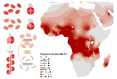
```

<br>

:::reference

Grosse et al 2011. doi: [10.1016/j.amepre.2011.09.013](https://doi.org/10.1016/j.amepre.2011.09.013)

Elguero et al 2015. doi: [10.1073/pnas.1505665112](https://doi.org/10.1073/pnas.1505665112)

Kato et al 2018. doi: [10.1038/nrdp.2018.10](https://doi.org/10.1038/nrdp.2018.10)

:::

<br>


A depender da aptidão relativa de cada genótipo, quatro tipos de seleção gênica poderão ocorrer:

- [Seleção contra o recessivo][]

- [Seleção a favor do dominante][]

- [Seleção a favor do heterozigoto][]

- [Seleção contra o heterozigoto][]

Perceba que, independentemente dos genótipos favorecidos ou desvantajosos, a seleção natural irá promover o aumento da aptidão reprodutiva média da população, e com o passar das gerações, $\bar{w} \to 1$.

<br>

### Seleção contra o recessivo 

Também chamada de **seleção negativa** ou **seleção purificadora**, esse tipo de seleção elimina
polimorfismos deletérios (tipicamente recessivos).

Neste tipo de seleção, a aptidão dos genótipos é expressa como:

$$ \color{green}{w_{11} = w_{12} = 1}$$

$$ \color{red}{w_{22} = 1-s}$$


Em uma grande parte dos casos, envolve alelos letais ou estéreis ($s=1$).

Casos de forte seleção negativa produzem uma diminuição no nível de variação em torno do locus sob seleção. A eliminação incidental de alelos não deletérios devido a ligação genética com alelos deletérios é chamada
de seleção de fundo (do inglês, _backgound selection_; Charlesworth et al [1993](https://doi.org/10.1093/genetics/134.4.1289); Charlesworth [2012](https://doi.org/10.1534/genetics.111.134288), [2013](https://doi.org/10.1093/jhered/ess136)).

Na seleção contra o recessivo:

- a frequência  do alelo recessivo ($q$) diminui rapidamente nas primeiras gerações de seleção, e com o tempo, $q \to 0$.

- a quantidade de mudança evolutiva ($\Delta q$) é negativa ao longo das gerações, porque a frequência alélica $q$ está diminuindo, e com o tempo, ($\Delta q \to 0$); e

- a aptidão média $\bar{w}$ da população aumenta a cada geração, e com o tempo, $\bar{w} \to 1$.

<br>

```{r negativeselection, echo = FALSE, warning = FALSE, fig.align = 'center', out.width = "800px", fig.cap="A frequência  do alelo recessivo (esquerda), a quantidade de mudança evolutiva (centro) e a aptidão média (direita) na seleção contra o recessivo."} 
## Dependências
library("ggplot2")
library("latex2exp")
library("patchwork")

## Parâmetros
T <- 1:50           ## Gerações
q <- 0.5            ## Frequência inicial do alelo recessivo
w11 <- 1            ## aptidão do genótipo homozigoto dominante
w12 <- 1            ## aptidão do genótipo heterozigoto
w22 <- 0.5          ## aptidão do genótipo homozigoto recessivo
q0 <- rep(0.5,50)   ## Frequência do alelo recessivo ao longo das gerações
Dq <- rep(q0[2]-q0[1],49)   ## A mudança evolutiva ao longo das gerações
wbar <- rep(w11*(1-q0[1])^2 + w12*2*(q0[1]*(1-q0[1])) + w22*q0[1]^2,50)   ## A aptidão média ao longo das gerações

## Modelos
for( t in 2:max(T)){
  q0[t] <- ( w22*q0[t-1]^2 + w12*(q0[t-1]*(1-q0[t-1])) ) / ( w11*(1-q0[t-1])^2 + w12*2*(q0[t-1]*(1-q0[t-1])) + w22*q0[t-1]^2 )
}

Dq[T] <- q0[T+1] - q0[T]

wbar[T] <- w11*(1-q0[T])^2 + w12*2*(q0[T]*(1-q0[T])) + w22*q0[T]^2


## Gráficos
data1401 <- data.frame(T, q0, Dq, wbar)
ggplot(data = data1401, aes(x = T)) +
  geom_line(aes(y = q0), color = "royalblue3", lwd = 1) +
  labs(x = "Geração", y = "Frequência do alelo recessivo") +
  xlim(0, 50) +
  ylim(0, 0.5) +
  annotate(geom='text', x=25, y=0.5, parse = TRUE, color="green4", label=TeX("$ w_{11} = w_{12} = 1$")) +
  annotate(geom='text', x=25, y=0.45, parse = TRUE, color="firebrick2", label=TeX("$w_{22} = 0.5$")) +
ggplot(data = data1401, aes(x = T)) +
  geom_line(aes(y = Dq), color = "deepskyblue3", lwd = 1) +
  labs(x = "Geração", y = "Mudança evolutiva") +
  xlim(0, 50) +
  ylim(-0.08, 0) +
ggplot(data = data1401, aes(x = T)) +
  geom_line(aes(y = wbar), color = "goldenrod", lwd = 1) +
  labs(x = "Geração", y = "Aptidão média") +
  xlim(0, 50) +
  ylim(0.85, 1)
```

<br>

### Seleção a favor do dominante

Também chamada de **seleção positiva** ou **seleção direcional**, esse tipo de seleção favorece o
aumento de um determinado alelo na população (tipicamente dominante ou co-dominante).

Neste tipo de seleção, a aptidão relativa dos genótipos pode ser expressa como:

$$ \color{green}{w_{11} = 1}$$

$$ \color{goldenrod}{w_{12} = 1-hs}$$

$$ \color{red}{w_{22} = 1-s}$$

onde $h$ é o grau de dominância entre os alelos, de forma que o alelo $1$ será dominante quando $h=0$, o alelo $2$ será dominante quando $h=1$, e os alelos serão codominantes para todo $0<h<1$.

Perceba que em um locus gênico bialélico com dominãncia completa, a seleção contra o recessivo e a seleção a favor do dominante levarão praticamente ao mesmo tipo de seleção; contudo, em um locus multialélico, a seleção a favor do dominante irá favorecer um determinado alelo em detrimento de outros alelos dominantes e/ou codominantes, fazendo que a a frequência alélica mude em direção ao aumento daquele alelo mais vantajoso.

O aumento da frequência de alelos vantajosos arrasta com ele polimorfismos neutros que estão em regiões gênicas ligadas, promovendo um tipo especial de seleção de fundo conhecido como **carona genética** (do inglês, _genetic hitchhiking_; [Maynard-Smith & Haigh 1974](https://doi.org/10.1017/S0016672300014634), [Gillespie 2000](https://doi.org/10.1093/genetics/155.2.909)).

Casos de forte ou rápida seleção positiva são conhecidos como **varredura seletiva** (do inglês, _selective sweep_; ver também [Hermisson & Pennings 2005](https://doi.org/10.1534/genetics.104.036947) e [Pennings & Hermisson 2006](https://doi.org/10.1093/molbev/msj117)).

Assim, na seleção a favor do dominante:

- a frequência  do alelo dominante ($p$) aumenta rapidamente nas primeiras gerações de seleção, e com o tempo, $p \to 1$.

- a quantidade de mudança evolutiva ($\Delta p$) é positiva ao longo das gerações, porque a frequência alélica $p$ está aumentando, mas com o tempo, ($\Delta p \to 0$); e

- a aptidão relativa média $\bar{w}$ da população aumenta a cada geração, de forma que $\bar{w} \to 1$.

<br>

```{r positiveselection, echo = FALSE, warning = FALSE, fig.align = 'center', out.width = "800px", fig.cap="A frequência  do alelo dominate (esquerda), a quantidade de mudança evolutiva (centro) e a aptidão relativa média (direita) na seleção a favor do dominante."} 
## Dependências
library("ggplot2")
library("latex2exp")
library("patchwork")

## Parâmetros
T <- 1:50           ## Gerações
p <- 0.5            ## Frequência inicial do alelo dominante
w11 <- 1            ## Aptidão do genótipo homozigoto dominante
w12 <- 0.75         ## Aptidão do genótipo heterozigoto
w22 <- 0.5          ## Aptidão do genótipo homozigoto recessivo
p0 <- rep(0.5,50)   ## Frequência do alelo recessivo ao longo das gerações
Dp <- rep(p0[2]-p0[1],49)   ## A mudança evolutiva ao longo das gerações
wbar <- rep(w11*p0[1]^2 + w12*2*p0[1]*(1-p0[1]) + w22*(1-p0[1])^2,50)   ## A aptidão média ao longo das gerações

## Modelos
for( t in 2:max(T)){
  p0[t] <- ( w11*p0[t-1]^2 + w12*(p0[t-1]*(1-p0[t-1])) ) / ( w11*p0[t-1]^2 + w12*2*p0[t-1]*(1-p0[t-1]) + w22*(1-p0[t-1])^2)
}

Dp[T] <- p0[T+1] - p0[T]

wbar[T] <- w11*p0[T]^2 + w12*2*p0[T]*(1-p0[T]) + w22*(1-p0[T])^2


## Gráficos
data1402 <- data.frame(T, p0, Dq, wbar)
ggplot(data = data1402, aes(x = T)) +
  geom_line(aes(y = p0), color = "royalblue3", lwd = 1) +
  labs(x = "Geração", y = "Frequência do alelo dominante") +
  xlim(0, 50) +
  ylim(0.5, 1) +
  annotate(geom='text', x=25, y=0.60, parse = TRUE, color="green4", label=TeX("$ w_{11} = 1$")) +
  annotate(geom='text', x=25, y=0.55, parse = TRUE, color="goldenrod", label=TeX("$w_{12} = 0.75$")) +
  annotate(geom='text', x=25, y=0.50, parse = TRUE, color="firebrick2", label=TeX("$w_{22} = 0.5$")) +
ggplot(data = data1401, aes(x = T)) +
  geom_line(aes(y = Dp), color = "deepskyblue3", lwd = 1) +
  labs(x = "Geração", y = "Mudança evolutiva") +
  xlim(0, 50) +
  ylim(0, 0.08) +
ggplot(data = data1401, aes(x = T)) +
  geom_line(aes(y = wbar), color = "goldenrod", lwd = 1) +
  labs(x = "Geração", y = "Aptidão relativa média") +
  xlim(0, 50) +
  ylim(0.85, 1)
```

<br>


<br>

### Seleção a favor do heterozigoto 

Também chamada de **sobredominância**, ocorre quando heterozigotos têm uma aptidão maior do que os
homozigotos, de forma que a aptidão relativa dos genótipos sejam:

$$ \color{red}{w_{11} = 1-s_1}$$

$$ \color{green}{w_{12} = 1}$$

$$ \color{red}{w_{22} = 1-s_2}$$

Este processo promove a conservação de polimorfismos genéticos, impedindo que alelos sejam perdidos por deriva genética, sendo assim um processo de **seleção balanceadora** (do inglês, _balancing selection_) que leva a um equilíbrio estável das frequências alélicas.

A vantagem do heterozigoto é o principal mecanismo subjacente da **heterose** (do inglês, _heterosis_), ou "vigor híbrido", que é a função melhorada ou aumentada de qualquer qualidade biológica em uma prole híbrida, geralmente por conta do o mascaramento de alelos recessivos deletérios em linhagens puras ou isoladas.

<br>

```{r overdominance, echo = FALSE, warning = FALSE, fig.align = 'center', out.width = "800px", fig.cap="A frequência  do alelo dominante na seleção a favor do heterozigoto, mostrando o processo de seleção balanceadora estável."} 
## Dependências
library("ggplot2")
library("latex2exp")
library("patchwork")

## Parâmetros
T <- 1:50           ## Gerações
p <- 0.5            ## Frequência inicial do alelo dominante
w11 <- 0.75         ## Aptidão relativa do genótipo homozigoto dominante
w12 <- 1            ## Aptidão relativa do genótipo heterozigoto
w22 <- 0.75         ## Aptidão relativa do genótipo homozigoto recessivo
p0 <- rep(0.95,50)  ## Frequência do alelo dominante ao longo das gerações
p1 <- rep(0.75,50)  ## Frequência do alelo dominante ao longo das gerações
p2 <- rep(0.55,50)  ## Frequência do alelo dominante ao longo das gerações
p3 <- rep(0.45,50)  ## Frequência do alelo dominante ao longo das gerações
p4 <- rep(0.25,50)  ## Frequência do alelo dominante ao longo das gerações
p5 <- rep(0.05,50)  ## Frequência do alelo dominante ao longo das gerações

Dp <- rep(p0[2]-p0[1],49)   ## A mudança evolutiva ao longo das gerações
wbar <- rep(w11*p0[1]^2 + w12*2*p0[1]*(1-p0[1]) + w22*(1-p0[1])^2,50)   ## A aptidão relativa média ao longo das gerações

## Modelos
for( t in 2:max(T)){
  p0[t] <- ( w11*p0[t-1]^2 + w12*(p0[t-1]*(1-p0[t-1])) ) / ( w11*p0[t-1]^2 + w12*2*p0[t-1]*(1-p0[t-1]) + w22*(1-p0[t-1])^2)
  p1[t] <- ( w11*p1[t-1]^2 + w12*(p1[t-1]*(1-p1[t-1])) ) / ( w11*p1[t-1]^2 + w12*2*p1[t-1]*(1-p1[t-1]) + w22*(1-p1[t-1])^2)
  p2[t] <- ( w11*p2[t-1]^2 + w12*(p2[t-1]*(1-p2[t-1])) ) / ( w11*p2[t-1]^2 + w12*2*p2[t-1]*(1-p2[t-1]) + w22*(1-p2[t-1])^2)
  p3[t] <- ( w11*p3[t-1]^2 + w12*(p3[t-1]*(1-p3[t-1])) ) / ( w11*p3[t-1]^2 + w12*2*p3[t-1]*(1-p3[t-1]) + w22*(1-p3[t-1])^2)
  p4[t] <- ( w11*p4[t-1]^2 + w12*(p4[t-1]*(1-p4[t-1])) ) / ( w11*p4[t-1]^2 + w12*2*p4[t-1]*(1-p4[t-1]) + w22*(1-p4[t-1])^2)
  p5[t] <- ( w11*p5[t-1]^2 + w12*(p5[t-1]*(1-p5[t-1])) ) / ( w11*p5[t-1]^2 + w12*2*p5[t-1]*(1-p5[t-1]) + w22*(1-p5[t-1])^2)
}

## Gráficos
data1403 <- data.frame(T, p0, p1, p2, p3)
ggplot(data = data1403, aes(x = T)) +
  geom_line(aes(y = p0), color = "royalblue3", lwd = 1) +
  geom_line(aes(y = p1), color = "deepskyblue3", lwd = 1) +
  geom_line(aes(y = p2), color = "green4", lwd = 1) +
  geom_line(aes(y = p3), color = "goldenrod", lwd = 1) +
  geom_line(aes(y = p4), color = "chocolate", lwd = 1) +
  geom_line(aes(y = p5), color = "firebrick2", lwd = 1) +
  labs(x = "Geração", y = "Frequência do alelo dominante") +
  xlim(0, 50) +
  ylim(0, 1) +
  annotate(geom='text', x=25, y=1, parse = TRUE, color="firebrick2", label=TeX("$ w_{11} = w_{22} = 0.75$")) +
  annotate(geom='text', x=25, y=0.9, parse = TRUE, color="green4", label=TeX("$w_{12} = 1$"))
```

<br>

### Seleção contra o heterozigoto 

Também chamada de **subdominância**, ocorre quando heterozigotos têm uma aptidão menor do que os
homozigotos, de forma que a aptidão dos genótipos sejam, por exemplo:

$$ \color{green}{w_{11} = 1}$$

$$ \color{red}{w_{12} = 1-s}$$

$$ \color{green}{w_{22} = 1}$$

Esse tipo de seleção também promove seleção balanceadora, mas que resulta em um equilíbrio instável das frequências alélicas.

Envolve muitas vezes polimorfismos adaptados a condições locais de diferentes subpopulações, e desta froma, hidridos, ao apresentar fenótipos intermediários, irão ter menor aptidão nos ambientes dos parentais. 

O acúmulo dessas incompatibilidades ao longo do tempo pode levar à especiação, como previsto pelo modelo Bateson–Dobzhansky–Muller de isolamento pós-zigótico ([Orr 1996](https://doi.org/10.1093/genetics/144.4.1331)).

<br>

```{r underdominance, echo = FALSE, warning = FALSE, fig.align = 'center', out.width = "800px", fig.cap="A frequência  do alelo dominante na seleção contra o heterozigoto, mostrando o processo de seleção balanceadora instável."} 
## Dependências
library("ggplot2")
library("latex2exp")
library("patchwork")

## Parâmetros
T <- 1:50           ## Gerações
p <- 0.5            ## Frequência inicial do alelo dominante
w11 <- 1            ## Aptidão relativa do genótipo homozigoto dominante
w12 <- 0.75         ## Aptidão relativa do genótipo heterozigoto
w22 <- 1            ## Aptidão relativa do genótipo homozigoto recessivo
p0 <- rep(0.95,50)  ## Frequência do alelo dominante ao longo das gerações
p1 <- rep(0.75,50)  ## Frequência do alelo dominante ao longo das gerações
p2 <- rep(0.55,50)  ## Frequência do alelo dominante ao longo das gerações
p3 <- rep(0.45,50)  ## Frequência do alelo dominante ao longo das gerações
p4 <- rep(0.25,50)  ## Frequência do alelo dominante ao longo das gerações
p5 <- rep(0.05,50)  ## Frequência do alelo dominante ao longo das gerações

Dp <- rep(p0[2]-p0[1],49)   ## A mudança evolutiva ao longo das gerações
wbar <- rep(w11*p0[1]^2 + w12*2*p0[1]*(1-p0[1]) + w22*(1-p0[1])^2,50)   ## A aptidão relativa média ao longo das gerações

## Modelos
for( t in 2:max(T)){
  p0[t] <- ( w11*p0[t-1]^2 + w12*(p0[t-1]*(1-p0[t-1])) ) / ( w11*p0[t-1]^2 + w12*2*p0[t-1]*(1-p0[t-1]) + w22*(1-p0[t-1])^2)
  p1[t] <- ( w11*p1[t-1]^2 + w12*(p1[t-1]*(1-p1[t-1])) ) / ( w11*p1[t-1]^2 + w12*2*p1[t-1]*(1-p1[t-1]) + w22*(1-p1[t-1])^2)
  p2[t] <- ( w11*p2[t-1]^2 + w12*(p2[t-1]*(1-p2[t-1])) ) / ( w11*p2[t-1]^2 + w12*2*p2[t-1]*(1-p2[t-1]) + w22*(1-p2[t-1])^2)
  p3[t] <- ( w11*p3[t-1]^2 + w12*(p3[t-1]*(1-p3[t-1])) ) / ( w11*p3[t-1]^2 + w12*2*p3[t-1]*(1-p3[t-1]) + w22*(1-p3[t-1])^2)
  p4[t] <- ( w11*p4[t-1]^2 + w12*(p4[t-1]*(1-p4[t-1])) ) / ( w11*p4[t-1]^2 + w12*2*p4[t-1]*(1-p4[t-1]) + w22*(1-p4[t-1])^2)
  p5[t] <- ( w11*p5[t-1]^2 + w12*(p5[t-1]*(1-p5[t-1])) ) / ( w11*p5[t-1]^2 + w12*2*p5[t-1]*(1-p5[t-1]) + w22*(1-p5[t-1])^2)
}

## Gráficos
data1404 <- data.frame(T, p0, p1, p2, p3)
ggplot(data = data1404, aes(x = T)) +
  geom_line(aes(y = p0), color = "royalblue3", lwd = 1) +
  geom_line(aes(y = p1), color = "deepskyblue3", lwd = 1) +
  geom_line(aes(y = p2), color = "green4", lwd = 1) +
  geom_line(aes(y = p3), color = "goldenrod", lwd = 1) +
  geom_line(aes(y = p4), color = "chocolate", lwd = 1) +
  geom_line(aes(y = p5), color = "firebrick2", lwd = 1) +
  labs(x = "Geração", y = "Frequência do alelo dominante") +
  xlim(0, 50) +
  ylim(0, 1) +
  annotate(geom='text', x=25, y=0.55, parse = TRUE, color="firebrick2", label=TeX("$ w_{11} = w_{22} = 0.75$")) +
  annotate(geom='text', x=25, y=0.45, parse = TRUE, color="green4", label=TeX("$w_{12} = 1$"))
```

<br>

:::reference 

Bateson 1909. doi: [10.1017/CBO9780511693953.007](https://doi.org/10.1017/CBO9780511693953.007)

Dobzhansky 1934. doi: [10.1007/BF00374056](https://doi.org/10.1007/BF00374056)

Muller 1942. [Biology Symposium 6, 71–125](https://www.ucl.ac.uk/taxome/lit/muller%201942%20new%20enh.pdf)

:::


## Seleção em organismos haplóides

<br>

```{r inhibitionhalo, echo = FALSE, fig.align = 'center', out.width="800px", fig.cap="A antibioticoterapia apropriada requer a identificação do agente causador da infecção e seu perfil de resistência. No teste de disco difusão para Staphylococcus aureus, a ausência de uma  zona de inibição de crescimento em torno do disco de ampicilina (AM) indica resistência ao antibiótico. No PCR em tempo real, a cepa resistente de Acinetobacter baumannii apresenta maior número de cópias de seus genomas."}
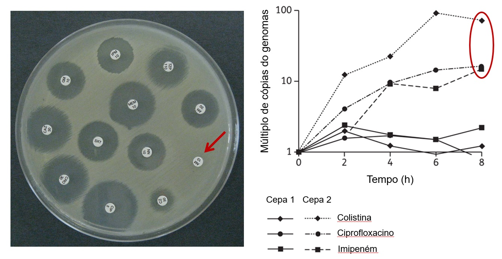
```

<br>

:::reference

Tenover 2009. doi: [10.1016/b978-012373944-5.00239-x](https://doi.org/10.1016/b978-012373944-5.00239-x)

Pulido et al. 2013. doi: [10.1093/jac/dkt253](https://doi.org/10.1093/jac/dkt253)

:::

<br>

Considere um microorganismo de reprodução assexuada, sem sobreposição de gerações, com um locus gênico com dois genótipos $\color{#2c89a0}{A}$ e $\color{#2ca05a}{B}$. Uma vez que são organismos haplóides, as frequências genotípicas e alélicas são iguais, de forma que:


$$f(\color{#2c89a0}{A}) = p $$


$$f(\color{#2ca05a}{B}) = q $$

Se na geração inicial ($t=0$) a frequência dos dois genótipos são iguais ($p = q = 0.5$), eventos reprodutivos irão promover o nascimento ($N$) de novos alelos na população, enquanto que a falha em sobreviver ao ambiente irá levar a morte ($M$) desses alelos. 

<br>

```{r haplobirthdeath, echo = FALSE, fig.align = 'center', out.width="600px", fig.cap="Alelos surgem com o nascimento (reprodução) e desaparecem com a morte (sobrevivência) dos organismos haplóides."}
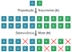
```

<br>

Assim, 


<table border="0">
 <tr>
    <td>$$\color{#2c89a0}{N_A} = 10$$</td>
    <td>$$\color{#2ca05a}{N_B} = 10$$</td>
 </tr>
</table>


<table border="0">
 <tr>
    <td>$$\color{#2c89a0}{M_A} = 1$$</td>
    <td>$$\color{#2ca05a}{M_B} = 4$$</td>
 </tr>
</table>

<br>


Desa forma, temos que a aptidão absoluta $W$ dos genótipos $\color{#2c89a0}{A}$ e $\color{#2ca05a}{B}$ será a proporção de sobreviventes, ou não-mortos ($N-M$), e nascimentos ($N$), sendo:

<table border="0">
 <tr>
    <td>$$
    \begin{aligned}
    \color{#2c89a0}{W_A} 
    &= \frac{\color{#2c89a0}{N_A}-\color{#2c89a0}{M_A}}{\color{#2c89a0}{N_A}} \\
    &= \frac{10-1}{10} \\
    &= \frac{9}{10} \\
    &= 0.9
    \end{aligned}
    $$</td>
    <td>$$
    \begin{aligned}
    \color{#2ca05a}{W_B} 
    &= \frac{\color{#2ca05a}{N_B}-\color{#2ca05a}{M_B}}{\color{#2ca05a}{N_B}} \\
    &= \frac{10-4}{10} \\
    &= \frac{6}{10} \\
    &= 0.6
    \end{aligned}
    $$</td>
 </tr>
</table>

<br>


E assim podemos obter a aptidão relativa $w$...


<table border="0">
 <tr>
    <td>$$
    \begin{aligned}
    \color{#2c89a0}{w_A} 
    &= \frac{\color{#2c89a0}{W_A}}{W_{max}} \\
    &= \frac{\color{#2c89a0}{W_A}}{\color{#2c89a0}{W_A}} \\
    &= \frac{0.9}{0.9} \\
    &= 1
    \end{aligned}
    $$</td>
    <td>$$
    \begin{aligned}
    \color{#2ca05a}{w_B} 
    &= \frac{\color{#2ca05a}{W_B}}{W_{max}} \\
    &= \frac{\color{#2ca05a}{W_B}}{\color{#2c89a0}{W_A}} \\
    &= \frac{0.6}{0.9} \\
    &\approx 0.667
    \end{aligned}
    $$</td>
 </tr>
</table>

<br>


... e o coeficiente de seleção $s$ dos genótipos.
 

<table border="0">
 <tr>
    <td>$$
    \begin{aligned}
    \color{#2c89a0}{s_A} 
    &= 1-\color{#2c89a0}{w_A} \\
    &= 1-1 \\
    &= 0
    \end{aligned}
    $$</td>
    <td>$$
    \begin{aligned}
    \color{#2ca05a}{s_B} 
    &= 1-\color{#2ca05a}{w_B} \\
    &\approx 1 - 0.667 \\
    &\approx 0.333
    \end{aligned}
    $$</td>
 </tr>
</table>

<br>


Desta forma, dos 20 alelos nascidos na população, somente 15 sobreviveram para serem transmitidos para a próxima geração. E assim, a frequência dos genótipos no próxima geração $t=1$ serão:


<table border="0">
 <tr>
    <td>$$
    \begin{aligned}
    \color{#2c89a0}{p_{1}} 
    &= \frac{9}{15} \\
    &= 0.6
    \end{aligned}
    $$</td>
    <td>$$
    \begin{aligned}
    \color{#2ca05a}{q_{1}} 
    &= \frac{6}{15} \\
    &= 0.4
    \end{aligned}
    $$</td>
 </tr>
</table>

<br>

As frequências genotípicas podem ser expressas em termos das frequências iniciais dos alelos $\color{#2c89a0}{p_0}$ e $\color{#2ca05a}{q_0}$ e dos valores de aptidão relativa de cada genótipo, $\color{#2c89a0}{w_M}$ e $\color{#2ca05a}{w_N}$, de forma que:

<table border="0">
 <tr>
    <td>$$\color{#2c89a0}{p_{1}} = \frac{\color{#2c89a0}{p_{0}}\color{#2c89a0}{w_A}}{\color{#2c89a0}{p_{0}}\color{#2c89a0}{w_A}+\color{#2ca05a}{q_{0}}\color{#2ca05a}{w_B}}$$</td>
    <td>$$\color{#2ca05a}{q_{1}} = \frac{\color{#2ca05a}{q_{0}}\color{#2ca05a}{w_B}}{\color{#2c89a0}{p_{0}}\color{#2c89a0}{w_A}+\color{#2ca05a}{q_{0}}\color{#2ca05a}{w_B}}$$</td>
 </tr>
</table>

<br>

Uma vez que $w = 1-s$, podemos substituir os termos nas equações acima de forma que:

<table border="0">
 <tr>
    <td>$$
    \color{#2c89a0}{p_{1}}
    = \frac{\color{#2c89a0}{p_{0}}(1-\color{#2c89a0}{s_A})}{\color{#2c89a0}{p_{0}}(1-\color{#2c89a0}{s_A})+\color{#2ca05a}{q_{0}}(1-\color{#2ca05a}{s_B})}
    $$</td>
    <td>$$
    \color{#2ca05a}{q_{1}}
    = \frac{\color{#2ca05a}{q_{0}}(1-\color{#2ca05a}{s_B})}{\color{#2c89a0}{p_{0}}(1-\color{#2c89a0}{s_A})+\color{#2ca05a}{q_{0}}(1-\color{#2ca05a}{s_B})} 
    $$</td>
 </tr>
</table>

<br>

E sabendo que $\color{#2c89a0}{s_A}=0$, teremos:

<table border="0">
 <tr>
    <td>$$
    \begin{aligned}
    \color{#2c89a0}{p_{1}}
    &= \frac{\color{#2c89a0}{p_{0}}}{\color{#2c89a0}{p_{0}}+\color{#2ca05a}{q_{0}}-\color{#2ca05a}{q_{0}}\color{#2ca05a}{s_B}} \\
    &= \frac{\color{#2c89a0}{p_{0}}}{1-\color{#2ca05a}{q_{0}}\color{#2ca05a}{s_B}} \\
    \end{aligned}
    $$</td>
    <td>$$
    \begin{aligned}
    \color{#2ca05a}{q_{1}}
    &= \frac{\color{#2ca05a}{q_{0}}(1-\color{#2ca05a}{s_B})}{\color{#2c89a0}{p_{0}}+\color{#2ca05a}{q_{0}}-\color{#2ca05a}{q_{0}}\color{#2ca05a}{s_B}} \\
    &= \frac{\color{#2ca05a}{q_{0}}(1-\color{#2ca05a}{s_B})}{1-\color{#2ca05a}{q_{0}}\color{#2ca05a}{s_B}} \\
    \end{aligned}
    $$</td>
 </tr>
</table>

<br>

Considerando que não haja variação no ambiente, de forma que os valores de coeficiente de seleção ($s$) permaneçam estáveis ao longo das gerações, teremos que as frequências genotípicas na geração seguinte ($t=2$) será: 

<table border="0">
 <tr>
    <td>$$
    \begin{aligned}
    \color{#2c89a0}{p_{2}}
    &= \frac{\color{#2c89a0}{p_{1}}}{1-\color{#2ca05a}{q_{1}}\color{#2ca05a}{s_B}} \\
    &= \frac{0.6}{1-(0.4 \times 0.333)} \\
    &\approx 0.692
    \end{aligned}
    $$</td>
    <td>$$
    \begin{aligned}
    \color{#2ca05a}{q_{2}}
    &= \frac{\color{#2ca05a}{q_{1}}(1-\color{#2ca05a}{s_B})}{1-\color{#2ca05a}{q_{1}}\color{#2ca05a}{s_B}} \\
    &= \frac{0.4(1-0.333)}{1-0.4 \times 0.333} \\
    &\approx 0.308
    \end{aligned}
    $$</td>
 </tr>
</table>

<br>

E na geração subsequente ($t=3$) teremos:

<table border="0">
 <tr>
    <td>$$
    \begin{aligned}
    \color{#2c89a0}{p_{3}}
    &= \frac{\color{#2c89a0}{p_{2}}}{1-\color{#2ca05a}{q_{2}}\color{#2ca05a}{s_B}} \\
    &\approx \frac{0.692}{1-(0.308 \times 0.333)} \\
    &\approx 0.771
    \end{aligned}
    $$</td>
    <td>$$
    \begin{aligned}
    \color{#2ca05a}{q_{3}}
    &= \frac{\color{#2ca05a}{q_{2}}(1-\color{#2ca05a}{s_B})}{1-\color{#2ca05a}{q_{2}}\color{#2ca05a}{s_B}} \\
    &\approx \frac{0.308(1-0.333)}{1-0.308 \times 0.333} \\
    &\approx 0.229
    \end{aligned}
    $$</td>
 </tr>
</table>

<br>

```{r haplogenerations, echo = FALSE, fig.align = 'center', out.width="600px", fig.cap="A frequência dos alelos evolui por seleção nos organismos haplóides proporcionalmente ao coeficiente de seleção ($s$) do genótipo $N$, menos adaptado, que tende a ser substituído na população pelo genótipo $M$, mais adaptado."}
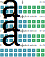
```

<br>

Se o crescimento populacional bacteriano segue um modelo geométrico, de forma que:


$$ N_t = N_0 \left( 1 + r\right)^t $$
onde 

$N_t$ é o tamanho da população na geração $t$;

$N_0$ é o tamanho inicial da população ($t=0$);

$r$ é a taxa de crescimento instrinseca da população; e

$t$ é o tempo transcorrido, em número de gerações. 

<br>

Podemos considerar o crescimento dos genótipos $\color{#2c89a0}{A}$ e $\color{#2ca05a}{B}$ de modo que:

<table border="0">
 <tr>
    <td>$$
    \color{#2c89a0}{A_t} = \color{#2c89a0}{A_0} \left( 1 + \color{#2c89a0}{a}\right)^t
    $$</td>
    <td>$$
    \color{#2ca05a}{B_t} = \color{#2ca05a}{B_0} \left( 1 + \color{#2ca05a}{b}\right)^t
    $$</td>
 </tr>
</table>

<br>

onde, respectivamente aos genótipos $\color{#2c89a0}{A}$ e $\color{#2ca05a}{B}$,

$\color{#2c89a0}{A_t}$ e $\color{#2ca05a}{B_t}$ são o número de indivíduos na geração $t$;

$\color{#2c89a0}{A_0}$ e $\color{#2ca05a}{B_0}$ são o número de indivíduos iniciais ($t=0$) de cada genótipo; 

$\color{#2c89a0}{a}$ e $\color{#2ca05a}{b}$ são as taxas de crescimento instrinsecas de cada genótipo; e

$t$ continua sendo o número de gerações.

<br>

Assim:

- Se $\color{#2c89a0}{a}=\color{#2ca05a}{b}$, ambos genótipos crescem na mesma proporção, e não há seleção.

- Se $\color{#2c89a0}{a} \ne \color{#2ca05a}{b}$, um genótipo cresce proporcionalmente mais rápido do que outro, e há seleção.

<br>

```{r haploselection, echo = FALSE, warning = FALSE, fig.align = 'center', out.width = "800px", fig.cap="As populações de células de duas cepas bacterianas M e N, com taxas de crescimentos instrínsecas m e n aumentam de tamanho exponencialmente, mas a cepa M aumenta mais rapidamente do que a cepa N por seleção."}
## Dependências
library("ggplot2")
library("latex2exp")
library("patchwork")
library("extrafont")

## Gráficos
ggplot(data.frame(x = c(0, 10)), aes(x = x)) + 
  stat_function(fun = function(x) 10000*(1+0.41)^x, color = "#2c89a0", lwd = 1) +
  stat_function(fun = function(x) 10000*(1+0.26)^x, color = "#2ca05a", lwd = 1) +
  scale_x_continuous(name = "Geração", breaks = seq(0, 10, 2), limits=c(0, 10)) +
  scale_y_continuous(name = "Número de células", breaks = seq(0, 350000, 50000), limits=c(0, 350000)) +
  annotate(geom='text', x=1, y=350000, parse = TRUE, family = "Cambria", color="#2c89a0", label=TeX(r'($a=0.41$)')) +
  annotate(geom='text', x=1, y=330000, parse = TRUE, family = "Cambria", color="#2ca05a", label=TeX(r'($b=0.26$)')) +
ggplot(data.frame(x = c(0, 10)), aes(x = x)) + 
  stat_function(fun = function(x) 10000*(1+0.41)^x, color = "#2c89a0", lwd = 1) +
  stat_function(fun = function(x) 10000*(1+0.26)^x, color = "#2ca05a", lwd = 1) +
  scale_x_continuous(name = "Geração", breaks = seq(0, 10, 2), limits=c(0, 10)) +
  scale_y_log10(name = "log10(número de células)",limits = c(10000, 350000)) 
```

<br>

Assim, o coeficiente de seleção ($s$) entre as cepas deve ser dado pela proporção com que as cepas $\color{#2c89a0}{A}$ e $\color{#2ca05a}{B}$ crescem em relação uma com a outra.

A razão do número de células da cepa $\color{#2c89a0}{A}$ para a $\color{#2ca05a}{B}$ no tempo $t$ é dada por:
 

$$ 
\frac{\color{#2c89a0}{A_t}}{\color{#2ca05a}{B_t}} = \frac{\color{#2c89a0}{A_0}\left(1+\color{#2c89a0}{a} \right)^t}{\color{#2ca05a}{B_0}\left(1+\color{#2ca05a}{b} \right)^t}
$$ 
Ou

$$ 
\frac{\color{#2c89a0}{A_t}}{\color{#2ca05a}{B_t}} = \frac{\color{#2c89a0}{A_0}}{\color{#2ca05a}{B_0}} \times \left( \frac{1+\color{#2c89a0}{a}}{1+\color{#2ca05a}{b}} \right)^t
$$ 

<br>

Se ao invés do número de células das cepas $\color{#2c89a0}{A}$ e $\color{#2ca05a}{B}$ nos interessarmos pelas frequências alélicas $\color{#2c89a0}{p}$ e $\color{#2ca05a}{q}$ respectivamente, teríamos que:

$$ 
\frac{\color{#2c89a0}{p_t}}{\color{#2ca05a}{q_t}} = \frac{\color{#2c89a0}{p_0}}{\color{#2ca05a}{q_0}} \times \left( \frac{1+\color{#2c89a0}{a}}{1+\color{#2ca05a}{b}} \right)^t
$$

<br>

Sendo $w$ a aptidão relativa entre as cepas $\color{#2c89a0}{A}$ e $\color{#2ca05a}{B}$, onde: 


$$ 
w = \left( \frac{1+\color{#2c89a0}{a}}{1+\color{#2ca05a}{b}} \right)
$$

<br>

Temos que:

$$ 
\frac{\color{#2c89a0}{p_t}}{\color{#2ca05a}{q_t}} = \frac{\color{#2c89a0}{p_0}}{\color{#2ca05a}{q_0}} \times w^t
$$
De forma que, a relação entre as frequências dos dois genótipos após $t$ gerações vai depender de suas frequências iniciais e da razão entre suas taxas de crescimento instrínsecas, *i.e.*, da aptidão relativa entre os genótipos $\color{#2c89a0}{A}$ e $\color{#2ca05a}{B}$.

<br>

```{r haplofitness, echo = FALSE, warning = FALSE, fig.align = 'center', out.width = "800px", fig.cap="A cepa $M$ se reproduz $w$ vezes mais rápido do que a cepa $N$."}
## Dependências
library("ggplot2")
library("latex2exp")
library("patchwork")
library("extrafont")

## Gráficos
ggplot(data.frame(x = c(0, 10)), aes(x = x)) + 
  stat_function(fun = function(x) (1.41/1.26)^x, color = "#c8ab37", lwd = 1) +
  scale_x_continuous(name = "Geração", breaks = seq(0, 10, 2), limits=c(0, 10)) +
  scale_y_continuous(name = "Razão do número de células (M/N)", breaks = seq(0, 3.5, 0.5), limits=c(1, 3.5)) +
  annotate(geom='text', x=2, y=3.4, parse = TRUE, family = "Cambria", color="#c8ab37", label=TeX(r'($w=\frac{1.41}{1.26}\approx 1.12$)')) +
ggplot(data.frame(x = c(0, 10)), aes(x = x)) + 
  stat_function(fun = function(x) (1.41/1.26)^x, color = "#c8ab37", lwd = 1) +
  scale_x_continuous(name = "Geração", breaks = seq(0, 10, 2), limits=c(0, 10)) +
  scale_y_log10(name = "log10(M/N)",limits = c(1, 3.5))
```

<br>

## Paisagem Adaptativa

<br>

```{r wright1932, echo = FALSE, fig.align = 'center', out.width="600px", fig.cap="A evolução da aptidão de uma população pode ser estudada visualizando a distribuição dos valores de aptidão de diferentes genótipos como um tipo de paisagem. Retirado de Wright ([1932](http://www.esp.org/books/6th-congress/facsimile/contents/6th-cong-p356-wright.pdf))."}
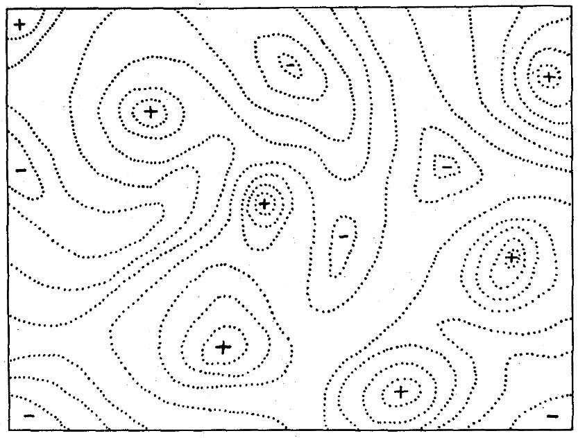
```

<br>


:::reference

Wright S. (1932) The roles of mutation, inbreeding, crossbreeding and selection in evolution. *Proceedings of the Sixth International Congress on Genetics* **1**, 356–366.

:::

Se presumirmos que todo genótipo tenha uma aptidão bem definida, genótipos semelhantes serão considerados "próximos" uns dos outros e apresentarão aptidões semelhantes, enquanto que genótipos muito diferentes estarão "distantes" uns dos outros e tenderão a diferir em aptidão. 

Assim, a paisagem adaptativa será o conjunto de todos os genótipos possíveis, seu grau de similaridade e seus valores de aptidão relacionados.

As paisagens adaptativas são frequentemente concebidas como cadeias de montanhas, onde:

- **Picos adaptativos** são pontos a partir dos quais todos os caminhos levam para baixo, *i.e.*, diminuem a aptidão.

- **Vales adptativos** são pontos a partir dos quais todos caminhos levam para cima, *i.e.*, aumentam a aptidão.

- **Trajetória evolutiva** é a série de mudanças evolutivas em uma população, normalmente, "morro" acima na paisagem adaptativa. Dado tempo suficiente, um pico evolutivo deverá ser alcançado.

<br>


```{r fitnesslandscape, echo = FALSE, fig.align = 'center', out.width="800px", fig.cap="Uma vez que a trajetória evolutiva ocorre gradualmente, ao atingir picos (p) adaptativos locais (A e C), as populações deixam de evoluir, mesmo havendo um pico adaptativo global (B) para determinado genótipo, uma vez que ela não consegue atravessar os vales (v) adaptativos."}
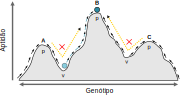
```

<br>

Diferentes trajetórias evolutivas podem atingir diferentes picos adaptativos, mesmo a partir do mesmo genótipo inicial. 


Paisagens adaptativas suaves, com um único pico e sem interações adaptativas entre genótipos, fazem com que diferentes trajetórias evolutivas levem a um mesmo pico adaptativo. 

Por outro lado, paisagens adaptativas acidentadas, com vários picos e interações entre genótipos, podem  fazer com que diferentes trajetórias evolutivas atinjam diferentes picos adaptativos, mesmo a partir do mesmo genótipo inicial.

<br>

```{r landscaperoughness, echo = FALSE, fig.align = 'center', out.width="800px", fig.cap="Diferentes trajetórias evolutivas podem atingir diferentes picos adaptativos, mesmo a partir do mesmo genótipo inicial. Adaptado de Van Cleve & Weissman ([2015](https://doi.org/10.1073/pnas.1507916112))."}
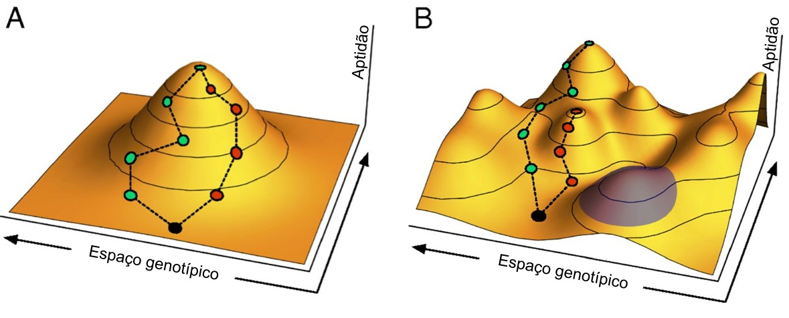
```

<br>

Em um cenário onde o ambiente é estável, a aptidão é igualmente estática, e a população evolui para apenas um pico. Contudo a evolução em ambientes alternados que modulam a paisagem adaptativa pode levar ao cruzamento de vales de aptidão. Á medida que a paisagem adaptativa muda, a população evolui para acompanhar os picos.

<br>

```{r landscapeevolution, echo = FALSE, fig.align = 'center', out.width="800px", fig.cap="As mudanças ambientais fazem a ponte entre os vales evolutivos. A. Uma população (círculo) em um ótimo local, separado do ótimo global por um vale adaptativo. B. Uma mudança no ambiente altera a paisagem de forma que a evolução traz a população um novo ótimo, que anteriormente residia no vale. C.O retorno do ambiente para a condição original faz com que a população resida no vale, e que agora pode evoluir para o ótimo global. Adaptado de Steinberg & Ostermeier ([2016](https://doi.org/10.1126/sciadv.1500921))."}
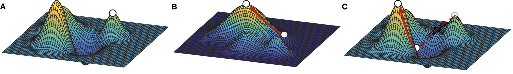
```

<br>

## Equilíbrio mutação-seleção

<br>

```{r mutationfrequency, echo = FALSE, fig.align = 'center', out.width="600px", fig.cap="A maioria das mutações são neutras (N), deletérias (D) ou letais (L); mutações vantajosas (V) são relativamente raras."}
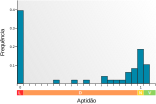
```

<br>

:::reference

Sanjuan et al. 2004. doi: [10.1073/pnas.0400146101](https://doi.org/10.1073/pnas.0400146101)

Eyre-Walker & Keightley 2007. doi: [10.1038/nrg2146](https://doi.org/10.1038/nrg2146)

:::

<br>

O influxo de mutações deletérias (e letais) em uma população ao longo do tempo é contrabalançado pela seleção negativa, que age para eliminar essas mutações.

Deixando de lado outros fatores, o número de alelos deletérios é então determinado por um equilíbrio entre a taxa de mutação deletéria e a taxa com que a seleção elimina essas mutações.

Em uma população diplóide, um alelo deletério $B$ pode ter efeitos diferentes sobre a aptidão individual em heterozigotos $AB$ e homozigotos $BB$ dependendo do grau de dominância $h$ do alelo normal $A$. 

Para representar tal efeito, consideraremos a aptidão relativa de homozigotos deletérios ($BB$), como sendo:

$$w_{BB} = 1-s$$

E heterozigotos ($AB$) como sendo:

$$w_{AB} = 1-hs$$

Onde $s$ é o coeficiente de seleção contra o genótipo homozigoto $BB$, e $h$ é o grau de dominância do alelo $A$, variando de 0 (dominância completa) a 1 (recessividade completa).

<br>

O grau de dominância afeta a importância relativa da seleção de heterozigotos contra homozigotos. 

- Se $\mu \rightarrow 0$, *i.e.*, se a taxa de mutação deletéria é muito baixa, os heterozigotos irão conter a grande maioria dos alelos deletérios $B$ da população.

- Se $h \ne 0$, *i.e.*, se o alelo $A$ não é completamente dominante, as mutações deletérias serão primariamente removidas pela seleção negativa dos heterozigotos.

<br>

Neste caso:

- A mutação converte homozigotos $AA$ em heterozigotos $AB$ em uma taxa de mutação $\mu$; e

- A seleção remove heterozigotos com coeficiente de seleção $hs$.

<br>

Assim, a frequência do alelo deletério $B$ no equilíbrio ($\hat{q}) será:

$$
\hat{q} = \frac{\mu}{hs}
$$

<br>

Se $h=0$, *i.e.*, o alelo $A$ apresenta dominância completa, então o alelo deletério $B$ só será removido pela seleção dos homozigotos $BB$. 

Neste caso, a frequência $p$ do alelo normal $A$ aumenta devido à eliminação seletiva de homozigotos recessivos, de forma que:

$$
\Delta p = \frac{1}{1-sp_{BB}}
$$
Onde,

$s$ é o coeficiente de seleção contra o genótipo homozigoto $BB$; e

$p_{BB}$ é a frequência denotípica do homozigoto $BB$.

Por outro lado, a mutação faz com que a frequência $p$ do alelo normal $A$ diminua proporcionalmente, e se ignorarmos as mutações reversas, uma vez que estas são muito raras, teremos que:

$$
\Delta p = 1-\mu
$$
<br>

Sendo assim, a frequência do genótipo recessivo $BB$ no equilíbrio $\hat{p}_{BB}$ entre seleção e mutação será:

$$
\hat{p}_{BB} \approx \frac{\mu}{s}
$$

<br>

E a freqüência $\hat{q}$ de alelos deletérios $B$ será:

$$
\hat{q} \approx \sqrt{\frac{\mu}{s}}
$$
<br>

Esta freqüência de equilíbrio é substancialmente maior do que no caso de dominância parcial, porque heterozigotos serão portadores de um grande número de alelos mutantes, e protegidos da seleção.


## Outros tipos de seleção


### Conflito intragenômico

A evolução por conflito intragenômico diz respeito a genes com efeitos fenotípicos que promovem sua própria transmissão em detrimento da transmissão de outros genes no mesmo genoma. 


Existem vários tipos de elementos genéticos egoístas (SGEs, do inglês *selfish genetic elements*) que proporcionam conflito genético e impulsionam inovação evolutiva, como transposons e outros elementos transponíveis.

Um outro tipo de conflito genético é o conflito intragenômicos promovido pelo impulso meiótico (*meiotic drive*), em que um ou mais *loci* de um genoma manipulam o processo meiótico para favorecer sua transmissão em detrimento de outros. Esse desequilíbrio pode ser desencadeado tanto pela assimetria da meiose ou letalidade de gametas que carregam o alelo/cromossomo em conflito.

<br>

```{r meioticdrive, echo = FALSE, fig.align = 'center', out.width="800px", fig.cap="Exemplo de conflito intragenômico. Um gene ligado ao X pode afetar sua própria transmissão para a próxima geração se puder aumentar a proporção de células de esperma que carregam um cromossomo X em vez de um cromossomo Y, e vice-versa."}
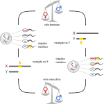
```

<br>


:::reference

Gershenson 1928. doi: [10.1093/genetics/13.6.488](https://doi.org/10.1093/genetics/13.6.488)

Rhoades 1941. doi: [10.1093/genetics/27.4.395](https://doi.org/10.1093/genetics/27.4.395)

Sandler & Novitski 1957. doi: [10.1086/281969](https://doi.org/10.1086/281969)

Dawkins 1976. ISBN: [9780191093067](https://archive.org/details/richard-dawkins-the-selfish-gene)

Werren 2011. NCBI Books: [NBK424883](https://www.ncbi.nlm.nih.gov/books/NBK424883/)

:::

<br>

### Seleção de parentesco

A seleção de parentesco favorece o sucesso reprodutivo dos parentes de um organismo, mesmo que custe a própria sobrevivência e reprodução do organismo.

Do ponto de vista de um gene, a aptidão depende, em última análise, somente de deixar para a próxima geração o maior número de cópias de si mesmo na população. Como indivíduos aparentados apresentam (em parte) genes idênticos por descendência entre si, para esses genes, não importa quem está de fato se reproduzindo, contanto que haja suceso reprodutivo.

Assim, os indivíduos que apresentem comportamentos altruístas para com outros aparentados a ele podem aumentar a chance de transmissão de seus genes se beneficiar um número equivalente de descendentes a sua aptidão pessoal. 

:::quote

**Aptidão pessoal** é o número de descendentes que um indivíduo gera, independentemente de qual indivíduo resgata, cria, ou suporta aquela prole.

**Aptidão inclusiva** é o número de equivalentes de descendentes que um indivíduo cria, resgata, ou de outra forma, sustenta por meio de seu comportamento, independentemente de quem os gera por reprodução.
:::

Em organismos diplóides, os descendentes diretos de um indivíduo carregam $1/2$ dos seus genes, definindo o que chamamos de **equivalente de descendente**. Assim, um sobrinho (filho de seu irmão) carrega $1/4$ dos seus genes, possuindo $1/2$ de equivalente de descendente. Da mesma forma, um primo de segundo grau (o filho de seu primo) tem 1/16 dos seus genes, e tem 1/8 de equivalente de descendente. Logo, para os genes, dois sobrinhos, ou oito primos de segundo grau, equivalem a um filho.

De acordo com a regra de Hamilton, os genes associados a comportamentos altruístas aumentarão em frequência quando:

$$
rB > C
$$

Onde,

$r$ é a relação de parentesco do destinatário com o ator,

$B$ é o benefício reprodutivo obtido pelo destinatário do ato altruísta, e,

$C$ é o custo reprodutivo para o ator do ato altruísta. 


Um exemplo clássico de de seleção de parentesco ocorre nos cães-de-pradaria (*Cynomys ludovicianus*), os quai mais propensos a dar chamados de alarme se seu grupo doméstico incluir indivíduos aparentados.

<br>

:::reference

Hamilton 1964. doi: [10.1016/0022-5193(64)90038-4](https://doi.org/10.1016/0022-5193(64)90038-4)

Hamilton 1964. doi: [10.1016/0022-5193(64)90039-6](https://doi.org/10.1016/0022-5193(64)90039-6)

Birch 2016. doi: [10.1086/687869](https://doi.org/10.1086/687869)

:::

<br>

### Efeito barba-verde

O efeito barba-verde é apresentado em um experimento mental onde a distinção entre reconhecimento/discriminação de parentesco é uma "barba verde" hipotética, onde se imagina que um gene para comportamento social também causa um fenotípico distintivo que pode ser reconhecido por outros portadores do gene.

Assim, formas de auto-reconhecimento genético permitem que o gene em um indivíduo direcione benefícios para outros indivíduos que possuem o mesmo gene.

Por exemplo, o número de rainhas por colônia de formigas-de-fogo (*Solenopsis invicta*) parece estar associado a genótipos operários no gene de proteína de ligação a feromônio Gp-9. 


<br>

```{r greenbeard, echo = FALSE, fig.align = 'center', out.width="600px", fig.cap="Um portador de um alelo de comportamento direciona o altruísmo para um portador de um alelo de barba que, devido ao desequilíbrio de ligação entre os dois loci, também é provável que seja um portador do alelo de comportamento. Adaptado de Gardner ([2019](https://doi.org/10.1016/j.cub.2019.03.063))"}
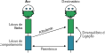
```

<br>

:::reference

Keller & Ross 1998. doi: [10.1038/29064](https://doi.org/10.1038/29064)

Krieger & Ross 2002. doi: [10.1126/science.1065247](https://doi.org/10.1126/science.1065247)

Krieger & Ross 2005. doi: [10.1093/molbev/msi203](https://doi.org/10.1093/molbev/msi203)

Gardner 2019. doi: [10.1016/j.cub.2019.03.063](https://doi.org/10.1016/j.cub.2019.03.063)

:::

<br>


## Exercícios

### Exercício 1 -- Resistência a inseticidas

A resistência a inseticidas organofosfatados e carbamatados em espécies de mosquitos _Culex_ e _Anopheles_ pode ser mediada por quatro mutações independentes no gene da acetilcolinesterase (ace-1). As mutações, resultando em G119S (uma glicina, na posição 119, substituída por uma serina), tornam a enzima insensível à inibição por essses inseticidas ([Weill et al 2004](https://doi.org/10.1111/j.1365-2583.2004.00452.x)).

Desta forma, responda:

- Que tipo de seleção essa variante mutante irá promover?

- Se os mosquitos que possuem esse alelo de resistência pudessem sobreviver e se reproduzir 10 vezes mais do que os que possuem o alelo sensível, quanto tempo levaria para que a frequência do alelo mudasse de $p_{G119S} = 0.01$ para $p_{G119S} = 0.5$?

<br>

### Exercício 2 -- Equilíbrio mutação-seleção

Imagine um alelo que seja letal em homozigose (deletério) em uma população de *Drosophila*. Suponha que esse alelo seja mantido por equilíbrio mutação-seleção com $\mu = 5 \times 10^{-6}$. Calcule a frequência do alelo para:

- Um recessivo completo.

- Um dominante parcial, quando o grau de dominância é $h = 0.025$.

