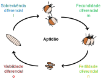

# Seleção Natural

<br>

```{r aedesresistance, echo = FALSE, fig.align = 'center', out.width="600px", fig.cap="O controle químico do mosquito _Aedes aegypti_ vem dependendo principalmente de inseticidas piretróides, que interagem com o canal de sódio controlado por voltagem no sistema nervoso do animal. Mutações de substituição em sítios específicos da proteína conferem ao mosquito resistência ao inseticida, sendo estas conhecidas como mutações kdr (do inglês, _knockdown resistance_). Retirado de Linss et al ([2014](https://doi.org/10.1186/1756-3305-7-25)."}
knitr::include_graphics("figs/linssetal2014.jpg")
```

<br>

:::reference

Soderlund & Knipple 2003. doi: [10.1016/S0965-1748(03)00023-7](https://doi.org/10.1016/S0965-1748(03)00023-7)

Melo-Costa et al. 2020. doi: [10.1038/s41598-020-70029-7](https://doi.org/10.1038/s41598-020-70029-7)

:::

<br>

## adaptabilidade reprodutiva absoluta

Algumas diferenças podem melhorar as chances de um indivíduo sobreviver, se reproduzir e deixar mais descendes. Se os traços que dão a estes indivíduos uma vantagem adaptativa também são hereditários, estes serão passados dos genitores para os descendentes, o que levará a uma adaptatibilidade reprodutiva (ou _fitness_) diferencial. Mesmo que a vantagem adaptativa seja muito pequena, ao longo de muitas gerações, qualquer característica hereditária vantajosa tornar-se-á dominante na população.

<br>

```{r bettlesprey, echo = FALSE, fig.align = 'center', out.width="800px", fig.cap="Genótipos que conferem maior sucesso reprodutivo aos indivíduos tenderão a suplantar os de menor sucesso reprodutivo ao longo do tempo pelo mecanismo da seleção natural."}
knitr::include_graphics("figs/bettles_prey_selection.svg")
```

<br>

Ao modelar a seleção natural, a adaptabilidade (ou _fitness_) reprodutiva de um genótipo se refere à sua contribuição para (ou a probabilidade de) sobrevivência ($l$), fecundidade e fecundabilidade ($m$), fertilidade ($n$) e viabilidade ($o$) dos indivíduos daquele genótipo.

<br>

```{r bettlescycle, echo = FALSE, fig.align = 'center', out.width="600px", fig.cap="."}

```

<br>

Se considerarmos o potencial efeito desses parâmetros no sucesso repodutivo de cada genótipo formado pelos alelos $1$ e $2$ em uma dada geração $t$, teremos:

<br>

| Genótipo | Número de\n indivíduos| Sobrevivência | Fecundidade | Fertilidade | Viabilidade | 
| :---: | :---: | :---: | :---: | :---: | :---: |
| $D(11)$ | $p^2N_t$ | $\color{blue}{l_{11}}$ | $\color{green}{m_{11}}$ | $\color{goldenrod}{n_{11}}$ | $\color{red}{o_{11}}$ |
| $H(12)$ | $2pqN_t$ | $\color{blue}{l_{12}}$ | $\color{green}{m_{12}}$ | $\color{goldenrod}{n_{12}}$ |$\color{red}{o_{12}}$ | 
| $R(22)$ | $q^2N_t$ | $\color{blue}{l_{22}}$ | $\color{green}{m_{22}}$ | $\color{goldenrod}{n_{22}}$ |$\color{red}{o_{22}}$ |

<br>

Assim, o número esperado de indivíduos de um determinado genótipo na próxima geração, dado o seu sucesso reprodutivo será...

... para o genótipo homozigoto dominante $D(11)$:

$$ D_{t+1} = p^2 N_t \color{blue}{l_{11}} \color{green}{m_{11}} \color{goldenrod}{n_{11}} \color{red}{o_{11}}$$

<br>

... para o genótipo heterozigoto $H(12)$:

$$ H_{t+1} = 2pq N_t \color{blue}{l_{12}} \color{green}{m_{12}} \color{goldenrod}{n_{12}} \color{red}{o_{12}}$$

<br>

... e para o genótipo homozigoto recessivo $R(22)$:

$$ R_{t+1} = q^2 N_t \color{blue}{l_{22}} \color{green}{m_{22}} \color{goldenrod}{n_{22}} \color{red}{o_{22}}$$

<br>

E desta forma, a resultante do produto dos parâmetros $l$, $m$, $n$ e $o$ corresponderá ao valor da adaptabilidade reprodutiva absoluta ($W$) da cada genótipo, onde:

$$\color{blue}{l_{11} m_{11} n_{11} o_{11}} = \color{blue}{W_{11}}$$

$$ \color{green}{l_{12} m_{12} n_{12} o_{12}} = \color{green}{W_{12}}$$

$$ \color{red}{l_{22} m_{22} n_{22} o_{22}} = \color{red}{W_{22}}$$ 

<br>

## Adaptabilidade reprodutiva relativa

As medidas de adaptabilidade reprodutiva absoluta podem variar consideravelmente entre as diferentes linhagens evolutivas, sendo assim mais prático utilizar uma medida padronizada desses valores. 

Ao dividir a adaptabilidade reprodutiva absoluta  de cada genótipo pela adaptabilidade máxima observada entre todos os genótipos, convertemo-os assim em uma medida de adaptabilidade reprodutiva relativa ($w$), definidos como:

<br>

$$\color{blue}{w_{11}}= \frac{\color{blue}{l_{11} m_{11} n_{11} o_{11}}}{\max\left(l_{ij} m_{ij} n_{ij} o_{ij} \right)} = \frac{ \color{blue}{W_{11}}}{W_{\max}}$$

<br>

$$\color{green}{w_{12}}= \frac{ \color{green}{l_{12} m_{12} n_{12} o_{12}}}{\max\left(l_{ij} m_{ij} n_{ij} o_{ij} \right)} = \frac{ \color{green}{W_{12}}}{W_{\max}}$$

<br>

$$\color{red}{w_{22}}= \frac{ \color{red}{l_{22} m_{22} n_{22} o_{22}}}{\max\left(l_{ij} m_{ij} n_{ij} o_{ij} \right)} = \frac{ \color{red}{W_{22}}}{W_{\max}}$$

<br>

## Modelando uma geração de seleção

Dada adaptabilidade reprodutiva relativa de cada genótipo e a expectitiva de cruzamento ao acaso do princípio de Hardy-Weinberg, podemos definir a expectativa das frequências genotípicas após uma geração de seleção natural geração como sendo ... 

... para o alelo $1$:  

$$ 
\begin{aligned}
p_{t+1} 
&= \frac{p^2 N_t \color{blue}{w_{11}} + pq N_t \color{green}{w_{12}}}{p^2 N_t \color{blue}{w_{11}} + 2pq N_t \color{green}{w_{12}} + q^2 N_t \color{red}{w_{22}}} \\
\\
&= \frac{N_t \left( p^2 \color{blue}{w_{11}} + pq \color{green}{w_{12}} \right)}{N_t \left( p^2 \color{blue}{w_{11}} + 2pq \color{green}{w_{12}} + q^2 \color{red}{w_{22}}\right)} \\
\\
&= \frac{p^2 \color{blue}{w_{11}} + pq \color{green}{w_{12}}}{p^2 \color{blue}{w_{11}} + 2pq \color{green}{w_{12}} + q^2 \color{red}{w_{22}}}
\end{aligned}
$$
<br>

... e para o alelo $2$:  

$$ 
\begin{aligned}
q_{t+1} 
&= \frac{q^2 N_t \color{red}{w_{22}} + pq N_t \color{green}{w_{12}}}{p^2 N_t \color{blue}{w_{11}} + 2pq N_t \color{green}{w_{12}} + q^2 N_t \color{red}{w_{22}}} \\
\\
&= \frac{N_t \left( q^2 \color{red}{w_{22}} + pq \color{green}{w_{12}} \right)}{N_t \left( p^2 \color{blue}{w_{11}} + 2pq \color{green}{w_{12}} + q^2 \color{red}{w_{22}}\right)} \\
\\
&= \frac{q^2 \color{red}{w_{22}} + pq \color{green}{w_{12}}}{p^2 \color{blue}{w_{11}} + 2pq \color{green}{w_{12}} + q^2 \color{red}{w_{22}}}
\end{aligned}
$$

<br>

Assim, cada genótipo irá contribuir com genes para a próxima geração ponderadamente a sua adaptabilidade reprodutiva relativa, e a soma da contribuição ponderada de todos os genótipos é definida como a adaptabilidade reprodutiva média
da população ($\bar{w}$), de forma que:

<br>

$$\bar{w} = p^2 w_{11} + 2pq w_{12} +  q^2 w_{22}$$


<br>

Perceba que $\bar{w}$ irá diferir da proporção total da população antes da seleção toda vez que ($w<1$) para qualquer um dos genótipos, e a diferença entre esse total inicial e a adaptabilidade reprodutiva média ($1 - \bar{w}$) irá refletir a parcela da população que foi eliminada pela seleção. 

<br>

Desta forma, para cada genótipo, temos:

<br>

| Parâmetro | $D(11)$ | $H(12)$ | $R(22)$ | Total | 
| :--- | :---: | :---: | :---: | :---: | 
| Adaptabilidade \n reprodutiva relativa | $w_{11}$ | $w_{12}$ | $w_{22}$ | $-$ |
| Frequência ($t$) | $p^2$ | $2pq$ | $q^2$ | $1$ | 
| Contribuição ponderada | $p^2 \cdot w_{11}$ | $2pq \cdot w_{12}$ | $q^2 \cdot w_{22}$ | $\bar{w}$ |
| Frequência ($t+1$) | $\frac{p^2 \cdot w_{11}}{\bar{w}}$ | $\frac{2pq \cdot w_{12}}{\bar{w}}$ | $\frac{q^2 \cdot w_{22}}{\bar{w}}$ | $1$ |

<br>

Ao padronizar as contribuições genotípicas dos indivíduos, pode-se estimar as freqüências alélicas para a próxima geração como:

<br>

$$p_{t+1} = \frac{p^2 w_{11} + pq w_{12}}{\bar{w}}$$

<br>

$$q_{t+1} = \frac{q^2 w_{22} + pq w_{12}}{\bar{w}}$$

<br>

Assim, a cada geração de seleção natural, é necessário estimar a contribuição ponderada de cada genótipo para a geração seguinte, que dependerá das frequências alélicas que seguem evoluindo ao longo das gerações. E como a adaptabilidade reprodutiva média da população, que relativiza as frequências alélicas após uma geração de seleção, também irá mudar de geração para geração, um modelo geral para estimar as frequências alélicas em uma dada geração $t$ não é possível de ser estabelecido.

Contudo essa modelagem da seleção natural de uma geração para a outra pode ser repetido passo-a-passo por várias gerações, algoritmo esse que é facilmente calculado em uma planilha eletrônica (ver [aqui](link para a planilha)).

<br>

Modelos de seleção natural são melhor compreendidos usando uma medida conhecida como coeficiente de seleção ($s$), que é o oposto de adaptabilidade ($w$).

Como a adaptabilidade reprodutiva representa o sucesso reprodutivo de um genótipo, enquanto que o coeficiente de seleção corresponde a parcela dos indivíduos que não sobreviveram ou se reproduziram.

O valores de $w$ e $s$ podem também ser interpretados como:

<br>

- a probabilidade de um indivíduo de um dado genótipo de sobreviver e se reproduzir, ou de ser eliminado por seleção; ou

<br>

- a proporção dos alelos que serão passados para a próxima geração, ou que serão removidos do _pool_ gênico por seleção.

As duas medidas estão relacionadas, de forma que:

<br>

$$w+s=1$$
<br>

Assim, a adaptabilidade reprodutiva pode ser expressa em função do coeficiente de seleção, onde:

<br>

$$w=1-s$$
<br>

## Tipos de de seleção gênica

<br>

```{r HbS, echo = FALSE, fig.align = 'center', out.width="600px", fig.cap="Hemácias com traços falcêmicos, promovidos pelo alelo HbS da cadeia da beta-globina, apresentam maior resistência à infecções por malária. Este é um polimorfismo balanceado, no qual a seleção natural favorece uma frequência de alelo intermediária devido a um equilíbrio estável de contribuições de aptidão positivas (resistência a malária) e negativas (anemia) para os excessos médios dos alelos polimórficos."}
knitr::include_graphics("figs/HbS_structure_frequency.svg")
```

<br>

:::reference

Grosse et al 2011. doi: [10.1016/j.amepre.2011.09.013](https://doi.org/10.1016/j.amepre.2011.09.013)

Elguero et al 2015. doi: [10.1073/pnas.1505665112](https://doi.org/10.1073/pnas.1505665112)

Kato et al 2018. doi: [10.1038/nrdp.2018.10](https://doi.org/10.1038/nrdp.2018.10)

:::

<br>


A depender da adaptabilidade reprodutiva relativa de cada genótipo, quatro tipos de seleção gênica poderão ocorrer:

- [Seleção contra o recessivo][]

- [Seleção a favor do dominante][]

- [Seleção a favor do heterozigoto][]

- [Seleção contra o heterozigoto][]

Perceba que, independentemente dos genótipos favorecidos ou desvantajosos, a seleção natural irá promover o aumento da adaptabilidade reprodutiva média da população, e com o passar das gerações, $\bar{w} \to 1$.

<br>

### Seleção contra o recessivo 

Também chamada de **seleção negativa** ou **seleção purificadora**, esse tipo de seleção elimina
polimorfismos deletérios (tipicamente recessivos).

Neste tipo de seleção, a adaptabilidade reprodutiva dos genótipos é expressa como:

$$ \color{green}{w_{11} = w_{12} = 1}$$

$$ \color{red}{w_{22} = 1-s}$$


Em uma grande parte dos casos, envolve alelos letais ou estéreis ($s=1$).

Casos de forte seleção negativa produzem uma diminuição no nível de variação em torno do locus sob seleção. A eliminação incidental de alelos não deletérios devido a ligação genética com alelos deletérios é chamada
de seleção de fundo (do inglês, _backgound selection_; Charlesworth et al [1993](https://doi.org/10.1093/genetics/134.4.1289); Charlesworth [2012](https://doi.org/10.1534/genetics.111.134288), [2013](https://doi.org/10.1093/jhered/ess136)).

Na seleção contra o recessivo:

- a frequência  do alelo recessivo ($q$) diminui rapidamente nas primeiras gerações de seleção, e com o tempo, $q \to 0$.

- a quantidade de mudança evolutiva ($\Delta q$) é negativa ao longo das gerações, porque a frequência alélica $q$ está diminuindo, e com o tempo, ($\Delta q \to 0$); e

- a adaptabilidade reprodutiva média $\bar{w}$ da população aumenta a cada geração, e com o tempo, $\bar{w} \to 1$.

<br>

```{r negativeselection, echo = FALSE, warning = FALSE, fig.align = 'center', out.width = "800px", fig.cap="A frequência  do alelo recessivo (esquerda), a quantidade de mudança evolutiva (centro) e a adaptabilidade reprodutiva média (direita) na seleção contra o recessivo."} 
## Dependências
library("ggplot2")
library("latex2exp")
library("patchwork")

## Parâmetros
T <- 1:50           ## Gerações
q <- 0.5            ## Frequência inicial do alelo recessivo
w11 <- 1            ## Adaptabilidade reprodutiva do genótipo homozigoto dominante
w12 <- 1            ## Adaptabilidade reprodutiva do genótipo heterozigoto
w22 <- 0.5          ## Adaptabilidade reprodutiva do genótipo homozigoto recessivo
q0 <- rep(0.5,50)   ## Frequência do alelo recessivo ao longo das gerações
Dq <- rep(q0[2]-q0[1],49)   ## A mudança evolutiva ao longo das gerações
wbar <- rep(w11*(1-q0[1])^2 + w12*2*(q0[1]*(1-q0[1])) + w22*q0[1]^2,50)   ## A adaptabilidade reprodutiva média ao longo das gerações

## Modelos
for( t in 2:max(T)){
  q0[t] <- ( w22*q0[t-1]^2 + w12*(q0[t-1]*(1-q0[t-1])) ) / ( w11*(1-q0[t-1])^2 + w12*2*(q0[t-1]*(1-q0[t-1])) + w22*q0[t-1]^2 )
}

Dq[T] <- q0[T+1] - q0[T]

wbar[T] <- w11*(1-q0[T])^2 + w12*2*(q0[T]*(1-q0[T])) + w22*q0[T]^2


## Gráficos
data1401 <- data.frame(T, q0, Dq, wbar)
ggplot(data = data1401, aes(x = T)) +
  geom_line(aes(y = q0), color = "royalblue3", lwd = 1) +
  labs(x = "Geração", y = "Frequência do alelo recessivo") +
  xlim(0, 50) +
  ylim(0, 0.5) +
  annotate(geom='text', x=25, y=0.5, parse = TRUE, color="green4", label=TeX("$ w_{11} = w_{12} = 1$")) +
  annotate(geom='text', x=25, y=0.45, parse = TRUE, color="firebrick2", label=TeX("$w_{22} = 0.5$")) +
ggplot(data = data1401, aes(x = T)) +
  geom_line(aes(y = Dq), color = "deepskyblue3", lwd = 1) +
  labs(x = "Geração", y = "Mudança evolutiva") +
  xlim(0, 50) +
  ylim(-0.08, 0) +
ggplot(data = data1401, aes(x = T)) +
  geom_line(aes(y = wbar), color = "goldenrod", lwd = 1) +
  labs(x = "Geração", y = "Adaptabilidade reprodutiva média") +
  xlim(0, 50) +
  ylim(0.85, 1)
```

<br>

### Seleção a favor do dominante

Também chamada de **seleção positiva** ou **seleção direcional**, esse tipo de seleção favorece o
aumento de um determinado alelo na população (tipicamente dominante ou co-dominante).

Neste tipo de seleção, a adaptabilidade reprodutiva dos genótipos pode ser expressa como:

$$ \color{green}{w_{11} = 1}$$

$$ \color{goldenrod}{w_{12} = 1-hs}$$

$$ \color{red}{w_{22} = 1-s}$$

onde $h$ é o grau de dominância entre os alelos, de forma que o alelo $1$ será dominante quando $h=0$, o alelo $2$ será dominante quando $h=1$, e os alelos serão codominantes para todo $0<h<1$.

Perceba que em um locus gênico bialélico com dominãncia completa, a seleção contra o recessivo e a seleção a favor do dominante levarão praticamente ao mesmo tipo de seleção; contudo, em um locus multialélico, a seleção a favor do dominante irá favorecer um determinado alelo em detrimento de outros alelos dominantes e/ou codominantes, fazendo que a a frequência alélica mude em direção ao aumento daquele alelo mais vantajoso.

O aumento da frequência de alelos vantajosos arrasta com ele polimorfismos neutros que estão em regiões gênicas ligadas, promovendo um tipo especial de seleção de fundo conhecido como **carona genética** (do inglês, _genetic hitchhiking_; [Maynard-Smith & Haigh 1974](https://doi.org/10.1017/S0016672300014634), [Gillespie 2000](https://doi.org/10.1093/genetics/155.2.909)).

Casos de forte ou rápida seleção positiva são conhecidos como **varredura seletiva** (do inglês, _selective sweep_; ver também [Hermisson & Pennings 2005](https://doi.org/10.1534/genetics.104.036947) e [Pennings & Hermisson 2006](https://doi.org/10.1093/molbev/msj117)).

Assim, na seleção a favor do dominante:

- a frequência  do alelo dominante ($p$) aumenta rapidamente nas primeiras gerações de seleção, e com o tempo, $p \to 1$.

- a quantidade de mudança evolutiva ($\Delta p$) é positiva ao longo das gerações, porque a frequência alélica $p$ está aumentando, mas com o tempo, ($\Delta p \to 0$); e

- a adaptabilidade reprodutiva média $\bar{w}$ da população aumenta a cada geração, de forma que $\bar{w} \to 1$.

<br>

```{r positiveselection, echo = FALSE, warning = FALSE, fig.align = 'center', out.width = "800px", fig.cap="A frequência  do alelo dominate (esquerda), a quantidade de mudança evolutiva (centro) e a adaptabilidade reprodutiva média (direita) na seleção a favor do dominante."} 
## Dependências
library("ggplot2")
library("latex2exp")
library("patchwork")

## Parâmetros
T <- 1:50           ## Gerações
p <- 0.5            ## Frequência inicial do alelo dominante
w11 <- 1            ## Adaptabilidade reprodutiva do genótipo homozigoto dominante
w12 <- 0.75            ## Adaptabilidade reprodutiva do genótipo heterozigoto
w22 <- 0.5          ## Adaptabilidade reprodutiva do genótipo homozigoto recessivo
p0 <- rep(0.5,50)   ## Frequência do alelo recessivo ao longo das gerações
Dp <- rep(p0[2]-p0[1],49)   ## A mudança evolutiva ao longo das gerações
wbar <- rep(w11*p0[1]^2 + w12*2*p0[1]*(1-p0[1]) + w22*(1-p0[1])^2,50)   ## A adaptabilidade reprodutiva média ao longo das gerações

## Modelos
for( t in 2:max(T)){
  p0[t] <- ( w11*p0[t-1]^2 + w12*(p0[t-1]*(1-p0[t-1])) ) / ( w11*p0[t-1]^2 + w12*2*p0[t-1]*(1-p0[t-1]) + w22*(1-p0[t-1])^2)
}

Dp[T] <- p0[T+1] - p0[T]

wbar[T] <- w11*p0[T]^2 + w12*2*p0[T]*(1-p0[T]) + w22*(1-p0[T])^2


## Gráficos
data1402 <- data.frame(T, p0, Dq, wbar)
ggplot(data = data1402, aes(x = T)) +
  geom_line(aes(y = p0), color = "royalblue3", lwd = 1) +
  labs(x = "Geração", y = "Frequência do alelo dominante") +
  xlim(0, 50) +
  ylim(0.5, 1) +
  annotate(geom='text', x=25, y=0.60, parse = TRUE, color="green4", label=TeX("$ w_{11} = 1$")) +
  annotate(geom='text', x=25, y=0.55, parse = TRUE, color="goldenrod", label=TeX("$w_{12} = 0.75$")) +
  annotate(geom='text', x=25, y=0.50, parse = TRUE, color="firebrick2", label=TeX("$w_{22} = 0.5$")) +
ggplot(data = data1401, aes(x = T)) +
  geom_line(aes(y = Dp), color = "deepskyblue3", lwd = 1) +
  labs(x = "Geração", y = "Mudança evolutiva") +
  xlim(0, 50) +
  ylim(0, 0.08) +
ggplot(data = data1401, aes(x = T)) +
  geom_line(aes(y = wbar), color = "goldenrod", lwd = 1) +
  labs(x = "Geração", y = "Adaptabilidade reprodutiva média") +
  xlim(0, 50) +
  ylim(0.85, 1)
```

<br>


<br>

### Seleção a favor do heterozigoto 

Também chamada de **sobredominância**, ocorre quando heterozigotos têm uma aptidão maior do que os
homozigotos, de forma que a adaptabilidade reprodutiva dos genótipos sejam:

$$ \color{red}{w_{11} = 1-s_1}$$

$$ \color{green}{w_{12} = 1}$$

$$ \color{red}{w_{22} = 1-s_2}$$

Este processo promove a conservação de polimorfismos genéticos, impedindo que alelos sejam perdidos por deriva genética, sendo assim um processo de **seleção balanceadora** (do inglês, _balancing selection_) que leva a um equilíbrio estável das frequências alélicas.

A vantagem do heterozigoto é o principal mecanismo subjacente da **heterose** (do inglês, _heterosis_), ou "vigor híbrido", que é a função melhorada ou aumentada de qualquer qualidade biológica em uma prole híbrida, geralmente por conta do o mascaramento de alelos recessivos deletérios em linhagens puras ou isoladas.

<br>

```{r overdominance, echo = FALSE, warning = FALSE, fig.align = 'center', out.width = "800px", fig.cap="A frequência  do alelo dominante na seleção a favor do heterozigoto, mostrando o processo de seleção balanceadora estável."} 
## Dependências
library("ggplot2")
library("latex2exp")
library("patchwork")

## Parâmetros
T <- 1:50           ## Gerações
p <- 0.5            ## Frequência inicial do alelo dominante
w11 <- 0.75         ## Adaptabilidade reprodutiva do genótipo homozigoto dominante
w12 <- 1            ## Adaptabilidade reprodutiva do genótipo heterozigoto
w22 <- 0.75         ## Adaptabilidade reprodutiva do genótipo homozigoto recessivo
p0 <- rep(0.95,50)  ## Frequência do alelo dominante ao longo das gerações
p1 <- rep(0.75,50)  ## Frequência do alelo dominante ao longo das gerações
p2 <- rep(0.55,50)  ## Frequência do alelo dominante ao longo das gerações
p3 <- rep(0.45,50)  ## Frequência do alelo dominante ao longo das gerações
p4 <- rep(0.25,50)  ## Frequência do alelo dominante ao longo das gerações
p5 <- rep(0.05,50)  ## Frequência do alelo dominante ao longo das gerações

Dp <- rep(p0[2]-p0[1],49)   ## A mudança evolutiva ao longo das gerações
wbar <- rep(w11*p0[1]^2 + w12*2*p0[1]*(1-p0[1]) + w22*(1-p0[1])^2,50)   ## A adaptabilidade reprodutiva média ao longo das gerações

## Modelos
for( t in 2:max(T)){
  p0[t] <- ( w11*p0[t-1]^2 + w12*(p0[t-1]*(1-p0[t-1])) ) / ( w11*p0[t-1]^2 + w12*2*p0[t-1]*(1-p0[t-1]) + w22*(1-p0[t-1])^2)
  p1[t] <- ( w11*p1[t-1]^2 + w12*(p1[t-1]*(1-p1[t-1])) ) / ( w11*p1[t-1]^2 + w12*2*p1[t-1]*(1-p1[t-1]) + w22*(1-p1[t-1])^2)
  p2[t] <- ( w11*p2[t-1]^2 + w12*(p2[t-1]*(1-p2[t-1])) ) / ( w11*p2[t-1]^2 + w12*2*p2[t-1]*(1-p2[t-1]) + w22*(1-p2[t-1])^2)
  p3[t] <- ( w11*p3[t-1]^2 + w12*(p3[t-1]*(1-p3[t-1])) ) / ( w11*p3[t-1]^2 + w12*2*p3[t-1]*(1-p3[t-1]) + w22*(1-p3[t-1])^2)
  p4[t] <- ( w11*p4[t-1]^2 + w12*(p4[t-1]*(1-p4[t-1])) ) / ( w11*p4[t-1]^2 + w12*2*p4[t-1]*(1-p4[t-1]) + w22*(1-p4[t-1])^2)
  p5[t] <- ( w11*p5[t-1]^2 + w12*(p5[t-1]*(1-p5[t-1])) ) / ( w11*p5[t-1]^2 + w12*2*p5[t-1]*(1-p5[t-1]) + w22*(1-p5[t-1])^2)
}

## Gráficos
data1403 <- data.frame(T, p0, p1, p2, p3)
ggplot(data = data1403, aes(x = T)) +
  geom_line(aes(y = p0), color = "royalblue3", lwd = 1) +
  geom_line(aes(y = p1), color = "deepskyblue3", lwd = 1) +
  geom_line(aes(y = p2), color = "green4", lwd = 1) +
  geom_line(aes(y = p3), color = "goldenrod", lwd = 1) +
  geom_line(aes(y = p4), color = "chocolate", lwd = 1) +
  geom_line(aes(y = p5), color = "firebrick2", lwd = 1) +
  labs(x = "Geração", y = "Frequência do alelo dominante") +
  xlim(0, 50) +
  ylim(0, 1) +
  annotate(geom='text', x=25, y=1, parse = TRUE, color="firebrick2", label=TeX("$ w_{11} = w_{22} = 0.75$")) +
  annotate(geom='text', x=25, y=0.9, parse = TRUE, color="green4", label=TeX("$w_{12} = 1$"))
```

<br>

### Seleção contra o heterozigoto 

Também chamada de **subdominância**, ocorre quando heterozigotos têm uma aptidão menor do que os
homozigotos, de forma que a adaptabilidade reprodutiva dos genótipos sejam, por exemplo:

$$ \color{green}{w_{11} = 1}$$

$$ \color{red}{w_{12} = 1-s}$$

$$ \color{green}{w_{22} = 1}$$

Esse tipo de seleção também promove seleção balanceadora, mas que resulta em um equilíbrio instável das frequências alélicas.

Envolve muitas vezes polimorfismos adaptados a condições locais de diferentes subpopulações, e desta froma, hidridos, ao apresentar fenótipos intermediários, irão ter menor adaptabilidade nos ambientes dos parentais. 

O acúmulo dessas incompatibilidades ao longo do tempo pode levar à especiação, como previsto pelo modelo Bateson–Dobzhansky–Muller de isolamento pós-zigótico ([Orr 1996](https://doi.org/10.1093/genetics/144.4.1331)).

<br>

```{r underdominance, echo = FALSE, warning = FALSE, fig.align = 'center', out.width = "800px", fig.cap="A frequência  do alelo dominante na seleção contra o heterozigoto, mostrando o processo de seleção balanceadora instável."} 
## Dependências
library("ggplot2")
library("latex2exp")
library("patchwork")

## Parâmetros
T <- 1:50           ## Gerações
p <- 0.5            ## Frequência inicial do alelo dominante
w11 <- 1            ## Adaptabilidade reprodutiva do genótipo homozigoto dominante
w12 <- 0.75         ## Adaptabilidade reprodutiva do genótipo heterozigoto
w22 <- 1            ## Adaptabilidade reprodutiva do genótipo homozigoto recessivo
p0 <- rep(0.95,50)  ## Frequência do alelo dominante ao longo das gerações
p1 <- rep(0.75,50)  ## Frequência do alelo dominante ao longo das gerações
p2 <- rep(0.55,50)  ## Frequência do alelo dominante ao longo das gerações
p3 <- rep(0.45,50)  ## Frequência do alelo dominante ao longo das gerações
p4 <- rep(0.25,50)  ## Frequência do alelo dominante ao longo das gerações
p5 <- rep(0.05,50)  ## Frequência do alelo dominante ao longo das gerações

Dp <- rep(p0[2]-p0[1],49)   ## A mudança evolutiva ao longo das gerações
wbar <- rep(w11*p0[1]^2 + w12*2*p0[1]*(1-p0[1]) + w22*(1-p0[1])^2,50)   ## A adaptabilidade reprodutiva média ao longo das gerações

## Modelos
for( t in 2:max(T)){
  p0[t] <- ( w11*p0[t-1]^2 + w12*(p0[t-1]*(1-p0[t-1])) ) / ( w11*p0[t-1]^2 + w12*2*p0[t-1]*(1-p0[t-1]) + w22*(1-p0[t-1])^2)
  p1[t] <- ( w11*p1[t-1]^2 + w12*(p1[t-1]*(1-p1[t-1])) ) / ( w11*p1[t-1]^2 + w12*2*p1[t-1]*(1-p1[t-1]) + w22*(1-p1[t-1])^2)
  p2[t] <- ( w11*p2[t-1]^2 + w12*(p2[t-1]*(1-p2[t-1])) ) / ( w11*p2[t-1]^2 + w12*2*p2[t-1]*(1-p2[t-1]) + w22*(1-p2[t-1])^2)
  p3[t] <- ( w11*p3[t-1]^2 + w12*(p3[t-1]*(1-p3[t-1])) ) / ( w11*p3[t-1]^2 + w12*2*p3[t-1]*(1-p3[t-1]) + w22*(1-p3[t-1])^2)
  p4[t] <- ( w11*p4[t-1]^2 + w12*(p4[t-1]*(1-p4[t-1])) ) / ( w11*p4[t-1]^2 + w12*2*p4[t-1]*(1-p4[t-1]) + w22*(1-p4[t-1])^2)
  p5[t] <- ( w11*p5[t-1]^2 + w12*(p5[t-1]*(1-p5[t-1])) ) / ( w11*p5[t-1]^2 + w12*2*p5[t-1]*(1-p5[t-1]) + w22*(1-p5[t-1])^2)
}

## Gráficos
data1404 <- data.frame(T, p0, p1, p2, p3)
ggplot(data = data1404, aes(x = T)) +
  geom_line(aes(y = p0), color = "royalblue3", lwd = 1) +
  geom_line(aes(y = p1), color = "deepskyblue3", lwd = 1) +
  geom_line(aes(y = p2), color = "green4", lwd = 1) +
  geom_line(aes(y = p3), color = "goldenrod", lwd = 1) +
  geom_line(aes(y = p4), color = "chocolate", lwd = 1) +
  geom_line(aes(y = p5), color = "firebrick2", lwd = 1) +
  labs(x = "Geração", y = "Frequência do alelo dominante") +
  xlim(0, 50) +
  ylim(0, 1) +
  annotate(geom='text', x=25, y=0.55, parse = TRUE, color="firebrick2", label=TeX("$ w_{11} = w_{22} = 0.75$")) +
  annotate(geom='text', x=25, y=0.45, parse = TRUE, color="green4", label=TeX("$w_{12} = 1$"))
```

<br>

:::reference 

Bateson 1909. doi: [10.1017/CBO9780511693953.007](https://doi.org/10.1017/CBO9780511693953.007)

Dobzhansky 1934. doi: [10.1007/BF00374056](https://doi.org/10.1007/BF00374056)

Muller 1942. [Biology Symposium 6, 71–125](https://www.ucl.ac.uk/taxome/lit/muller%201942%20new%20enh.pdf)

:::

<br>

## Exercícios

### Exercício 1 -- Resistência a inseticidas

A resistência a inseticidas organofosfatados e carbamatados em espécies de mosquitos _Culex_ e _Anopheles_ pode ser mediada por quatro mutações independentes no gene da acetilcolinesterase (ace-1). As mutações, resultando em G119S (uma glicina, na posição 119, substituída por uma serina), tornam a enzima insensível à inibição por essses inseticidas ([Weill et al 2004](https://doi.org/10.1111/j.1365-2583.2004.00452.x)).

Desta forma, responda:

a. Que tipo de seleção essa variante mutante irá promover?

b. Se os mosquitos que possuem esse alelo de resistência pudessem sobreviver e se reproduzir 10 vezes mais do que os que possuem o alelo sensível, quanto tempo levaria para que a frequência do alelo mudasse de $p_{G119S} = 0.01$ para $p_{G119S} = 0.5$?

<br>

### Exercício 2 -- 

<br>