--- 
title: "Notas de Aula em Genética de Populações"
author: "Thiago S. de Paula"
date: '`r paste("Iniciado em junho de 2022. Última atualização", format(Sys.Date(),"%B de %Y", locale = "pt_BR"))`'
site: bookdown::bookdown_site
documentclass: book
bibliography: [book.bib, packages.bib]
biblio-style: apalike
link-citations: yes
description: "Este livro foi desenvolvido para estudantes de cursos de Genética de Populações da Graduação e Pós-Graduação."
output:
  html_document:
    number_sections: true
  pdf_document:
    number_sections: true
  tufte::tufte_handout: default
  tufte::tufte_html: default

header-includes: 
- \usepackage{caption}
- \usepackage{multirow}
- \usepackage{xcolor}
- \usepackage{mathrm}


---


# {-}

<br

```{r capa, echo = FALSE, fig.align = 'center', out.width="600px"}
knitr::include_graphics("figs/capa_v.2022.svg")
```

<br>


<!--chapter:end:index.Rmd-->

# Prefácio{-}


## Licença de uso {-}

© 2022 Thiago S. de Paula

Este livro de notas está licenciado sob a Licença _Creative Commons_ Atribuição-NãoComercial-CompartilhaIgual 4.0 (CC BY-NC-SA 4.0). Para ver uma cópia desta licença, visite https://creativecommons.org/licenses/by-nc-sa/4.0/.

```{r copyright, echo = FALSE, fig.align = 'left', out.width="100px"}
knitr::include_graphics("https://mirrors.creativecommons.org/presskit/buttons/88x31/png/by-nc-sa.png")
```
\linebreak

## Por que ler este livro {-}

xxx

## Estrutura do Livro {-}

xxx

## Agradecimentos {-}

xxx

## Sobre o autor {-}

xxx

<!--chapter:end:00_prefacio.Rmd-->

# Introdução

A **Genética de Populações** é uma subárea da Genética que lida com as diferenças dentro e entre as populações.

Compreende a origem, quantidade e distribuição da variação genética presente em populações de organismos, ao longo do tempo e do espaço.

A variação dos genes no tempo e no espaço constitui a base fundamental da mudança evolutiva (microevolução).

Para tal, se baseia em três premissas básicas:

- O DNA pode replicar

- O DNA pode mutar e recombinar

- O DNA interage com o ambiente e produz fenótipos

<br>

```{r microevolucao, echo = FALSE, fig.align = 'center', out.width="800px", fig.cap="A genética de populações estuda a microevolução - mudanças na frequência de um gene em uma população"} 
knitr::include_graphics("figs/microevolution_scheme.svg")
```

<br>

:::reference

Hartl DL, Clark AG. 2010. Princípios de Genética de Populações. 4ª Ed. Artmed, Porto Alegre. 660 p. ISBN: 978-0-87893-3082

:::

<br>

## O DNA pode replicar

A replicação do DNA permite que um gene, ou sequência de nucleotídeos:

- seja passado de uma geração para a próxima; e 

- exista em múltiplas cópias em diferentes indivíduos.

<br>

```{r mitose, echo = FALSE, fig.align = 'center', out.width="600px", fig.cap="A informação genética contida no DNA é duplicado pela replicação (esquerda) e dividido entre as novas células pela mitose (esquerda)"} 
knitr::include_graphics("figs/mitose_replicacao.svg")
```

<br>

Os genes possuem uma existência no tempo e no espaço que transcende os indivíduos que temporariamente os carregam.


A existência biológica dos genes no tempo e no espaço é a base física da evolução.

A continuidade de um gene no tempo e através do espaço se manifesta físicamente por meio de uma população de indivíduos se reproduzindo.

Indivíduos não possuem continuidade no tempo e no espaço; indivíduos são eventos únicos que vivem e morrem e não podem evoluir. 

Os genes carregados pelos indivíduos são virtualmente imortais por meio da replicação do DNA.

A evolução é possível somente no nível de uma população se reproduzindo, e não no nível dos indivíduos contidos dentro da população.

<br>

```{r birthdeath, echo = FALSE, fig.align = 'center', out.width="800px", fig.cap="A replicação do DNA permite que a informação genética persista para além da existência dos indvidíduos que a carrega."} 
knitr::include_graphics("figs/nascimento_morte_replicacao.svg")
```

<br>

A genética de populações pode operar em diferentes níveis hierárquicos populacionais dentro de uma espécie.

Comumente ela foca a população local, ou deme, uma coleção intercruzante de indivíduos da mesma espécie que vivem em proximidade suficiente para compartilhar um sistema de cruzamento.

<br>

```{r coalascencia, echo = FALSE, fig.align = 'center', out.width="500px", fig.cap="A continuidade da informação genética ao longo das linhagens reprodutivas, e seus processos de diversificação, apresenta uma estrutura hierárquica temporal - árvore de relações evolutivas. Redesenhado de Leaché et al. ([2009](https://doi.org/10.1073/pnas.0906380106))."} 
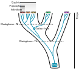
```

<br>

Uma vez que o deme é uma população que se reproduz, indivíduos são continuamente substituídos por nascimentos e mortes, mas a população local é uma entidade dinâmica que persiste através do espaço e do tempo além dos indivíduos que temporariamente à compõe.

<br>

```{r poptime, echo = FALSE, fig.align = 'center', out.width="400px", fig.cap="As relações do tipo ancestral-descendente entre indivíduos de uma geração com a outra determinam a continuidade temporal das populações."}
knitr::include_graphics("figs/population_relation_time.svg")
```

<br>

:::quote

**Sistema de cruzamento** -- Conjunto de regras por meio das quais indivíduos se organizam para reproduzir sexuadamente.

:::

<br>

Associada a cada população local de indivíduos há uma população local de genes correspondentes, chamada **fundo gênico** (_gene pool_).

O pool gênico pode ter duas definições:

Empiricamente = o conjunto de genes coletivamente partilhado pelos indivíduos de um deme.

Teoricamente = a população potencial de gametas produzidos por todos os indivíduos de um deme.

O pool gênico associado a um deme é descrito mensurando os números e frequências de vários tipos de genes ou combinações de genes no pool.

<br>

```{r demepool, echo = FALSE, fig.align = 'center', out.width="600px", fig.cap="O _pool_ gênico das populações como representação teórica do número de alelos carregados coletivamente pelos indivíduos  de um deme."}
knitr::include_graphics("figs/deme_pool_gene.svg")
```

<br>

:::quote

**Evolução** -- Mudança ao longo do tempo nas frequências dos genes ou combinações destes no _pool_ gênico das populações. A evolução é uma propriedade emergente das populações de indivíduos que se intercruzantes, que não se manifesta nos próprios indivíduos que as compõem.

:::

<br>

## O DNA pode mutar e recombinar

Evolução requer mudança, que somente pode ocorrer quando existem alternativas. 

Um prérequisito necessário para a evolução é a diversidade genética, cuja fonte última é a mutação.

Há diferentes formas de mutações, as quais criam diversidade na população de genes presentes no pool gênico.

<br>

```{r mutacao, echo = FALSE, fig.align = 'center', out.width="600px", fig.cap="Principais mutações no nível do gene e suas alterações em uma região codificante."}
knitr::include_graphics("figs/mutation.svg")
```

<br>

Mutações criam diversidade alélica.

Alelos são simplesmente formas alternativas de um gene. 

Em alguns casos são focadas regiões do DNA que podem não ser um gene no sentido clássico. O termo haplótipo se refere a uma forma alternativa (sequência específica de nucleotídeos) entre as cópias homólogas de uma região definida do DNA, ou locus gênico.

<br>

```{r cromossomo, echo = FALSE, fig.align = 'center', out.width="600px", fig.cap="O lócus (ou região) gênico em um cromossomo e sua variação alélica."}
knitr::include_graphics("figs/chromosome_locus_alelle.svg")
```

<br>

A diversidade genética criada pela mutação pode ser amplificada por mecanismos genéticos de recombinação e diploidia. 

A reprodução sexuada e a diploidia podem ser pensadas como mecanismos que criam novas combinações de genes.

Recombinação compreende basicamente os eventos meióticos tanto de crossing-over quanto de segregação independente. 

Mas pode incluir eventos não-meióticos que criam novas combinações de genes nos dos gametas, passível de ser transmitida para as próximas gerações.

A distinção entre mutação e recombinação muitas vezes é borrada uma vez que uma recombinação pode ocorrer dentro de um gene de dessa forma criar novos alelos ou haplótipos.

<br>

```{r meiose, echo = FALSE, fig.align = 'center', out.width="600px", fig.cap="Os principais eventos da meiose e os eventos de recombinação genética (variabilidade)."}
knitr::include_graphics("figs/chromosome_segregation.svg")
```

<br>

## O DNA interage com o ambiente e produz fenótipos

Um fenótipo é um caráter mensurável de um indivíduo.

No passado, os genes podiam ser identificados somente por meio de seus efeitos no fenótipo. 

O gene era nomeado pelo seu efeito fenotípico, levando a uma equação simplória e errônea entre genes e fenótipos.

<br>

```{r simplephenotype, echo = FALSE, fig.align = 'center', out.width="400px", fig.cap="A relação simplória entre genótipo e fenótipo, tipicamente evocada no imaginário leigo."}
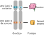
```

<br>


As informações contidas no DNA controlam processos dinâmicos, que sempre ocorrem em um contexto ambiental.

É a interação da informação genética com as variáveis ambientais através dos processos de desenvolvimento que geram os fenótipos.

Fenótipos emergem de processos dinâmicos geneticamente influenciados cujos resultados dependem de um contexto ambiental

<br>

```{r dynamicphenotype, echo = FALSE, fig.align = 'center', out.width="800px", fig.cap="A relação dinâmica entre genótipo e fenótipo, a partir da qual associações diretas nem sempre são possíveis."}
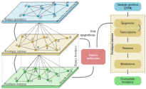
```

<br>

Considere os seguintes fenótipos de um organismo:

- Ser viável $\times$ ser inviável -- o fenótipo da **viabilidade**, a capacidade de um zigoto de completar seu desenvolvimento até a forma adulta.

Uma vez sendo viável:

- Estar-vivo $\times$ Estar-morto -- o fenótipo da **sobrevivência**, a habilidade do indivíduo adulto de sobreviver ao ambiente até se reproduzir.

Uma vez sendo viável e estando vivo:

- Produzir gametas $\times$ não produzir gametas -- o fenótipo da **fecundidade**, a habilidade de um indivíduo adulto vivo de prozuzir gametas capazes de gerar um zigoto.

Uma vez sendo viável, estando vivo e produzindo gametas:

- Gerar uma prole $\times$ não gerar uma prole -- o fenótipo da **fertilidade**, o número de descentes que um indivíduo adulto vivo e fecundo pode produzir no ambiente.

Viabilidade, sobrevivência, fecundidade e fertilidade são quatro fenótipos fundamentais na teoria microevolutiva, uma vez que coletivamente determinam as chances de um indivíduo passar seu DNA para a próxima geração no contexto do ambiente.

O fenótipo coletivo, produzido pelos quatro componentes, é chamado de **adaptabilidade reprodutiva** (ou _fitness_).

<br>

```{r fitness, echo = FALSE, fig.align = 'center', out.width="400px", fig.cap="A adaptabilidade (ou _fitness_) reprodutiva é mede a viabilidade, sobrevivência, fecundidade e fertilidade diferencial dos genótipos."}
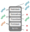
```

<br>

O fenótipo do _fitness_ une a **premissa 3** ("o DNA interage com o ambiente e produz fenótipos") com a **premissa 1** ("o DNA pode replicar"). 

O DNA pode se replicar somente no contexto de um indivíduo viável, sobrevivendo em um ambiente, fecundo e fértil o suficiente para passar seus genes para a próxima geração.

Esta unificação de premissas implica que a probabilidade da replicação do DNA é determinada pela interação do genótipo com o ambiente.

Em uma população de indivíduos geneticamente diversos, possível devido a **premissa 2** ("o DNA pode mutar e recombinar"), é possível que algumas variantes genotípicas irão interagir com o ambiente de forma a produzir mais ou menos atos de replicação de DNA do que outras variantes.

Assim, o ambiente influencia as chances relativas dos vários genótipos de replicar seu DNA.

A influência do ambiente (**premissa 3**) sobre a replicação do DNA (**premissa 1**) em populações geneticamente variáveis (**premissa 2**) é a base da seleção natural, e uma das maiores características emergentes da microevolução: a adaptação ao ambiente.

:::quote

**Adaptação** -- atributos e características dos organismos que os ajuda a sobreviver, reproduzir e deixar descendentes em ambientes específicos.

:::


<!--chapter:end:01_introducao.Rmd-->

# Histórico

Histórico da Genética de Populações

<br> 

## Evolução do pensamento evolutivo

<br> 

## Linha do tempo


<div class="flex-container">
  <div class="flex-item-left">
  **1809**
  </div>
  <div class="flex-item-mid">
  **Jean-Baptiste Lamarck** publica _Philosophie Zoologique_, apresentando novas idéias sobre o processo de evolução.
  </div>
  <div class="flex-item-right">
```{r TLlamarck2, echo = FALSE, fig.align = 'left', out.width="80px"}
knitr::include_graphics('https://upload.wikimedia.org/wikipedia/commons/thumb/a/a5/Jean-Baptiste_de_Lamarck.jpg/640px-Jean-Baptiste_de_Lamarck.jpg')
```
  </div>
</div>

<div class="flex-container">
  <div class="flex-item-left">
  **1830--1833**
  </div>
  <div class="flex-item-mid">
  **Charles Lyell** publica _Principles of Geology_, popularizando a idéia de que a Terra foi moldada por frças de ação lenta que ainda operam hoje em dia.
  </div>
  <div class="flex-item-right">
```{r TLlyell, echo = FALSE, fig.align = 'left', out.width="80px"}
knitr::include_graphics('https://maestrovirtuale.com/wp-content/uploads/2019/10/Sir_Charles_Lyell-e1544295605323.jpg')
```
  </div>
</div>

<div class="flex-container">
  <div class="flex-item-left">
  **1831--1836**
  </div>
  <div class="flex-item-mid">
  Charles Darwin serve como naturalista a bordo do **HMS Beagle**.
  </div>
  <div class="flex-item-right">
```{r TLbeagle, echo = FALSE, fig.align = 'left', out.width="80px"}
knitr::include_graphics('https://upload.wikimedia.org/wikipedia/commons/thumb/9/94/PSM_V57_D097_Hms_beagle_in_the_straits_of_magellan.png/1920px-PSM_V57_D097_Hms_beagle_in_the_straits_of_magellan.png')
```
  </div>
</div>

<div class="flex-container">
  <div class="flex-item-left">
  **1836--1858**
  </div>
  <div class="flex-item-mid">
  Darwin desenvolve suas idéias de que a evolução pode explicar a **descendência com modificação** por seleção natural.
  </div>
  <div class="flex-item-right">
```{r TLithink, echo = FALSE, fig.align = 'left', out.width="80px"}
knitr::include_graphics('http://darwin-online.org.uk/converted/scans/manuscript%20scans/1837-9_TransmutationNotebooks/DarwinArchive_1837_NotebookB_CUL-DAR121.-_038.jpg')
```
  </div>
</div>

<div class="flex-container">
  <div class="flex-item-left">
  **1842--1844**
  </div>
  <div class="flex-item-mid">
  O primeiro [ensaio](http://darwin-online.org.uk/content/frameset?itemID=F1556&viewtype=text&pageseq=1) de Darwin sobre seleção natural.
  </div>
  <div class="flex-item-right">
 
  </div>
</div>

<div class="flex-container">
  <div class="flex-item-left">
  **1858**
  </div>
  <div class="flex-item-mid">
  Darwin e **Alfred Russel Wallace** publicam artigos sobre seleção natural.
  </div>
  <div class="flex-item-right">
```{r TLwallace, echo = FALSE, fig.align = 'left', out.width="80px"}
knitr::include_graphics('https://upload.wikimedia.org/wikipedia/commons/thumb/d/d4/Alfred-Russel-Wallace-c1895.jpg/800px-Alfred-Russel-Wallace-c1895.jpg')
```
  </div>
</div>

<div class="flex-container">
  <div class="flex-item-left">
  **1859**
  </div>
  <div class="flex-item-mid">
  Darwin publica **_On the Origin of Species_**.
  </div>
  <div class="flex-item-right">
```{r TLorigins, echo = FALSE, fig.align = 'left', out.width="80px"}
knitr::include_graphics('http://darwin-online.org.uk/graphics/1859_Origin_Carroll.png')
```
  </div>
</div>

<div class="flex-container">
  <div class="flex-item-left">
  **1858--1900**
  </div>
  <div class="flex-item-mid">
  O estudo da evolução dominado por estudos de palentologia, desenvolvimento e morfologia
  </div>
  <div class="flex-item-right">
 
  </div>
</div>

<div class="flex-container">
  <div class="flex-item-left">
  **1866**
  </div>
  <div class="flex-item-mid">
  Gregor Mendel publica seu artigo sobre a genética das ervilhas. **Ernst Haeckel** publica seu diagrama da Árvore da Vida.
  </div>
  <div class="flex-item-right">
```{r TLhaeckel, echo = FALSE, fig.align = 'left', out.width="80px"}
knitr::include_graphics('https://upload.wikimedia.org/wikipedia/commons/8/8d/Ernst_Haeckel.jpg')
```
  </div>
</div>

<div class="flex-container">
  <div class="flex-item-left">
  **1900**
  </div>
  <div class="flex-item-mid">
  Redescoberta do trabalho de Mendel por múltiplos pesquisadores.
  </div>
  <div class="flex-item-right">
 
  </div>
</div>

<div class="flex-container">
  <div class="flex-item-left">
  **1900--1918**
  </div>
  <div class="flex-item-mid">
  Os princícios básica da herança genética são estabelecidos.
  </div>
  <div class="flex-item-right">
 
  </div>
</div>

<div class="flex-container">
  <div class="flex-item-left">
  **1908**
  </div>
  <div class="flex-item-mid">
  **T. H. Morgan** estabelece seus laboratório de _Drosophila_ na Universidade da Colúmbia; esclarece o papel dos cromossomos na herança.
  </div>
  <div class="flex-item-right">
```{r TLmorgan, echo = FALSE, fig.align = 'left', out.width="80px"}
knitr::include_graphics('https://upload.wikimedia.org/wikipedia/commons/thumb/8/8f/Thomas_Hunt_Morgan.jpg/800px-Thomas_Hunt_Morgan.jpg')
```
  </div>
</div>

<div class="flex-container">
  <div class="flex-item-left">
  **1918--1936**
  </div>
  <div class="flex-item-mid">
  Fundação da genética de populações por R. A. Fisher, J. B. S. Haldane e S. Wright.
  </div>
  <div class="flex-item-right">
 
  </div>
</div>

<div class="flex-container">
  <div class="flex-item-left">
  **1936--1947**
  </div>
  <div class="flex-item-mid">
  "Síntese Moderna" da genética e evolução.
  </div>
  <div class="flex-item-right">
 
  </div>
</div>

<div class="flex-container">
  <div class="flex-item-left">
  **1937**
  </div>
  <div class="flex-item-mid">
  **Theodosius Dobzhansky** publica _Genetics and the Origin of Species_.
  </div>
  <div class="flex-item-right">
```{r TLdobzhansky, echo = FALSE, fig.align = 'left', out.width="80px"}
knitr::include_graphics('https://static.wikia.nocookie.net/totalwar-ar/images/2/2f/Theodosius_Dobzhansky.jpg/revision/latest?cb=20190207151144')
```
  </div>
</div>

<div class="flex-container">
  <div class="flex-item-left">
  **1942**
  </div>
  <div class="flex-item-mid">
  **Ernst Mayr** publica _Systematics and the Origin of Species_.
  </div>
  <div class="flex-item-right">
```{r TLmayr, echo = FALSE, fig.align = 'left', out.width="80px"}
knitr::include_graphics('https://www.science.org/cms/10.1126/science.1100561/asset/69100ea6-49f5-447a-86b9-11e9d4a5f544/assets/graphic/46-1.gif')
```
  </div>
</div>

<div class="flex-container">
  <div class="flex-item-left">
  **1944**
  </div>
  <div class="flex-item-mid">
  **G. G. Simpson** publica _Tempo and Mode in Evolution_.
  </div>
  <div class="flex-item-right">
```{r TLsimpson, echo = FALSE, fig.align = 'left', out.width="80px"}
knitr::include_graphics('https://upload.wikimedia.org/wikipedia/en/c/c3/George_Gaylord_Simpson-en.jpg')
```
  </div>
</div>

<div class="flex-container">
  <div class="flex-item-left">
  **1947--1960**
  </div>
  <div class="flex-item-mid">
  Ênfase ne evolução dos cromossomos, modelos de especiação, variação geográfica, continuação do desenvolvimento da genética de populações.
  </div>
  <div class="flex-item-right">
 
  </div>
</div>

<div class="flex-container">
  <div class="flex-item-left">
  **1950**
  </div>
  <div class="flex-item-mid">
  Willi Hennig publica _Grundzüge einer Theorie der phylogenetischen Systematik_. **G. L. Stebbins** publica _Variation and Evolution in Plants_.
  </div>
  <div class="flex-item-right">
```{r TLstebbins, echo = FALSE, fig.align = 'left', out.width="80px"}
knitr::include_graphics('https://upload.wikimedia.org/wikipedia/en/f/fa/G_Ledyard_Stebbins.jpg')
```
  </div>
</div>

<div class="flex-container">
  <div class="flex-item-left">
  **1953**
  </div>
  <div class="flex-item-mid">
  **James Watson** e **Francis Crick** publicam seu artigo sobre a estrutura do DNA.
  </div>
  <div class="flex-item-right">
```{r TLwatsoncrick, echo = FALSE, fig.align = 'left', out.width="80px"}
knitr::include_graphics('https://www.sciencehistory.org/sites/default/files/styles/rte_full_width/public/watson-crick-dna-model.jpg')
```
  </div>
</div>

<div class="flex-container">
  <div class="flex-item-left">
  **1959**
  </div>
  <div class="flex-item-mid">
  **Bernhard Rensch** publica _Evolution above the Species Level_.
  </div>
  <div class="flex-item-right">
```{r TLrensch, echo = FALSE, fig.align = 'left', out.width="80px"}
knitr::include_graphics('https://upload.wikimedia.org/wikipedia/en/f/f2/Bernhard_Rensch.jpg')
```
  </div>
</div>

<div class="flex-container">
  <div class="flex-item-left">
  **1960--1980**
  </div>
  <div class="flex-item-mid">
  Introdução dos estudos moleculares da variação; desenvolvimento de métodos quantitativos explícitos para análise filogenética; avanços no conhecimento sobre seleção sexual, evolução do comportamento e co-evolução.
  </div>
  <div class="flex-item-right">
 
  </div>
</div>

<div class="flex-container">
  <div class="flex-item-left">
  **1962**
  </div>
  <div class="flex-item-mid">
  **Emile Zuckerkandl** e **Linus Pauling** publicam sua hipótese de relógio molecular.
  </div>
  <div class="flex-item-right">
```{r TLzuckerpauling, echo = FALSE, fig.align = 'left', out.width="80px"}
knitr::include_graphics('https://www.darwinthenandnow.com/wp-content/uploads/2010/01/zuckerkandlpauling-300x199.jpg')
```
  </div>
</div>

<div class="flex-container">
  <div class="flex-item-left">
  **1968**
  </div>
  <div class="flex-item-mid">
  **Motoo Kimura** publica sua teoria neutra da evolução molecular.
  </div>
  <div class="flex-item-right">
```{r TLkimura, echo = FALSE, fig.align = 'left', out.width="80px"}
knitr::include_graphics('https://upload.wikimedia.org/wikipedia/en/4/48/Motoo_Kimura.jpg')
```
  </div>
</div>

<div class="flex-container">
  <div class="flex-item-left">
  **1970**
  </div>
  <div class="flex-item-mid">
  **Susumu Ohno** publica _Evolution by Gene Duplication_.
  </div>
  <div class="flex-item-right">
```{r TLohno, echo = FALSE, fig.align = 'left', out.width="80px"}
knitr::include_graphics('https://nap.nationalacademies.org/openbook/0309084768/xhtml/images/p20005c54g234001.jpg')
```
  </div>
</div>

<div class="flex-container">
  <div class="flex-item-left">
  **1975**
  </div>
  <div class="flex-item-mid">
  **E. O. Wilson** publica _Sociobiology_.
  </div>
  <div class="flex-item-right">
```{r TLwilson, echo = FALSE, fig.align = 'left', out.width="80px"}
knitr::include_graphics('https://citacoes.in/media/authors/edward-o-wilson_0vIfONC.jpeg')
```
  </div>
</div>

<div class="flex-container">
  <div class="flex-item-left">
  **1975--1979**
  </div>
  <div class="flex-item-mid">
  Desenvolvimento métodos rápidos para o sequênciamento de DNA.
  </div>
  <div class="flex-item-right">
```{r TLsequencing, echo = FALSE, fig.align = 'left', out.width="80px"}
knitr::include_graphics('https://iiif.wellcomecollection.org/image/B0004963/full/880%2C/0/default.jpg')
```
  </div>
</div>

<div class="flex-container">
  <div class="flex-item-left">
  **1980--presente**
  </div>
  <div class="flex-item-mid">
  Aumento exponencial dos estudos de evolução, especialmente evolução molecular, aplicações filogenéticas, estudos experimentais e processos evolutivos do  desenvolvimento.
  </div>
  <div class="flex-item-right">
 
  </div>
</div>

<br> 

## Principais pensadores

<br> 

### Charles Darwin

<br>

```{r darwin, echo = FALSE, fig.align = 'right', out.width = "300px", fig.cap="[Charles Darwin](https://en.wikipedia.org/wiki/Charles_Darwin) (1809--1882),naturalista inglês."} 
knitr::include_graphics('https://upload.wikimedia.org/wikipedia/commons/thumb/2/2e/Charles_Darwin_seated_crop.jpg/640px-Charles_Darwin_seated_crop.jpg')
```

<br>

Sobre a Origem das Espécies por Meio da Seleção Natural, ou a Preservação de Raças Favorecidas na Luta pela Vida (1859) -- [_On the Origin of Species_](http://darwin-online.org.uk/content/frameset?itemID=F373&viewtype=side&pageseq=1).

As espécies evoluem gradualmente por seleção natural.

Herança por miscigenação

<br> 

### Gregor Mendel

<br>

```{r mendel, echo = FALSE, fig.align = 'right', out.width = "300px", fig.cap="[Gregor Mendel](https://en.wikipedia.org/wiki/Gregor_Mendel) (1822--1884), monge austríaco."} 
knitr::include_graphics('https://upload.wikimedia.org/wikipedia/commons/thumb/b/ba/Gregor_Mendel_2.jpg/640px-Gregor_Mendel_2.jpg')
```

<br>

Experimentos em Hibridização de Plantas (1865)

Leis da hereditariedade. 

Herança particulada.

<br> 

### A redescoberta de Mendel

Redescoberta do trabalho de Mendel no início do século XX.

Confirmação da hereditariedade particulada 30 anos depois.

<div class="flex-container">
  <div class="flex-item-left">
```{r Tschermak, echo = FALSE, fig.align = 'left', out.width="80px"}
knitr::include_graphics('https://upload.wikimedia.org/wikipedia/commons/6/6c/Acta_Horti_berg._-_1905_-_tafl._124._-_Erich_Tschermak.jpg')
```
  </div>
  <div class="flex-item-mid">
  [Erich von Tschermak](https://en.wikipedia.org/wiki/Erich_von_Tschermak) (1871--1962), agrônomo austríaco.
  </div>
  <div class="flex-item-right">

  </div>
</div>

<div class="flex-container">
  <div class="flex-item-left">
```{r DeVries, echo = FALSE, fig.align = 'left', out.width="80px"}
knitr::include_graphics('https://upload.wikimedia.org/wikipedia/commons/thumb/e/e5/Hugo_de_Vries.jpg/800px-Hugo_de_Vries.jpg')
```
  </div>
  <div class="flex-item-mid">
  [Hugo de Vries](https://en.wikipedia.org/wiki/Hugo_de_Vries) (1848--1935), botânico holandês.
  </div>
  <div class="flex-item-right">

  </div>
</div>

<div class="flex-container">
  <div class="flex-item-left">
```{r Correns, echo = FALSE, fig.align = 'left', out.width="80px"}
knitr::include_graphics('https://upload.wikimedia.org/wikipedia/commons/thumb/8/8e/Carl_Correns_1910s.jpg/448px-Carl_Correns_1910s.jpg')
```
  </div>
  <div class="flex-item-mid">
  [Carl Correns](https://en.wikipedia.org/wiki/Carl_Correns) (1864--1933), botânico alemão.
  </div>
  <div class="flex-item-right">

  </div>
</div>

<div class="flex-container">
  <div class="flex-item-left">
```{r Spillman, echo = FALSE, fig.align = 'left', out.width="80px"}
knitr::include_graphics('https://upload.wikimedia.org/wikipedia/commons/thumb/8/8d/William_Jasper_Spillman_%281863-1931%29.jpg/414px-William_Jasper_Spillman_%281863-1931%29.jpg')
```
  </div>
  <div class="flex-item-mid">
  [William J. Spillman](https://en.wikipedia.org/wiki/William_Jasper_Spillman) (1863--1931), agrônomo estadunidense.
  </div>
  <div class="flex-item-right">

  </div>
</div>

<br>

### Ronald A. Fisher 

<br>

```{r fischer, echo = FALSE, fig.align = 'right', out.width = "300px", fig.cap="[Ronald A. Fisher](https://en.wikipedia.org/wiki/Ronald_Fisher) (1890--1962), matemático britânico."} 
knitr::include_graphics('https://upload.wikimedia.org/wikipedia/commons/a/aa/Youngronaldfisher2.JPG')
```

<br>

A teoria genética da seleção natural (1930)

Genética quantitativa

<br> 

### J. B. S. Haldane 

<br>

```{r haldane, echo = FALSE, fig.align = 'right', out.width = "300px", fig.cap="[J. B. S. Haldane](https://en.wikipedia.org/wiki/J._B._S._Haldane) (1892--1964), geneticista britânico."} 
knitr::include_graphics('https://www.marxists.org/portugues/haldane/img/haldane.jpg')
```

<br>

Uma teoria matemática da seleção natural e artificial (1924)

Melanismo industrial em _Biston betularia_.

;;;quote

_Na consideração da evolução, uma teoria matemática pode ser considerada como um tipo de andaime dentro do qual uma teoria razoavelmente segura, expressável em palavras, pode ser construída_. ([Haldane 1964](https://doi.org/10.1093/ije/dyn056))

:::


<br> 

### Sewall Wright

<br>

```{r wright, echo = FALSE, fig.align = 'right', out.width = "300px", fig.cap="[Sewall Wright](https://en.wikipedia.org/wiki/Sewall_Wright) (1889--1988), geneticista estadunidense."} 
knitr::include_graphics('https://cdn.britannica.com/78/41278-004-5D2683FD/Sewall-Wright-1965.jpg')
```

<br>

Evolução em populações mendelianas (1931)

Deriva gênica > Seleção natural

Paisagem adaptativa.


<!--chapter:end:02_historico.Rmd-->

# Polimorfismo Genéticos e Marcadores Moleculares

<br>

```{r Erythrura, echo = FALSE, fig.align = 'center', out.width="400px", fig.cap="Uma pequena região gênica controla as mudanças de cor na cabeça dos tentilhões de Gould (_Erythrura gouldiae_). Ilustrado em Des Murs ([1849](https://www.biodiversitylibrary.org/item/109479#page/9/mode/1up)). Ver também Toomey et al. ([2018](https://doi.org/10.1098/rspb.2018.1788)) e Kim et al. ([2019](https://doi.org/10.1038/s41467-019-09806-6))"}
knitr::include_graphics('https://ia800502.us.archive.org/BookReader/BookReaderImages.php?id=Iconographieorn00DesMA&itemPath=%2F26%2Fitems%2FIconographieorn00DesMA&server=ia800502.us.archive.org&page=n318_w525')
```

<br>

## Mutações $\times$ Polimorfismos 

Uma **mutação** é uma variante nova, tendo aparecido recentemente na linhagem germinativa.

Uma variante é dita mutante quando direta e abertamente causa uma doença e/ou reduz a aptidão.

Um **polimorfismo** é uma variante ancestral em uma população, herdada intacta dos parentais.

Uma variante é dita polimórfica quando não causa doença, é neutra, ou influência levemente características quantitativas.

Uma mutação em uma população pode se tornar um polimorfismo em outra se conferir uma vantagem seletiva e aumentar em freqüência.

Arbitrariamente, mutações e polimorfismos são definidos com base nas suas frequêcnias em uma população, onde:

$${Mutação} < 1 \%$$

<br>

$${Polimorfismo} > 1 \%$$

<br>

A **Genética mendeliana** aborda associações entre Fenótipo e Genótipo, estando restrita a um pequeno número de espécies modelo. Nesta somente um número reduzido de características estão disponíveis para análise por meio de **polimoefismos genéticos**, que comumente estão associadas à características recessivas deletérias.

A **Genética molecular** envolve a análise direta da informação genética, e pode abranger todas as espécies. Nesta está disponível um número enorme de **marcadores moleculares**, permitindo a análise de regiões expressas e não expressas do genoma.

:::quote

**Polimorfismos genéticos** -- A ocorrência em uma população (ou entre populações) de várias formas fenotípicas associadas a alelos de um gene ou homólogos de um cromossomo.

**Marcadores moleculares** -- Todo e qualquer fenótipo molecular oriundo de um gene expresso (RNA ou proteína) ou de um segmento de DNA que corresponde a regiões codificantes ou não de um genoma.

:::

<br>

```{r polymarker, echo = FALSE, fig.align = 'center', out.width="600px", fig.cap="As informações genéticas usadas em estudos populacionais podem ser obtidas a partir de polimorfismos genéticos e marcadores moleculares."}
knitr::include_graphics("figs/polimorfismos_marcadores.svg")
```

<br>


## Dinâmica evolutiva e ecológica dos polimorfismos

<br>

```{r evodinamica, echo = FALSE, fig.align = 'center', out.width="600px", fig.cap="Ao longo das geraçoes (tempo), variantes genéticas podem surgir (I) e desaparecer (III), enquanto sao (IV) ou não (II) estruturadas / influenciadas pelos ambientes (espaço)."}
knitr::include_graphics("figs/dinamicas_evolutivas_tempo.svg")
```

<br>

I. Surgimento de novas variantes genéticas (Mutação).

II. Variantes restritas geograficamente se dispersam ao longo dos ambientes (fluxo gênico).

III. Perda de variantes genéticas (deriva / seleção).

IV. Organização da variação ao longo de um gradiente ambiental / geográfico (seleção).


## Evolução dos polimorfismos em diferentes escalas

Na microevolução, marcadores moleculares dizem respeito a variantes genéticas encontradas em populações de uma mesma espécie, sendo utilizadas em genética de populações. 

Na macroevolução, esses marcadores correspodem a regiões gênicas homólogas  (ortólogas) de diferentes espécies, que acúmulam mutações ao longo do tempo, e podem ser utilizados em filogenética.

<br>

:::quote 

**Anagênese** -- Evolução dentro de um ramo evolutivo.

**Cladogênese** -- Evolução entre ramos evolutivos.

::: 

<br>

```{r genearvore, echo = FALSE, fig.align = 'center', out.width="400px", fig.cap="As mudanças evolutivas ao longo das gerações (anagênese) em relação ao processo de diversificação (cladogênese)."}
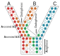
```

<br>

A evolução de sequências de DNA, e dos produtos por elas codificados, é produto dos padrões e taxas de mudança ao longo do tempo evolutivo.

Assim, diferentes questões podem e devem ser abordadas por diferentes marcadores moleculares. 

Estudos multi-loci evidenciam conflitos e corroboram congruências entre as histórias evolutivas das diferentes regiões gênicas.

```{r geneconflito, echo = FALSE, fig.align = 'center', out.width="800px", fig.cap="Diferentes marcadores 'contam' diferentes histórias evolutivas, que nem sempre estão de acordo com o processo de diversificação."}
knitr::include_graphics("figs/genealogy_conflict.svg")
```

<br>

## Padrões de herança

A localização genômica de uma região gênica pode determinar diferentes padrões de herança.

- Herança biparental -- genes co-dominantes (contribuição de ambos os sexos) em regiões gênicas nucleares autossômicas e pseudo-autossômicas; essas regiões sofrem recombinação na meiose.

- Herança uniparental -- genes dominantes (contribuiçao de somente um dos sexos) em regiões gênicas nucleares no cromossomo Y (herança patrilinear) e extra-nucleares no DNA mitocondrial (herança matrilinear); essas regiões não sofrem recombinação.

<br>

```{r tiposheranca, echo = FALSE, fig.align = 'center', out.width="800px", fig.cap="Os padrões de herança biparental e uniparental em regiões gênicas autossômicas (nuclear) e mitocondriais (extra-nuclear)."}
knitr::include_graphics("figs/inheritance_types_genealogy.svg")
```

<br>

## Taxas de mutação

A função ou estrutura de uma região gênica pode determinar diferentes taxas de mutação.

- Regiões funcionais ou codificantes  -- baicas taxas mutacionais pois sofrem uma pressão de seleção (positivas ou negativas) dependente da importância da função para a célula/organismo. 

- Regiões não-funcionais ou não-codificantes -- apresentam acúmulo de mutações devido às baixas pressões seletivas (neutras).

- Regiões de repetição _in tandem_ -- evolução por derrapagem (_slippage_) da replicacão; mutações dinâmicas a cada ciclo replicativo. 

<br>

```{r relogiomolecular, echo = FALSE, fig.align = 'center', out.width="600px", fig.cap="As taxas de mutação em genes codificantes de proteínas estão relacionadas à função desses genes devido a diferentes pressões de seleção."}
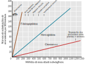
```

<br>

## Marcadores moleculares

A seguir são apresentados os principais marcadores utilizados em genética de populações.

A popularidade desses marcadores ao longo dos anos está diretamente relacionado a relação custo-benefício das metodologias de análise associadas. Com o desenvolvimento de novas metodologias ocorre o barateamento dos custos de análise de última geração, capazes de analisar múltiplos marcadores ao mesmo tempo, e gerar estudos mais compreensivos.

<br>

```{r markeryear, echo = FALSE, fig.align = 'center', out.width="800px", fig.cap="Popularidade ao longo dos anos de diferentes marcadores moleculares na genética de populações desde o surgimento da biologia molecular, no século XX, até o início do século XXI. Ver Schlötterer ([2004](https://doi.org/10.1038/nrg1249)) e Seeb et al. ([2011](https://doi.org/10.1111/j.1755-0998.2010.02979.x))"}
knitr::include_graphics("figs/markers_year.svg")
```

<br>

### Aloenzimas

A análise de aloenzimas (ou alozimas) baseia-se na migração diferencial em eletroforese de enzimas com cargas e tamanhos diferentes devido as modificações subjacentes nas sequências de bases desses genes. 

Esses marcadores geralmente envolvem enzimas que desempenham funções muito básicas, podendo ser encontradas em quase todas as formas de vida, sendo asism um método de análise universal.

A detecção da variação genética se baseia na revelação por coloração histoquímica, a partir da qual podem ser visualizadas bandas correspondentes aos fenótipos bioquímicos dessas enzimas.

Como marcadores moleculares, as aloenzimas são co-dominantes.

Os polimorfismos ocorrem necessariamente em regiões codificantes, podendo ser neutros ou com efeitos positivos ou negativos no fenótipo do indivíduo. 

<br>

```{r allozymes, echo = FALSE, fig.align = 'center', out.width="800px", fig.cap="Esquema da eletroforese de marcadores de aloenzimas monoméricas e diméricas e seus genótipos associados. Isoenzimas estão identificadas por cores diferentes. Ver Wendt et al ([2009](https://doi.org/10.1590/S1516-89132009000600016))."}
knitr::include_graphics("figs/allozymes.svg")
```

<br>

| Vantagens   | Desvantagens |
| :--:        | :--:         |
| Barato      | Requer material fresco ou congelado |
| Protocolos universais | Alguns loci apresentam proteínas instáveis |
|             | Número limitado de marcadores disponíveis |
|             | Potencialmente alvos diretos de seleção (fenótipo bioquímico) |

<br>

### RFLP

Polimorfismos de Tamanho de Fragmento de Restrição

Polimorfismos detectados gerados por digestão enzimática com endonucleases de DNA genômico ou amplificado por PCR. 

Como marcadores moleculares, são tipicamente neutros e podem ser co-dominantes ou dominantes.

Diferentes endonucleases apresentam sítios de ligação e corte do DNA diferentes.

Análise direta de mutações nos sítios de reconhecimento de endonucleases por meio de mudanças no tamanho dos fragmentos gerados em padrões eletroforéticos

<br>

```{r rflp, echo = FALSE, fig.align = 'center', out.width="800px", fig.cap="Polimorfismos de tamanho de fragmentos de restrição (RFLPs). Na esquerda, o mecanismo de clivagem da enzima de Restrição _Eco_RI. Na direita, a digestão _in silico_ do gene 16S do DNA ribossomal de um fitoplasma do subgrupo 16SrII-C usando diferentes enzimas de restrição (PM, marcador de peso molecular)."}
knitr::include_graphics("figs/restriction_enzyme.svg")
```

<br>

| Vantagens   | Desvantagens |
| :--:        | :--:         |
| Barato      | Baixa reprodutibilidade |
| Grande número de informações que podem ser refinadas posteriormente | Majoritariamente dominante |
|             | Análise, automação e comparações entre estudos difíceis |

<br>

### Sequência de nucleotídeos

Cada posição da sequência pode ser informacional.

As sequências de DNA são marcadores tipicamente neutros e dominantes, que podem ser utilizados para análises populacionais e filogenéticas.

Estas podem definir alelos ou haplótipos, e as posições podem ser usadas para tabular caractéres, onde cada nucleotídeo corresponde a um estado de caráter.

<br>

```{r DNAhaplotypes, echo = FALSE, fig.align = 'center', out.width="400px", fig.cap="Sequência de nucleotídeos de DNA alinhados entre sete indivíduos. "}
knitr::include_graphics("figs/DNAseq_haplotypes.svg")
```

<br>

| Vantagens   | Desvantagens |
| :--:        | :--:         |
| Maior nível possível de resolução      | Muito caro |
| Não-tendenciado |   | 
| Facilidade de comparaÇão entre estudos e formação de bancos de dados  |   |

<br>

### SNPs

Polimorfismos de nucleotídeo único ou Polimorfismos de um único nucleotídeo

Representam uma variação de um único par de base em uma região gênica específica, mas alguns autores consideram substituições de poucos nucleotídeos ou mesmo inserções e deleções como SNPs.

Como marcadores moleculares, são co-dominantes.

Estes polimorfismos podem ou não ocorrer em regiões codificantes, podendo ser neutros ou com efeitos positivos ou negativos no fenótipo do indivíduo. 

SNPs são ditos causativos quando alteram a quantidade ou a função de proteínas por ocorrerem em regiões regulatórias e codificantes, ou podem estar ligados a estas, sem efeito no fenótipo. 

SNPs são muito numerosos no genoma (_ca._ 1:300 pb em humanos). Estima-se que 90% da variação genética intraespecífica se deva a estes polimorfismos e que cada indivíduo apresente um arranjo genômico único em relação a eles.

<br>

```{r SNPs, echo = FALSE, fig.align = 'center', out.width="400px", fig.cap="Polimorfismos de nucleotídeo único em uma região do DNA e sua frequência em uma população. "}
knitr::include_graphics("figs/SNPs_scheme.svg")
```

<br>

| Vantagens   | Desvantagens |
| :--:        | :--:         |
| Baixa taxa de mutação   | Substancial heterogeidade nas taxas de evolutivas |
| Abundância | Desenvolvimento caro  | 
| Fácil caracterização  | Podem estar tendenciados  |
| Novas abordagens de análise em constante desenvolvimento  |Baixo nível de informação; dependente do número de loci |
| Facilidade de comparaÇão entre estudos e formação de bancos de dados  |   |

<br>


### Microssatelites

Repetições de Sequências Simples (SSRs) ou 
Repetições Curtas em Série (STR)

São regiões gênicas polimórficas que consistem de unidades de sequências curtas de DNA de 2-6 pb repetidas _in tandem_. 

Como marcadores moleculares, são co-dominantes e geralmente neutros.

As frequências de um lócus microssatélite com $n$ repetições geralmente apresentam uma alta variância (evolução por mutações dinâmicas; _slippage_ da replicação) e um forte caráter populacional. 

<br>

Por exemplo, a sequência:

$$\underline{TCCCAAGCTCTTC}CTCTTCCCTAGATCAATACAGACAGAAGACAGGTG\color{red}{GATAGATAGATAGATAGATAGATAGATAGATAGATAGATAGATAGATA}TCATTGAAAGACAAAACAGAGATGGATGATAGATACATGCT\underline{TACAGATGCACAC}$$

tem $12$ repetições do tetranucleotídeo de DNA $\color{red}{GATA}$, ou $\left( {GATA} \right)_{12}$.

<br>

A depender do número de nucleotídeos na unidade de repetição, os microssatélites são formados por repetições de:

${Dinucleotídeo} \rightarrow \left( {CA} \right)_{n}$

${Trinucleotídeo} \rightarrow \left( {GCC} \right)_{n}$

${Tetranucleotídeo} \rightarrow \left( {AATG} \right)_{n}$

${Pentanucleotídeo} \rightarrow \left( {AGAAA} \right)_{n}$

${Hexanucleotídeo} \rightarrow \left( {AGTACA} \right)_{n}$

<br>

A análise multi-loci de microssatélites permite inferências em nível individual (_fingerprinting_) e possui aplicações como marcadores para estudos de parentesco e populacionais.

<br>

```{r microsatellites, echo = FALSE, fig.align = 'center', out.width="800px", fig.cap="Os microssatélites evoluem sobretudo por mutações de derrapagem da replicação (esquerda), o que promove a instabilidade do número de repetições nessas regiões (direita)."}
knitr::include_graphics("figs/microsatellites.svg")
```

<br>

<br>

| Vantagens   | Desvantagens |
| :--:        | :--:         |
| Altamente informativo   | Alta taxa de mutação |
| Baixo nível de tendenciamento | Comportamento mutacional complexo  | 
| Novas abordagens de análise em constante desenvolvimento | Pouco abundantes |
| Facilidade de comparaÇão entre estudos e formação de bancos de dados | Automação e comparações entre estudos difíceis  |

<br>


## Tipo de dados

<br>

```{r mainmarkers, echo = FALSE, fig.align = 'center', out.width="800px", fig.cap="Comparação entre os principais marcadores moleculares tradicionalmente usados em genética de populações."}
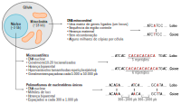
```

<br>


## Bancos de dados públicos

**_NCBI - GenBank_**

https://www.ncbi.nlm.nih.gov/genbank/

<br>

**_SNP Database_**

https://www.ncbi.nlm.nih.gov/projects/SNP/

<br>

**_Barcode of Life Data Systems_**

http://www.boldsystems.org/

<br>

**_1000 Genomes Project_**

http://www.internationalgenome.org/


<!--chapter:end:03_marcadores.Rmd-->

# Variação e Diversidade Genética

<br>

```{r liguus, echo = FALSE, fig.align = 'center', out.width="400px", fig.cap="A distribuição de alelos e a baixa diversidade genética no caramujo da Flórida (_Liguus fasciatus_) apóia a visão de uma única espécie parcialmente autofecundante que se diversificou na Flórida após um único evento fundador. Ver Hillis et al ([1991](https://doi.org/10.1093/oxfordjournals.jhered.a111087))"} 
knitr::include_graphics("figs/Liguus_fasciatus_Hillis.png")
```

<br>

## Genética mendeliana $\times$ Genética de populações

A **genética mendeliana** estuda o comportamento de um ou mais loci gênicos em cruzamentos simples.

Nesta, dois parentais intercruzantes contribuem cada com um alelo por locus, e Os resultados esperados são proporções mendelianas das características fenotípicas.

<br>

```{r mendeliano, echo = FALSE, fig.align = 'center', out.width="600px", fig.cap="Exemplos de proporções mendelianas em características co-dominantes (1:2:1) e dominantes (3:1)."} 
knitr::include_graphics("figs/traços_mendelianos.svg")
```

<br>

Por outro lado, a **genética de populações** visa estudar o comportamento de um ou mais loci gênicos em múltiplos cruzamentos, _i. e._, em proporções populacionais.

Para tal, as informações genéticas do **_pool_ gênico** de um ou mais **demes** constituindo **unidades panmíticas** são analisados a partir de **amostras** populacionais. 

<br>

:::quote

**_pool_ gênico** --  (Unidade genética) Todos os alelos em um ou mais loci gênicos.
	
**deme** -- (Unidade ecológica ou demográfica) Grupo de indivíduos em uma dada área geográfica.

**unidade panmítica** -- (Unidade reprodutiva) Grupo de indivíduos intercruzantes ao acaso.

**amostra** -- (Unidade estatística) Subconjunto de tamanho $n$ de uma população de tamanho $N$, a partir do qual  parâmatros são estimados, e inferências são feitas. 

:::

<br>

## Frequências genotípicas

Considere um locus autossômico diplóide com dois alelos $A$ e $a$, sem dominância. 

Em uma população $N$, deixe ser o número de indivíduos dos genótipos $AA = x$, $Aa = y$ e $aa = z$, de forma que:

$$x + y + z = N$$

<br>

Logo, as frequências genotípicas observadas na população serão:

- para os homozigotos dominates ($AA$):

$$f_{Obs}(AA) = \frac{x}{N}$$

<br>

- para os heterozigotos ($Aa$):

$$f_{Obs}(Aa) = \frac{y}{N}$$

<br>

- e para os homozigotos recessivos ($aa$):

$$f_{Obs}(aa) = \frac{z}{N}$$

<br>

## Frequências alélicas

As frequências alélicas (ou gênicas) podem ser definidas como:

\begin{equation} 
f(A) = p = \frac{2x + y}{2N} = f(AA) + ½f(Aa)
  (\#eq:freqp)
\end{equation} 

<br>

e

\begin{equation} 
f(a) = q = \frac{2z + y}{2N} = f(aa) + ½f(Aa)
  (\#eq:freqq)
\end{equation} 

<br>

De forma que,

\begin{equation} 
p + q = 1
  (\#eq:poolgene)
\end{equation} 

<br>

As frequências $p$ e $q$ são convenções, intercambiáveis em relação aos alelos $A$ e $a$.
	
Contudo, $q$ é geralmente usado para alelos recessivos, mutantes, raros ou desvantajosos.

<br>

:::quote

**Dominante e recessivo** -- propriedades fenotípicas.

**Selvagem e mutante** -- propriedades ontológicas.

**Comum e raro** -- propriedades estatísticas.

**Vantajoso e desvantajoso** -- propriedades evolutivas.

:::

<br>

\linebreak

## Generalização das frequências genotípicas e alélicas

Considere um locus autossômico diplóide com $i$ alelos, sem dominância. 

As frequências genotípicas observadas são:

$$f_{Obs}(A_1A_1) = \frac{N_{A_1A_1}}{N}$$

<br>

$$f_{Obs}(A_1A_2) = \frac{N_{A_1A_2}}{N}$$
<br>

$$...$$

<br>

$$f_{Obs}(A_1A_i) = \frac{N_{A_1A_i}}{N}$$
<br>

$$...$$
<br>

$$f_{Obs}(A_iA_i) = \frac{N_{A_iA_i}}{N}$$

As frequências alélicas serão:

$$f(A_1)  = a_1 =   f(A_1A_1) + ½ f(A_1A_2) + … + ½ f(A_1A_i)$$

<br>

$$f(A_2)  = a_2 =   f(A_2A_2) + ½ f(A_1A_2) + … + ½ f(A_2A_i)$$

<br>

$$...$$

<br>

$$f(A_i)  = a_i =   f(A_iA_i) + ½ f(A_1A_i) + … + ½ f(A_iA_i)$$
De forma que:

$$a_1 \ + a_2 \ + \ ... \ + \ a_i = 1$$

<br>

## Heterozigoside

A heterozigosidade (ou heterozigose) observada ($H_{Obs}$) de uma população é a freqüência de heterozigotos em um dado locus gênico.

Dada as definições de frequências [genotípicas][Frequências genotípicas] e [alélicas][Frequências genotípicas], para um lócus bialélico, temos que:  

$$H_{Obs} = \frac{y}{N} = f(Aa) =  1 – f(AA) – f(aa)$$

<br>

Esta estimativa é muito útil para avaliarmos a diversidade genética de uma população natural, uma vez que uma alta heterozigosidade quase sempre está relacionada a uma alta variabilidade genética, e vice-versa.
 

A heterozigosidade observada ($H_{Obs}$) é geralmente contrastada com a expectativa da heterozigosidade dado o [princípio de Hardy-Weinberg][Princípio de Hardy-Weinberg].

Essa heterozigosidade esperada ($H_{Esp}$) pelo princípio de Hardy-Weinberg pode ser interpretada como a probabilidade de que um indivíduo seja heterozigoto para um determinado locus gênico (ver [Modelando o princípio de Hardy-Weinberg]{Modelando o princípio de Hardy-Weinberg})

Sendo,

$$H_{Esp} = 2pq =  1 – p^2 – q^2$$

<br>

Quando $H_{Obs} \neq H_{Esp}$, forças evolutivas podem estar atuando nas populações.

<br>

## Diversidade gênética

<br>

```{r zea, echo = FALSE, fig.align = 'center', out.width="800px", fig.cap="O milho (_Zea mays_) foi domesticado pela primeira vez por povos indígenas no sul do México há cerca de 10.000 anos e espalhado para as Américas. A maioria desses grãos tradicionais corre o risco de ser perdido e esquecido. Uma parcela significativa de diversidade no milho é devida à recombinação genética."} 
knitr::include_graphics('https://pbs.twimg.com/media/DdziLo1U0AEPdfJ.png')
```

:::reference

Matsuoka et al. 2002. doi: [10.1073/pnas.052125199](https://doi.org/[10.1073/pnas.052125199)

Vigouroux et al. 2003. doi: [10.1093/molbev/msg156](https://doi.org/10.1093/molbev/msg156)

Piperno 2011. doi: [10.1086/659998](https://doi.org/10.1086/659998)

:::

<br>

Na linguagem comum, a variabilidade genética e a diversidade genética são erroneamente consideradas sinônimos entre si. 

A **variabilidade genética** é a variação nos alelos dos genes ou nas sequências de DNA no pool gênico de uma espécie ou população. Isso se expressa em termos de formas alternativas no fenótipo. 

A **Diversidade genética**, por outro lado, é um termo amplo que abrange toda a variabilidade que ocorre entre os diferentes genótipos relacionados a uma única espécie ou entre espécies. 

Como definido por Swingland ([2013](https://doi.org/10.1016/B978-0-12-384719-5.00009-5)), diversidade genética é a variação de características hereditárias presentes em uma população da mesma espécie; podendo essa variação se expressar na forma de alterações na morfologia, anatomia, comportamento fisiológico ou características bioquímicas. 

A diversidade genética pode ser medida contando o número de genes diferentes em um pool gênico. Por sua vez, a variação genética só pode ocorrer e não pode ser medida, podendo ser considerada como unidade básica da diversidade genética. 

<br>

```{r setXeY, echo = FALSE, fig.align = 'center', out.width="400px", fig.cap="Exemplo de dois conjuntos com diferentes níveis de variação e diversidade. Quando há variação nos elementos ($A$, $B$, $C$ e $D$), o conjunto ($X$ e $Y$) é mais diverso"} 
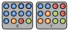
```

<br>

Alguns autores consideram a diversidade genética ($D$) de um locus como a heterozigosidade esperada (H_{Esp}) daquele lócus, _i. e._, a proporção de genótipos heterozigotos dada a expectativa do princípio de Hardy-Weinberg.

Nesse sentido, a diversidade genética é composta de dois parâmetros:

- o número de alelos na população, e

- a abundância (ou uniformidade) dos alelos.

<br>

### Exemplo 

Se uma população consiste em um excesso de homozigotos para diferentes alelos, isso leva a uma baixa heterozigose observada, mas não afeta a heterozigose esperada.

| População 2                                         |  População 2                                        |
|                    :---:                            |                   :---:                             |
| $P_1 = \left\{ AA, BB, CC, DD \right\}$             | $P_2 = \left\{ AB, AB, AB, AB \right\}$             |
| $f(A) = f(B) = f(C) = f(D) = 0.25$                  | $f(A) = f(B) = 0.50$                                |
| $H_{Obs} = 0.00$                                    | $H_{Obs} = 1.00$                                    |
| $H_{Esp} = 1 – 4(0.25)^2 = 0.75$                    | $H_{Esp}  = 1 – 2(0.5)^2 = 0.50$                    |

<br>

Assim, se uma população apresenta um excesso de homozigotos para diferentes alelos, isso leva a uma baixa heterozigosidade observada, mas não afeta a heterozigose esperada.

<br>

## Determinantes da diversidade genética

<br>

### Extratégias reprodutivas

<br>

```{r diversitylifestrategy, echo = FALSE, fig.align = 'center', out.width="400px", fig.cap="Animais estrategistas r são mais polimórficos do que estrategistas K. A correlação negativa apresentada no gráfico reflete uma compensação entre a quantidade e o tamanho da prole. Ver Ellegreen & Galtier ([2016](https://doi.org/10.1038/nrg.2016.58))."} 
knitr::include_graphics('https://media.springernature.com/full/springer-static/image/art%3A10.1038%2Fnrg.2016.58/MediaObjects/41576_2016_Article_BFnrg201658_Fig1_HTML.jpg')
```

<br>

Uma forte correlação foi relatada entre diversidade genética e características da história de vida das espécies, como massa corporal, longevidade e, surpreendentemente, estratégia reprodutiva.

Espécies altamente fecundas que liberam um grande número de ovos pequenos no ambiente (por exemplo, mexilhões, ouriços e minhocas; os chamados **r-estrategistas**) são muito mais polimórficos do que espécies que produzem um pequeno número de descendentes relativamente grandes e fornecem cuidados parentais (por exemplo, pinguins, cupins e cavalos-marinhos; chamados **K-estrategistas**)

<br>

:::reference

Rominguier et al. (2014). doi: [10.1038/nature13685](https://doi.org/10.1038/nature13685)

:::

<br>

### Ligação gênica

<br>

```{r diversitylinkage, echo = FALSE, fig.align = 'center', out.width="800px", fig.cap="Efeito da seleção ligada na diversidade genética (nucleotídica) em torno dos genes ou outros elementos funcionais. As linhas contínuas indicam a variação local no nível de diversidade nucleotídica, e as linhas tracejadas indicam a diversidade média em toda a região em questão.  Ver Ellegreen & Galtier ([2016](https://doi.org/10.1038/nrg.2016.58))."} 
knitr::include_graphics('https://media.springernature.com/lw685/springer-static/image/art%3A10.1038%2Fnrg.2016.58/MediaObjects/41576_2016_Article_BFnrg201658_Fig3_HTML.jpg')
```

<br>

Em regiões com uma alta densidade de alvos de seleção (a), a seleção ligada é generalizada e reduz significativamente a diversidade em comparação com regiões com uma densidade mais baixa de alvos de seleção (b). Quando a taxa de recombinação é alta (c), o efeito da seleção ligada torna-se menos prevalente, permitindo a manutenção de altos níveis de diversidade naquela região.

Ambos os aspectos contribuem para a heterogeneidade dentro do genoma ao gerar vales de diversidade reduzida nas proximidades dos loci selecionados.

<br>

:::reference

Cutter & Payseur (2013). doi: [10.1038/nrg3425](https://doi.org/10.1038/nrg3425)

:::

<br>

## Medidas de Diversidade em loci diplóides

<br>

### Nível de polimorfismo

Nível de polimorfismo ($P$)

\begin{equation} 
P = \frac{n_p}{K}
  (\#eq:polimorfism)
\end{equation} 

<br>

Onde, 
$n_p$ é o número de loci gênicos polimórficos observados, e
$K$ é o número total de loci gênicos examinados.

<br>

Exemplo,


|     |Loc 1 |Loc 2 |Loc 3 |Loc 4 |Loc 5 |Loc 6 |Loc 7 |Loc 8 |  
| :-- | :--: | :--: | :--: | :--: | :--: | :--: | :--: | :--: |
|Ind 1|<span style="color: green;">AA</span>|<span style="color: blue;">CC</span>|<span style="color: blue;">C</span><span style="color: goldenrod;">G</span>|<span style="color: green;">AA</span>|<span style="color: red;">T</span>G|<span style="color: green;">A</span><span style="color: goldenrod;">G</span>|<span style="color: red;">TT</span>|<span style="color: green;">AA</span>|
|Ind 2|<span style="color: green;">AA</span>|<span style="color: blue;">CC</span>|<span style="color: blue;">C</span><span style="color: goldenrod;">G</span>|<span style="color: green;">AA</span>|<span style="color: blue;">C</span><span style="color: goldenrod;">G</span>|<span style="color: green;">A</span><span style="color: goldenrod;">G</span>|<span style="color: red;">TT</span>|<span style="color: green;">AA</span>| 
|Ind 3|<span style="color: green;">A</span><span style="color: red;">T</span>|<span style="color: blue;">CC</span>|<span style="color: goldenrod;">GG</span>|<span style="color: green;">AA</span>|<span style="color: blue;">C</span><span style="color: goldenrod;">G</span>|<span style="color: goldenrod;">GG</span>|<span style="color: red;">TT</span>|<span style="color: green;">AA</span>| 
|Ind 4|<span style="color: green;">A</span><span style="color: red;">T</span>|<span style="color: blue;">CC</span>|<span style="color: goldenrod;">GG</span>|<span style="color: green;">AA</span>|<span style="color: goldenrod;">GG</span>|<span style="color: green;">AA</span>|<span style="color: red;">TT</span>|<span style="color: green;">A</span><span style="color: blue;">C</span>| 
|Ind 5|<span style="color: red;">TT</span>|<span style="color: blue;">CC</span>|<span style="color: blue;">C</span><span style="color: goldenrod;">G</span>|<span style="color: green;">AA</span>|<span style="color: blue;">C</span><span style="color: red;">T</span>|<span style="color: green;">AA</span>|<span style="color: red;">TT</span>|<span style="color: green;">A</span><span style="color: blue;">C</span>| 
|     |  |  |  |  |  |  |  |  |  
|  | **Poli** | Mono | **Poli** | Mono | **Poli** | **Poli** | Mono | **Poli** |

<br>

$$P = \frac{5}{8} = 0.625$$

<br>

### Riqueza alélica

Riqueza alélica ($A$) é o número de alelos polimórficos observados em um locus gênico.

<br>

Exemplo,


|     |Loc 1 |Loc 2 |Loc 3 |Loc 4 |Loc 5 |Loc 6 |Loc 7 |Loc 8 |  
| :-- | :--: | :--: | :--: | :--: | :--: | :--: | :--: | :--: |
|Ind 1|<span style="color: green;">AA</span>|<span style="color: blue;">CC</span>|<span style="color: blue;">C</span><span style="color: goldenrod;">G</span>|<span style="color: green;">AA</span>|<span style="color: red;">T</span>G|<span style="color: green;">A</span><span style="color: goldenrod;">G</span>|<span style="color: red;">TT</span>|<span style="color: green;">AA</span>|
|Ind 2|<span style="color: green;">AA</span>|<span style="color: blue;">CC</span>|<span style="color: blue;">C</span><span style="color: goldenrod;">G</span>|<span style="color: green;">AA</span>|<span style="color: blue;">C</span><span style="color: goldenrod;">G</span>|<span style="color: green;">A</span><span style="color: goldenrod;">G</span>|<span style="color: red;">TT</span>|<span style="color: green;">AA</span>| 
|Ind 3|<span style="color: green;">A</span><span style="color: red;">T</span>|<span style="color: blue;">CC</span>|<span style="color: goldenrod;">GG</span>|<span style="color: green;">AA</span>|<span style="color: blue;">C</span><span style="color: goldenrod;">G</span>|<span style="color: goldenrod;">GG</span>|<span style="color: red;">TT</span>|<span style="color: green;">AA</span>| 
|Ind 4|<span style="color: green;">A</span><span style="color: red;">T</span>|<span style="color: blue;">CC</span>|<span style="color: goldenrod;">GG</span>|<span style="color: green;">AA</span>|<span style="color: goldenrod;">GG</span>|<span style="color: green;">AA</span>|<span style="color: red;">TT</span>|<span style="color: green;">A</span><span style="color: blue;">C</span>| 
|Ind 5|<span style="color: red;">TT</span>|<span style="color: blue;">CC</span>|<span style="color: blue;">C</span><span style="color: goldenrod;">G</span>|<span style="color: green;">AA</span>|<span style="color: blue;">C</span><span style="color: red;">T</span>|<span style="color: green;">AA</span>|<span style="color: red;">TT</span>|<span style="color: green;">A</span><span style="color: blue;">C</span>|  
|     |  |  |  |  |  |  |  |  |  
| $A$ | **2** | **1** | **2** | **1** | **3** | **2** | **1** | **2** |

<br>

### Número médio de alelos

Número médio de alelos por locus ($\bar{A}$)

<br>

\begin{equation} 
\bar{A} = \frac{ \sum_{i=1}^{i} {A_i} }{K}
  (\#eq:alellemedian)
\end{equation} 

<br>

Onde,
$A_i$ é o número de alelos polimórficos observados no $i$-nésimo locus gênico, e
$k$ é o número de loci gênicos examinados.

<br>

Exemplo,


|     |Loc 1 |Loc 2 |Loc 3 |Loc 4 |Loc 5 |Loc 6 |Loc 7 |Loc 8 |  
| :-- | :--: | :--: | :--: | :--: | :--: | :--: | :--: | :--: |
|Ind 1|<span style="color: green;">AA</span>|<span style="color: blue;">CC</span>|<span style="color: blue;">C</span><span style="color: goldenrod;">G</span>|<span style="color: green;">AA</span>|<span style="color: red;">T</span>G|<span style="color: green;">A</span><span style="color: goldenrod;">G</span>|<span style="color: red;">TT</span>|<span style="color: green;">AA</span>|
|Ind 2|<span style="color: green;">AA</span>|<span style="color: blue;">CC</span>|<span style="color: blue;">C</span><span style="color: goldenrod;">G</span>|<span style="color: green;">AA</span>|<span style="color: blue;">C</span><span style="color: goldenrod;">G</span>|<span style="color: green;">A</span><span style="color: goldenrod;">G</span>|<span style="color: red;">TT</span>|<span style="color: green;">AA</span>| 
|Ind 3|<span style="color: green;">A</span><span style="color: red;">T</span>|<span style="color: blue;">CC</span>|<span style="color: goldenrod;">GG</span>|<span style="color: green;">AA</span>|<span style="color: blue;">C</span><span style="color: goldenrod;">G</span>|<span style="color: goldenrod;">GG</span>|<span style="color: red;">TT</span>|<span style="color: green;">AA</span>| 
|Ind 4|<span style="color: green;">A</span><span style="color: red;">T</span>|<span style="color: blue;">CC</span>|<span style="color: goldenrod;">GG</span>|<span style="color: green;">AA</span>|<span style="color: goldenrod;">GG</span>|<span style="color: green;">AA</span>|<span style="color: red;">TT</span>|<span style="color: green;">A</span><span style="color: blue;">C</span>| 
|Ind 5|<span style="color: red;">TT</span>|<span style="color: blue;">CC</span>|<span style="color: blue;">C</span><span style="color: goldenrod;">G</span>|<span style="color: green;">AA</span>|<span style="color: blue;">C</span><span style="color: red;">T</span>|<span style="color: green;">AA</span>|<span style="color: red;">TT</span>|<span style="color: green;">A</span><span style="color: blue;">C</span>| 
|     |  |  |  |  |  |  |  |  |  
| $A$ | **2** | **1** | **2** | **1** | **3** | **2** | **1** | **2** |

<br>

$$\bar{A} = \frac{2+1+2+1+3+2+1+2}{8} = \frac{14}{8} = 1.75$$

<br>

### Número efetivo de alelos

O número efetivo de alelos ($A_e$) é O número de alelos igualmente frequentes que seriam necessários para atingir a mesma heterozigosidade esperada na população estudada, de forma que:

<br>

\begin{equation} 
A_e  =  \frac{1}{1-H_{Esp}}  = \frac{1}{\sum {p_i^2}}
  (\#eq:alelleeffective)
\end{equation} 

<br>

Onde,
$p_i$ é a frequência do $i$-nésimo alelo em um locus gênico. 

<br>

Exemplo,


|     |Loc 1 |Loc 2 |Loc 3 |Loc 4 |Loc 5 |Loc 6 |Loc 7 |Loc 8 |  
| :-- | :--: | :--: | :--: | :--: | :--: | :--: | :--: | :--: |
|Ind 1|<span style="color: green;">AA</span>|<span style="color: blue;">CC</span>|<span style="color: blue;">C</span><span style="color: goldenrod;">G</span>|<span style="color: green;">AA</span>|<span style="color: red;">T</span>G|<span style="color: green;">A</span><span style="color: goldenrod;">G</span>|<span style="color: red;">TT</span>|<span style="color: green;">AA</span>|
|Ind 2|<span style="color: green;">AA</span>|<span style="color: blue;">CC</span>|<span style="color: blue;">C</span><span style="color: goldenrod;">G</span>|<span style="color: green;">AA</span>|<span style="color: blue;">C</span><span style="color: goldenrod;">G</span>|<span style="color: green;">A</span><span style="color: goldenrod;">G</span>|<span style="color: red;">TT</span>|<span style="color: green;">AA</span>| 
|Ind 3|<span style="color: green;">A</span><span style="color: red;">T</span>|<span style="color: blue;">CC</span>|<span style="color: goldenrod;">GG</span>|<span style="color: green;">AA</span>|<span style="color: blue;">C</span><span style="color: goldenrod;">G</span>|<span style="color: goldenrod;">GG</span>|<span style="color: red;">TT</span>|<span style="color: green;">AA</span>| 
|Ind 4|<span style="color: green;">A</span><span style="color: red;">T</span>|<span style="color: blue;">CC</span>|<span style="color: goldenrod;">GG</span>|<span style="color: green;">AA</span>|<span style="color: goldenrod;">GG</span>|<span style="color: green;">AA</span>|<span style="color: red;">TT</span>|<span style="color: green;">A</span><span style="color: blue;">C</span>| 
|Ind 5|<span style="color: red;">TT</span>|<span style="color: blue;">CC</span>|<span style="color: blue;">C</span><span style="color: goldenrod;">G</span>|<span style="color: green;">AA</span>|<span style="color: blue;">C</span><span style="color: red;">T</span>|<span style="color: green;">AA</span>|<span style="color: red;">TT</span>|<span style="color: green;">A</span><span style="color: blue;">C</span>| 
|     |  |  |  |  |  |  |  |  |  
| $f(\color{green}{A})$ | 0.60 | -- | -- | 1.00 | -- | 0.60 | -- | 0.80 |
| $f(\color{red}{T})$ | 0.40 | -- | -- | -- | 0.20 | -- | 1.00 | -- |
| $f(\color{blue}{C})$ | -- | 1.00 | 0.30 | -- | 0.30 | -- | -- | 0.20 |
| $f(\color{goldenrod}{G})$ | -- | -- | 0.70 | -- |0.50 | 0.40 | -- | -- |
| $H_{Esp}$ | 0.48 | 0.00 | 0.42 | 0.00 | 0.62 | 0.48 | 0.00 | 0.32 |
| $A_{e}$ | **1.92** | **1.00** | **1.72** | **1.00** | **2.63** | **1.92** | **1.00** | **1.47** |

<br>

## Medidas de Diversidade em loci haplóides

### Número de haplótipos

Número de haplótipos ($h$) é o número de haplótipos diferentes observados.

<br>

Exemplo,

||1|2|3|4|5|6|7|8|9|10|11|12|13|14|15|16|17|18|
|:-- |:--:|:--:|:--:|:--:|:--:|:--:|:--:|:--:|:--:|:--:|:--:|:--:|:--:|:--:|:--:|:--:|:--:|:--:|:--:|:--:
|1.|<span style="color: green;"> A </span>|<span style="color: green;"> A </span>|<span style="color: blue;"> C </span>|<span style="color: blue;"> C </span>|<span style="color: blue;"> C </span>|<span style="color: goldenrod;"> G </span>|<span style="color: green;"> A </span>|<span style="color: green;"> A </span>|<span style="color: red;"> T </span>|<span style="color: goldenrod;"> G </span>|<span style="color: green;"> A </span>|<span style="color: goldenrod;"> G </span>|<span style="color: red;"> T </span>|<span style="color: red;"> T </span>|<span style="color: green;"> A </span>|<span style="color: green;"> A </span>|<span style="color: green;"> A </span>|<span style="color: green;"> A </span>|
|2.|<span style="color: green;"> A </span>|<span style="color: green;"> A </span>|<span style="color: blue;"> C </span>|<span style="color: blue;"> C </span>|<span style="color: blue;"> C </span>|<span style="color: goldenrod;"> G </span>|<span style="color: green;"> A </span>|<span style="color: green;"> A </span>|<span style="color: red;"> T </span>|<span style="color: goldenrod;"> G </span>|<span style="color: green;"> A </span>|<span style="color: goldenrod;"> G </span>|<span style="color: red;"> T </span>|<span style="color: red;"> T </span>|<span style="color: green;"> A </span>|<span style="color: green;"> A </span>|<span style="color: green;"> A </span>|<span style="color: green;"> A </span>|
|3.|<span style="color: green;"> A </span>|<span style="color: red;"> T </span>|<span style="color: blue;"> C </span>|<span style="color: blue;"> C </span>|<span style="color: goldenrod;"> G </span>|<span style="color: goldenrod;"> G </span>|<span style="color: green;"> A </span>|<span style="color: green;"> A </span>|<span style="color: blue;"> C </span>|<span style="color: goldenrod;"> G </span>|<span style="color: goldenrod;"> G </span>|<span style="color: goldenrod;"> G </span>|<span style="color: red;"> T </span>|<span style="color: red;"> T </span>|<span style="color: green;"> A </span>|<span style="color: green;"> A </span>|<span style="color: goldenrod;"> G </span>|<span style="color: red;"> T </span>|
|4.|<span style="color: green;"> A </span>|<span style="color: red;"> T </span>|<span style="color: blue;"> C </span>|<span style="color: blue;"> C </span>|<span style="color: goldenrod;"> G </span>|<span style="color: goldenrod;"> G </span>|<span style="color: green;"> A </span>|<span style="color: green;"> A </span>|<span style="color: goldenrod;"> G </span>|<span style="color: goldenrod;"> G </span>|<span style="color: green;"> A </span>|<span style="color: green;"> A </span>|<span style="color: red;"> T </span>|<span style="color: red;"> T </span>|<span style="color: green;"> A </span>|<span style="color: blue;"> C </span>|<span style="color: green;"> A </span>|<span style="color: red;"> T </span>|
|5.|<span style="color: green;"> A </span>|<span style="color: red;"> T </span>|<span style="color: blue;"> C </span>|<span style="color: blue;"> C </span>|<span style="color: goldenrod;"> G </span>|<span style="color: goldenrod;"> G </span>|<span style="color: green;"> A </span>|<span style="color: green;"> A </span>|<span style="color: goldenrod;"> G </span>|<span style="color: goldenrod;"> G </span>|<span style="color: green;"> A </span>|<span style="color: green;"> A </span>|<span style="color: red;"> T </span>|<span style="color: red;"> T </span>|<span style="color: green;"> A </span>|<span style="color: blue;"> C </span>|<span style="color: green;"> A </span>|<span style="color: red;"> T </span>|

<br>

Desta forma, temos:

- **Haplótipo X** -- Haplótipo observado nos indivíduos 1 e 2;

- **Haplótipo Y** -- Haplótipo observado no indivíduo 3; e

- **Haplótipo Z** -- Haplótipo observado nos indivíduos 4 e 5;

<br>

E assim,

$$h = 3$$
<br>

### Número de sítios segregantes

Número de sítios segregantes ($S$) é o número de sítios observados que apresentam variação (polimórficos).

<br>

Exemplo,

||1|2|3|4|5|6|7|8|9|10|11|12|13|14|15|16|17|18|
|:-- |:--:|:--:|:--:|:--:|:--:|:--:|:--:|:--:|:--:|:--:|:--:|:--:|:--:|:--:|:--:|:--:|:--:|:--:|:--:|:--:
|1.|<span style="color: green;"> A </span>|<span style="color: green;"> A </span>|<span style="color: blue;"> C </span>|<span style="color: blue;"> C </span>|<span style="color: blue;"> C </span>|<span style="color: goldenrod;"> G </span>|<span style="color: green;"> A </span>|<span style="color: green;"> A </span>|<span style="color: red;"> T </span>|<span style="color: goldenrod;"> G </span>|<span style="color: green;"> A </span>|<span style="color: goldenrod;"> G </span>|<span style="color: red;"> T </span>|<span style="color: red;"> T </span>|<span style="color: green;"> A </span>|<span style="color: green;"> A </span>|<span style="color: green;"> A </span>|<span style="color: green;"> A </span>|
|2.|<span style="color: green;"> A </span>|<span style="color: green;"> A </span>|<span style="color: blue;"> C </span>|<span style="color: blue;"> C </span>|<span style="color: blue;"> C </span>|<span style="color: goldenrod;"> G </span>|<span style="color: green;"> A </span>|<span style="color: green;"> A </span>|<span style="color: red;"> T </span>|<span style="color: goldenrod;"> G </span>|<span style="color: green;"> A </span>|<span style="color: goldenrod;"> G </span>|<span style="color: red;"> T </span>|<span style="color: red;"> T </span>|<span style="color: green;"> A </span>|<span style="color: green;"> A </span>|<span style="color: green;"> A </span>|<span style="color: green;"> A </span>|
|3.|<span style="color: green;"> A </span>|<span style="color: red;"> T </span>|<span style="color: blue;"> C </span>|<span style="color: blue;"> C </span>|<span style="color: goldenrod;"> G </span>|<span style="color: goldenrod;"> G </span>|<span style="color: green;"> A </span>|<span style="color: green;"> A </span>|<span style="color: blue;"> C </span>|<span style="color: goldenrod;"> G </span>|<span style="color: goldenrod;"> G </span>|<span style="color: goldenrod;"> G </span>|<span style="color: red;"> T </span>|<span style="color: red;"> T </span>|<span style="color: green;"> A </span>|<span style="color: green;"> A </span>|<span style="color: goldenrod;"> G </span>|<span style="color: red;"> T </span>|
|4.|<span style="color: green;"> A </span>|<span style="color: red;"> T </span>|<span style="color: blue;"> C </span>|<span style="color: blue;"> C </span>|<span style="color: goldenrod;"> G </span>|<span style="color: goldenrod;"> G </span>|<span style="color: green;"> A </span>|<span style="color: green;"> A </span>|<span style="color: goldenrod;"> G </span>|<span style="color: goldenrod;"> G </span>|<span style="color: green;"> A </span>|<span style="color: green;"> A </span>|<span style="color: red;"> T </span>|<span style="color: red;"> T </span>|<span style="color: green;"> A </span>|<span style="color: blue;"> C </span>|<span style="color: green;"> A </span>|<span style="color: red;"> T </span>|
|5.|<span style="color: green;"> A </span>|<span style="color: red;"> T </span>|<span style="color: blue;"> C </span>|<span style="color: blue;"> C </span>|<span style="color: goldenrod;"> G </span>|<span style="color: goldenrod;"> G </span>|<span style="color: green;"> A </span>|<span style="color: green;"> A </span>|<span style="color: goldenrod;"> G </span>|<span style="color: goldenrod;"> G </span>|<span style="color: green;"> A </span>|<span style="color: green;"> A </span>|<span style="color: red;"> T </span>|<span style="color: red;"> T </span>|<span style="color: green;"> A </span>|<span style="color: blue;"> C </span>|<span style="color: green;"> A </span>|<span style="color: red;"> T </span>|
|$S$|0|**1**|0|0|**1**|0|0|0|**1**|0|**1**|**1**|0|0|0|**1**|**1**|**1**|


E assim,

$$S = 8$$

<br>

### Número de sítios invariáveis

Número de sítios invariáveis ($I$) é o número de sítios observados que não apresentam variação (constantes). 

<br>

Exemplo,

||1|2|3|4|5|6|7|8|9|10|11|12|13|14|15|16|17|18|
|:-- |:--:|:--:|:--:|:--:|:--:|:--:|:--:|:--:|:--:|:--:|:--:|:--:|:--:|:--:|:--:|:--:|:--:|:--:|:--:|:--:
|1.|<span style="color: green;"> A </span>|<span style="color: green;"> A </span>|<span style="color: blue;"> C </span>|<span style="color: blue;"> C </span>|<span style="color: blue;"> C </span>|<span style="color: goldenrod;"> G </span>|<span style="color: green;"> A </span>|<span style="color: green;"> A </span>|<span style="color: red;"> T </span>|<span style="color: goldenrod;"> G </span>|<span style="color: green;"> A </span>|<span style="color: goldenrod;"> G </span>|<span style="color: red;"> T </span>|<span style="color: red;"> T </span>|<span style="color: green;"> A </span>|<span style="color: green;"> A </span>|<span style="color: green;"> A </span>|<span style="color: green;"> A </span>|
|2.|<span style="color: green;"> A </span>|<span style="color: green;"> A </span>|<span style="color: blue;"> C </span>|<span style="color: blue;"> C </span>|<span style="color: blue;"> C </span>|<span style="color: goldenrod;"> G </span>|<span style="color: green;"> A </span>|<span style="color: green;"> A </span>|<span style="color: red;"> T </span>|<span style="color: goldenrod;"> G </span>|<span style="color: green;"> A </span>|<span style="color: goldenrod;"> G </span>|<span style="color: red;"> T </span>|<span style="color: red;"> T </span>|<span style="color: green;"> A </span>|<span style="color: green;"> A </span>|<span style="color: green;"> A </span>|<span style="color: green;"> A </span>|
|3.|<span style="color: green;"> A </span>|<span style="color: red;"> T </span>|<span style="color: blue;"> C </span>|<span style="color: blue;"> C </span>|<span style="color: goldenrod;"> G </span>|<span style="color: goldenrod;"> G </span>|<span style="color: green;"> A </span>|<span style="color: green;"> A </span>|<span style="color: blue;"> C </span>|<span style="color: goldenrod;"> G </span>|<span style="color: goldenrod;"> G </span>|<span style="color: goldenrod;"> G </span>|<span style="color: red;"> T </span>|<span style="color: red;"> T </span>|<span style="color: green;"> A </span>|<span style="color: green;"> A </span>|<span style="color: goldenrod;"> G </span>|<span style="color: red;"> T </span>|
|4.|<span style="color: green;"> A </span>|<span style="color: red;"> T </span>|<span style="color: blue;"> C </span>|<span style="color: blue;"> C </span>|<span style="color: goldenrod;"> G </span>|<span style="color: goldenrod;"> G </span>|<span style="color: green;"> A </span>|<span style="color: green;"> A </span>|<span style="color: goldenrod;"> G </span>|<span style="color: goldenrod;"> G </span>|<span style="color: green;"> A </span>|<span style="color: green;"> A </span>|<span style="color: red;"> T </span>|<span style="color: red;"> T </span>|<span style="color: green;"> A </span>|<span style="color: blue;"> C </span>|<span style="color: green;"> A </span>|<span style="color: red;"> T </span>|
|5.|<span style="color: green;"> A </span>|<span style="color: red;"> T </span>|<span style="color: blue;"> C </span>|<span style="color: blue;"> C </span>|<span style="color: goldenrod;"> G </span>|<span style="color: goldenrod;"> G </span>|<span style="color: green;"> A </span>|<span style="color: green;"> A </span>|<span style="color: goldenrod;"> G </span>|<span style="color: goldenrod;"> G </span>|<span style="color: green;"> A </span>|<span style="color: green;"> A </span>|<span style="color: red;"> T </span>|<span style="color: red;"> T </span>|<span style="color: green;"> A </span>|<span style="color: blue;"> C </span>|<span style="color: green;"> A </span>|<span style="color: red;"> T </span>|
|$I$|**1**|0|**1**|**1**|0|**1**|**1**|**1**|0|**1**|0|0|**1**|**1**|**1**|0|0|0|

<br>

E assim,

$$I = 10$$

<br>


### Número total de mutações

Número total de mutações ($\eta$; ${Eta}$}) ([Fu & Li 1993](https://doi.org/10.1093/genetics/133.3.693)), também referido como o número mínimo de mutações ([Tajima 1996](https://doi.org/10.1093/genetics/143.3.1457)), é definido como:

<br>

\begin{equation} 
\eta  =  \sum_i^m s_i
  (\#eq:eta)
\end{equation} 

<br>

Onde,
$s_i$ é o número de diferentes nucleotídeos no $i$-nésimo sítio menos um.

<br>

Exemplo,

||1|2|3|4|5|6|7|8|9|10|11|12|13|14|15|16|17|18|
|:-- |:--:|:--:|:--:|:--:|:--:|:--:|:--:|:--:|:--:|:--:|:--:|:--:|:--:|:--:|:--:|:--:|:--:|:--:|:--:|:--:
|1.|<span style="color: green;"> A </span>|<span style="color: green;"> A </span>|<span style="color: blue;"> C </span>|<span style="color: blue;"> C </span>|<span style="color: blue;"> C </span>|<span style="color: goldenrod;"> G </span>|<span style="color: green;"> A </span>|<span style="color: green;"> A </span>|<span style="color: red;"> T </span>|<span style="color: goldenrod;"> G </span>|<span style="color: green;"> A </span>|<span style="color: goldenrod;"> G </span>|<span style="color: red;"> T </span>|<span style="color: red;"> T </span>|<span style="color: green;"> A </span>|<span style="color: green;"> A </span>|<span style="color: green;"> A </span>|<span style="color: green;"> A </span>|
|2.|<span style="color: green;"> A </span>|<span style="color: green;"> A </span>|<span style="color: blue;"> C </span>|<span style="color: blue;"> C </span>|<span style="color: blue;"> C </span>|<span style="color: goldenrod;"> G </span>|<span style="color: green;"> A </span>|<span style="color: green;"> A </span>|<span style="color: red;"> T </span>|<span style="color: goldenrod;"> G </span>|<span style="color: green;"> A </span>|<span style="color: goldenrod;"> G </span>|<span style="color: red;"> T </span>|<span style="color: red;"> T </span>|<span style="color: green;"> A </span>|<span style="color: green;"> A </span>|<span style="color: green;"> A </span>|<span style="color: green;"> A </span>|
|3.|<span style="color: green;"> A </span>|<span style="color: red;"> T </span>|<span style="color: blue;"> C </span>|<span style="color: blue;"> C </span>|<span style="color: goldenrod;"> G </span>|<span style="color: goldenrod;"> G </span>|<span style="color: green;"> A </span>|<span style="color: green;"> A </span>|<span style="color: blue;"> C </span>|<span style="color: goldenrod;"> G </span>|<span style="color: goldenrod;"> G </span>|<span style="color: goldenrod;"> G </span>|<span style="color: red;"> T </span>|<span style="color: red;"> T </span>|<span style="color: green;"> A </span>|<span style="color: green;"> A </span>|<span style="color: goldenrod;"> G </span>|<span style="color: red;"> T </span>|
|4.|<span style="color: green;"> A </span>|<span style="color: red;"> T </span>|<span style="color: blue;"> C </span>|<span style="color: blue;"> C </span>|<span style="color: goldenrod;"> G </span>|<span style="color: goldenrod;"> G </span>|<span style="color: green;"> A </span>|<span style="color: green;"> A </span>|<span style="color: goldenrod;"> G </span>|<span style="color: goldenrod;"> G </span>|<span style="color: green;"> A </span>|<span style="color: green;"> A </span>|<span style="color: red;"> T </span>|<span style="color: red;"> T </span>|<span style="color: green;"> A </span>|<span style="color: blue;"> C </span>|<span style="color: green;"> A </span>|<span style="color: red;"> T </span>|
|5.|<span style="color: green;"> A </span>|<span style="color: red;"> T </span>|<span style="color: blue;"> C </span>|<span style="color: blue;"> C </span>|<span style="color: goldenrod;"> G </span>|<span style="color: goldenrod;"> G </span>|<span style="color: green;"> A </span>|<span style="color: green;"> A </span>|<span style="color: goldenrod;"> G </span>|<span style="color: goldenrod;"> G </span>|<span style="color: green;"> A </span>|<span style="color: green;"> A </span>|<span style="color: red;"> T </span>|<span style="color: red;"> T </span>|<span style="color: green;"> A </span>|<span style="color: blue;"> C </span>|<span style="color: green;"> A </span>|<span style="color: red;"> T </span>|
|   | | | | | | | | | | | | | | | | | | |
|$s$|0|**1**|0|0|**1**|0|0|0|**2**|0|**1**|**1**|0|0|0|**1**|**1**|**1**|

<br>

E assim,

$$\eta = 10$$

<br>

### Diversidade haplotípica

Diversidade haplotípica ($Hd$) representa a probabilidade de que dois indivíduos amostrados aleatoriamente apresentam haplótipos diferentes, de forma que:

<br>

\begin{equation} 
Hd  =  \frac{N}{N-1} \left( 1 - \sum{p_i^2} \right)
  (\#eq:haplotypediversity)
\end{equation} 

<br>

Onde, 
$N$ é o tamanho da amostra, e 
$p_i$ é a frequência do $i$-nésimo haplótipo.

<br>

Exemplo,

Dados os haplótipos observados no exemplo anterior, temos que:

| | Hap X | Hap Y | Hap z |
| :-- | :--: | :--: | :--: |
|Ind 1|$\checkmark$|--|--| 
|Ind 2|$\checkmark$|--|--|
|Ind 3|--|$\checkmark$|--|
|Ind 4|--|--|$\checkmark$|
|Ind 5|--|--|$\checkmark$|
| | | | | 
|$p$ |**0.4**|**0.2**|**0.4**| 

<br>

E assim,

$$Hd = \frac{5}{4-1} \left( 1 - 0.4^2 + 0.2^2 + 0.4^2 \right) = 1.25 \cdot 0.64 = 0.8$$
<br>

Observe que a probabilidade de um par de indivíduos amostrados aleatoriamente na população apresentar uma dada combinação haplotípica é dada pela matrix:

<br>

| | Hap X | Hap Y | Hap z |
| :-- | :--: | :--: | :--: |
|**Hap X**|$\color{red}{p_X^2}$|$p_Xp_Y$|$p_Xp_Z$| 
|**Hap Y**|$p_Xp_Y$|$\color{red}{p_Y^2}$|$p_Yp_Z$|
|**Hap Z**|$p_Xp_Z$|$p_Yp_Z$|$\color{red}{p_Z^2}$|

<br>

Assim, as chances de dois indivíduos quaisquer apresentarem:

- Haplótipos iguais $\rightarrow$ $\color{red}{p_X^2 + p_Y^2 + p_Z^2}$; e

- Haplótipos diferentes $\rightarrow$ $2p_Xp_Y + 2p_Xp_Z + 2p_Yp_Z = 1 - \left( \color{red}{p_X^2 + p_Y^2 + p_Z^2} \right)$.

<br>

### Número médio de diferenças nucleotídicas

Número médio de diferenças nucleotídicas (k) ([Tajima 1983](https://doi.org/10.1093/genetics/105.2.437)) é definido como:

\begin{equation} 
k = \frac { \sum_{i<j}^{} k_{ij} } { \binom{n}{2} }
  (\#eq:nucleotidedifferences)
\end{equation}

<br> 

Onde, 
$k_{ij}$ é o número de nucleotídeos diferentes entre as $i$-nésima e $j$-nésima sequência de nucleotídeos, e 
$n$ é o número de sequências sendo comparadas.

<br>

Exemplo,

Dadas as $n=5$ sequências do exemplo anterior, as comparações par-a-par entre elas serão:

|     | Ind 1 | Ind 2 | Ind 3 | Ind 4 | Ind 5 |
| :-- | :--:  | :--:  | :--:  | :--:  | :--:  |
|**Ind 1**|--     |       |       |       |       |
|**Ind 2**|$k_{12}$|--     |       |       |       |
|**Ind 3**|$k_{13}$|$k_{23}$|--     |       |       |
|**Ind 4**|$k_{14}$|$k_{24}$|$k_{34}$|--     |       |
|**Ind 5**|$k_{15}$|$k_{25}$|$k_{35}$|$k_{45}$|--     |

<br>

De forma que o número total de comparações será:

$$\binom{5}{2}=10$$

<br>

Assim, tomemos como exemplo a comparação entre as sequências dos indivíduos 2 e 3.

Onde,

||1|2|3|4|5|6|7|8|9|10|11|12|13|14|15|16|17|18|
|:-- |:--:|:--:|:--:|:--:|:--:|:--:|:--:|:--:|:--:|:--:|:--:|:--:|:--:|:--:|:--:|:--:|:--:|:--:|:--:|:--:|
|2.|<span style="color: green;"> A </span>|<span style="color: green;"> A </span>|<span style="color: blue;"> C </span>|<span style="color: blue;"> C </span>|<span style="color: blue;"> C </span>|<span style="color: goldenrod;"> G </span>|<span style="color: green;"> A </span>|<span style="color: green;"> A </span>|<span style="color: red;"> T </span>|<span style="color: goldenrod;"> G </span>|<span style="color: green;"> A </span>|<span style="color: goldenrod;"> G </span>|<span style="color: red;"> T </span>|<span style="color: red;"> T </span>|<span style="color: green;"> A </span>|<span style="color: green;"> A </span>|<span style="color: green;"> A </span>|<span style="color: green;"> A </span>|
|3.|<span style="color: green;"> A </span>|<span style="color: red;"> T </span>|<span style="color: blue;"> C </span>|<span style="color: blue;"> C </span>|<span style="color: goldenrod;"> G </span>|<span style="color: goldenrod;"> G </span>|<span style="color: green;"> A </span>|<span style="color: green;"> A </span>|<span style="color: blue;"> C </span>|<span style="color: goldenrod;"> G </span>|<span style="color: goldenrod;"> G </span>|<span style="color: goldenrod;"> G </span>|<span style="color: red;"> T </span>|<span style="color: red;"> T </span>|<span style="color: green;"> A </span>|<span style="color: green;"> A </span>|<span style="color: goldenrod;"> G </span>|<span style="color: red;"> T </span>|
|   | | | | | | | | | | | | | | | | | | |
|$k$|0|**1**|0|0|**1**|0|0|0|**1**|0|**1**|0|0|0|0|0|**1**|**1**|

<br>

Logo,

$$k_{23} = 6$$

<br>

Desta forma, as diferenças de nucleotídeos entre os pares de sequências serão:

|     | Ind 1 | Ind 2 | Ind 3 | Ind 4 | Ind 5 |
| :-- | :--:  | :--:  | :--:  | :--:  | :--:  |
|**Ind 1**|--     |       |       |       |       |
|**Ind 2**|0|--     |       |       |       |
|**Ind 3**|6|6|--     |       |       |
|**Ind 4**|6|6|5|--     |       |
|**Ind 5**|6|6|5|0|--     |

<br>

E assim

$$k = \frac{\left( 0+6+6+6+6+6+6+5+5+0 \right)}{10}=4.6$$

<br>

### Diversidade nucleotídica 

Diversidade nucleotídica  ($\pi$; $Pi$) ou número médio de substituições por sítio de nucleotídeo, é definida como:

<br>

\begin{equation} 
\pi = \frac { \sum_{i<j}^{} \pi_{ij} } { \binom{n}{2} }
  (\#eq:nucleotidediversity)
\end{equation}

<br> 

Onde, 
$\pi_{ij}$ é a proporção de nucleotídeos diferentes entre as $i$-nésima e $j$-nésima sequência de nucleotídeos, e 
$n$ é o número de sequências sendo comparadas.

<br>

A diversidade nucleotídica pode ser estimada a partir do número médio de diferenças nucleotídicas ($k$) de forma que:

<br>

$$ \pi = \frac {k} {L} $$

<br>

Onde, 
$L$ é o tamanho do haplótipo em pares de bases.

<br>

Exemplo,

Dadas as $n=5$ sequências do exemplo anterior, as comparações par-a-par entre elas serão:

|     | Ind 1 | Ind 2 | Ind 3 | Ind 4 | Ind 5 |
| :-- | :--:  | :--:  | :--:  | :--:  | :--:  |
|**Ind 1**|--     |       |       |       |       |
|**Ind 2**|$\pi_{12}$|--     |       |       |       |
|**Ind 3**|$\pi_{13}$|$\pi_{23}$|--     |       |       |
|**Ind 4**|$\pi_{14}$|$\pi_{24}$|$\pi_{34}$|--     |       |
|**Ind 5**|$\pi_{15}$|$\pi_{25}$|$\pi_{35}$|$\pi_{45}$|--     |

<br>

De forma que o número total de comparações será:

$$\binom{5}{2}=10$$

<br>

Assim, tomemos como exemplo a comparação entre as sequências dos indivíduos 2 e 3.

Onde,

||1|2|3|4|5|6|7|8|9|10|11|12|13|14|15|16|17|18|
|:-- |:--:|:--:|:--:|:--:|:--:|:--:|:--:|:--:|:--:|:--:|:--:|:--:|:--:|:--:|:--:|:--:|:--:|:--:|:--:|:--:|
|2.|<span style="color: green;"> A </span>|<span style="color: green;"> A </span>|<span style="color: blue;"> C </span>|<span style="color: blue;"> C </span>|<span style="color: blue;"> C </span>|<span style="color: goldenrod;"> G </span>|<span style="color: green;"> A </span>|<span style="color: green;"> A </span>|<span style="color: red;"> T </span>|<span style="color: goldenrod;"> G </span>|<span style="color: green;"> A </span>|<span style="color: goldenrod;"> G </span>|<span style="color: red;"> T </span>|<span style="color: red;"> T </span>|<span style="color: green;"> A </span>|<span style="color: green;"> A </span>|<span style="color: green;"> A </span>|<span style="color: green;"> A </span>|
|3.|<span style="color: green;"> A </span>|<span style="color: red;"> T </span>|<span style="color: blue;"> C </span>|<span style="color: blue;"> C </span>|<span style="color: goldenrod;"> G </span>|<span style="color: goldenrod;"> G </span>|<span style="color: green;"> A </span>|<span style="color: green;"> A </span>|<span style="color: blue;"> C </span>|<span style="color: goldenrod;"> G </span>|<span style="color: goldenrod;"> G </span>|<span style="color: goldenrod;"> G </span>|<span style="color: red;"> T </span>|<span style="color: red;"> T </span>|<span style="color: green;"> A </span>|<span style="color: green;"> A </span>|<span style="color: goldenrod;"> G </span>|<span style="color: red;"> T </span>|
|   | | | | | | | | | | | | | | | | | | |
|$\pi$|0|$\frac{1}{18}$|0|0|$\frac{1}{18}$|0|0|0|$\frac{1}{18}$|0|$\frac{1}{18}$|0|0|0|0|0|$\frac{1}{18}$|$\frac{1}{18}$|

<br>

Logo,

$$\pi_{23} = \frac {6}{18} = 0.333$$

<br>

Desta forma, as diferenças de nucleotídeos entre os pares de sequências serão:

|     | Ind 1 | Ind 2 | Ind 3 | Ind 4 | Ind 5 |
| :-- | :--:  | :--:  | :--:  | :--:  | :--:  |
|**Ind 1**|--     |       |       |       |       |
|**Ind 2**|0|--     |       |       |       |
|**Ind 3**|0.333|0.333|--     |       |       |
|**Ind 4**|0.333|0.333|0.277|--     |       |
|**Ind 5**|0.333|0.333|0.277|0|--     |

<br>

E assim

$$\pi = \frac{\left( 0+0.333+0.333+0.333+0.333+0.333+0.333+0.277+0.277+0 \right)}{10} \approx 0.255$$

<br>


<!--chapter:end:04_variacao.Rmd-->

# Princípio de Hardy-Weinberg

<br>

```{r amoebahw, echo = FALSE, fig.align = 'center', out.width="600px", fig.cap="A natureza probabilística princípio de Hardy-Weinberg torna a análise de cenários evolutivos enganosamente difícil para os alunos, bem como para professores que não são especificamente treinado em análises quantitativas. Veja também este [vídeo](https://www.youtube.com/watch?v=7S4WMwesMts)"}
knitr::include_graphics("figs/amoeba_sisters_HW.png")
```

<br>

:::reference

Mertens 1992. doi: [10.2307/4449417](https://doi.org/10.2307/4449417)

Masel 2012. doi: [10.1002/bies.201100178](https://doi.org/10.1002/bies.201100178)

Brewer & Gardner 2013. doi: [10.1525/abt.2013.75.7.6](https://doi.org/10.1002/bies.201100178)

:::

<br>

## HIstórico e premissas

<br>

```{r hardy, echo = FALSE, fig.align = 'right', out.width = "300px", fig.cap="[Geoffrey H. Hardy](https://en.wikipedia.org/wiki/G._H._Hardy) (1877-1947), matemático inglês."} 
knitr::include_graphics('https://upload.wikimedia.org/wikipedia/commons/3/35/Ghhardy%4072.jpg')
```

<br>

```{r weinberg, echo = FALSE, fig.align = 'right', out.width = "300px", fig.cap="[Wilhelm Weinberg]() (1862-1937), médico alemão."} 
knitr::include_graphics('https://assets.sutori.com/user-uploads/image/5ebbe88a-0058-4307-bf1b-8236eb3793ca/0d0f9915fa3e3b8b91c7584f4b7fe06c.jpeg')
```
<br>

Desenvolvido independentemente por G. H. Hardy e Wilhelm Weinberg, no início de 1900, o **princípio de Hardy-Weinberg** (PHW) é a pedra angular da genética de populações, e consiste em um modelo matemático que relaciona frequências alélicas a frequências genotípicas.

De acordo com o princípio (ou equilíbrio, modelo, teorema e lei) de Hardy-Weinberg, as freqüências gênicas e genótípicas em uma população permanecerão constantes, de geração em geração, desde que respeitadas suas premissas teóricas.

Como a maioria dos modelos, o princípio de Hardy-Weinberg é uma simplificação das complexidades do mundo real, mas tem um surpreendente poder explicativo.

As premissas subjacentes ao princípio de Hardy-Weinberg são:

- Organismos diplóides

- Reprodução sexual

- Gerações não-sobrepostas

- Acasalamento aleatório

- Tamanho infinito da população

- Frequências alélicas iguais entre os sexos

- Ausência de forças evolutivas 

<br>
:::quote

**Força evolutiva** -- Incluindo, mas não limitado a, deriva genética, escolha de parceiro, acasalamento seletivo, seleção natural, seleção sexual, mutação, fluxo gênico, impulso meiótico, carona genética, gargalo populacional, efeito fundador e endogamia.

:::

<br>

## Modelando o princípio de Hardy-Weinberg

<br>

### Segundo os cruzamentos

Considere um lócus com dois alelos $A$ e $a$ no _pool_ gênico de uma população.

<br>

```{r poppool, echo = FALSE, fig.align = 'center', out.width = "600px", fig.cap="Representação do _pool_ gênico de uma população."} 
knitr::include_graphics("figs/population_pool_gene.svg")
```

<br>

Assim, as frequências dos indivíduos dos diferentes genótipos da população na geração atual ($F_0$), são: 

- $D$, para os homozigotos dominantes ($AA$);

- $H$, para os heterozigotos ($Aa$); e

- $R$, para os homozigotos recessivos ($aa$).

De forma que $D+H+R=1$.

Das as premissas do princípio de Hardy-Weinberg, todos Os possíveis cruzamentos (união de gametas) entre esses indivíduos serão observados.

Por exemplo, a chance de dois indivíduos heterozigotos se cruzarem na população é igual a chance do parental masculino pertencer àquele genótipo ($M_H$), multiplicado pela chance do parental feminino pertencer também àquele genótipo ($F_H$), ou seja: 

$$Pr_{cruzamento(M_H \times F_H)} = H \cdot H = H^2$$

<br>

Por outro lado, a chance de um cruzamento entre parentais de genótipos diferentes depende, é igual a chance do parental masculino ser, por exemplo, homozigoto dominante ($M_D$), multiplicada pela chance do parental feminino ser, por exemplo, heterozigoto dominante ($F_H$), adicionada a chance inversa, na qual o parental masculino é heterozigoto ($M_H$) e o parental feminino é homozigoto dominante ($F_D$), ou seja:

$$Pr_{cruzamento(M_D \times F_H \ or \ M_H \times F_D)} = \left( D \cdot H \right) + \left( H \cdot D \right) = 2DH$$

<br>

```{r cruzapop, echo = FALSE, fig.align = 'center', out.width = "600px", fig.cap="Os cruzamentos entre os indivíduos dos diferentes genótipos da população na geração atual ($F_0$) determinarão os genótipos dos descentes, e assim, a frequência dos genótipos na próxima geração ($F_1$)."} 
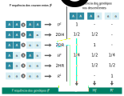
```

<br>

Desta forma, a frequência dos genótipos na próxima geração ($F_1$) será resultado da frequência de formação dos genótipos a partir desses cruzamentos, se forma que:

- para os homozigotos dominantes:

$$D' = D^2 + \frac {2DH}{2} + \frac {H^2}{4} = \left( D + \frac {H}{2} \right)^2$$

<br>

- para os heterozigotos:

$$H' = \frac {2DH}{2} + 2DR + \frac {H^2}{2} + \frac {2HR}{2} = 2 \left( D + \frac {H}{2} \right) \left( R + \frac {H}{2} \right)$$

<br>

- e para os homozigotos recessivos:

$$R' = R^2 + \frac {2HR}{2} + \frac {H^2}{4} = \left( R + \frac {H}{2} \right)^2$$

<br>

### Segundo o _pool_ gênico

Como visto no capítulo anterior (seção (ref)), a frequência dos alelos no _pool_ gênico, podem ser expressas por meio das frequências genotípicas, tal que:

$$F(A) = p = D + \frac {H}{2}$$

<br>

e 

$$F(a) = q = R + \frac {H}{2}$$

<br>

Substituindo esses termos nas equações anteriores, teremos, para a geração seguinte:

- a frequência dos homozigotos dominantes:

$$D'=p^2$$

- a frequência dos heterozigotos:

$$H'=2pq$$

- a frequência dos homozigotos recessivos:

$$R'=q^2$$

Sabendo que as frequências dos alelos $A$ e $a$ correspondem a totalizade do _pool_ gênico, de forma que: 

$$p + q = 1$$

É fácil constatar, a partir da demonstração anterior, que as frequências do genótipos na geração seguinte corresponde a um **Binômio de Newton**., que representa as chances de encontros (combinação) dos alelos do _pool_ gênico em dupla carga (diploidia).

De forma que:

$$\left( p + q \right)^2 = p^2 +2pq + q^2 = 1$$

<br>

```{r hwgraph, echo = FALSE, fig.align = 'center', out.width = "400px", fig.cap = "Uma população que siga as premissas do princípio de Hardy-Weinberg apresenta genótipos previstos de acordo com o modelo $(p + q)^2$"}
knitr::include_graphics("figs/hardy_weinberg_graph.svg")
```

<br>

Por exemplo, dadas as frequências alélicas $F(A) = p = 0.6$ e $F(a) = q = 0.4$, as freqüências genotípicas esperadas pela princípio de Hardy-Weinberg serão:

- para os homozigotos dominantes:

$$F_{Esp}(AA) = p^2 = (0.6)^2 = 0.6 \times 0.6 = 0.36$$

<br>

- para os heterzigotos:

$$F_{Esp}(Aa) = 2pq = 2 \times 0.6 \times 0.4 = 0.48$$

<br>

- para os homozigotos recessivos:

$$F_{Esp}(aa) = q^2 = (0.4)^2 = 0.4 \times 0.4 = 0.16$$

<br>

A expectativa das frequências genotípicas dado um _pool_ gênico pode ser vista também por meio de um quadrado de Punnett se os lados dos quadrados são proporcionais as frequências dos alelos. Desta forma, as freqüências genotípicas corresponderão às áreas dos retângulos formados pelos cruzamentos dos gametas.

<br>

```{r hwpunnet2, echo = FALSE, fig.align = 'center', out.width = "400px", fig.cap = "Quadrado de Punnet para um lócus gênico com 2 alelos relativo ao _pool_ gênico ($p+q=1$)."}
knitr::include_graphics("figs/punnett_2alelles.svg")
```

<br>

## Generalizações do modelo

<br>

### Generalização para três alelos

Se o _pool_ gênico de uma população apresentar, em um lócus gênico, três alelos $A$, $B$ e $C$, cujas frequências sejam, por exemplo, $F(A) = p = 0.5$, $F(B) = q = 0.3$ e $F(C) = r = 0.2$.

Teremos então que: 

$$p + q +r = 1$$

<br>

De forma que, as frequências do genótipos na geração seguinte corresponderão a:

$$\left( p + q + r\right)^2 = p^2 + q^2 + r^2 + 2pq + 2pr + 2qr = 1$$

<br>

Assim, as frequências esperadas, por exemplo:

- para o genótipo homozigoto $CC$:

$$F_{Esp}(CC) = r^2 = (0.2)^2 = 0.2 \times 0.2 = 0.04$$
<br>

- e para o genótipo heterozigoto $AC$: 

$$F_{Esp}(AC) = 2pr = 2 \times 0.5 \times 0.2 = 0.2$$


<br>

```{r hwpunnet3, echo = FALSE, fig.align = 'center', out.width = "400px", fig.cap = "Quadrado de Punnet para um lócus gênico com 3 alelos relativo ao _pool_ gênico ($p+q+r=1$)."}
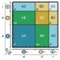
```

<br>

### Generalização para quatro alelos

Se no entanto o _pool_ gênico de uma população apresentar, em um lócus gênico, quatro alelos $A$, $B$, $C$ e $D$ , cujas frequências sejam, por exemplo, $F(A) = p = 0.4$, $F(B) = q = 0.2$, $F(C) = r = 0.2$ e $F(D) = s = 0.2$. 

Teremos então que: 

$$p + q + r + s = 1$$

<br>

De forma que, as frequências do genótipos na geração seguinte corresponderão a:

$$\left( p + q + r +s \right)^2 = p^2 + q^2 + r^2 + s^2 + 2pq + 2pr + 2ps + 2qr + 2qs + 2rs = 1$$

<br>

Assim, as frequências esperadas, por exemplo:

- do genótipo homozigoto $DD$:

$$F_{Esp}(DD) = r^2 = (0.2)^2 = 0.2 \times 0.2 = 0.04$$

<br>

- e para o genótipo heterozigoto $BD$: 

$$F_{Esp}(DB) = 2pr = 2 \times 0.2 \times 0.2 = 0.08$$


<br>

```{r hwpunnet4, echo = FALSE, fig.align = 'center', out.width = "400px", fig.cap = "Quadrado de Punnet para um lócus gênico com 4 alelos relativo ao _pool_ gênico ($p+q+r+s=1$)."}
knitr::include_graphics("figs/punnett_4alelles.svg")
```

<br>

### Generalização para $n$ alelos

Desta forma, uma população que apresenta, em um lócus gênico, $n$ alelos $A_1$, $A_2$, ..., $A_n$, cuja frequência do $i$-nésimo alelo seja $F(A_i) = p_i$, teremos então que: 

$$p_1 + p_2 + ... + p_n = 1$$

<br>

As chances de encontro de alelos nos cruzamentos a partir deste _pool_ gênico resultarão assim nas frequências genotípicas da próxima geração, correspondendo a:

$$(p_1 + p_2 + ... + p_n)^2 = 1$$

<br>

E assim:

- para todo homozigoto:

$$f(A_{i}A_{i}) = p_i^2$$

<br>

- e para todo heterozigoto:

$$f(A_{i}A_{j})  = 2p_{i}p_{j}$$

<br>

### Generalização para triploidia

Considerando um lócus gênico triplóide -- no qual a herança dos alelos sejam independente, como por exemplo na poliespermia de gametas $n$ (como a fecundação dupla de um oócito por dois espermatozóides) -- com dois alelos $A$, $a$, cujas frequências sejam, por exemplo, $F(A) = p = 0.6$, $F(a) = q = 0.4$.

Teremos ainda que: 

$$p + q = 1$$

Contudo, por carregar informação em carga tripla, os cruzamentos neste lócus irão corresponder a um binômio de terceira potência, e assim, as chances de encontro de alelos, e as frequências genotípicas esperadas para a geração, corresponderão a:

$$\left( p + q \right)^3 = p^3 + 3qp^2 + 3pq^2 + q^3 = 1$$

<br>

Assim, as frequências esperadas deste exemplo serão:

- para o genótipo $AAA$:

$$F_{Esp}(AAA) = p^3 = (0.6)^3 = 0.6 \times 0.6 \times 0.6 = 0.216$$

<br>

- para o genótipo heterozigoto $AAa$: 

$$F_{Esp}(AAa) = 3qp^2 = 3 \times 0.4 \times (0.6)^2 = 0.432$$

<br>

- para o genótipo heterozigoto $Aaa$: 

$$F_{Esp}(Aaa) = 3pq^2 = 3 \times 0.6 \times (0.4)^2 = 0.288$$

<br>

- e para o genótipo heterozigoto $aaa$: 

$$F_{Esp}(aaa) = q^3 = (0.4)^3 = 0.4 \times 0.4 \times 0.4 = 0.064$$

<br>

### Hardy-Weinberg em genes ligados ao sexo

O Princípio de Hardy-Weinberg como formulado originalmente se aplica a genes autossômicos. Genes situados nos cromossomos sexuais atingem uma situação de equilíbrio ligeiramente diferente.

O sexo homogamético possui dois cromossomos sexuais iguais (fêmeas $XX$, ou machos $ZZ$) e o sexo heterogamético apresenta os dois cromossomo sexuais diferentes (machos $XY$, ou fêmeas $ZW$).

Por exemplo, no sistema $XX/XY$, considerando-se um locus gênico ligado ao cromossomo $X$ com dois alelos $X^A$ e $X^a$, temos:

Quando a população está em equilíbrio:

- os genótipos dos indivíduos do sexo heterogamético ($X^AY$ e $X^aY$) corresponderão às frequências gênicas ($p$ e $q$), e

- os genótipos dos indivíduos do sexo homogamético ($X^AX^A$, $X^AX^a$ e $X^aX^a$) corresponderão às proporções de Hardy-Weinberg ($p^2$, $2pq$ e $q^2$).

Em populações que não estejam em equilíbrio:

- se as frequências dos genótipos dos indivíduos do sexo heterogamético ($X^AY$ e $X^aY$) correponderem as frequências gênicas ($p$ e $q$), a população atingirá o equilíbrio após algumas gerações de acasalamento ao acaso. 

Assim, no caso de características recessivas ligadas ao $X$, o número de machos afetados é maior que o de fêmeas, uma vez que $q > q^2$.

<br>


## Exercícios

<br>

### Exercício 1 -- ???


<br>

### Exercício 2 -- Tremoço-anão

<br>

```{r lnanus, echo = FALSE, fig.align = 'center', out.width = "400px", fig.cap="Polimorfismo da coloração das flores no tremoço-anão (_Lupinus nanus_)."} 
knitr::include_graphics('https://www.bolster.eu/media/images/5620_dbweb.jpg')
```

<br>

O tremoço-anão (_Lupinus nanus_), uma planta silvestre nativa dos estados unidos, normalmente apresenta flores azuis, mas plantas com flores rosa são ocasionalmente observadas em populações selvagens. A cor da flor é controlada em um único locus, com o alelo rosa completamente recessivo ao alelo azul.

O estudo de Harding ([1970](https://doi.org/10.1111/j.1558-5646.1970.tb01744.x)) nas cordilheiras da Califórniana, revelou os seguintes dados para uma dada população:

<br>

```{r tableB05, echo = FALSE}
B05azul <- c(3291)
B05rosa <- c(25)
B05N <- c(3316)
dataB05 <- data.frame(B05azul, B05rosa, B05N)
rownames(dataB05) <- c("**Indivíduos**")
knitr::kable(dataB05, align = "ccc", booktabs = TRUE, col.names = c("Flores azuis", "Flores rosas", "N"), caption = "Frequências fenotípicas para o polimorfismo de cor das flores do tremoço-anão (_Lupinus nanus_) de uma população da Planície Espanhola, Califórnia, EUA.")
```

<br>

- Quais são as frequências genotípicas esperadas para essa população, assumindo que ela segue o princípio de Hardy-weinberg?

<br>

### Exercício 3 -- Albinismo em humanos

<br>

```{r familialbino, echo = FALSE, fig.align = 'center', out.width = "600px", fig.cap="As crianças Vijay, 25, Ramkishan, 19, e Shankar, 24 (fila de trás), juntamente com as filhas Pooja, 18 (esquerda) e Deepa, 21 (direita) herdaram o albinismo de seus pais Rosetauri e Mani Pullan (centro)."} 
knitr::include_graphics('https://i.pinimg.com/originals/aa/a9/c4/aaa9c48bc7d6a49b0633733558515844.jpg')
```

<br>

O albinismo oculocutâneo tirosinase-positivo (OCA, tipo II; [OMIM 203200](https://www.omim.org/entry/203200)) é um distúrbio autossômico recessivo no qual a biossíntese do pigmento melanina é reduzida na pele, cabelos e olhos.

A prevalência deste distúrbio varia largamente entre as diversas populações humanas.

<br>

```{r tableC05, echo = FALSE}
C05prev <- c("1:36.000", "1:10.000", "1:3.900", "1:2.833", "1:1.100", "1:140")
C05ref <- c("[Lee et al. 1994](https://doi.org/10.1056/NEJM199402243300803 )", " '' ", "[Kromberg & Jenkins 1982](https://pubmed.ncbi.nlm.nih.gov/7064008/), [1984](https://doi.org/10.1017/S0021932000014838)", "[Kagore & Lund 1995](http://dx.doi.org/10.1136/jmg.32.11.859)", "[Okoro 1975](https://doi.org/10.1111/j.1365-2133.1975.tb03116.x)", "[Woolf 1965](https://pubmed.ncbi.nlm.nih.gov/14255554/); [Woolf & Dukepoo 1969](https://doi.org/10.1126/science.164.3875.30)")
dataC05 <- data.frame(C05prev, C05ref)
rownames(dataC05) <- c("**Estados Unidos (geral)**", "**Estados Unidos (afro-americanos)**", "**South Africa (negros)**", "**Zimbabwe (Harare)**", "**Nigeria (Ibo)**", "**Jemez (ameríndios)**")
knitr::kable(dataC05, align = "cr", booktabs = TRUE, col.names = c("Prevalência", "Referência"), caption = "Prevalência de albinismo tipo 2 em diferentes populações humanas")
```

<br>

Assumindo que esta deficiência seja devida a um único gene autossômico recessivo, e que as populações abaixo estejam em equilíbrio de Hardy-Weinberg: 

- Qual a proporção esperada de pessoas portadoras? 

<br>


<!--chapter:end:05_hardy-weinberg.Rmd-->

# Desequilíbrio de Ligação

<br>

```{r LDsorghum, echo = FALSE, fig.align = 'center', out.width="600px", fig.cap="O desequilíbrio de ligação decai com a distância física entre as regiões gênicas, como mostrado pela correlação (r2) nos diversos cromossomos do sorgo (Sorghum bicolor). Perceba que raças tradicionais (RT, _Landraces_) apresentam uma taxa de decaimento maior do que linhagens endocruzantes recombinantes (LER, _RILS_). Ver Hu et al [2019](https://doi.org/10.3835/plantgenome2018.06.0044)."} 
knitr::include_graphics('https://acsess.onlinelibrary.wiley.com/cms/asset/72da5c7a-6c96-450d-b9d1-20d9e0bad237/tpg2plantgenome2018060044-fig-0003-m.jpg')
```

<br>

:::quote

**Linhagem Endocruzante Recombinante** -- Um organismo com cromossomos que incorporam um conjunto essencialmente permanente de eventos de recombinação entre cromossomos herdados de duas ou mais linhagens endocruzantes.

**Raça Tradicional** -- Uma variedade tradicional domesticada e adaptada localmente de uma espécie de animal ou planta que se desenvolveu ao longo do tempo, por meio da adaptação ao seu ambiente natural e cultural de agricultura ou pastorícia, e devido ao isolamento de outras populações da espécie.

:::

<br>

## Ligação gênica

A ligação gênica é a tendência de genes localizados no mesmo cromossomo serem herdados em conjunto durante a meiose. 

Genes ditos estarem geneticamente ligados correspondem a loci que estão perto um do outro, sendo menos susceptíveis de ser separados em diferentes cromátides por recombinação genética.

Considera-se recombinação genética toda e qualquer produção de uma nova combinação de alelos em dois ou mais loci gênicos. Em organismos diplóides, isto se dá principalmente por meio do mecanismo de _crossing over_.

Assim sendo, a proporção de descendentes que sofreram um evento de recombinação entre dois loci gênicos é medida pela *taxa de recombinação genética* ($r$).

<br>

Desta forma que, os descendentes herdarão cromossomos:

- iguais ao de um dos parentais, em uma taxa $1 − r$; ou

- que são uma recombinação dos cromossomos dos parentais, em uma taxa $r$.

<br>

Uma vez que a recombinação por _crossing over_ só ocorre entre os dois cromossomos homólogos pareados da tétrade na meiose, o maior valor que a taxa de recombinação genética pode alcançar é igual a $1/2$, que é igual o mesmo que chance de encontro de alelos em loci em cromossomos diferentes, _i. e._, segregando independentemente.

<br>

```{r tester, echo = FALSE, fig.align = 'center', out.width="400px", fig.cap="Medição empírica da taxa de recombinação -- Linhagens parentais ($F_0$) puras são cruzadas para produzir indivíduos heterozigotos no dois loci gênicos (diíbridos), cuja variação entre os alelos esteja ligada nos cromossomos parentais (_cis_), os quais são cruzados com uma outra linhagem pura (testador) para quantificar os tipos parentais e recombinantes produzidos."} 
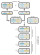
```

<br>

## Frequências haplotípicas

<br>

:::quote

Haplótipo -- **1**. coleção de alelos específicos em um agrupamento de genes fortemente ligados em um cromossomo, que provavelmente serão herdados juntos; **2**. um conjunto de alelos de polimorfismo de nucleotídeo único (SNP) ligados que tendem a sempre ocorrer juntos, _i.e._, que estão associados estatisticamente.

:::

<br>

Considere os haplótipos produzidos por dois loci gênicos $A$ e $B$, com dois alelos cada, com taxa de recombinação $r$ entre si.

A gametogênese dos indivíduos do genótipo $AB/ab$ produzirá os seguintes haplótipos:

<br>

| Haplótipo   | Frequência     | Tipo             |
| :---:       | :---:          | :---:            |
| $AB$        | $(1-r)/2$      | Parental         |
| $ab$        | $(1-r)/2$      | Parental         |
| $Ab$        | $r/2$          | **Recombinante** |
| $aB$        | $r/2$          | **Recombinante** |

<br>

Enquanto que a gametogênese de um genótipo $Ab/aB$ produzirá os seguintes haplótipos:

<br>

| Haplótipo   | Frequência     | Tipo             |
| :---:       | :---:          | :---:            |
| $AB$        | $r/2$          | **Recombinante** |
| $ab$        | $r/2$          | **Recombinante** |
| $Ab$        | $(1-r)/2$      | Parental         |
| $aB$        | $(1-r)/2$      | Parental         |

<br>

Sendo a frequência observada dos haplótipos dos loci gênicos $A$ e $B$:

<br>

| Haplótipo   | Frequência   |
| :---:       | :---:        |
| $AB$        | $p_{AB}$     |
| $ab$        | $p_{ab}$     |
| $Ab$        | $p_{Ab}$     |
| $aB$        | $p_{aB}$     |

<br>

De forma que,

$$p_{AB} + p_{ab} + p_{Ab} + p_{aB} = 1$$

<br>

Note que estas são frequências relativas, que determinam as frequências alélicas:

<br>

| Alelo      | Frequência                    |
| :---:      | :---:                         |
| $A$        | $p_{A} = p_{AB} + p_{Ab}$     |
| $a$        | $p_{A} = p_{ab} + p_{aB}$     |
| $B$        | $p_{A} = p_{AB} + p_{aB}$     |
| $b$        | $p_{A} = p_{ab} + p_{Ab}$     |

<br>

:::quote

**Acoplamento gênico** -- Quando ambos os alelos do tipo selvagem estão em um cromossomo homólogo, e ambos os alelos mutantes estão no outro (_e. g._, $AB/ab$). Também conhecido como configuração _cis_. 

**Repulsão gênica** -- Quando um alelo do tipo selvagem e um alelo mutante estão em um cromossomo homólogo, e o oposto no outro (_e. g._, $Ab/aB$). Também conhecido como configuração _trans_. 

:::

<br>

## coeficiente de desequilíbrio de ligação

O termo desequilíbrio de ligação (LD, _linkage disequilibrium_) foi usado pela primeira vez por Lewontin e Kojima ([1960](https://doi.org/10.1111/j.1558-5646.1960.tb03113.x)) para indicar uma associação não-aleatória de alelos em dois ou mais loci. 

Dado suficiente tempo evolutivo... 

- a ocorrência de eventos de recombinação aleatória em um cromossomo resultará em uma distribuição de equilíbrio de alelos em cada locus; e

- a frequência de um alelo em particular em um determinado locus será independente da frequência de alelos em outros loci ligados.

Nesse sentido, seria alcançado um equilíbrio de ligação, e a frequência do haplótipo entre um par de alelos será igual ao produto das frequências alélicas individuais, de forma que:

<br>

$$p_{AB} = p_{A} \cdot p_{B}$$

<br>

Assim sendo, o desequilíbrio de ligação é definido como a diferença entre a frequência observada de uma combinação particular de alelos em dois loci gênicos e a frequência esperada para a associação aleatória (esperada no equilíbrio). 

<br>

$$D_{AB} = p_{AB} - p_{A}p_{B}$$

<br>

A medida $D_{AB}$ é o **coeficiente de desequilíbrio de ligação**.

O coeficiente de desequilíbrio de ligação é definido para um par específico de alelos, no caso $A$ e $B$, e não depende de quantos outros alelos estão nos dois loci -- cada par de alelos tem seu próprio coeficiente.

Na ausência de forças evolutivas, o coeficiente de desequilíbrio de ligação ($D$) convergirá para zero ao longo do tempo (atingindo o equilíbrio de ligação), e o tempo ($t$), em termos de número de gerações, que levará para tal convergência ocorrer irá depender da magnitude da taxa de recombinação ($r$) entre os dois loci.

Assim, a taxa de recombinação irá mudar a frequência do haplótipo da próxima geração ($p_{AB}'$) de forma que:

<br>

$$p_{AB}' = \left( 1-r \right) p_{AB} + rp_{A}p_{B}$$

<br>

onde $(1-r)$ e $r$ são as chances de formação de haplótipos não-recombinantes e recombinantes, respectivamente.

A equação acima pode ser reescrita (_viz._, subtraindo $p_{A}p_{B}$ dos dois lados) como:

<br>

$$p_{AB}' - p_{A}p_{B} = \left( 1-r \right) \left( p_{AB} - p_{A}p_{B} \right)$$

<br>

Sendo $D_{AB}$ o coeficiente de desequilíbrio da geração atual, e $D_{AB}'$ o coeficiente de desequilíbrio da próxima geração, temos então que:

<br>

$$D_{AB}' = \left( 1-r \right) D_{AB}$$

<br>

Desta forma, para qualquer par de alelos em dois loci gênicos ligados, de uma geração para a seguinte, temos:

<br>

$$D_{t+1} = \left( 1-r \right) D_{t}$$

<br>

E assim, partir desta, temos:

<br>

$$D_{t} = \left( 1-r \right)^t D_{0}$$

<br>

Logo, se $t → ∞$, então $D_t → 0$.

<br>

```{r LDgraph, echo = FALSE, warning = FALSE, fig.align = 'center', out.width = "600px", fig.cap="O coeficiente de desequilíbrio de ligação ($D$) ao longo das gerações sob diferentes taxas de recombinação ($r$)."} 
library("ggplot2")
library("latex2exp")
ggplot(data.frame(x = c(0, 25)), aes(x = x)) + 
  stat_function(fun = function(x) 0.25*(1-0)^x, color = "firebrick2", lwd = 1) +
  stat_function(fun = function(x) 0.25*(1-0.01)^x, color = "chocolate", lwd = 1) +
  stat_function(fun = function(x) 0.25*(1-0.05)^x, color = "royalblue3", lwd = 1) +
  stat_function(fun = function(x) 0.25*(1-0.1)^x, color = "green4", lwd = 1) +
  stat_function(fun = function(x) 0.25*(1-0.5)^x, color = "deepskyblue3", lwd = 1) +
  labs(x = "Geração", y = "Coeficiente de \ndesequilíbrio de ligação") + 
  annotate(geom='text', x=24, y=0.24, parse = TRUE, color="firebrick2", label=TeX("$r=0$")) +
  annotate(geom='text', x=24, y=0.18, parse = TRUE, color="chocolate", label=TeX("$r=0.01$")) +
  annotate(geom='text', x=24, y=0.09, parse = TRUE, color="royalblue3", label=TeX("$r=0.05$")) +
  annotate(geom='text', x=24, y=0.04, parse = TRUE, color="green4", label=TeX("$r=0.1$")) +
  annotate(geom='text', x=20, y=0.01, parse = TRUE, color="deepskyblue3", label=TeX("$r=0.5$"))
```

<br>

O coeficiente de desequilíbrio de ligação é usado geralmente para indicar que dois genes estão fisicamente ligados.

No entanto, a detecção de um desequilíbrio de ligação não assegura a existência de ligação gênica ou falta de equilíbrio, podendo alternativamente refletir:

<br>

A ocorrência de LD pode refletir... 

- no genoma, como um todo:

	- histórias populacionais, 
	
	- sistemas de acasalamento,
	
	- padrões de subdivisão geográfica

-e em regiões gênicas específicas:

	- seleção natural, 
	
	- convergência gênica, 
	
	- mutação, 
	
	- e outras forças que promovem mudança nas nas freqüências gênicas.

<br>

Como esses fatores afetam o equilíbrio de ligação entre um par particular de locos ou em uma região genômica depende das taxas locais de recombinação.

<br>

## coeficiente de desequilíbrio de ligação normalizado

O coeficiente de desequilíbrio de ligação ($D$) nem sempre é uma medida conveniente, porque o seu intervalo de valores possíveis depende das frequências dos alelos a que se refere.

Isso dificulta a comparação do nível de desequilíbrio de ligação entre diferentes pares de alelos.

<br>

O coeficiente de desequilíbrio de ligação pode ser normalizado ($D'$) se dividindo-o pela diferença máxima teórica entre as frequências de haplótipos observadas e esperadas como:

<br>

\begin{equation}
D’ = \frac{D}{D_{max}}
(\#eq:dnorm)
\end{equation}

<br>

Onde,

<br>

\begin{equation}
D_{max} = \min
\begin{cases} 
\left \{p_A(1-p_B) , (1 – p_A)p_B \right \} & \text{se } D > 0 \\
\left \{p_Ap_B , (1 – p_A)(1 – p_B) \right \} & \text{se } D < 0 \\
\end{cases}
(\#eq:dmax)
\end{equation}

<br>

## Coeficiente de correlação

Uma forma alternativa de expressar o desequilíbrio de ligação entre pares de alelos é por meio do coeficiente de correlação ($r^2$), expresso como:

<br>

$$r^2 = \frac{(D_{AB}^2)}{p_A(1-p_A)p_B(1-p_B)}$$

<br>

As medidas do coeficiente de correlação $r^2$ e do coeficiente de correlação normalizado $D'$ têm seus intervalos de valores limitados, e não abrangem todos os valores de $0$ a $1$ para todos os pares de loci.

O valor máximo de $r^2$ depende das frequências alélicas nos dois loci sendo comparados, e só pode variar totalmente de $0$ a $1$ quando as frequências alélicas em ambos os loci são iguais, $p_A = p_B$, se $D_{AB} > 0$, ou quando as frequências alélicas têm a relação $p_{A}=1-P_{B}$, se $D_{AB} < 0$.

Por sua vez, $D'$ sempre poderá ter um valor máximo teórico de $1$, mas seu valor mínimo para dois loci será igual a $| r |$ para esses loci.

<br>

:::reference

Lewontin 1964. doi: [10.1093/genetics/49.1.49](https://doi.org/10.1093/genetics/49.1.49)

Hill & Robertson 1968. [10.1007/BF01245622](https://doi.org/10.1007/BF01245622) 

Slatkin 2008. [10.1038/nrg2361](https://doi.org/10.1038/nrg2361)

Smith 2020. doi: [10.1016/j.tpb.2020.02.005](https://doi.org/10.1016/j.tpb.2020.02.005)

:::

<br>

## Exercícios

<br>

### Exercício 1 -- Ligação gênica em SNPs

Considere os sequintes Polimorfismos de nucleotídeo único (SNPs) abaixo:

<br>

```{r tableD05, echo = FALSE}
D05SNP1 <- c("A/A", "A/G", "A/G", "A/A", "G/G")
D05SNP2 <- c("C/C", "C/T", "C/T", "C/C", "T/T")
D05SNP3 <- c("A/A", "A/A", "A/C", "A/A", "C/C")
D05SNP4 <- c("T/T", "G/G", "T/G", "G/G", "G/T")
dataD05 <- data.frame(D05SNP1, D05SNP2, D05SNP3, D05SNP4)
rownames(dataD05) <- c("**Indivíduo 1**", "**Indivíduo 2**", "**Indivíduo 3**", "**Indivíduo 4**", "**Indivíduo 5**")
knitr::kable(dataD05, align = "cccc", booktabs = TRUE, col.names = c("SNP1", "SNP2", "SNP3", "SNP4"), caption = "Polimorfismos de nucleotídeo único (SNPs) em quatro loci gênicos hipotéticos.", "html")
```

<br>

- Qual é o coeficiente de desequilíbrio de ligação normalizado ($D'$) entre esses loci gênicos?

- Qual é o coeficiente de correlação ($r^2$) entre esses loci gênicos?


<!--chapter:end:06_desequilibrio.Rmd-->

# Testes de Significância

.\linebreak
```{r infestat, echo = FALSE, fig.align = 'center', out.width="600px", fig.cap="A inferência estatística é o ato de generalizar de uma amostra para uma população, a partir de dados obtidos desta, com um calculado nível de certeza."} 
knitr::include_graphics("figs/inferencia_estatistica.svg")
```
.\linebreak

## Significância estatística

Em qualquer experimento ou observação que envolva obter uma amostra de uma população, sempre há a possibilidade de que um efeito observado tenha ocorrido devido apenas ao erro de amostragem. 

Em um teste estatístico de hipótese, um resultado tem significância estatística quando é muito improvável que tenha ocorrido dada a hipótese nula.

O termo significância não implica importância, e o termo significância estatística não é o mesmo que significância para pesquisa, teórica ou prática. 

Mas se a probabilidade de um efeito observado for menor que (ou igual a) o nível de significância assumido para o estudo, um investigador pode concluir que o efeito reflete os parâmetros de toda a população, rejeitando assim a hipótese nula.

Mais precisamente:

- o nível de significância de um estudo ($\alpha$) é a probabilidade de o estudo rejeitar a hipótese nula, dado que a hipótese nula foi assumida como verdadeira; e

- o valor-p de um resultado ($p$) é a probabilidade de obter um resultado pelo menos tão extremo, dado que a hipótese nula é verdadeira. 

Assim, quando $p\le\alpha$, o resultado é então estatisticamente significativo pelos padrões do estudo.

O nível de significância de um estudo é escolhido antes da coleta de dados e é normalmente definido como 5% (mas podendo ser muito mais baixo dependendo da área de estudo ou tipo de pesquisa, ver a seguir)

Sempre que houver incerteza, existe a possibilidade de cometer um erro. 

Uma vez que testes estatíticos tratam de escolher entre duas proposições concorrentes, chamadas de **Hipótese nula** ($H_0$) e **Hipótese alternativa** ($H_1$), a possibilidade de erro estatístico é parte integrante dos testes de hipóteses. 

Se o resultado do teste corresponder à realidade, então uma decisão correta foi tomada. No entanto, se o resultado do teste não corresponder à realidade, então ocorreu um erro. 

Existem duas situações em que a decisão tomada a partir de um teste estatístico está errada:

**Erro tipo I** — É a probabilidade a probabilidade de rejeitar a hipótese nula (H0) dada que ela seja verdadeira. Esse erro é denotado por \alpha, e é conhecido também como nível de significância ou risco alfa.
O nível de significância de um teste definido como 0,05 (5%) implica que é aceitável ter uma probabilidade de 5% de rejeitar incorretamente a hipótese nula verdadeira. 

**Erro tipo II** — É a probabilidade de aceitar a hipótese nula ($H_0$) dada que ela é falsa. Esse erro é denotado por \beta, e é também conhecido como risco beta.

Fazendo analogia à um tribunal, onde todos são inocentes ($H_0$) até que se prove ao contrário ($H_1$):

- um erro do tipo I corresponde à condenação de um réu inocente; e

- um erro do tipo II corresponde à absolvição de um criminoso.

Esses dois tipos de erro são compensados entre si: para qualquer conjunto de amostra, o esforço para reduzir um tipo de erro geralmente resulta no aumento do outro tipo de erro.

.\linebreak
```{r errostipos, echo = FALSE, fig.align = 'center', out.width="600px", fig.cap="Relações entre verdade/falsidade da hipótese nula e resultados de um teste statístico."} 
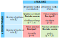
```

.\linebreak

:::reference
Sokal & Rohlf 2011. ISBN: 978-0716786047
 
Dancey et al. 2012. ISBN: 978-1849203364
 
Herzog et al. 2019. doi: [10.1007/978-3-030-03499-3](https://doi.org/10.1007/978-3-030-03499-3)
:::

.\linebreak


## Testes de ajuste do chi-quadrado

O teste do qui-quadrado de Pearson ($χ^2$; [Pearson 1900](https://doi.org/10.1080/14786440009463897)) é um teste estatístico aplicado a conjuntos de dados categóricos para avaliar a probabilidade de que qualquer diferença observada entre os conjuntos tenha surgido por acaso.

Ele testa uma hipótese nula declarando que a distribuição de freqüência de certos eventos observados em uma amostra é consistente com uma distribuição teórica específica. 

Os eventos considerados devem ser mutuamente exclusivos e ter probabilidade total igual a 1.

.\linebreak

### Um exemplo simples

Um exemplo simples é a hipótese de que um dado comum de seis lados é "justo" (ou seja, todos os seis resultados são igualmente prováveis de ocorrer).

.\linebreak
```{r dados, echo = FALSE, fig.align = 'center', out.width="200px", fig.cap="Em um dado perfeito (sem viés), a chance de cada lado cair com a face para cima é igual a $1/6$."} 
knitr::include_graphics("figs/dice.svg")
```
.\linebreak

#### Os dados de Weldon

.\linebreak
```{r weldon, echo = FALSE, fig.align = 'right', out.width = "300px", fig.cap="[W. F. Raphael Weldon](https://en.wikipedia.org/wiki/Raphael_Weldon) (1860-1906), biólogo evolucionista inglês."} 
knitr::include_graphics('https://upload.wikimedia.org/wikipedia/commons/c/c7/Weldon_Walter_F_R.jpg')
```
.\linebreak

Raphael Weldon foi um dos fundadores da biometria, e editor e co-fundador do periódico Biometrika (juntamente com Francis Galton e Karl Pearson).

Em 1894, Weldon lançou um conjunto de 12 dados 26.306 vezes, e registrou o número de 5s ou 6s (que considerou um sucesso). 

Ele coletou os dados em parte, "para julgar se as diferenças entre uma série de frequências de grupo e uma lei teórica, considerada como um todo, eram ou não mais do que poderiam ser atribuídas às flutuações fortuitas da amostragem aleatória". 

Weldon observou que 5s ou 6s ocorreram com mais frequência do que o esperado*.

Os dados de dados de Weldon foram usados por Karl Pearson em seu artigo pioneiro sobre a estatística qui-quadrado, e ele hipotetizou que o desvio se devia à  construção dos dados da época (a face com 6 e 5 pontos seria mais leve do que as faces opostas, que tem apenas 1e 2 pontos).

.\linebreak

#### Os dados de Labby

.\linebreak
```{r labbym, echo = FALSE, fig.align = 'right', out.width = "300px", fig.cap="Zacariah Labby e [máquina de rolar dados](https://ehttps://www.youtube.com/watch?v=95EErdouO2w)."} 
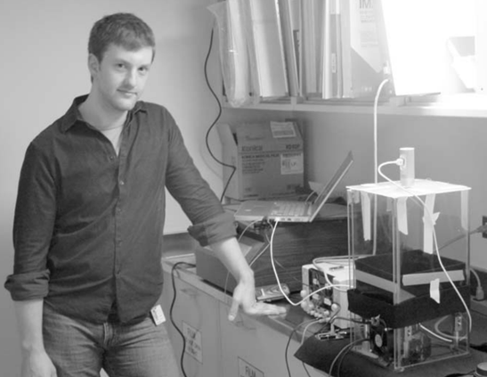
```
.\linebreak

Em [2009](https://doi.org/10.1007/s00144-009-0036-8), Zacariah Labby da Universidade de Chicago, repetiu o experimento de Weldon.

Como parte de um projeto para um curso de História da Estatística, ele construiu uma máquina para lançar dados e contar automaticamente os pontos em cada dado. 

O processo de geração de imagem contínua demorou cerca de 20 segundos por rolagem.


Cada dia havia ∼150 imagens para processar manualmente. Nesse ritmo, o experimento de Weldon foi repetido em pouco mais de seis dias inteiros.

Os dados resultantes permitiram que Labby repetisse as investigações originais de Weldon e Pearson, bem como se aprofundasse na análise.

Labby não observou o mesmo fenômeno que Weldon observou (frequência mais alta de 5s e 6s).

A automação permitiu que Labby coletasse mais dados do que Weldon em 1894, em vez de registrar “sucessos” e “falhas”, Labby registrou o número individual de pontos em cada dado.

.\linebreak
```{r labbyg, echo = FALSE, fig.align = 'center', out.width = "400px", fig.cap="Probabilidade de observar cada face de um dado em 12 ralagens, em um total de 26.306 rolagens ([Labby 2009](https://doi.org/10.1007/s00144-009-0036-8))."} 
knitr::include_graphics("figs/Labby_results.svg")
```
.\linebreak

### Teste do qui-quadrado de Pearson

O valor da estatística $\chi^2$ é:

\begin{equation} 
\chi^2=\displaystyle\sum_{i-1}^{n}\frac{(O_i-E_i)^2}{E_i} 
  (\#eq:quiquadrado)
\end{equation} 

Onde, $n$ é o número total de observações, $O_i$ é o número de observações do tipo $i$, e $E_i$ é a contagem esperada (teórica) do tipo $i$. 

A estatística do qui-quadrado pode então ser usada para calcular um valor-p comparando o valor da estatística a uma distribuição qui-quadrada. 

.\linebreak

### Graus de liberdade

A distribuição qui-quadrada tem apenas um parâmetro denominado **grau de liberdade** ($gl$), que influencia o formato, o centro e a extensão da distribuição.

Grau de liberdade faz referência ao número de maneiras independentes pelas quais um sistema dinâmico pode se mover, sem violar qualquer restrição imposta a ele. 

Em outras palavras, o número de graus de liberdade pode ser definido como o número mínimo de coordenadas independentes que podem especificar a posição do sistema completamente.

Matematicamente, grau de liberdade é o número de dimensões do domínio de um vetor aleatório, ou essencialmente o número de componentes "livres“, isto é, quantos componentes precisam ser conhecidos antes que o vetor seja totalmente determinado.

.\linebreak
```{r gl, echo = FALSE, fig.align = 'center', out.width = "400px", fig.cap="Os graus de liberdade ($gl$) de um corpo rígido são definidos como o número de movimentos independentes que ele possui."} 
knitr::include_graphics("figs/gl_mecanismo.svg")
```
.\linebreak

Cada grau de liberdade apresenta um função densidade de probabilidade, onde os valores de $\chi^2$ (eixo x) apresentam diferentes frequências (eixo y).

.\linebreak
```{r glgraph, echo = FALSE, warning = FALSE, fig.align = 'center', out.width = "600px", fig.cap="Função densidade de probabilidade de cinco distribuições de qui-quadrado com diferentes graus de liberdade."} 
library("ggplot2")
library("latex2exp")
ggplot(data.frame(x = c(0, 15)), aes(x = x)) + 
  stat_function(fun = dchisq, args = list(df = 1), color = "firebrick2", lwd = 1) +
  stat_function(fun = dchisq, args = list(df = 2), color = "chocolate", lwd = 1) +
  stat_function(fun = dchisq, args = list(df = 3), color = "royalblue3", lwd = 1) +
  stat_function(fun = dchisq, args = list(df = 5), color = "green4", lwd = 1) +
  stat_function(fun = dchisq, args = list(df = 9), color = "deepskyblue3", lwd = 1) +
  labs(x = "Qui-quadrado", y = "Densidade de probabilidade") + 
  annotate(geom='text', x=1, y=0.9, parse = TRUE, color="firebrick2", label=TeX("$gl=1$")) +
  annotate(geom='text', x=1.5, y=0.35, parse = TRUE, color="chocolate", label=TeX("$gl=2$")) +
  annotate(geom='text', x=2.7, y=0.25, parse = TRUE, color="royalblue3", label=TeX("$gl=3$")) +
  annotate(geom='text', x=4.8, y=0.18, parse = TRUE, color="green4", label=TeX("$gl=5$")) +
  annotate(geom='text', x=7.5, y=0.15, parse = TRUE, color="deepskyblue3", label=TeX("$gl=10$"))
  
```
.\linebreak

A partir da função densidade de probabilidade, é possível calcular a probabilidade p de um evento cujo valor de $\chi^2$  é conhecido.

.\linebreak
```{r glprob, echo = FALSE, warning = FALSE, fig.align = 'center', out.width = "600px", fig.cap="Função densidade de probabilidade de cinco distribuições de qui-quadrado com diferentes graus de liberdade."} 
library("ggplot2")
library("latex2exp")
ggplot(data.frame(x = c(0, 15)), aes(x = x)) + 
  stat_function(fun = dchisq, geom = "area", args = list(df = 5), fill = "lightgreen", xlim = c(7, 15)) +
  stat_function(fun = dchisq, geom = "line", args = list(df = 5), colour = "green4", lwd = 1) +
  labs(x = "Qui-quadrado", y = "Densidade de probabilidade") + 
  annotate(geom='text', x=9, y=.015, parse = TRUE, color="black", label=TeX("$p = Pr \\left [ X \\geq \\chi^2 \\right ]$"))

```
.\linebreak

No teste de ajuste do qui-quadrado o número de graus de liberdade é igual ao número classes de observações ($k$) menos 1 menos o número parâmetros independentes estimados para o modelo ($p$).

\begin{equation} 
gl=k-1-p
  (\#eq:gl)
\end{equation} 

.\linebreak
```{r, echo = FALSE}
library(kableExtra)
chi_table <- read.csv("tables/chi_square.csv", sep=",", check.names = FALSE)
knitr::kable(chi_table, align = "cccccccccc", booktabs = TRUE, caption = "Tabela de distribuição de qui-quadrado", "html")
```
.\linebreak

## Testando a significância do Princípio de Hardy-Weinberg

O teste de ajuste do qui-quadrado pode ser utilizado para saber se uma população segue o Princípio de Hardy-Weinberg, _i.e._, para saber se esta está em equilíbrio.

Para tal, utilizamos a estatística $\chi^2$ para estimar a significância do desvio entre:

- o número observado de indivíduos de um determinado genótipo (obtidos a partir dos dados); e 

- o número esperado de indivíduos daquele genótipo de acordo com o o Princípio de Hardy-Weinberg (estimado a partir do modelo).

E o número de graus de liberdade dependerá do número de genótipos e alelos presentes no modelo do estudo.

De forma que, para um dado locus gênicos,$k$ é o número de genótipos, e $p$ é o número de alelos, diminuído em um.

.\linebreak

#### Graus de liberdade com dois alelos

Considerando um lócus gênico com dois alelos $A$ e $B$, cujas frequências $p+q=1$.

.\linebreak
```{r gl2alelos, echo = FALSE, fig.align = 'center', out.width = "400px", fig.cap="Quadrado de Punnett para 2 alelos"} 
knitr::include_graphics("figs/punnett_2alelles.svg")
```
.\linebreak

Temos:

**Classes de observações** -- Os três genótipos possíveis: $AA$, $Aa$ e $aa$.

$$k=3$$

.\linebreak

**Parâmetros independentes** -- A frequência alélica independente $F(A)=p$, pois $F(a)=q=1-p$.

$$p=1$$

.\linebreak

**Graus de liberdade** -- Considerando que $gl=3-1-1$.

$$gl=1$$

.\linebreak

#### Graus de liberdade com três alelos

Considerando um lócus gênico com três alelos $A$, $B$ e $C$, cujas frequências $p+q+r=1$.

.\linebreak
```{r gl3alelos, echo = FALSE, fig.align = 'center', out.width = "400px", fig.cap="Quadrado de Punnett para 3 alelos"} 

```
.\linebreak

Temos:

**Classes de observações** -- Os seis genótipos possíveis: $AA$, $BB$, $CC$, $AB$, $AC$ e $BC$

$$k=6$$

.\linebreak

**Parâmetros independentes** -- As frequências alélicas independentes $F(A)=p$ e $F(B)=q$, pois $F(C)=r=1-p-q$.

$$p=2$$

.\linebreak

**Graus de liberdade** -- Considerando que $gl=6-1-2$.

$$gl=3$$


.\linebreak

#### Graus de liberdade com quatro alelos

Considerando um lócus gênico com três alelos $A$, $B$, $C$ e $D$ cujas frequências $p+q+r+s=1$.

.\linebreak
```{r gl4alelos, echo = FALSE, fig.align = 'center', out.width = "400px", fig.cap="Quadrado de Punnett para 4 alelos"} 
knitr::include_graphics("figs/punnett_4alelles.svg")
```
.\linebreak

Temos:

**Classes de observações** -- Os dez genótipos possíveis: $AA$, $BB$, $CC$, $DD$, $AB$, $AC$, $AD$, $BC$, $BD$ e $CD$.

$$k=10$$

.\linebreak

**Parâmetros independentes** -- As frequências alélicas independentes $F(A)=p$, $F(B)=q$ e $F(C)=r$, pois $F(D)=s=1-p-q-r$.

$$p=3$$

.\linebreak

**Graus de liberdade** -- Considerando que $gl=6-1-3$.

$$gl=6$$
.\linebreak

#### Graus de liberdade com $i$ alelos

Considerando um lócus gênico com $i$ alelos $A1$, $A2$, ..., $Ai$, cujas frequências $p_1+p_2+...+p_i=1$.

Temos:

**Classes de observações** -- Os genótipos possíveis dada a combinação par-a-par em um lócus diplóide.

$$k=\binom{i}{2} = \frac{n!}{k!\left ( n-k \right )!}$$

.\linebreak


**Parâmetros independentes** -- O número de alelos $i$ menos um. 

$$p=i-1$$

.\linebreak

**Graus de liberdade** -- Considerando que $gl=\binom{i}{2}-1-(i-1)$.

\begin{equation} 
gl = (\text{# genótipos}) - (\text{# alelos})
\end{equation} 

.\linebreak

## Tabela de contingência (RxC)

Uma tabela de contingência (também conhecida como tabulação cruzada) é um tipo de tabela em formato de matriz que exibe a distribuição de frequência das variáveis (Pearson 1904).

Elas fornecem uma imagem básica da inter-relação entre duas variáveis e podem ajudar a encontrar interações entre elas. 

.\linebreak
```{r tabelarc, echo = FALSE, fig.align = 'center', out.width = "300px", fig.cap="Tabela de contingência (2x2)"} 
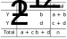
```
.\linebreak


### Razão de chances

A medida mais simples de associação para uma tabela de contingência 2 × 2 é a razão de chances ($OR$, _odds ratio_). 

Dados dois eventos, $A$ e $B$, a razão de chances é definida como a razão das chances de $A$ na presença de $B$ e as chances de $A$ na ausência de $B$, ou equivalentemente (devido à simetria), a razão das chances de $B$ na presença de $A$ e as chances de $B$ na ausência de $A$. 

Dois eventos são independentes se $OR=1$; se $OR>1$, os eventos estão associados positivamente; e se $OR<1$, os eventos estão associados negativamente.

A razão de chances tem uma expressão simples em termos de probabilidades; dada a distribuição de probabilidade conjunta:

\begin{equation} 
OR = \frac{p_00\cdot p_11}{p_01\cdot p_10}
  (\#eq:or)
\end{equation} 

### Frequências haplotípicas observadas

As relações entre as frequências haplotípicas e as frequências alélicas podem ser ilustradas por uma tabela de contingência entre pares de alelos de dois loci gênicos:


.\linebreak
```{r freqhapobs, echo = FALSE, fig.align = 'center', out.width = "350px", fig.cap="Relação entre frequências haplotípicas e alélicas"} 
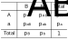
```
.\linebreak

### Frequências haplotípicas esperadas

A expectativa, de acordo com o princípio de Hardy-Weinberg, é que os alelos nos dois loci gênicos se combinem aleatoriamente, e assim, as frequências dos haplótipos seriam igual ao produto das frequências alélicas individuais.

.\linebreak
```{r freqhapesp, echo = FALSE, fig.align = 'center', out.width = "350px", fig.cap="Relação entre frequências haplotípicas e alélicas"} 
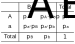
```
.\linebreak


### Testado a significância de tabelas de contingência

Assim é possível estimar a significância da associação entre pares de alelos, expressa em uma tabela de contingência, por meio da estatística χ2.

Esse teste é uma maneira de determinar a significância do desequilíbrio de ligação entre um par de alelos ligados.

Assim, temos:

**Valores observados** -- As frequências dos haplótipos $p_A$, $p_a$, $p_b$ e $p_b$. 
**Valores esperados** -- As frequências das associações $p_A p_B$, $p_A p_b$, $p_a p_B$ e $p_a p_b$. 

**Classes de observações** -- Os quatro haplótipos possíveis: $AB$, $Ab$, $aB$ e $aa$.

$$k=4$$

.\linebreak

**Parâmetros independentes** -- As duas frequências alélicas independentes $F(A)=p_A$ e $F(B)=p_B$, pois $F(a)=p_a=1-p_A$ e $F(b)=p_b=1-p_B$.


$$p=2$$

.\linebreak

**Graus de liberdade** -- Considerando que $gl=4-1-2$.

$$gl=1$$

.\linebreak


### Alternativa: Teste exato de Fisher

O teste exato de Fisher é válido para todos os tamanhos de amostra, e se torna exato no limite à medida que o tamanho da amostra cresce até o infinito, como acontece com muitos testes estatísticos.

Fisher ([1922](https://doi.org/10.2307/2340521)) mostrou que condicionalmente nas margens da tabela de contingência (ver Figura \@ref(fig:tabelarc)), $a$ é distribuído de forma hipergeométrica com $a+c$ retiradas de uma população, sendo destes $a+b$ sucessos e $c+d$ fracassos.

Assim, a probabilidade de obter tal conjunto de valores é dada por:

\begin{equation}
   p = \frac{\binom{a+b}{a}\binom{c+d}{c}}{\binom{n}{a+c}}=\frac{\binom{a+b}{b}\binom{c+d}{d}}{\binom{n}{b+d}}=\frac{ \left( a+b \right)! \left( c+d \right)! \left( a+c  \right)! \left( b+d  \right)! }{a! \ b! \  c! \ d! \ n!}
  (\#eq:testefisher)
\end{equation}

De forma que, se os totais marginais (ou seja, $a + b$, $c + d$, $a + c$ e $b + d$ são conhecidos, resta apenas um único grau de liberdade ($gl$): o valor e.g. de um {\displaystyle a} a é suficiente para deduzir os outros valores. 

Agora, $p = p ( a )$ é a probabilidade de que $a$ elementos sejam positivos em uma seleção aleatória (sem substituição) de $a + c$ de um conjunto maior contendo $n$ elementos no total, dos quais $a + b$, que é precisamente a definição da distribuição hipergeométrica.

Apesar do teste de Fisher fornecer valores de $p$ exatos, alguns autores argumentam que este é conservador, ou seja, que sua taxa de rejeição real está abaixo do nível de significância nominal.

.\linebreak

## Exercícios e Atividades

.\linebreak

### Exercício 1 -- Ervilhas de Mendel

Considere as frequências fenotípicas dos traços das ervilhas ervilhas (_Pisum_ spp.) estudadas por Mendel mostradas na Figura \@ref(fig:peatrait).

.\linebreak
```{r peatrait, echo = FALSE, fig.align = 'center', out.width = "600px", fig.cap="Os sete traços fenotípicos das ervilhas (_Pisum_ spp.) cujos padrões de herança foram estudados por Mendel ([1865](http://www.mendelweb.org/Mendel.html))."} 
knitr::include_graphics("figs/mendel_pea_traits.svg")
```
.\linebreak

- Os traços fenotípicos das ervilhas de Mendel seguem as esperadas frequências mendelianas ($3:1$)?

.\linebreak

### Exercício 2 -- Traça de tigre escarlate

.\linebreak
```{r callimorpha, echo = FALSE, fig.align = 'center', out.width = "800px", fig.cap="Polimorfismo de cor na asa da traça de tigre escarlate (_Callimorpha dominula_)."} 
knitr::include_graphics('https://slideplayer.com/slide/13126368/79/images/7/Figure+26.2+Early+evolutionary+geneticists+were+forced+to+rely+on+the+phenotypic+traits+that+had+a+simple+genetic+basis..jpg')
```
.\linebreak

Considere os dados abaixo:

.\linebreak
```{r tableA09, echo = FALSE}
A09BB <- c(1469)
A09Bb <- c(138)
A09bb <- c(5)
A09N <- c(1612)
data0901 <- data.frame(A09BB, A09Bb, A09bb, A09N)
rownames(data0901) <- c("**Indivíduos**")
knitr::kable(data0901, align = "cccc", booktabs = TRUE, col.names = c("BB", "Bb", "bb", "N"), caption = "Frequências genotípicas observadas em uma população de traça de tigre escarlate (_Callimorpha dominula_) para o polimorfismos de cor das asas.", "html")
```
.\linebreak

- Essa população segue o princípio de Hardy-Weinberg?

.\linebreak

### Exercício 3 -- Urso de Kermode

.\linebreak
```{r kermode, echo = FALSE, fig.align = 'center', out.width = "600px", fig.cap="Um filhote de urso de Kermode se aconchegando com seu irmão (Colúmbia Britânica)."} 
knitr::include_graphics('https://img.peapix.com/eeb011ee41bc4e618088779e9a966227.jpg?attachment&modal')
```
.\linebreak


Nas ilhas costeiras da Colúmbia Britânica, muitos membros da subespécie urso de preto, urso de Kermode (_Ursus americanus kermodei_), são brancos (tradicionalmente chamados de ursos espirituais). 

Esses ursos não são híbridos com ursos polares, nem são albinos, eles são homozigotos para uma mudança recessiva no gene $MC1R$, com indivíduos homozigotos mutantes ($GG$) sendo brancos e indivíduos portando o alelo selvagem ($AA$ e $AG$) sendo negros. Considere as frequências genotípicas observadas abaixo:

.\linebreak
```{r tableB09, echo = FALSE}
B09AA <- c(83)
B09AG <- c(28)
B09GG <- c(21)
B09N <- c(132)
data0902 <- data.frame(B09AA, B09AG, B09GG, B09N)
rownames(data0902) <- c("**Indivíduos**")
knitr::kable(data0902, align = "cccc", booktabs = TRUE, col.names = c("AA", "AG", "GG", "N"), caption = "Frequências dos genótipos para o polimorfismo MC1R em populações das ilhas da Colúmbia Britânica do urso de Kermode (_Ursus americanus kermodei_).")
```
.\linebreak

- Este polimorfismo segue o princípio de Hardy-Weinberg?

.\linebreak

### Exercício 4 -- Equilíbrio de LIgação

O estudo de uma variação em um sítio de restrição na região do gene álcool desidrogenase ($Adh$) em moscas-da-fruta capturadas em um mercado na Holanda ([Cross & Birley 1986](https://doi.org/10.1007/BF00499097)) revelou os seguintes dados:

.\linebreak
```{r tableC09, echo = FALSE}
C09Ecoplus <- c(22, 4)
C09Ecominus <- c(3, 5)
data0903 <- data.frame(C09Ecoplus, C09Ecominus)
rownames(data0903) <- c("$Adh^F$", "$Adh^S$")
knitr::kable(data0903, "html", align = "cc", col.names = c("$EcoRI^+$", "$EcoRI^-$"), booktabs = TRUE, escape = FALSE, caption = "Frequências dos haplótipos entre o gene álcool desidrogenase ($Adh$) e um sítio de restrição ($EcoRI$) 3.5 kb à jusante do mesmo.")
```
.\linebreak

- Qual o coeficiente de desequilíbrio de ligação normalizado (D’) entre os dois pares de alelos?

- As duas regiões gênicas estão em equilíbrio de ligação?


<!--chapter:end:07_testes.Rmd-->

# Tamanho efetivo da população

Hartl & Clark p. 135

## Razão sexual desigual

## Flutuação no tamanho populaconal

## Variância no número de descendentes

## Tamanho efetivo em populações subdivididas

##


<!--chapter:end:08_tamanho-efetivo.Rmd-->

# Endogamia

<br>

```{r habsburg, echo = FALSE, fig.align = 'center', out.width="600px", fig.cap="O casamento entre nobres foi usado como um método de formar alianças políticas entre as elites. Com o tempo, devido ao número relativamente limitado de consortes em potencial, o pool gênico de muitas famílias governantes tornou-se progressivamente menor, até que todos as realezas européias estivessem relacionadas."}
knitr::include_graphics('https://www.thesun.co.uk/wp-content/uploads/2019/12/DD-COMPOSITE-HABSBURG-JAW-V2.jpg')
```

<br>

:::reference

Ceballos & Álvarez 2013. doi: [10.1038/hdy.2013.25](https://doi.org/10.1038/hdy.2013.25)

Vilas et al. 2019. doi: [10.1080/03014460.2019.1687752](https://doi.org/10.1080/03014460.2019.1687752)

:::

<br>

## Endocruzamentos $\times$ exocruzamentos

Endogamia é a produção de descendentes do cruzamento de indivíduos ou organismos relacionados geneticamente (endocruzamentos), o que leva a um aumento da frequência de genótipos homozigotos em relação a frequência esperada em cruzamentos aleatórios.

A homozigose de alelos raros (a maioria recessivos) pode levar ao aparecimento de traços deletérios (_viz._, depressão endogâmica).

<br>

```{r inbreedinggenealogy, echo = FALSE, fig.align = 'center', out.width="600px", fig.cap="Endocruzamentos aumentam as chances de encontro de alelos raros deléterios."}
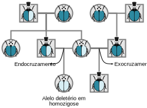
```

<br>

## Causas de endogamia

<br>

### Endogamia intencional

<br>

#### Estoques de laboratório

O endocruzamento sucessivo de animais tem sido usado para estabelecer linhagens genéticas "puras" para a pesquisa científica. Os experimentos conduzidos nesses assuntos são valiosos porque a variação genética não pode distorcer os resultados.

<br>

:::reference

Rader 2004. ISBN: [9780691016368](https://www.goodreads.com/book/show/434281.Making_Mice)

Taft et al. 2006. doi: [10.1016/j.tig.2006.09.010](https://doii.org/10.1016/j.tig.2006.09.010)

:::

<br>

#### Estoques para melhoramento animal e vegetal

Em animais domésticos, o endocruzamento geralmente resulta em uma troca em que uma característica desejável é ampliada às custas de outra.

Por exemplo, a endogamia de gado leiteiro holandês (_Holstein-Frísia_) levou ao aumento da produção de leite, mas as vacas são mais difíceis de criar.

<br>

:::reference

Zenger et al. 2007. doi: 10.1111/j.1365-2052.2006.01543.x [link](https://doii.org/10.1111/j.1365-2052.2006.01543.x ) 

Utsunomiya et al. 2013. doi: 10.1371/journal.pone.0064280 [link](https://doii.org/10.1371/journal.pone.0064280)

Mrode et al. 2019. doi: 10.1371/journal.pone.0064280 [link](https://doii.org/10.1371/journal.pone.0064280)

:::

<br>

### Endogamia acidental

A endogamia também vai surgir acidentalmente na natureza, sobretudo quando os cruzamentos se desviarem do acasalamento aleatório, como por conta de:

- Populações pequenas

- Acasalamento preferencial

- Autofertilização

<br>

## Freqüências genotípicas sob endogamia

Considere as sucessivas gerações de autofertilização em uma linhagem híbrida, cujas frequências alélicas iniciais $p$ e $q$ sejam idênticas.

As frequências genotípicas não estarão em equilíbrio de Hardy-Weinberg pois ao longo de algumas gerações irá existir uma deficiência de heterozigotos e um excesso de homozigotos. 

Após $n$ gerações de autofertilização, teremos:

- A frequência dos heterozigotos será 

$$\frac {1}{2^n}$$

<br>

- A frequência dos homozigotos será $\frac {1}{2^n}$; e

$$\frac {1- \frac {1}{2^n}}{2}$$
<br>

```{r inbreedingfertilization, echo = FALSE, fig.align = 'center', out.width="400px", fig.cap="Endocruzamentos aumentam as chances de encontro de alelos raros deléterios."}
knitr::include_graphics("figs/inbreeding_self_fertilization.svg")
```

<br>


## Coeficiente de endogamia

A quantidade de endogamia em uma população pode ser medida pela redução na heterozigosidade.

O **Coeficiente de Endogamia** ($F$) compara a proporção real de genótipos heterozigotos ($H_{Obs}$) com proporção genótipos heterozigotos esperada caso a população cruze aleatoriamente ($H_{Esp}$), de forma que:

<br>

\begin{equation} 
  F=\frac{H_{Esp} - H_{Obs}}{H_{Esp}}
  (\#eq:endogamia)
\end{equation} 

<br>

que é o mesmo que:

<br>

$$F=1 -  \frac{H_{Obs}}{H_{Esp}}$$


<br>

O coeficiente de endogamia ($F$) pode ser interpretado como a probabilidade de que dois alelos em um determinado locus sejam aleatoriamente idênticos por descendência (IBD).

**Não há endogamia ...**

... quando a população se reproduz ao acaso, pois $H_{Obs}=H_{Esp}$, e assim:

$$F=0$$

<br>

**Há endogamia completa ...**

... quando não há heterozigotos na população, pois $H_{Obs}=0$, e assim: 

$$F=1$$

<br>

**Há endogamia parcial ...**

... quando há heterozigotos na população, mas menos do que o esperado ao acaso, pois $H_{Obs}\ne0$ e $H_{Obs}<H_{Esp}$, e assim: 

$$0<F<1$$

<br>

**Também não há endogamia ...**

... quando há excesso de heterozigotos na população, pois .

<br>


## Freqüências genotípicas sob endogamia

Assumindo que, para um locus dialélico, que $H_{Esp} = 2pq$, podemos então definir a frequência real do genótipo heterozigoto em uma população endogâmica nos termos do coeficiente de endogamia, de forma que:

$$F = \frac {H_{Esp} - H_{Obs}}{H_{Esp}} = \frac {2pq - H}{2pq}$$
Assim, temos que:

$$f(Aa) = H = 2pq - 2pqF$$

<br>

```{r inbreedinggraph, echo = FALSE, warning = FALSE, fig.align = 'center', out.width = "600px", fig.cap="Frequência real do genótipo heterozigoto em uma população endogâmica."} 
library("ggplot2")
library("latex2exp")
ggplot(data.frame(x = c(0, 1)), aes(x = x)) + 
  stat_function(fun = function(x) x*(1-x)*(1-0), color = "firebrick2", lwd = 1) +
  stat_function(fun = function(x) x*(1-x)*(1-0.2), color = "chocolate", lwd = 1) +
  stat_function(fun = function(x) x*(1-x)*(1-0.4), color = "green4", lwd = 1) +
  stat_function(fun = function(x) x*(1-x)*(1-0.6), color = "deepskyblue3", lwd = 1) +
  stat_function(fun = function(x) x*(1-x)*(1-0.8), color = "royalblue3", lwd = 1) +
  labs(x = "Frequência do alelo p", y = "Frequência do genótipo heterozigoto") + 
  annotate(geom='text', x=0.5, y=0.24, parse = TRUE, color="firebrick2", label=TeX("$F=0$")) +
  annotate(geom='text', x=0.5, y=0.185, parse = TRUE, color="chocolate", label=TeX("$F=0.2$")) +
  annotate(geom='text', x=0.5, y=0.14, parse = TRUE, color="green4", label=TeX("$F=0.4$")) +
  annotate(geom='text', x=0.5, y=0.09, parse = TRUE, color="deepskyblue3", label=TeX("$F=0.6$")) +
  annotate(geom='text', x=0.5, y=0.04, parse = TRUE, color="royalblue3", label=TeX("$F=0.8$"))
```

<br>

Perceba que a frequência do genótipo heterozigoto sob endogamia é descrescida em uma parcela $2pqF$ da expectativa $2pq$ de cruzamento aleatório, parcela essa que, como visto anteriormente, será acrescida nos procionalmente aos genótipos homozigotos.

Isso pode ser demonstrado assumindo a frequência real de heterozigotos em uma população endogâmica a partir do cálculo das frequências alélicas.

Assim, teremos para o alelo $A$:

<br>

$$ f(A) = p = D + \frac{1}{2}H = p^2 + \frac{1}{2}(2pq - 2pqF)$$

<br>

A fórmula acima pode ser reescrita, assumindo que $pq=p(1-p)=p-p^2$, de forma que:

<br>

$$f(AA) = p^2 = p - pq + pqF = p^2 +pqF$$

E para o alelo $a$:

<br>

$$ f(a) = q = R + \frac{1}{2}H = q^2 + \frac{1}{2}(2pq - 2pqF)$$

<br>

E assumindo que $pq=q(1-q)=q-q^2$, de forma que:

e

<br> 

$$f(aa) = q^2 = q - pq + pqF = q^2 +pqF$$


## Autozigotos e alozigotos

Na fecundação, podemos categorizar os zigotos em **autozigotos** ou **alozigotos** a depender da origem dos alelos em um locus gênico.

<br>

:::quote

**Autozigotos** — formado por dois alelos que se originam de um ancestral comum por meio de acasalamento não-aleatório, i.e., **idênticos por descendência** (IBD).

**Alozigotos** — formado por dois alelos que provêm de diferentes fontes (até onde a descendência pode ser estabelecida), ou **idênticos por estado** (IBS).

:::

<br>

A chance de formação de autozigotos em uma geração depende da chance de encontros de gametas no _pool_ gênico, que intrinsecamente depende do tamanho da amostra, de forma que:

\begin{equation}
  P(Autozigotos)=\frac{1}{2N_e}
  (\#eq:autozigotos)
\end{equation}

Todos os demais cruzamentos resultam em alozigotos, sejam eles heterozigotos ou homozigotos idênticos por estado, de forma que:

\begin{equation} 
   P(Alozigotos)= 1-\left(\frac{1}{2N_e}\right)
   (\#eq:alozigotos)
\end{equation} 

<br>

```{r autozigotos, echo = FALSE, fig.align = 'center', out.width="600px", fig.cap="Formação de homozigotos autozigotos e alozigotos no _pool_ gênico. Somente alelos idênticos por descendência (IBD, vermelho) formam autozigotos, uma vez que alelos idênticos por estado (IBS, amarelo) formam alozigotos, assim como os heterozigotos (verde)."}
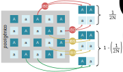
```

<br>


<br>

```{r punnetinbreeding, echo = FALSE, fig.align = 'center', out.width="400px", fig.cap="Frequências genotípicas a partir das chances de formação de alozigotos e autozigotos dado o coeficiente de endogamia $F$ da população."}
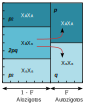
```

<br>


## Endogamia em genealogias

O coeficiente de endogamia também pode ser utilizado para expressar a probabilidade de encontro de alelos idênticos por descendência (IBD) em uma prole de endocruzamento em genealogias.

Assim, o coeficiente de endogamia de um indivíduo $X$ da genealogia é dado pelo grau de parentesco entre seus parentais até o(s) ancestral(is) em comum, de forma que:

- Se o(s) ancestral(is) em comum não é(são) endogâmico(s):

<br>

$$F_X = \sum \left( \frac{1}{2} \right)^n$$

<br>

Onde 
$n$ é o grau de separação entre os parentais até o ancestral em comum (ver Figuras \@ref(fig:Fpedigree) e \@ref(fig:Fpedigreeexamples)).

- Se o(s) ancestral(is) em comum é(são) endogâmico(s):

<br>

$$F_X = \sum \left( \frac{1}{2} \right)^n \cdot \ \left( 1 + F_A \right)$$
<br>

Onde 
$F_A$ é o coeficiente de endogamia do ancentral comum.

<br>

```{r Fpedigree, echo = FALSE, fig.align = 'center', out.width="800px", fig.cap="O coeficiente de endogamia ($F$) de um indivíduo é determinado pela chance de identidade por descendência (IBD) de genes herdados de um ou mais ancestrais comuns na sua genealogia."}
knitr::include_graphics("figs/inbreeding_coeficient_genalogy.svg")
```

<br>

```{r Fpedigreeexamples, echo = FALSE, fig.align = 'center', out.width="600px", fig.cap="Diferentes coeficientes de endogamia ($F$) em função das relaçoes de parentesco entre indivíduos em uma genealogia."}
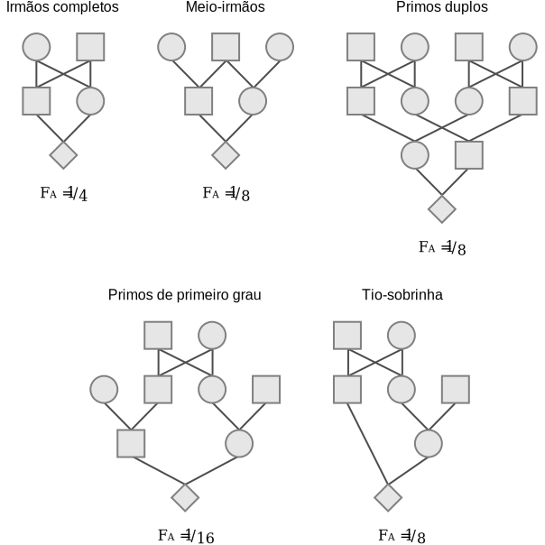
```

<br>

## Endogamia ao longo das gerações

Como visto anteriormente, a chance de formação de autozigotos em uma geração depende do tamanho efetivo da população ($N_e$).

Seja $\Delta F$ a variação no coeficiente de endogamia de uma geração para a outra, temos que:

$$\Delta F = \frac{1}{2N_e}$$
Assim, o coeficiente de endogamia na geração atual $t$ seria dado pela endogamia produzida na formação de autozigotos nessa e pela endogamia que já existia na geração anterior $t-1$ herdada pelos alozigotos, de forma que:

<br>

$$F_t = \frac{1}{2N_e} + \left( 1- \frac{1}{2N_e} \right)F_{t-1}$$

<br>

ou

<br>

$$F_t = \Delta F + \left( 1- \Delta F \right)F_{t-1}$$

<br>


Assim, o coeficiente de endogamia na geração seguinte $t+1$, pode ser expresso como:

<br>

$$F_{t+1} = \Delta F + \left( 1- \Delta F \right)F_{t}$$
<br>

As equações acima, aplicadas de forma recorrente, podem ser usadas para estimar o coeficiente de endogamia produzido em função do número de gerações $t$ decorridas, de forma que:

$$F_t = 1 - \left( 1- \frac{1}{2N_e} \right)^t$$

<br>

Desta forma, dado tempo suficiente, _i. e._, $t \rightarrow \infty$), todas as populações finitas, irão eventualmente se tornar completamente endogâmicas. 

<br>

```{r inbreedinggeneration, echo = FALSE, warning = FALSE, fig.align = 'center', out.width = "600px", fig.cap="O coeficiente de endogamia ao longo das gerações em populações com diferentes tamanhos populacionaisFrequência real do genótipo heterozigoto em uma população endogâmica."} 
library("ggplot2")
library("latex2exp")
ggplot(data.frame(x = c(0, 50)), aes(x = x)) + 
  stat_function(fun = function(x) 1-(1-(1/(2*10)))^x, color = "firebrick2", lwd = 1) +
  stat_function(fun = function(x) 1-(1-(1/(2*20)))^x, color = "chocolate", lwd = 1) +
  stat_function(fun = function(x) 1-(1-(1/(2*50)))^x, color = "green4", lwd = 1) +
  stat_function(fun = function(x) 1-(1-(1/(2*100)))^x, color = "deepskyblue3", lwd = 1) +
  stat_function(fun = function(x) 1-(1-(1/(2*500)))^x, color = "royalblue3", lwd = 1) +
  labs(x = "Gerações", y = "Coeficiente de endogamia") + 
  annotate(geom='text', x=49, y=0.97, parse = TRUE, color="firebrick2", label=TeX("$N_e=10$")) +
  annotate(geom='text', x=49, y=0.76, parse = TRUE, color="chocolate", label=TeX("$N_e=20$")) +
  annotate(geom='text', x=49, y=0.44, parse = TRUE, color="green4", label=TeX("$N_e=50$")) +
  annotate(geom='text', x=49, y=0.27, parse = TRUE, color="deepskyblue3", label=TeX("$N_e=100$")) +
  annotate(geom='text', x=49, y=0.09, parse = TRUE, color="royalblue3", label=TeX("$N_e=500$")) +
  coord_cartesian(ylim = c(0,1))
```

<br>


## Depressão endogâmica

A **depressão endogâmica** é a redução da aptidão de uma determinada população devido à endogamia, a qual envolve dois mecanismos.
 
1. O aparecimento de características desvantajosas através do encontro de alelos recessivos deletérios na descendência de um cruzamento endogâmico; e

2. O aumento da aptidão dos heterozigotos.

Quando dois indivíduos relacionados se acasalam, a probabilidade de alelos recessivos deletérios emparelhados com a prole resultante é maior quando comparada a quando os indivíduos não relacionados se acasalam. 

Assim, é possível estimar o **risco relativo** de um indivíduo em herdar alelos idênticos por descendência, dada simplesmente a razão entre a frequência do genótipo homozigoto dado o coeficiente de endogamia da população e a a frequência genotípica esperada sob cruzamento aleatório.

Considerando que a estimativa de risco relativo é predominantemente utilizada para genes recessivos, temos que:

<br>

$${Risco \ Relativo} = \frac{ q^2 \left( 1-F \right) + qF }{ q^2 }$$

<br>

Por exemplo, na população humana, foi demonstrado que a taxa de mortalidade infantil é 4% maior em nascimentos de pais que são primos de primeiro grau do que em nascimentos de pais não aparentados, enquanto em aves, O fracasso da eclosão dos ovos tende a aumentar com o coeficiente de endogamia dos pais (Figura /@ref(fig:inbreedingdepression)) 

<br>

```{r inbreedingdepression, echo = FALSE, fig.align = 'center', out.width="800px", fig.cap="Depressão endogâmica em humanos (esquerda; [Bittles & Neel 1994](https://doi.org/10.1038/ng1094-117)) e pássaros _Parus major_ (direita; [Noordwijk et al. 1981](https://doi.org/10.1007/BF00349183))."}
knitr::include_graphics("figs/inbreeding_depression.svg")
```

<br>

## Evitando a endogamia

A hipótese da evitação da endogamia postula que certos mecanismos se desenvolvem dentro de uma espécie, ou dentro de uma dada população de uma espécie, como resultado da seleção natural e sexual, a fim de prevenir a reprodução entre indivíduos relacionados naquela espécie ou população. 

Embora a endogamia possa impor certos custos evolucionários, a abstenção de endogamia, que limita o número de parceiros potenciais para um determinado indivíduo, pode infligir custos de oportunidade. 

<br>

### Reconhecimento de parentesco

O reconhecimento de parentesco é o mecanismo pelo qual os indivíduos identificam e evitam o acasalamento com membros intimamente relacionados.

Por exemplo, os genes do complexo principal de histocompatibilidade (MHC) podem e são usados para discriminar entre indivíduos aparentados e não-relacionados

Desta forma, esses mecanismos favorecem acasalamentos heteroespecíficos. 

<br>

### Dispersão

A dispersão é adotada por algumas espécies como forma de separar os parentes próximos e evitar a endogamia.

Contudo, movimentos de longa distância podem acarretar riscos de mortalidade e custos energéticos.

<br>

### Maturação sexual tardia

A maturação sexual tardia da prole na presença dos pais é outro mecanismo pelo qual os indivíduos evitam a endogamia. 

Cenários de maturação atrasada podem envolver a remoção do genitor original do sexo oposto, como é o caso de leoas que exibem estro mais cedo após a substituição de seus pais por novos machos.

<br>

### Cópulas extra-par

Em várias espécies, as fêmeas se beneficiam ao acasalar com vários machos, produzindo assim mais descendentes de maior diversidade genética e potencialmente de qualidade. 

Fêmeas que estão ligadas a um macho de baixa qualidade genética, como pode ser o caso de endogamia, são mais propensas a se envolver em cópulas extrapar para melhorar seu sucesso reprodutivo e a capacidade de sobrevivência de sua prole.

<br>

:::reference

Pusey & Wolf 1996. doi: [10.1016/0169-5347(96)10028-8](http://dx.doi.org/10.1016/0169-5347(96)10028-8)

Manning et al. 1992. doi: [10.1038/360581a0](https://doi.org/10.1038/360581a0)

Szulkin & Sheldon 2008. doi: [10.1098/rspb.2007.0989](http://dx.doi.org/10.1098/rspb.2007.0989)

O’Riain et al. 2000. doi: [10.1007%2Fs002650000249](https://doi.org/10.1007%2Fs002650000249)

Petrie & Kempenaers 1998. doi: [10.1016/S0169-5347(97)01232-9](https://doi.org/10.1016/S0169-5347(97)01232-9)

:::

<br>

## Exercícios

<!--chapter:end:09_endogamia.Rmd-->

# Estruturação Populacional

<br>

```{r Aphelocoma, echo = FALSE, fig.align = 'center', out.width="400px", fig.cap="A integração de dados detalhados de dispersão, linhagem e genômica possibilitou uma compreensão bastante completa de como a dispersão molda os padrões de diversidade genética em escalas espaciais curtas em gaio-dos-arbustos da Flórida (Aphelocoma coerulescens), em que o isolamento por distância ocorre como resultado da dispersão limitada sobre escalas de tempo contemporâneas. Veja [Aguillon et al. 2017](https://doi.org/10.1371/journal.pgen.1006911)."}
knitr::include_graphics('https://gcbias.files.wordpress.com/2017/09/plos_cover_image.jpg')
```

<br>

## Variação genética em populações subdivididas

A estrutura genética de uma população pode ser amplamente definida como a quantidade e distribuição da variação genética dentro e entre populações.


De forma geral, uma estrutura genética irá decorrer de qualquer desvio do acasalamento aleatório, incluindo:

- Endogamia

- Acasalamento seletivo

- Subdivisão geográfica

<br>

A estruturação geográfica das populações por sua vez irão decorrer de:
 
- barreiras ao fluxo gênico

- limites de dispersão

- filopatria

<br>	
	
Seja como for, os organismos não se reproduzem aleatoriamente e tendem a permanecer próximos de onde nasceram. 

Nestas circunstâncias, as diferenças genéticas e fenotípicas podem se acumular entre as populações. 

Essas diferenças podem levar, ao longo de várias gerações, ao isolamento reprodutivo e, por fim, à especiação. 


## Efeito Wahlund

<br>

```{r wahlund, echo = FALSE, fig.align = 'right', out.width = "300px", fig.cap="[Sten Wahlund]() (1901 – 1976), geneticista e político sueco."} 
knitr::include_graphics('https://dms-cf-05.dimu.org/image/032wZ1NqR4JC')
```
<br>

O efeito Wahlund é uma redução na heterozigosidade em uma população causada pela estruturação populacional.

Se duas ou mais subpopulações têm diferentes frequências alélicas, a heterozigosidade global é reduzida, mesmo que as próprias subpopulações estejam em equilíbrio de Hardy-Weinberg.

<br>

Considere duas subpopulações A e B, ambas em equilíbrio de Hardy-Weinberg:

<br>

| População A | População B | 
| :--:        | :--:        |
|$N(AA) = x_A = 49$|$N(AA) = x_B = 16$|
|$N(Aa) = y_A = 42$|$N(Aa) = y_B = 48$|
|$N(aa) = z_A = 9$|$N(aa) = z_B = 36$|

<br>

Assim, as frequências alélicas dos alelos $A$ e $a$ em cada população serão:

<br>

| População A | População B | 
| :--:        | :--:        |
|$f(A) = p_A = 0.7$|$f(AA) = p_B = 0.4$|
|$f(a) = q_A = 0.3$|$f(a) = q_B = 0.6$|

<br>

Contudo, podemos considerar que as subpopulações A e B integram uma única população M, onde teremos que:


<br>

$$N_{Obs}(AA) = x_A + x_B = 65$$

$$N_{Obs}(Aa) = y_A + y_B = 90$$

$$N_{Obs}(aa) = z_A + z_B = 45$$

<br>

E suas frequências alélicas na população M serão:


$$\bar{p} = \frac{p_A + p_B}{2} = 0.55$$

$$\bar{q} = \frac{q_A + q_B}{2} = 0.45$$

<br>

Assim, dada a expectativa do princípio de Hardy-Weinberg, o número de indivíduos de cada genótipo para a população M será:

<br>

$$N_{Esp}(AA) = N_M\cdot p_M^2 = 200 \cdot 0.55^2 \approx 60.5$$

$$N_{Esp}(Aa) = N_M\cdot 2p_Mq_M = 2 \cdot 0.55 \cdot 0.45 \approx 99$$

$$N_{Esp}(aa) = N_M\cdot q_M^2 = 200 \cdot 0.45^2 \approx 40.5$$

<br>

Observam-se assim uma quantidade menor de heterozigotos na população M (e correspondentemente mais homozigotos) do que o esperado pelo cruzamento aleatório.

Tal redução na heterozigosidade pode ser estimada pelo coeficiente de endogamia $F$, como visto anteriormente (\@ref(eq:endogamia)), de forma que:

<br>

$$F_M = 1 - \frac{N_{Obs}(Aa)}{N_{Esp}(Aa)} = 1 - \frac{90}{99} \approx 0.091$$

<br>

Assim, pode-se dizer que subdivisão populacional é responsável por cerca de 9,1% de diferenciação genética entre as subpopulações A e B.

<br>

De forma geral, a heterozigosidade em uma população subdividida é dada pela média das suas subpopulações 1 e 2, de forma que:

<br>

$$H = \frac{2p_1q_1 + 2p_2q_2}{2}$$

<br>

Que é o mesmo que:

<br>

$$H = p_1q_1 + p_2q_2$$

<br>

Sendo $q = 1-p$, teremos:

<br>

$$H = p_1(1-p_1) + p_2(1-p_2)$$

<br>

Assim, é fácil provar que a heterozigosidade da população subdividida ($H$) será sempre menor do que a heterozigosidade esperada da população total ($2\bar{p}\bar{q}$), a não ser que as frequências alélicas nas duas subpopulações sejam iguais ($p_1 = p_2$), _i. e._, que não haja estruturação subpopulacional.

<br>

## Heterozigosidade em níveis demográficos

É possível porém estimar a frequência esperada de heterozigotos em diferentes níveis demográficos quando as populações estão subdivididas.

Supondo que os indivíduos sejam amostrados a partir de um número $k$ de locais diferentes, a heterozigosidade pode ser estimada nos seguintes níveis:

<br>

**Heterozigosidade individual ($H_I$)**

Também chamada de heterozigosidade observada ($H_{Obs}$), a heterozigosidade individual é estimada como a fração de heterozigotos na amostra em uma determinada localidade, de forma que:

<br>

$$H_I = \frac{\sum{N_{ij}}}{N}$$

<br>

Onde 
$N_{ij}$ é o número de indivíduos do genétipo heterozigoto do $i$-nésimo e $j$-nésimo alelos, e 
$N$ é o tamanho da subpopulação.

<br>

A heterozigosidade individual pode ser interpretada como uma medida da _heterozigosidade média de todos os genes de um indivíduo_ ou como _a probabilidade de observar um heterozigoto em um locus específico_.

<br>

**Heterozigose subpopulacional ($H_S$)**

A heterozigose subpopulacional é a proporção de heterozigosidade esperada em uma subpopulação amostrada específica, e pode ser estimada como a heterozigosidade esperada ($H_{Esp}$) média em todos os $k$ locais amostrados, de forma que:

<br>

$$H_S = \frac{1}{k}\cdot\sum_{i=1}^k{2p_iq_i}$$

<br>

Onde 
$p_i$ é $q_i$ são as frequências alélicas do $i$-nésimo local amostrado.

<br>

Para tal, assume-se que cada uma das localidades amostradas sigam o princípio de Hardy-Weinberg.

<br>

**Heterozigosidade total ($H_T$)**

A heterozigosidade total é a heterozigosidade em todo o conjunto de dados; é a heterozigosidade esperada se todos os dados fossem mesclados e acasalados como uma única população panmítica, definida como:

<br>

$$H_T = 2\bar{p}\bar{q}$$

<br>

Onde 
$\bar{p}$ e $\bar{q}$ são as frequências alélicas médias entre todos os $k$ locais de amostragem.

<br>

```{r hetrozigosedemography, echo = FALSE, fig.align = 'center', out.width="400px", fig.cap="A heterozigosidade em populações subdivididas.."}
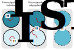
```

<br>

Assim, se os padrões subjacentes de acasalamento entre populações subdivididas restringirem o fluxo gênico, então essas estimativas de heterozigosidade irão mudar. 

<br>

**Não há estruturação geográfica ...**


... quando todas as subpopulações se misturam livremente, havendo essencialmente uma única população panmica, independente da quantidade de endogamia que realmente esteja ocorrendo nos locais individualmente, e assim:

<br>

$$H_S = H_T$$


<br>

Contudo, no outro extremo:

**Haverá estruturação geográfica ...**

... quando as subpopulações estão geneticamente isoladas umas das outras, e cada local está divergindo de acordo com sua própria história evolutiva, e neste caso:

<br>

$$H_S \ne H_T$$

<br>

## Estatísticas $F$ de Wright

As estatísticas $F$ (também conhecidas como índices de fixação) foram desenvolvidas por Sewall Wright na década de 1920 para comparar os níveis de heterozigosidade observada e esperada em termos do princípio de Hardy-Weinberg, de forma que, se um local está produzindo heterozigotos em uma proporção consistente com a expectativa de Hardy-Weinberg, então não há endogamia naquele deme ([Wright 1950](https://doi.org/10.1038/166247a0)).

<br>

Assim, o coeficiente de endogamia $F$ visto anteriormente (Equação \@ref(eq:endogamia)) corresponde ao primeiro nível demográfico, uma vez que a heterozigose dos indivíduos ($H_I$) é examinada em relação a heterozigosidade da subpopulação ($H_S$), de forma que:

<br>

$$F_{IS} = \frac{H_S-H_I}{H_S}=1-\frac{H_I}{H_S}$$

<br>

Os valores desse parâmetro são:

- positivos ($F_{IS}>0$), quando observa-se menos heterozigotos do que a expectativa de Hardy-Weinberg; e

- negativos ($F_{IS}<0$), quando observa-se mais heterozigotos do que a expectativa de Hardy-Weinberg.


<br>

No próximo nível demográfico, pode-se examinar a heterozigosidade das subpopulações ($H_S$) em relação ao conjunto total de dados ($H_T$), de forma que:

$$F_{ST} = \frac{H_T-H_S}{H_T}=1-\frac{H_S}{H_T}$$

<br>

Este parâmetro mede a redução na heterozigosidade das subpopulações caso não houve subdivisão populacional em relação à metapopulação, _i. e._, caso os cruzamentos entre todos os indivíduos fosse de fato aleatório, onde teremos:

**Ausência de isolamento ...**

... quando as subpopulações foram geneticamente idênticas; e:

<br>

$$F_{ST}=0$$

<br>

**Isolamento completo ...**

... quando as subpopulações foram geneticamente únicas, e assim:

<br>

$$F_{ST}=1$$

<br>

```{r fixationindex, echo = FALSE, fig.align = 'center', out.width="800px", fig.cap="A estrutura das populações e o índice de fixação ($F_{ST}$) em populações panmíticas e isoladas."}
knitr::include_graphics("figs/fixation_index.svg")
```

<br>

Para completar, podemos examinar a heterozigosidade individual ($H_I$) em relação ao conjunto total de dados ($H_T$), de forma que:

<br>

$$F_{IT} = \frac{H_T-H_I}{H_T}=1-\frac{H_I}{H_T}$$

<br>

Este parâmetro não é usado com frequência, pois os indivíduos são endogâmicos em relação às subpopulações nas quais são encontrados, e não em relação a totalidade do conjunto de dados. 

<br>

Os três parâmetros têm a seguinte relação matemática:

<br>

$$\left( 1-F_{IT} \right) = \left( 1-F_{IS} \right ) \left( 1-F_{ST} \right)$$

<br>

Onde 
$\left( 1-F_{IT} \right)$ corresponde a probabilidade geral de identidade por descendência (IBD), ou o desvio geral do princípio de Hardy-Weinberg (PHW), 
$\left( 1-F_{IS} \right )$ corresponde a probabilidade de IBD dentro de um indivíduo, ou o desvio do PHW devido à endogamia dentro das populações, e
$\left( 1-F_{ST} \right)$ corresponde probabilidade de IDB entre dois indivíduos em uma subpopulação, ou desvio do PHW devido à diferenciação subpopulacional.

<br>

## Isolamento por distância

Isolamento por distância (IBD*) é um termo usado para se referir ao acúmulo de variação genética local sob dispersão geograficamente limitada.

Como populações locais são pequenas em comparação com a população total, e a reprodução ocorre apenas dentro da população local, há uma restrição da probabilidade de indivíduos se acasalarem. 

Indivíduos dentro da subpopulação são vizinhos no sentido de que seus gametas tendem a se unir com maior probabilidade, aumentando a endogamia dentro da subpopulação. 

:::quote

Note que a sigla **IBD** também é usada para outro conceito importante em genética de populações, _viz._, **identidade por descendência**.

:::

O isolamento por distância é geralmente o modelo mais simples para a causa do isolamento genético entre as populações. 

Isso porque a probabilidade de dispersão decresce com a distância física, o que contribui para a diferenciação genética local. 

<br>

:::reference

White et al. 2010. doi: [10.1098/rspb.2009.2214](https://doi.org/10.1098/rspb.2009.2214)

Paradis et al 1998. doi: [10.1046/j.1365-2656.1998.00215.x](https://doi.org/10.1046/j.1365-2656.1998.00215.x)

Monteiro et al. 2014. doi: [10.1371/journal.pntd.0003167](https://doi.org/10.1371/journal.pntd.0003167)

Kanitz et al. 2018. doi: [10.1371/journal.pone.0192460](https://doi.org/10.1371/journal.pone.0192460)

:::

<br>

### Teste de Mantel

O teste de Mantel ([Mantel 1967](https://pubmed.ncbi.nlm.nih.gov/6018555); [Mantel & Valand 1970](https://doi.org/10.2307/2529108 )) é um teste estatístico extremamente versátil que tem muitos usos, incluindo análise espacial. 

Este teste examina a relação entre duas matrizes quadradas (geralmente matrizes de distância) $X$ e $Y$. 

Os valores dentro de cada matriz ($X_{ij}$ ou $Y_{ij}$) representam uma relação entre os pontos $i$ e $j$. 

No caso do isolamento por distância, a relação representada pelas matrizes a serem testadas seriam distâncias genéticas e geográficas entre as amostras. 

Por definição, as diagonais de ambas as matrizes deverão sempre ser preenchidas com zeros, uma vez que correspodendem a comparações de um indivíduo com ele mesmo..

<br>

### Correlação de Mantel estandardizada

A estatística de Mantel ($Z_M$) básica é simplesmente a soma dos produtos dos elementos correspondentes das matrizes, onde:

<br>

$$Z_M = \sum\sum X_{ij}Y_{ij} $$
<br>

Como $Z$ pode assumir qualquer valor, dependendo da natureza exata de $X$ e $Y$, geralmente usa-se a correlação de Mantel normalizada ($r_M$), calculada como a correlação entre os elementos de pares de $X$ e $Y$, de forma que:

<br>

$$r_M = \left( \frac{1}{n-1} \right) \sum \sum \frac{\left(X_{ij}-\bar{X}\right)}{\sigma_X}\frac{\left(Y_{ij}-\bar{Y}\right)}{\sigma_Y} $$

<br>

Onde 
$\bar{X}$ e $\bar{y}$ são os valores médios, e
${\sigma_X}$ e ${\sigma_Y}$ são os valores de desvio-padrão dos parâmetros de $X$ e $Y$, respectivamente.

<br>

A estatística varia de $-1 \leq r_M \leq +1$, 


<br>

```{r mantelcorrel, echo = FALSE, fig.align = 'center', out.width="800px", fig.cap="A correlação de Mantel entre matrizes de distâncias genéticas e geográficas permite avaliar se as populações se diferenciam por isolamento por distância (IBD)."}
knitr::include_graphics("figs/mantel_correlation.svg")
```

<br>

### Significância do teste de Mantel

A sigificância do teste de Mantel é estimada por meio de um teste de randomização (Monte Carlo)

O procedimento se dá em cinco passos:

1. A partir dos dados $X$ e $Y$, calcular a correlação de Mantel normalizada $r_M(XY)$, a qual será usada como valor de referência no teste;

2. Permutar aleatoriamente as linhas e colunas correspondentes de uma das matrizes, por exemplo na matriz $X$, obtendo a matriz $X^*$ (processo chamado de permutação de matriz);

3. Após a permutação dos dados $X^*$ e $Y$, calcular a correlação de Mantel normalizada $r_M(X^*Y)$, obtendo o valor $r_M^*$ da estatística sob permutação; 

4. Repetir os passos 2 e 3 um grande número de vezes (_e.g._, 999 ou 9999) para obter $n$ réplicas da distribuição de $r_M^*$ sob permutação, adicionando o valor de referência  $r_M(XY)$ à distribuição (a permuta e recompilação várias vezes para gerar uma distribuição de referência);

5. Para um teste unicaudal, envolvendo a cauda superior, _i. e._, para saber se as distâncias nas matrizes estão positivamente correlacionadas, calcular a probabilidade (valor-p) como a proporção de valores $r_M^*$ maiores ou iguais ao valor de referência $r_M(XY)$ em relação ao número $n$ de réplicas mais um (o valor original), de forma que:

$$valor\text{-}p = \frac{n(r_M^* \geq r_M)}{n+1}$$

<br>

## Exercícios


<!--chapter:end:10_estruturacao.Rmd-->

# Deriva Genética

<br>

```{r sealhunt, echo = FALSE, fig.align = 'center', out.width="600px", fig.cap="O elefante marinho do norte (_Mirounga angustirostris_) foi caçado implacavelmente na década de 1890, a ponto de se acreditar que o número de sua população caiu para 20 no final do século XIX. Desde então, sua população aumentou para dezena de milhares de indivíduos, mas seus genes ainda carregam as marcas desse gargalo."}
knitr::include_graphics('https://upload.wikimedia.org/wikipedia/commons/thumb/2/24/Killing_fur_seals%2C_St_Paul_Island.jpg/1024px-Killing_fur_seals%2C_St_Paul_Island.jpg')
```

<br>

:::reference

Weber et al. 2000. doi: [10.1016/S0960-9822(00)00759-4](https://doi.org/10.1016/S0960-9822(00)00759-4)

Hoelzel et al. 2020. doi: [10.1046/j.1420-9101.2002.00419.x](https://doi.org/10.1046/j.1420-9101.2002.00419.x)

:::

<br>

## Deriva genética aleatória

Uma vez que populações reais não são infinitas, as frequências alélicas se modificam de uma geração para a seguinte em decorrência do acaso, _i. e._, devido a **erros de amostragem**.

<br>

Considere dois indivíduos ($N = 2$), diplóides ($2n$), heterozigotos ($Cc$) reproduzindo sexuadamente, e com o tamanho populacional constante (produzindo dois filhos, _i. e._, cada indivíduo substituindo a si mesmo).

<br>

```{r driftN2, echo = FALSE, fig.align = 'center', out.width="800px", fig.cap="Probabilidade de mudança na frequência alélica em uma população população de tamanho finito e constante ($N=2$) dado o ruzamento entre dois indivíduos heterozigotos na geração parental ($F_0$)."}
knitr::include_graphics("figs/drift_breed_N2.svg")
```

<br>

A frequência do alelo recessivo pode sofrer uma mudança em relação à geração parental ($F_0$) dependendo da composição genotípica da prole ($F_1$), que depende simplesmente do acaso.

Assim, teremos que:

**Não haverá evolução ...**

... quando $q_1 = q_0$, com probabilidade igual a $\frac{6}{16}$.

<br>

**Haverá evolução ...**

.. quando $q_1 \ne q_0$, com probabilidade $1-\frac{6}{16}$, sendo a chance de aumento ou diminuição da frequência alélica proporcionalmente igual, $\frac{5}{16}$ cada, uma vez que a distribuição é simétrica.

<br>

Se uma população é infinita, não haverá erros de amostragem, e assim a frequência alélica de um determinado alelo na geração inicial $p_0$ será igual a frequência desse alelo na geração seguinte $p_1$, e permanecerá constante por conta do princípio de Hardy-Weinberg. 


E a mudança na frequência alélica geracional em populações infinitas ($\Delta p$) será:

<br>

$$\Delta p = p_1 - p_0 = 0$$

<br>

Contudo, Se uma população é finita, nem todos os cruzamentos possíveis de serem obsarvados no _pool_ gênico irão de fato ocorrer por conta de efeitos estocásticos, de forma que a frequência alélica $p_0$ em uma geração não será igual a frequência $p_1$ da próxima geração. 

E a mudança na frequência alélica geracional em populações finitas ($\Delta p$) será:

<br>

$$\Delta p = p_1 - p_0 \ne 0$$

<br>

Como a deriva genética decorre de erros de amostragem, cada população irá evoluir de forma diferente (considerando tamanhos populacionais iguais). 

<br>

## Prevendo o acaso 

<br>

```{r hungtington, echo = FALSE, fig.align = 'center', out.width="600px", fig.cap="A Doença de Huntington, uma desordem neurodegenerativa herdada por um alelo dominante de expanção de repetição CAG no gene da huntingtina, pode chegar a uma prevalença de até 2,2 em 100 mil habitantes em populações Afrikaner. A herança desse traço pode ser traçado de volta a quatro famílias dos 344 colonos holandeses que chegaram na África do Sul em 1658."}
knitr::include_graphics('https://upload.wikimedia.org/wikipedia/commons/3/3f/Charles_Bell_-_Jan_van_Riebeeck_se_aankoms_aan_die_Kaap.jpg')
```

<br>

:::reference

Hayden et al. 1980. PMID: [6447365](https://pubmed.ncbi.nlm.nih.gov/6447365/)

Greeff 2020 doi: [10.1111/j.1469-1809.2007.00363.x](https://doi.org/10.1111/j.1469-1809.2007.00363.x)

Hollfelder et al. 2020. doi: [10.1186/s12915-020-0746-1](https://doi.org/10.1186/s12915-020-0746-1)

:::

<br>

A deriva genética resulta de erros de amostragem que surgem sobretudo quando os gametas se unem para produzir descendentes, sobretudo quando a população é pequena, onde um número limitado de gametas se unem para produzir os indivíduos da próxima geração. O acaso influencia quais alelos estão presentes nesta amostra limitada e, desta forma, os erros de amostragem podem levar a mudanças na frequência alélica. 

Como os desvios das razões esperadas são aleatórios, a direção do acaso é imprevisível. 

<br>

Considere um locus gênico com dois alelos, $A$ e $a$, com frequências alélicas $p+q=1$, uma geração $t$ qualquer de uma população de tamanho $N$, com $2N$ gametas em seu _pool_ gênico, de forma que o número de alelos $A$ na população seja igual $2pN$.

A probabilidade exata de que o número de alelos $A$ permaneça igual a $2pN$ após uma geração de amostragem aleatória pode ser estimada pela fórmula geral para a distribuição binomial, onde $P$ é a probabilidade de $k$ sucessos dado a probabilidade $p$ de sucesso em $n$ eventos, de forma que:

<br>

\begin{equation} 
  P \left( k | p, n\right) = \binom{n}{k} \cdot p^k \cdot q^{n-k}
  (\#eq:binomial)
\end{equation} 

<br>

O parâmetro $\binom{n}{k}$ é o número total de combinações que os $k$ sucessos podem se apresentar no universo $n$ de eventos, de forma que:

<br>

\begin{equation} 
  \binom{n}{k} = \ ^nC_k =  \frac {n!}{k! \left( n-k \right)!}
  (\#eq:combinacao)
\end{equation} 


De forma geral,  
$n!$ é o fator que inicia a contagem do número de maneiras pelas quais o evento pode ocorrer, 
$k!$ é o fator que encerra a contagem do número de maneiras pelas quais o evento pode ocorrer, e 
$\left( n-k \right)!$ é o fator que remove eventos duplicados (_i. e._, em diferentes arranjos).

Perceba que, na formulação da probabilidade binomial, $q$ é a probabilidade de fracasso, onde $q = 1-p$.

<br>

Assim, em uma população de tamanho amostral $N=10$, e logo um _pool_ gênico com $2N=20$ gametas, com uma frequência alélica $p=0.8$...

... a probabilidade de que a frequência do alelo $A$ permaneça inalterada na próxima geração, _i. e._, que seja igual à $2pN = 16$, será:

<br>

$$
\begin{aligned}
P \left( 16 | 0.8, 20\right)
&= \binom{20}{16} \cdot 0.8^{16} \cdot0.2^{4} \\
&= \frac {20!}{16! \cdot 4!} \cdot 0.8^{16} \cdot0.2^{4}  \\
&\approx \frac {2.43290 \times 10^{18}}{2.09228 \times 10^{13} \cdot 24} \cdot 0.02815 \cdot 0.00160 \\
&\approx 4845 \cdot ×0,000045 \\
&\approx 0,21820 
\end{aligned}
$$ 

<br>

## A magnitude do acaso

<br>

```{r buri1956, echo = FALSE, fig.align = 'center', out.width="800px", fig.cap="O experimento clássico de Peter Buri ([1956](https://doi.org/10.1111/j.1558-5646.1956.tb02864.x)) sobre a dinâmica de duas mutações diferentes, $bw^{75}$ e $bw$) em um gene que influencia a cor dos olhos de 107 populações de _Drosophila melanogaster_, com 8 machos e 8 fêmeas em cada frasco de cultura."}
knitr::include_graphics("figs/buri_experiment.svg")
```

<br>

Embora é mais provável que as freqüências alélicas mudem de uma geração para outra, na verdade, é a magnitude da mudança que importa.

A probabilidades de frequências alélicas de uma geração para a próxima em populações de tamanhos variados mostra que a amplitude da distribuição diminui à medida que o tamanho da população aumenta.

<br>

```{r binomial, echo = FALSE, warning = FALSE, fig.align = 'center', out.width = "800px", fig.cap="Probabilidade binomial da mudança na frequência alélica ($p$) em uma geração por deriva dos alelos dado diferentes tamanhos populacionals ($N$). Note que a amplitude da distribuição diminui à medida que o tamanho da população aumenta."} 
library("ggplot2")
library("latex2exp")
library("patchwork")
X5 = seq(from = 0, to = 10, length = 11)
Y5 = dbinom(x = 0:10, size = 10, prob = 0.5)
Z5 = X5/10

X50 = seq(from = 0, to = 100, length = 101)
Y50 = dbinom(x = 0:100, size = 100, prob = 0.5)
Z50 = X50/100

X500 = seq(from = 0, to = 1000, length = 1001)
Y500 = dbinom(x = 0:1000, size = 1000, prob = 0.5)
Z500 = X500/1000

df10 <- data.frame(alelos = X5, prob = Y5, freq = Z5)

df100 <- data.frame(alelos = X50, prob = Y50, freq = Z50)

df1000 <- data.frame(alelos = X500, prob = Y500, freq = Z500)

ggplot(df10, aes(x=freq, y = prob)) +
  geom_line(aes(y = prob), size = 1, color = "firebrick2") +
  labs(x = "Frequência do alelo \nna próxima geração", y = "Probabilidade") +
  theme(legend.position="none") +
  annotate(geom='text', x=0.1, y=0.235, parse = TRUE, color="firebrick2", label=TeX("$N=10$")) +
ggplot(df100, aes(x=freq, y = prob)) +
  geom_line(aes(y = prob), size = 1, color = "royalblue3") +
  labs(x = "Frequência do alelo \nna próxima geração", y = "Probabilidade") +
  theme(legend.position="none") +
  annotate(geom='text', x=0.13, y=0.076, parse = TRUE, color="royalblue3", label=TeX("$N=100$")) +
ggplot(df1000, aes(x=freq, y = prob)) +
  geom_line(aes(y = prob), size = 1, color = "green4") +
  labs(x = "Frequência do alelo \nna próxima geração", y = "Probabilidade") +
  theme(legend.position="none") +
  annotate(geom='text', x=0.18, y=0.024, parse = TRUE, color="green4", label=TeX("$N=1000$"))
```

<br>

E assim também diminui, à medida que o tamanho da população aumenta, a quantidade de mudança devido a erros de amostragem. 

A direção da mudança é imprevisível -- as frequências alélicas aumentam e diminuem estocasticamente ao longo do tempo. 

Quando a mudança ocorre, a amostragem para produzir a próxima geração será centralizada no novo valor de frequência alélica $p$, com uma variância (dispersão) estimada de:

<br>

$$var(p) = \frac{p \left( 1-p \right)}{2N_e}$$
<br>

Como em um jogo com dados, em qualquer locus, a deriva pode sortir alelos a partir de uma geração para a seguinte até um alelo ser totalmente fixado ou perdido. O tempo necessário para que isso ocorra depende das freqüências iniciais dos alelos e, é claro, do tamanho da população.

Assim, a cada geração, uma população que tenha um alelo fixado (e.g., $p=1$) ou perdido (e.g., $p=0$) permanecerá desta forma uma vez que a variação genética foi exaurida ($q = 1-p = 0$ ou $q = 1-p = 1$, respectivamente), a menos que novos alelos surjam por mutação ou entrem na população por migração. 

Por outro lado, uma população que permanece com um locus segregante (e.g., $0<p<1$) irá produzir uma dispersão nas freqüências alélicas na geração seguinte, que por sua vez terão novamente alelos fixados para locos alternativos, enquanto outros permanecerão segregantes. 

<br>

À medida que passa o tempo, uma fração cada vez menor de locos continuarão segregantes. E após um número suficiente de gerações, a maioria dos locos terão um alelo fixado. 

Em populações maiores, o espalhamento progressivo das freqüências alélicas e o acúmulo de locos fixados ocorrem mais lentamente. 

```{r binomialpopsize, echo = FALSE, warning = FALSE, fig.align = 'center', out.width = "800px", fig.cap="Probabilidade binomial da mudança na frequência alélica ($p$) em uma geração por deriva dos alelos dado diferentes tamanhos populacionals ($N$). Note que a amplitude da distribuição diminui à medida que o tamanho da população aumenta."} 
library("ggplot2")
library("latex2exp")
library("patchwork")
drift <- read.csv("tables/drift.csv", sep=",", check.names = FALSE, header = TRUE)
ggplot(drift, aes(x=generation)) +
  geom_line(aes(y = N10_L01), size = 1, color = "#d53e4f") +
  geom_line(aes(y = N10_L02), size = 1, color = "#f46d43") +
  geom_line(aes(y = N10_L03), size = 1, color = "#fdae61") +
  geom_line(aes(y = N10_L04), size = 1, color = "#fee08b") +
  geom_line(aes(y = N10_L05), size = 1, color = "#fffdbf") +
  geom_line(aes(y = N10_L06), size = 1, color = "#e6f598") +
  geom_line(aes(y = N10_L07), size = 1, color = "#abdda4") +
  geom_line(aes(y = N10_L08), size = 1, color = "#66c2a5") +
  geom_line(aes(y = N10_L09), size = 1, color = "#3288bd") +
  geom_line(aes(y = N10_L10), size = 1, color = "#5e4fa2") +
  labs(x = "Geração", y = "Frequência alélica") +
  theme(legend.position="none") +
  xlim(0, 30) +
  ylim(0, 1) +
  annotate(geom='text', x=15, y=1, parse = TRUE, color="black", label=TeX("$N=10$")) +
ggplot(drift, aes(x=generation)) +
  geom_line(aes(y = N500_L01), size = 1, color = "#d53e4f") +
  geom_line(aes(y = N500_L02), size = 1, color = "#f46d43") +
  geom_line(aes(y = N500_L03), size = 1, color = "#fdae61") +
  geom_line(aes(y = N500_L04), size = 1, color = "#fee08b") +
  geom_line(aes(y = N500_L05), size = 1, color = "#fffdbf") +
  geom_line(aes(y = N500_L06), size = 1, color = "#e6f598") +
  geom_line(aes(y = N500_L07), size = 1, color = "#abdda4") +
  geom_line(aes(y = N500_L08), size = 1, color = "#66c2a5") +
  geom_line(aes(y = N500_L09), size = 1, color = "#3288bd") +
  geom_line(aes(y = N500_L10), size = 1, color = "#5e4fa2") +
  labs(x = "Geração", y = "Frequência alélica") +
  theme(legend.position="none") +
  xlim(0, 30) +
  ylim(0, 1) +
  annotate(geom='text', x=15, y=1, parse = TRUE, color="black", label=TeX("$N=500$"))

```

<br>

O tempo médio necessário para a fixação de um alelo, como mostrado por Kimura e Ohta ([1969](https://doi.org/10.1093%2Fgenetics%2F61.3.763)), depende do tamanho da população e da frequência do alelo, de forma que:

<br>

$$\bar{t}_1\left(p\right) = - \frac{1}{p} \left[ 4N_e \left( 1-p \right) \ln \left( 1-p \right) \right] $$
<br>

Assim, para um alelo que tenha acabado de surgir na população, com frequência mínima $p = \frac{1}{2N} \rightarrow 0 $, temos:

<br>

$$\bar{t}_1\left(p \rightarrow 0\right) = 4N_e $$

<br>

```{r fixationtime, echo = FALSE, fig.align = 'center', out.width="800px", fig.cap="O tempo médio necessário para a fixação de um alelo depende do tamanho da população e da frequência do alelo, como mostrado por Kimura e Ohta ([1969](https://doi.org/10.1093%2Fgenetics%2F61.3.763))."}
knitr::include_graphics("figs/birth_to_fixation.svg")
```

<br>

Outra maneira de pensar a deriva genética é considerar a taxa na qual a variação é perdida. 

Dada a heterozigosidade inicial da população $H_0$, a heterozigosidade após $t$ gerações $H_t$ pode ser calculada como:

<br>

$$H_t = \left( 1- \frac{1}{2N_e}   \right)^t \cdot H_0 $$

<br>

Espera-se que a heterozigosidade diminua, a cada geração, em uma fração $\frac{1}{2N_e}$. 

Assim, quanto menor o tamanho efetivo ($N_e$) da população, mais rápida a heterozigosidade será perdida.

<br>

```{r heterodrift, echo = FALSE, warning = FALSE, fig.align = 'center', out.width = "600px", fig.cap="A heterozigosidade de uma população finita tende a diminuir a cada geração."} 
library("ggplot2")
library("latex2exp")
ggplot(data.frame(x = c(0, 200)), aes(x = x)) + 
  stat_function(fun = function(x) 0.5*(1-(1/(2*10)))^x, color = "firebrick2", lwd = 1) +
  stat_function(fun = function(x) 0.5*(1-(1/(2*20)))^x, color = "chocolate", lwd = 1) +
  stat_function(fun = function(x) 0.5*(1-(1/(2*50)))^x, color = "royalblue3", lwd = 1) +
  stat_function(fun = function(x) 0.5*(1-(1/(2*200)))^x, color = "green4", lwd = 1) +
  stat_function(fun = function(x) 0.5*(1-(1/(2*1000)))^x, color = "deepskyblue3", lwd = 1) +
  labs(x = "Geração", y = "Heterozigosidade") + 
  xlim(0, 200) +
  ylim(0, 0.5) +
  annotate(geom='text', x=100, y=0.02, parse = TRUE, color="firebrick2", label=TeX("$N_e=10$")) +
  annotate(geom='text', x=100, y=0.08, parse = TRUE, color="chocolate", label=TeX("$N_e=20$")) +
  annotate(geom='text', x=100, y=0.22, parse = TRUE, color="royalblue3", label=TeX("$N_e=50$")) +
  annotate(geom='text', x=100, y=0.42, parse = TRUE, color="green4", label=TeX("$N_e=200$")) +
  annotate(geom='text', x=100, y=0.5, parse = TRUE, color="deepskyblue3", label=TeX("$N_e=1000$"))
```

<br>

Em suma:

- As frequências alélicas flutuam aleatoriamente de uma geração para outra;

- Eventualmente, alelos iniciais são fixado e outros são perdidos;

- A heterozigosidade esperada diminui ao longo do tempo;

- A taxa de desvio está diretamente relacionada ao tamanho efetivo da população.

<br>

## Gargalo populacional

<br>

```{r cheetah, echo = FALSE, fig.align = 'center', out.width="600px", fig.cap="Os guepardos africanos (_Acinonyx jubatus_) passaram por dois principais eventos de gargalo populacional: um a cerca de 10.000 anos atrás, na era do gelo, e outro a aproximadamente 200 anos atrás, durante o imperialismo das potências européias. Com isso, os guepardos atuais são mais parecidos geneticamente do que ratos Wistar, com menos de 1% de variação genética."}
knitr::include_graphics('https://cdn.britannica.com/s:700x500/01/152301-050-1EF6EBB4/Cheetah.jpg')
```

<br>

:::reference

O’Brien et al. 1987. doi: [10.1073/pnas.84.2.508](https://doi.org/10.1073/pnas.84.2.508)

Menotti-Raymond & O'Brien 1993. doi: [10.1073/pnas.90.8.3172](https://doi.org/10.1073/pnas.90.8.3172)

Dobrynin et al 2015. doi: [10.1186/s13059-015-0837-4](https://doi.org/10.1186/s13059-015-0837-4)

:::

<br>

Gargalo da população ou gargalo genético é uma redução acentuada no tamanho de uma população devido a eventos ambientais  ou atividades humanas.

Tais eventos podem reduzir a variação no pool genético de uma população; a partir de então, uma população menor, com menor diversidade genética, continua a passar genes para futuras gerações de descendentes por meio da reprodução sexual.

Como a população pode se recuperar após o gargalo, precisamos levar em conta essa mudança ao longo do tempo na medida de N, principalmente devido a perda de heterozigotos por deriva gênica.

Assim o tamanho efetivo da população ($N_e$) é a média harmônica dos tamanhos populacionais a cada geração, de forma que:

<br>

$$N_e = \frac{t}{ \sum_{i=1}^t \frac{1}{N_i} } $$

<br>

Onde 
$N_i$ é o tamanho da população na $i$-nésima geração, e
$t$ é o número de gerações decorridas.

<br>

```{r table1101, echo = FALSE}
bottleneckt1 <- c(1000, 1000, 1000)
bottleneckt2 <- c(1000, 250, 250)
bottleneckt3 <- c(1000, 1000, 250)
bottleneckt4 <- c(1000, 1000, 250)
bottleneckt5 <- c(1000, 1000, 1000)
bottleneckNe <- c(1000, 625, 357.1)
data1101 <- data.frame(bottleneckt1, bottleneckt2, bottleneckt3, bottleneckt4, bottleneckt5, bottleneckNe)
rownames(data1101) <- c("Constante", "Gargalo (curto)", "Gargalo (longo)")
knitr::kable(data1101, "html", align = "cccccc", col.names = c("$t_1$", "$t_2$", "$t_3$", "$t_4$", "$t_5$", "$N_e$"), booktabs = TRUE, escape = FALSE, caption = "Tamanho efetivo da população ($N_e$) entre três populações com diferentes histórias demográficas ao longo das gerações ($t$).")
```
<br>


## Efeito fundador

<br>

```{r amerindios, echo = FALSE, fig.align = 'center', out.width="400px", fig.cap= "Índios sul e centro-americanos colonizaram essas áreas a partir do norte desde a Sibéria, até o final da última Idade do Gelo. A maioria dessas pessoas descende de um pequeno grupo de fundadores intimamente relacionado, e são em quase totalidade pertencentes ao tipo sanguíneo O+. Retirado de Meyers Großes Konversations, Lexikon 6, Auflage."}
knitr::include_graphics("figs/amerindios.jpg")
```

<br>
  
:::reference

Halverson & Bolnick 2008. doi: [10.1002/ajpa.20887](https://doi.org/10.1002/ajpa.20887)

Estrada-Mena et al. 2009. doi: [10.1002/ajpa.21204](https://doi.org/10.1002/ajpa.20887)

Bégat et al. 2015. doi: [10.1371/journal.pone.0132211](https://doi.org/10.1002/ajpa.20887)

:::

<br>

O efeito fundador é a perda de variação genética que ocorre quando uma nova população é estabelecida por um número muito pequeno de indivíduos de uma população maior.

Nestes casos um pequeno grupo de migrantes que não é geneticamente representativo da população da qual eles vieram se estabelece em uma nova área. 

<br>

## Simulando a deriva genética

<br>

Veja como simular a deriva genética passo-a-passo [aqui][Simulações em genética de populações].

<br>

## Exercícios

<br>

### Exercício 1 -- O camundongo e o elefante

<br>

Uma espécie animal diplóide, que se reproduz sexuadamente, apresenta uma população com 1000 indivíduos. A análise de um locus gênico autossômico revelou que a população se encontra atualmente em equilíbrio de Hardy-Weinberg. Na ausência de forças evolutivas, qual seria o coeficiente de endogamia desta população daqui a dez mill anos se esta espécie fosse:

<br>

a. o camundongo doméstico (_Mus musculus_), com um tempo médio de geração de 1 a 2 anos?

b. o elefante africano (_Loxodonta africana_), com um tempo médio de geração de 25 anos?

<br>

Ainda, quanto maior seria a endogamia nessas populações se elas tivessem passado por um gargalo populacional que tivesse reduzido o tamanho das populações em 80% nos últimos 200 anos?


<!--chapter:end:11_deriva.Rmd-->

# Migração e Fluxo Gênico

<br>

```{r apricot, echo = FALSE, fig.align = 'center', out.width="800px", fig.cap="A Grande Muralha da China tem servido como uma barreira física ao fluxo gênico entre subpopulações de plantas separadas por mais de 600 anos, como por exemplo para o damasqueiro tibetano (_Prunus armeniaca_), em floração. Foto: runchinamarathon.com/images (2014)"}
knitr::include_graphics("figs/apricot_blossom_great_wall.JPG")
```

<br>

:::reference

Su et al. 2003. doi: [10.1038/sj.hdy.6800237](https://doi.org/10.1038/sj.hdy.6800237)

:::

<br>

## Migração $\times$ Fluxo gênico 

Como visto anteriormente, quando populações se encontram estruturadas, as subpopulações irão divergir por deriva genética. 

Cabe assim à migração promover o cruzamento de indivíduos de um deme com os de outro, e logo, o fluxo de genes entre as subpopulações. 

Contudo, a migração faz referência geralmente à indivíduos juvenis e adultos, e não necessariamente inclui o intercruzamento de indivíduos de populações diferentes (_e. g._,, pássaros migratórios).

Enquanto o fluxo gênico requer necessariamente que haja intercruzamento, o qual é também promovido por dispersão de larvas, sementes e gametas.

<br>

```{r bettlemigration, echo = FALSE, fig.align = 'center', out.width="600px", fig.cap="A migração de indivíduos entre subpopulações promove o fluxo gênico."}
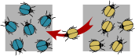
```

<br>


:::quote

**Migração** -- O movimento de membros de uma espécie para um ambiente diferente.

**Fluxo gênico** -- A transferência da variação genética de uma população para outra.

:::

<br>

## Modelando a migração

Conside um modelo simples onde duas populações locais trocam genes ao permutar uma proporção $m$ do total de seus indivíduos a cada geração reciprocamente.


Assim, em um lócus com dois alelos $A$ e $a$, teremos...

- ... na população 1:

<br>

$$f(A,Pop\ 1) = p_1$$ 

e

$$f(a,Pop\ 1) = q_1$$ 
<br>

- ... e na população 2:

<br>

$$f(A,Pop\ 2) = p_2$$ 

e

$$f(a,Pop\ 2) = q_2$$ 
<br>

Assim, a frequência $p'$ do alelo $A$ na próxima geração dependerá da fraçao $m$ de migrantes trocada entre as duas populações, de forma que...

- ... na população 1:

<br>

$$p'_1 = (1-m)p_1 + mp_2$$ 
<br>

- ... e na população 2:

<br>

$$p'_2 = (1-m)p_2 + mp_1$$ 

<br>

Onde 
$m$ é a fração de migrantes entre as duas populações, e 
$1-m$ é a a fração de não-migrantes.

<br>

```{r migration2way, echo = FALSE, fig.align = 'center', out.width="600px", fig.cap="A frequência alélica $p$ após uma geração com uma taxa de migração recíproca $m$ entre duas populações."}
knitr::include_graphics("figs/migration_bidirectional.svg")
```

<br>

A mudança nas frequências gênicas promovida pelo fluxo gênico dependerá assim da fração $m$ de migrantes e da diferença prévia existente entre as frequências gênicas $p_1$ e $p_2$ das populações, de forma que...

- ... na população 1:

<br>

$$
\begin{aligned}
\Delta p_1
&= p’_1 –  p_1 \\
&= (1 – m)p_1 + mp_2 \ – \ p_1 \\
&= p_1 – mp_1 + mp_2 \ – \ p_1 \\
&= mp_2 \ – \  mp_1 \\
&= m(p_2 \ – \ p_1)
\end{aligned}
$$ 
<br>

- ... e na população 2:

$$
\begin{aligned}
\Delta p_2
&= p’_2 –  p_2 \\
&= (1 – m)p_2 + mp_1 \ – \ p_2 \\
&= p_2 – mp_2 + mp_1 \ – \ p_2 \\
&= mp_1 \ – \  mp_2 \\
&= m(p_1 \ – \ p_2)
\end{aligned}
$$ 
<br>

Desta maneira, a migração será uma força evolutiva (promeverá mudança nas frequências gênicas), quando:

- $m > 0$ -- _i. e._ , há fluxo gênico (_viz._, as populações locais não estão totalmente isoladas); e

- $p_1 \neq p_2$ -- _i. e._, há divergência genética entre as populações locais (o que quase sempre irá ocorrer, uma vez que as subpopulações são finitas e possuem uma história evolutiva prévia, _viz._, deriva genética).

<br>

Assim, quando $p_1 = 0$ e $p_2 > 0$, O fluxo gênico introduzirá nova variação genética na população 1, uma vez que $p’_1  =  mp_2$

Neste sentido o fluxo gênico atuará localmente como um processo criativo, semelhante à mutação, mas mais expressivo do que esta, pois geralmente $m \gg µ$ (ver taxa de mutação em [#Mutação]).

<br>

## Migração ao longo do tempo

O fluxo gênico entre populações geneticamente distintas promove mudança nas frequências gênicas (evolução).

Contudo, esta mudança ocorre em uma direção específica.

Assim, se...

- ...na população 1

<br>

$$
\begin{aligned}
p'_1
&= (1-m)p_1 + mp_2 \\
&= p_1 - mp_1 + mp_2 \\
&= p_1 - (mp_1 - mp_2) \\
&= p_1 - m(p_1 - p_2)
\end{aligned}
$$ 

<br>

- ... e na população 2:

- ...na população 1

<br>

$$
\begin{aligned}
p'_2
&= (1-m)p_2 + mp_1 \\
&= p_2 - mp_2 + mp_1 \\
&= p_2 + (mp_1 - mp_2) \\
&= p_2 + m(p_1 - p_2)
\end{aligned}
$$ 

E se chamarmos $d$ a diferença entre as frequências gênicas das duas populações em uma dada geração, de forma que:

<br>

$$ d = p_1 - p_2$$
<br>

Então teremos que:

$$p'_1 = p_1 - md$$

e

$$p'_2 = p_2 + md$$

Assim, a diferença entre as frequências gênicas das duas populações na geração seguinte $d'$, será:

<br>

$$
\begin{aligned}
d'
&= p’_1 \ – \ p’_2 \\
&= (p_1 - md) - (p_2 + md) \\
&= p_1 - md - p_2 - md \\
&= p_1 - p_2 - 2md
\end{aligned}
$$
<br>

Assim, se $ d = p_1 - p_2$, logo teremos que:

<br> 

$$
\begin{aligned}
d'
&= d - 2md \\
&= d(1-2m) 
\end{aligned}
$$

<br>

Desta forma, o fluxo gênico entre as populações, quando $m>0$, leva à redução da diferença entre as frequências alélicas das subpopulações, proporcional a taxa de migração $m$, uma vez que $d'<d$.

Logo, após $t$ gerações de migração, temos que:

<br>

$$d_t = d(1 – 2m)^t$$

<br>

Assim:

- $d_t \to 0$, quando $t \to \infty$;

- e $d = 0$, quando $p_1 = p_2 = 0.5$


<br>

```{r migration2graph, echo = FALSE, warning = FALSE, fig.align = 'center', out.width = "600px", fig.cap="O fluxo gênico entre duas populações levará ao equilíbrio das frequências alélicas proporcionalmente a taxa de migracão $m$."} 
library("ggplot2")
library("latex2exp")
ggplot(data.frame(x = c(0, 50)), aes(x = x)) + 
  stat_function(fun = function(x) 1 - (1-(1*(1-(2*0.05))^x))/2, color = "royalblue3", lwd = 1) +
  stat_function(fun = function(x) 0 + (1-(1*(1-(2*0.05))^x))/2, color = "green4", lwd = 1) +
  labs(x = "Geração", y = "Frequência alélica") + 
  xlim(0, 50) +
  ylim(0, 1) +
  annotate(geom='text', x=25, y=0.7, parse = TRUE, color="royalblue3", label=TeX("$População \\ 1$")) +
  annotate(geom='text', x=25, y=0.3, parse = TRUE, color="green4", label=TeX("$População \\ 2$"))
```

<br>

O fluxo gênico pode ser visto como o ponto que conecta as populações:

- Em **curto prazo**, o fluxo gênico atua como uma força evolutiva criadora, pois introduz novas variantes alélicas em populações locais divergentes ou mesmo em espécies próximas por meio de **hibridização** e **introgressão**. 

- Em **longo prazo**, o fluxo gênico atua como uma força evolutiva conservadora, pois restringe a diferenciação gênica entre populações, promovendo a **conectividade** e **mistura**.

## O modelo fonte-dreno

No modelo fonte-dreno, também conhecido como continentes-ilha, o fluxo gênico ocorre unidirecionalmente, a partir de uma grande população (fonte) para uma menor (dreno). 

Desta forma, a introdução de alelos vindos da população fonte afeta a freqüência alélica na população dreno, mas não ao contrário. 

<br>

Como a população fonte não recebe migrantes da população dreno, ou, se o faz, a diferença no tamanho das duas populações torna a fração de migrantes desprezível, teremos que a frequência $P$ do alelo $A$ não é alterada pelo fluxo gênico, e permanecerá constante de uma geração para a outra.

Contudo, na população dreno, a frequência $p$ do alelo $A$ na próxima geração será influenciada pela fração $m$ de migrantes oriundos da população fonte, de forma que:

<br>

$$p_1 = (1 – m)p_0 + mP$$


<br>

```{r migration1way, echo = FALSE, fig.align = 'center', out.width="600px", fig.cap="A frequência alélica $p$ após uma geração com uma taxa de migração unidirecional $m$ pa população fonte para a população dreno."}
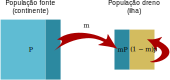
```

<br>

Como a frequência $P$ não muda, podemos prever que:

<br>

$$p_2 = (1 – m)p_1 + mP$$

$$p_3 = (1 – m)p_2 + mP$$

$$...$$

<br>

E assim, em termos gerais, a frequência $p$ do alelo $A$ na população dreno após $t$ gerações será:

<br>

$$p_t = (p_0 - P)(1 - m)^t+ P$$

<br>


De forma que $p_t \to P$, quando $t \to \infty$.

<br>

```{r migration1graph, echo = FALSE, warning = FALSE, fig.align = 'center', out.width = "600px", fig.cap="O fluxo gênico da população fonte para a população dreno promoverá, após certo tempo, dada a taxa de migracão $m$, a substituiçào dos alelos na última."} 
library("ggplot2")
  library("latex2exp")
ggplot(data.frame(x = c(0, 50)), aes(x = x)) + 
  stat_function(fun = function(x) 0.2, color = "royalblue3", lwd = 1) +
  stat_function(fun = function(x) 0.2 + (1 - 0.2)*(1 - 0.1)^x, color = "green4", lwd = 1) +
  labs(x = "Geração", y = "Frequência alélica") + 
  xlim(0, 50) +
  ylim(0, 1) +
  annotate(geom='text', x=25, y=0.10, parse = TRUE, color="royalblue3", label=TeX("$População \\ fonte$")) +
  annotate(geom='text', x=25, y=0.40, parse = TRUE, color="green4", label=TeX("$População \\ dreno$"))
```

<br>

## O modelo de ilhas

O modelo de ilha é uma modelagem mais complexa da migraÇão, onde todas $n$ populações estão conectadas através de uma taxa de migração $m$ constante. 

A maneira mais simples de modelar esse tipo de sistema é considerar que os migrantes compreendem um grande reservatório de migrantes, que são distribuídos para todas as populações. 

Se $\bar{p}$ é a frequência alélica média global, o conjunto de migrantes pode ser considerado como tendo também essa frequência alélica. 

Sendo assim, a frequência $p$ do alelo $A$ na $i$-nésima população na próxima geração será:

<br>

$$p_{i,t+1} = (1-m)p_{i, t} + m\bar{p}$$ 

<br>

## Equilíbrio entre fluxo gênico e deriva gênica

O fluxo gênico atua reduzindo a probabilidade de identidade por descendência (IBD), uma vez que um alelo introduzido de fora de uma população significa que não haverá ancestralidade comum dentro da população. 

Usando o índice de fixação ($F_{ST}$) como a medida do progresso da deriva genética, _i.e._, como a probabilidade de identidade por descendência em subpopulações relativas à metapopulação total, podemos expressar assim probabilidade total de identidade por descendência em populações migrantes.

Como visto anteriormente, em uma dada geração $t$, o coeficiente de endogamia ($F$) será:

<br>

$$F_t = \frac{1}{2N_e} + \left( 1- \frac{1}{2N_e} \right)F_{t-1}$$

<br>

Assumindo que a migração traz genes inteiramente não relacionados de outras populações, com probabilidade $m$: 

- $(1 – m)$ -- é a chance de que um alelo qualquer em uma geração não ter surgido por migração, e 

- $(1 – m)^2$ -- é a chance de que nenhum dos dois alelos combinados em uma fecundação tenha imigrado nessa geração. 

<br>

Assim, depois de contabilizar a possibilidade de migração, a probabilidade geral de identidade por descendência na geração tempo $t$ será:

<br>

$$F_t = \left[ \frac{1}{2N_e} + \left( 1- \frac{1}{2N_e} \right)F_{t-1} \right] \left( 1-m\right)^2$$

<br>

Como o tamanho efetivo da população $N_e$ e a taxa de migração $m$ são os dois únicos parâmetros para determinar o coeficiente de endogamia $F$ conforme acima, é bastante claro que os efeitos combinados da deriva genética e da migração devem tender a algum tipo de valor de equilíbrio.

Sendo o coeficiente de endogamia de equilíbrio $\hat{F}$, onde $\hat{F} = F_t = F_{t-1}$, teremos que:

- se $N$ e $m$ são pequenos, a deriva supera a migração, e $\hat{F} \approx 1$, mas

- se $N$ e $m$ são grandes, a migração irá homogeneizar as frequências dos genes mais rapidamente do que a deriva, e $\hat{F} \approx 0$.

E assim, o coeficiente de endogamia de equilíbrio $\hat{F}$ será:

<br>

$$\hat{F} = \left[ \frac{1}{2N_e} + \left( 1- \frac{1}{2N_e} \right)\hat{F} \right] \left( 1-m\right)^2$$

<br>

Assintoticamente à taxa de migração $m$, _i. e._, assumindo que o valor de $m$ é pequeno o suficiente para que $m^2 \sim 0$, teremos que:

$$ (1 - m)^2 \sim 1-2m$$

<br>

E assim, após várias simplificações algébricas da equação anterior (veja [aqui][#Provas]), teremos que:

<br>

$$\hat{F} \sim  \frac{1-2m}{4N_em+1-2m} $$

<br>

Desde que $2m \ll Nm$ e $2m \ll 1$, teremos a relação aproximada:

<br>

$$\hat{F} \sim  \frac{1}{4N_em+1} $$

<br>

Quando o índice de fixação ($F_{ST}$) é conhecido, podemos expressá-lo como:

<br>

$$F_{ST} \sim  \frac{1}{4N_em+1} $$

<br>

e 

<br>

$$N_em \sim  \frac{ \frac{1}{F_{ST}}-1}{4} $$

<br>

Neste contexto, $N_em$ representa o **número efetivo de migrantes** em uma população. 

Por esse motivo, algumas pessoas passaram a ver estimativas de $N_em$ como medidas de "fluxo gênico", quando, na verdade, $N_em$ não mede fluxo gênico, o que é dado efetivamente pela taxa de migração $m$.

O que $N_em$ realmente irá medir é a "tendência de produzir $F_{ST}$  sob deriva aleatória”, desde que as suposições bastante irrealistas do modelo de ilha sejam cumpridas. 

Assim:

- Se $N_em > 1$, há fluxo gênico suficiente para negar os efeitos da deriva genética, e manter a conectividade entre as populações, mas

- Se $N_em > 4$, então as populações locais podem ser consideradas pertencer a uma única população panmítica.

<br>

```{r fixationmigration, echo = FALSE, warning = FALSE, fig.align = 'center', out.width = "600px", fig.cap="O índice de fixação ($F_{ST}$) é uma função não-linear do número efetivo de migrantes ($N_em$). Ver Whitlock & McCauley ([1999](https://doi.org/10,1038/sj.hdy.6884960))."} 
library("ggplot2")
library("latex2exp")
ggplot(data.frame(x = c(0, 20)), aes(x = x)) + 
  stat_function(fun = function(x) 1/(x+1), color = "black", lwd = 2) +
  labs(x = "Número efetivo de migrantes", y = "Índice de fixação") + 
  xlim(0, 20) +
  ylim(0, 1)
```

<br>

## Exercícios

<br>

### Exercício 1 -- Duas subpopulações quaisquer

Suponha que existam duas subpopulações, $X$ e $Y$, com frequencias gênicas iniciais de um alelo $A$ iguais a $p_{0,X}=0.2$ e $p_{0,Y}=0.8$, respectivamente, sendo que $1\%$ dos indivíduos em uma subpopulação em qualquer geração são migrantes.

Desta forma, calcule a frequência alélica nas duas populações após...

- ... 5 gerações.

- ... 25 gerações.

- ... 100 gerações.

### Exercício 2 -- Aranha do deserto

Os indivíduos de uma espécie de aranha do deserto (_Agelenopsis aperta_) apresentam características comportamentais de base genética que os adaptam às pressões seletivas de diferentes ambientes:

- As aranhas de terras áridas, com baixa pressão de predação e baixa disponibilidade de presas, são muito territoriais e não discriminam a presa.

- As aranhas de floresta ribeirinha, com alta pressão de predação por pássaros e abundância de presas, são pouco territoriais e discriminam entre itens de presa com maior ou menor retorno energético.

Indivíduos de uma população de floresta ribeirinha do Arizona que é cercada por populações de áreas áridas, apresentam uma mistura de comportamentos de áreas áridas e ribeirinhas.

Esses comportamentos de áreas áridas podem ser considerados mal-adaptados a um ambiente ribeirinho, onde os locais de teia são abundantes, as presas são abundantes e as pressões de predação são altas. 

Estaria o fluxo gênico mantendo esses comportamentos mal-adaptativos na população ribeirinha do Arizona?

Usando os dados abaixo de isoenzimas isoenzimas para cinco populações locais da aranha do deserto (uma população da floresta ribeirinha e quatro populações próximas de habitats mais áridos), obtidos por Riechert ([1993](https://doi.org/10.1007/BF00183792)): 

<br>

| Locus | $F_{ST}$ |
| :--: | :--: |
| PGI1 | 0.020 |
| PGM1 | 0.023 |
| EST1 | 0.021 |
| MDH2 | 0.032 |
| IDH1 | 0.019 |
| GOT2 | 0.031 |
| αGPD1 | 0.029 |
| SOD1 | 0.145 |
| LDH1 | 0.012 |
| MDH1 | 0.141 |
| GAM1 | 0.063 |
| HEX1 | 0.034 |
| GOT1 | 0.033 |
| FUM2 | 0.129 |

<br>

O que pode-se concluir? 

<br>


<!--chapter:end:12_migracao.Rmd-->

# Mutação

<br>

```{r neutraltheory, echo = FALSE, fig.align = 'center', out.width="600px", fig.cap="Os padrões de polimorfismo de proteínas vistos na natureza são consistentes com a visão de que a maioria dos polimorfismos e diferenças fixas entre as espécies são fortemente deletérios ou seletivamente neutros. Esta proposta foi chamada de teoria neutra da evolução molecular. Retirado de Casillas & Barbadilla ([2017](https://doi.org/10.1534/genetics.119.302623))"}
knitr::include_graphics("figs/neutral_theory.jpeg")
```

<br>

:::reference

Kimura 1968. doi: [10.1038/217624a0](https://doi.org/10.1038/217624a0)

Ohta 1973. doi: [10.1038/246096a0](https://doi.org/10.1038/217624a0)

:::

<br>

A mutação é uma força evolutiva uma vez que promove uma mudança nas frequências gênicas ao longo do tempo. 

Por exemplo, considere uma população com de tamanho $N = 1000$ indivíduos, todos homozigotos em um locus gênico com o alelo $A$. 

Uma mutação que ocorra em um desses alelos, produzindo um único novo alelo $a$, mudará a frequência $p$ do alelo $A$ de uma geração $t$ para a outra $t+1$ , onde:

<br>

$$p_t = \frac{2N}{2N} = 1 $$

e

$$ p_{t+1} = \frac{2N-1}{2N} = 0.9995$$

<br>

Evidentemente, esta é uma mudança muito pequena, mas ainda assim é uma mudança evolutiva. 

<br>

A mutação é a fonte última de toda a variação genética, pois é ela que introduz novos alelos em uma população.

Embora a evolução não seja possível sem as mutações, a evolução não é simplesmente o acúmulo de mutações ao longo do tempo. 

A mutação, por si só, introduz novas variantes genéticas em uma população, o que não é possível de promover grandes mudanças gênicas ao longo do tempo evolutivo.

Outras forças evolutivas (_i. e._, seleção, deriva, e fluxo gênico) atuam sobre variantes mutantes, fazendo com que a mudança nas frequências alélicas seja mais expressiva. 

<br.

## Modelando as mutações

Modelos de mutação são caracterizações conceituais de como o processo de mutação resulta no desenvolvimento de novos estados alélicos. 

Neste ponto, não leva-se em conta as conseqüências de adaptabilidade dessas alterações. 

### Mutação direta

Considere o modelo mais simples de mutação, no qual um alelo $A$ em um dado locus tem a chance de se transformar em um alelo $a$ a cada geração. 

Esta é a única forma de mutação possível neste modelo (apenas um alelo mutante), e a mutação é irreversível (um alelo $a$ não pode sofrer mutação de volta para um alelo $A$). 

A chance desta mutação acontecer depende da taxa de mutação geracional $\mu$, onde:

<br>

$$ A \overset{\mu}{\rightarrow} a$$

<br>

Como a mutação é aleatória, essa taxa representa a probabilidade de mutação por locus por geração. Assim, embora o número real de mutações em qualquer geração possa variar em quantidade, a taxa de mutação é uma estimativa da probabilidade média de aparecimento de mutações durante longos períodos de tempo.

Logo, de uma geração $t_0$ para a outra $t_1$, assumindo que $f(A, t_0) = p_0$ e $ f(a, t_0) = q_0$, e $ f(A, t_1) = p_1$ e $ f(a, t_1) = q_1$,teremos:

<br>

$$ p_1 = p_0(1- \mu)$$ 

e

$$ q_1 = q_0 + p_0 \mu$$ 

Na segunda geração, se a taxa de mutação $\mu$ é constante, teremos que:

<br>

$$
\begin{aligned}
p_2
&= \color{red}{p_1}(1- \mu) \\
&= \color{red}{p_0(1- \mu)}(1- \mu) \\
&= p_0(1- \mu)^2 \\
&= p_0 - 2p_0\mu + p_0\mu^2
\end{aligned}
$$ 

e

$$
\begin{aligned}
q_2
&= \color{blue}{q_1} + \color{red}{p_1} \mu \\
&= \color{blue}{q_0 + p_0 \mu}+\color{red}{p_0(1- \mu)} \mu \\
&= \color{green}{q_0} + 2p_0\mu - p_0\mu^2 \\
&= \color{green}{1-p_0} + 2p_0\mu - p_0\mu^2 \\
&= 1 - \left( p_0 - 2p_0\mu + p_0\mu^2 \right) \\
&= 1 - p_2
\end{aligned}
$$ 

<br>

<br>

```{r mutation1way, echo = FALSE, fig.align = 'center', out.width="800px", fig.cap="NO modelo de mutação direta, a taxa de mutação geracional $μ$ promove o aumento do alelo $a$ em detrimento do alelo $A$."}
knitr::include_graphics("figs/mutation_unidirectional.svg")
```

<br>

Assim, após $t$ gerações de mutações com taxa $\mu$, 

A frequencia $p_t$ do alelo $A$ será:

<br>

$$ p_t = p_0 \left( 1 - \mu \right)^t $$

<br>

E a frequencia $q_t$ do alelo $a$ será:

<br>

$$ q_t = 1 - p_t$$

<br>

```{r mutation1graph, echo = FALSE, warning = FALSE, fig.align = 'center', out.width = "600px", fig.cap="A mutação do alelo $A$ para o alelo $a$ promoverá uma mudança evolutiva cuja direção é a diminuiçãao da frequência alélica $p$, e aumento da frequência alélica $q$,  proporcionalmente à taxa de mutação $μ$."} 
library("ggplot2")
  library("latex2exp")
ggplot(data.frame(x = c(0, 1000000)), aes(x = x)) + 
  stat_function(fun = function(x) 1*(1-0.0001)^x, color = "firebrick2", lwd = 1) +
  stat_function(fun = function(x) 1*(1-0.00001)^x, color = "chocolate", lwd = 1) +
  stat_function(fun = function(x) 1*(1-0.000001)^x, color = "royalblue3", lwd = 1) +
  stat_function(fun = function(x) 1*(1-0.0000001)^x, color = "deepskyblue3", lwd = 1) +
  stat_function(fun = function(x) 1*(1-0.00000001)^x, color = "green4", lwd = 1) +
  labs(x = "Geração", y = "Frequência do alelo A") + 
  xlim(0, 1000000) +
  ylim(0, 1) +
  annotate(geom='text', x=100000, y=0.10, parse = TRUE, color="firebrick2", label=TeX("$μ=10^{-4}")) +
  annotate(geom='text', x=250000, y=0.25, parse = TRUE, color="chocolate", label=TeX("$μ=10^{-5}$")) +
  annotate(geom='text', x=500000, y=0.70, parse = TRUE, color="royalblue3", label=TeX("$μ=10^{-6}")) +
  annotate(geom='text', x=800000, y=0.85, parse = TRUE, color="deepskyblue3", label=TeX("$μ=10^{-7}$")) +
  annotate(geom='text', x=950000, y=0.95, parse = TRUE, color="green4", label=TeX("$μ=10^{-8}$"))
```

<br>

### Mutaçao reversa

Sob um modelo de mutação reversível, além das mutações do alelo $A$ para a alelo $a$, também há a ocorrência de mutações que transformam o alelo $a$ de volta para o alelo $A$.

Desta forma, para que ocorra mudança nas frequências alélicas de uma geração para outra, é necessário que as taxas de mutação de um alelo para o outro sejam diferentes uma da outra (balanço mutacional diferente de zero).

Sendo $\mu$ a taxa de mutação do alelo $A$ para um alelo $a$, temos também agora a probabilidade de um alelo $a$ mutar para o alelo $A$, que irá depender de uma nova taxa de mutação $\nu$, de forma que:

<br>

$$A \mathrel{\mathop{\rightleftharpoons}^{\mathrm{\mu}}_{\mathrm{\nu}}} a$$

<br>

Logo, de uma geração $t_0$ para a outra $t_1$, assumindo que $f(A, t_0) = p_0$ e $ f(a, t_0) = q_0$, e $ f(A, t_1) = p_1$ e $ f(a, t_1) = q_1$,teremos:

br>

$$ p_1 = p_0(1- \mu) + q_o \nu$$ 

e

$$ q_1 = q_0(1- \nu) + p_0 \mu$$ 

<br>

Sendo 
$ p_0(1- \mu) $ e $ q_0(1- \nu) $ a proporção dos alelos $A$ e $a$ respectivamente que não sofreram mutação, e 
$ p_0 \mu $ e $ q_o \nu $ a proporção de alelos $A$ que, por mutação, viraram $a$, e vice-versa. 


<br>


```{r mutation2way, echo = FALSE, fig.align = 'center', out.width="600px", fig.cap="NO modelo de mutação reversa, as taxas de mutação geracional $μ$ e $\nu$ promovem o surgimento de novos alelos de ambos of tipos, cujo balanço dependerá dessas taxas e das frequências dos alelos naquela geração."}
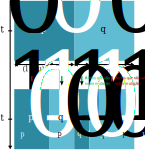
```

<br>

### Equilíbrio das taxas de mutação

<br>

Seja $\Delta p$ a mudança evolutiva na frequência $p$ do alelo $A$ de uma geração $t$ para a seguinte $t+1$, teremos que:

$$
\begin{aligned}
\Delta p
&= p_{t+1} - p_t \\
&= p_t(1- \mu) + q_t \nu - p_t \\
&= p_t - p_t \mu + q_t \nu - p_t \\
&= q_t \nu - p_t \mu
\end{aligned}
$$ 

Ou seja, no modelo de mutação reversa, a mudança evolutiva dependerá do balanço entre a proporção de alelos perdidos pela mutação direta (_e. g._, $ A \overset{\mu}{\rightarrow} a$) e de alelos criados pela mutação reversa (_e. g._, $ A \overset{\nu}{\leftarrow} a$).

A mudança evolutiva geracional na frequência do alelo $A$ pode ser determinada independentemente da frequência do alelo $a$ uma vez que $p+q=1$, de forma que:

<br>

$$
\begin{aligned}
\Delta p
&= p_{t+1} - p_t \\
&= p_t(1- \mu) + \color{red}{q_t} \nu - p_t \\
&= p_t(1- \mu) + \color{red}{(1-p_t)} \nu - p_t \\
&= p_t - p_t \mu + \nu - p_t \nu - p_t \\
&= \nu - p_t \mu + - p_t \nu \\
&= \nu - p_t (\mu + \nu)
\end{aligned}
$$ 

<br>

Desta forma, é possível verificar que a mudança evolutiva dependerá da magnitudade da taxa de mutação "criadora" do alelo e das taxas globais de mutação que atuam modificando a frequência daquele alelo.


Dada a magnitudade das taxa de mutação direta e reversa, $\mu$ e $\nu$, e das freqüências alélicas na população, é possível que haja um balanço nulo entre a quantidade de alelos "criados" e "destruídos" por mutação em uma geração, e assim, a frequência $p$ de um determinado alelo tenda a uma freqüência $\hat{p}$ de equilíbrio, onde:

<br>

$$ \hat{p} = p_{t+1} = p_t $$

<br>

Uma população que atinja tal equilíbrio entre o aparecimento de mutações diretas e reversas, para todos os efeitos, não mais sofrerá mudança nas frequências alélicas, uma vez que:

<br>

$$ \Delta \hat{p} = 0 $$

<br>

Assim, é possível estimar a frequência de equlíbrio $\hat{p}$ do alelo $A$, pois embora as frequências alélicas estejam em equilibrio, este é um equilíbrio dinâmico dado o balanço das taxas de mutação geracional, onde:

<br>

$$ \Delta \hat{p} = \nu - \hat{p} (\mu + \nu) $$


E desta forma, teremos que:

<br>


$$ \nu - \hat{p} (\mu + \nu) = 0 $$

$$\hat{p} (\mu + \nu) =  \nu $$

$$\hat{p}  =  \frac{\nu}{(\mu + \nu)} $$

<br>

Similarmente, a frequência de equlíbrio $\hat{q}$ do alelo $a$ será:

$$\hat{q}  =  \frac{\mu}{(\mu + \nu)} $$
<br>

Assim, no modelo de mutação reversa, a frequência de equlíbrio de um alelo será a razão entre a taxa de formação daquele alelo e a taxa global de mutação atuando sobre aquele alelo.

Note que $ \hat{p} \to 0$, quando $ \mu \gg \nu $.

Note também que, no equilíbrio:

<br>

$$ \Delta \hat{p} = 0 = \hat{q} \nu - \hat{p} \mu$$

Logo, as frequências alélicas de equilíbrio se manterão proporcionais às taxa relativas de mutação direta e reversa, de forma que:

<br>

$$ \hat{q} \nu - \hat{p} \mu = 0 $$

$$\hat{p} \mu =  \hat{q} \nu $$

$$\frac{\mu}{\nu} = \frac{\hat{q}}{\hat{p}} $$

<br>

E dado que $\hat{p} + \hat{q} = 1$ ...

- ... a frequência de equlíbrio $\hat{p}$ do alelo $A$ será:

<br>

$$\hat{p} + \color{red}{\hat{q}} = 1$$

$$\hat{p} + \color{red}{\frac{\hat{p}\mu}{\nu}} = 1$$

$$\hat{p} \left( 1 + \frac{\mu}{\nu} \right) = 1$$

$$\hat{p} = \frac{1}{\left( 1 + \frac{\mu}{\nu} \right)}$$
<br>


- ... e a frequência de equlíbrio $\hat{q}$ do alelo $a$ será:

<br>

$$\hat{q} + \color{red}{\hat{p}} = 1$$

$$\hat{q} + \color{red}{\frac{\hat{q}\nu}{\mu}} = 1$$

$$\hat{q} \left( 1 + \frac{\nu}{\mu} \right) = 1$$

$$\hat{q} = \frac{1}{\left( 1 + \frac{\nu}{\mu} \right)}$$
<br>

### Mutações ao longo do tempo

Após $t$ gerações de mutações reversíveis, com taxas $\mu$ e $\nu$, teremos que...

- ... a frequencia $p_t$ do alelo $A$ será:

<br>

$$ p_t = p_{t-1} \left( 1 - \mu \right) + \left( 1 - p_{t-1} \right) \nu$$

<br>

- ... a frequencia $q_t$ do alelo $a$ estimada apartir dessa, de forma que:

<br>

$$ q_t = 1 - p_t $$

<br>

Como a mudança evolutiva a cada geração dependerá do balanço entre as taxas formação de alelos dos dois tipos, uma função geral de que dependa somente das taxas de mutação e das frequências alélicas iniciais não é possível.

Contudo, na ausência de outras forças evolutivas, todas as populações sofrendo efeito de mutações reversíveis tenderão ao estado de equilíbrio.


Assim, sabendo o quanto falta para a população alcançar o equilíbrio, em termos da distância da freqüência alélica inicial da população da freqüência alélica de equilíbrio, e o quanto que as mutações conseguem ou não promover mudança evolutiva a cada geração, será possível estimar a frequência alélicas $p$ em qualquer geração $t$, de forma que:


<br>

$$ p_t = \frac{\nu}{(\mu + \nu)} + \left( p_0 - \frac{\nu}{(\mu + \nu)} \right) \left(1- \mu - \nu \right)^t$$

<br>

Onde 
$\frac{\nu}{(\mu + \nu)}$ é a frequência de equilíbrio $\hat{p}$, 
$p_0$ é a frequência alélica inicial, quando $t=0$, 
$1- \mu - \nu$ é a proporção de alélos que não sofre mudança evolutiva por mutação, e
$t$ é o tempo em número de gerações decorridas.

<br>

```{r mutation2graph, echo = FALSE, warning = FALSE, fig.align = 'center', out.width = "600px", fig.cap="Na ausência de outras forças evolutivas, todas as populações sofrendo efeito de mutações reversíveis tenderão a um estado de equilíbrio."} 
library("ggplot2")
library("latex2exp")
library("patchwork")
ggplot(data.frame(x = c(0, 50000)), aes(x = x)) + 
  stat_function(fun = function(x) ((0.00001/(0.0001+0.00001)) + (1 - (0.00001/(0.0001+0.00001)))*(1-0.0001-0.00001)^x), color = "firebrick2", lwd = 1) +
  stat_function(fun = function(x) ((0.00001/(0.0001+0.00001)) + (0.75 - (0.00001/(0.0001+0.00001)))*(1-0.0001-0.00001)^x), color = "chocolate", lwd = 1) +
  stat_function(fun = function(x) ((0.00001/(0.0001+0.00001)) + (0.5 - (0.00001/(0.0001+0.00001)))*(1-0.0001-0.00001)^x), color = "green4", lwd = 1) +
  stat_function(fun = function(x) ((0.00001/(0.0001+0.00001)) + (0.25 - (0.00001/(0.0001+0.00001)))*(1-0.0001-0.00001)^x), color = "deepskyblue3", lwd = 1) +
  stat_function(fun = function(x) ((0.00001/(0.0001+0.00001)) + (0 - (0.00001/(0.0001+0.00001)))*(1-0.0001-0.00001)^x), color = "royalblue3", lwd = 1) +
  labs(x = "Geração", y = "Frequência alélica") + 
  xlim(0, 50000) +
  ylim(0, 1) +
  annotate(geom='text', x=25000, y=1, parse = TRUE, color="black", label=TeX("$μ = 10^{-5} \\ e \\ ν = 10^{-4}$")) +
  ggplot(data.frame(x = c(0, 50000)), aes(x = x)) + 
  stat_function(fun = function(x) ((0.0001/(0.0001+0.00001)) + (1 - (0.0001/(0.0001+0.00001)))*(1-0.0001-0.00001)^x), color = "firebrick2", lwd = 1) +
  stat_function(fun = function(x) ((0.0001/(0.0001+0.00001)) + (0.75 - (0.0001/(0.0001+0.00001)))*(1-0.0001-0.00001)^x), color = "chocolate", lwd = 1) +
  stat_function(fun = function(x) ((0.0001/(0.0001+0.00001)) + (0.5 - (0.0001/(0.0001+0.00001)))*(1-0.0001-0.00001)^x), color = "green4", lwd = 1) +
  stat_function(fun = function(x) ((0.0001/(0.0001+0.00001)) + (0.25 - (0.0001/(0.0001+0.00001)))*(1-0.0001-0.00001)^x), color = "deepskyblue3", lwd = 1) +
  stat_function(fun = function(x) ((0.0001/(0.0001+0.00001)) + (0 - (0.0001/(0.0001+0.00001)))*(1-0.0001-0.00001)^x), color = "royalblue3", lwd = 1) +
  labs(x = "Geração", y = "Frequência alélica") + 
  xlim(0, 50000) +
  ylim(0, 1) +
  annotate(geom='text', x=25000, y=1, parse = TRUE, color="black", label=TeX("$μ = 10^{-4} \\ e \\ ν = 10^{-5}$"))
  
```

<br>

## Mutação e Endogamia

A endogamia será influenciada pelas taxas de mutação, uma vez que a mutação influenciará o nível de autozigosidade.

Se endogamia produzida de uma geração para outra é expressada como:

<br>

$$F_t = \frac{1}{2N_e} + \left( 1- \frac{1}{2N_e} \right)F_{t-1}$$

<br>

Com a ocorrência de mutações, o modelo de endogamia não será simétrico.

Assumindo que uma mutação irá alterar o estado dos alelos entregues para a próxima geração, com probabilidade $\mu$: 

- $(1 – \mu)$ -- é a chance de que um alelo qualquer em uma geração não ter sofrido mutação, e 

- $(1 – \mu)^2$ -- é a chance de que nenhum dos dois alelos combinados em uma fecundação tenha sofrido mutação nessa geração. 

<br>

Como somentes genótipos que não sofreram mutação podem produzir gametas autozigóticos, e portanto podem contribuir para o aumento da endogamia, podemos reformular a estimativa de endogamia esperada sob mutação, de forma que:


<br>

$$\hat{F} = \left[ \frac{1}{2N_e} + \left( 1- \frac{1}{2N_e} \right)\hat{F} \right] \left( 1-\mu \right)^2$$

<br>

Assim, enquanto o endocruzamento reduz a heterozigosidade, as mutações em populações endogâmicas irão promover o aumento da heterozigosidade, ao criar variantes alélicas _de novo_ em genótipos previamente homozigotos em sua maioria, proporcionalmente à taxa de mutação $\mu$. 

Ao longo do tempo, espera-se que seja alcançado um equilíbrio na endogamia, promovido pelo antagonismo entre o endocruzamento e as mutações.

<br>

```{r inbreedingmutation, echo = FALSE, warning = FALSE, fig.align = 'center', out.width = "600px", fig.cap="Uma vez que as mutações introduzem alelos novos na população, a probabilidade de encontro de alelos idênticos por descendência será menor nessas populações, e a endogamia ao longo das gerações irá crescer em uma taxa menor do que se não houvesse mutações."} 
## Dependências
library("ggplot2")
library("latex2exp")

## Parâmetros
T <- 1:100        ## Gerações
F <- 0            ## Coeficiente de endogamia inicial
mu <- 1/1000      ## Taxa de mutação
Ne <- 10          ## Tamanho efetivo da população
F0 <- rep(0,100)  ## Endogamia sem mutação
F1 <- rep(0,100)  ## Endogamia com mutação
IBD <- 1/(2*Ne)   ## Probabilidade de formação de autozigotos

## Modelo
for( t in 2:max(T)){
  F0[t] <- IBD + (1-IBD)*F0[t-1]
  F1[t] <- (IBD + (1-IBD)*F1[t-1]) * (1-mu)^2
}

## Gráfico
data1301 <- data.frame(T, F0, F1)
ggplot(data = data1301, aes(x = T)) +
  geom_line(aes(y = F0), color = "royalblue3", lwd = 1) +
  geom_line(aes(y = F1), color = "green4", lwd = 1) +
  labs(x = "Geração", y = "Coeficiente de endogamia") +
  xlim(0, 100) +
  ylim(0, 1) +
  annotate(geom='text', x=50, y=1, parse = TRUE, color="royalblue3", label=TeX("$μ = 0$")) +
  annotate(geom='text', x=50, y=0.8, parse = TRUE, color="green4", label=TeX("$μ = 10^{-4}$"))
```

<br>

Dada a expectativa de equilíbrio em relação à endogamia com base no tamanho efetivo da população ($N_e$) e na taxa de mutação ($\mu$) podemos verificar o nível de endogamia no equilíbrio ($\hat{F}$) como:

<br>

$$ \hat{F} = F_{t} = F_{t-1}$$

<br>

E assim, no equilíbrio:

<br>

$$ \Delta \hat{F} = 0$$
<br>

Assintoticamente à taxa de mutação $\mu$, _i. e._, assumindo que o valor de $\mu$ é pequeno o suficiente para que $\mu^2 \sim 0$, teremos que:

<br>

$$ (1 - \mu)^2 \sim 1-2\mu$$

<br>

E assim, após várias simplificações algébricas da equação anterior (veja [aqui][#Provas]), teremos que:

<br>

$$\hat{F} \sim  \frac{1-2\mu}{4N_e\mu+1-2\mu} $$

<br>

Desde que $2\mu \ll N_e\mu$ e $2\mu \ll 1$, teremos a relação aproximada:

<br>

$$\hat{F} \sim  \frac{1}{4N_e\mu+1} $$

<br>

Para organismos diplóides, $ 4N_e\mu = \theta$, que é a medida da **variação genética molecular**, e desta forma:

<br>

$$ \hat{F} \sim \frac{1}{1+\theta} $$

<br>

Como qualquer genótipo que não é homozigoto deve ser heterozigoto, a heterozigosidade no equilíbrio mutação-deriva ($\hat{H}$) pode ser definida como:

<br>

$$
\begin{aligned}
\hat{H}
&= 1 - \color{blue}{\hat{F}} \\
&= 1 - \color{blue}{\frac{1}{4N_e\mu+1}} \\
&= \frac{4N_e\mu}{4N_e\mu+1} \\
&= \frac{\theta}{\theta+1} 
\end{aligned}
$$ 

<br>

## Exercícios

<br>

### Exercício 1 -- Mudança evolutiva em $t$ gerações

Se partirmos de uma população sem mutações na qual $p_0 = 0.5$, quantas gerações $t$ são necessárias para alcançar $p_t = 0.4$, assumindo uma taxa de mutação direta $\mu = 10^{-6}$ e uma taxa de mutação reversa $\nu = 10^{-9}$.

<br>

Para isso, você lembra como trabalhar com logaritmos?

Logaritmo do produto -- $ \log_\color{red}{a} \left( \color{blue}{b}\cdot \color{green}{c} \right) = \log_\color{red}{a} \left( \color{blue}{b} \right) + \log_\color{red}{a} \left( \color{green}{c} \right)$

Logaritmo do quociente -- $ \log_\color{red}{a} \left( \frac {\color{blue}{b}}{\color{green}{c}} \right) = \log_\color{red}{a} \left( \color{blue}{b} \right) - \log_\color{red}{a} \left( \color{green}{c} \right)$

Logaritmo da potência -- $ \log_\color{red}{a} \left( \color{blue}{b}^\color{green}{c} \right) = \color{green}{c} \cdot \log_\color{red}{a} \left( \color{blue}{b} \right) $


<br>

### Exercício 2 -- Componente flagelar em _Salmonella_

A bacteria Salmonella enterica possui um mecanismo de controle genético que regula a produção de duas formas alternativas de um componente proteico do flagelo celular, controladas por dois alelos: $A$, para o componente flagelar de “fase específica”, e $a$, para o componente flagelar de “fase de grupo”. A mudança de $A \to a$ tem uma taxa de mutação de $\mu = 8.6 \times 10^{-4}$ por geração, e a mudança de $a \to A$ tem uma taxa de mutação $\nu = 4.7 \times 10^{-3}$ por geração. 

Note que essas taxas são ordens de magnitude maiores do que as taxas de mutação tipicamente observadas em outros genes. A razão é que as mudanças $A \leftrightharpoons a$ não resulta de uma mutação no sentido convencional, mas de uma recombinação intracromossômica, como demonstrado por Simon e colaboradores ([1980](https://doi.org/10.1126/science.6251543)). Em termos formais, entretanto, podemos tratar esse sistema como um que permite mutação reversível. 

Stocker ([1949](https://doi.org/10.1017/s002217240001473x)) estabeleceu culturas destas bactérias com frequências do alelo $A$ igual a $p_0 = 0$, e verificou que sua frequência aumentou para $p_{30} = 0.16$ e para $p_{700} = 0.85$. Quando cultivou bactérias com frequências do alelo $A$ igual a $p_0 = 1$, a frequência do alelo diminui para $p_{388} = 0.88$ e para $p_{700} = 0.86$. 

Com base nesses dados:

a. Calcule a frequência de equilíbrio $\hat{p}$ esperada para o alelo $A$.

b. O valores observados por Stocker ([1949](https://doi.org/10.1017/s002217240001473x)) concordam com os estimados a partir das taxas de mutações de Simon e colaboradores ([1980](https://doi.org/10.1126/science.6251543))? 

<br>

### Exercício 3 -- Variação genética em _Drosophila_

Ayala e Tracey ([1974](https://doi.org/10.1073/pnas.71.3.999), estudando variantes proteícas por eletroforese em uma população caribenha de _Drosophila willistoni_, obtiveram as estimativas abaixo de frequências alélicas para os loci gênicos da adenilato quinase 1 (Adk-1), leucina amino peptidade 5 (Lap-5) e xantina desidrogenase (Xdh).

<br>

| Alelo | Adk-1 | Lap-5 | Xdh  |
| :--   | :--:  | :--:  | :--: |
| 1     | 0.574 | 0.801 | 0.446|
| 2     | 0.309 | 0.177 | 0.406|
| 3     | 0.114 | 0.014 | 0.092|
| 4     | 0.003 | 0.004 | 0.034|
| 5     | -     | 0.004 | 0.014|
| 6     | -     | -     | 0.004|
| 7     | -     | -     | 0.002|
| 8     | -     | -     | 0.002|

<br>

Com base nesses dados, estime, para cada gene:

a. a homozigosidade;

b. a heterozigosidade esperada; e

c. a variação genética molecular ($\theta$).

<br>


<!--chapter:end:13_mutacao.Rmd-->

# Seleção Natural

<br>

```{r aedesresistance, echo = FALSE, fig.align = 'center', out.width="600px", fig.cap="O controle químico do mosquito _Aedes aegypti_ vem dependendo principalmente de inseticidas piretróides, que interagem com o canal de sódio controlado por voltagem no sistema nervoso do animal. Mutações de substituição em sítios específicos da proteína conferem ao mosquito resistência ao inseticida, sendo estas conhecidas como mutações kdr (do inglês, _knockdown resistance_). Retirado de Linss et al ([2014](https://doi.org/10.1186/1756-3305-7-25)."}
knitr::include_graphics("figs/linssetal2014.jpg")
```

<br>

:::reference

Soderlund & Knipple 2003. doi: [10.1016/S0965-1748(03)00023-7](https://doi.org/10.1016/S0965-1748(03)00023-7)

Melo-Costa et al. 2020. doi: [10.1038/s41598-020-70029-7](https://doi.org/10.1038/s41598-020-70029-7)

:::

<br>

## adaptabilidade reprodutiva absoluta

Algumas diferenças podem melhorar as chances de um indivíduo sobreviver, se reproduzir e deixar mais descendes. Se os traços que dão a estes indivíduos uma vantagem adaptativa também são hereditários, estes serão passados dos genitores para os descendentes, o que levará a uma adaptatibilidade reprodutiva (ou _fitness_) diferencial. Mesmo que a vantagem adaptativa seja muito pequena, ao longo de muitas gerações, qualquer característica hereditária vantajosa tornar-se-á dominante na população.

<br>

```{r bettlesprey, echo = FALSE, fig.align = 'center', out.width="800px", fig.cap="Genótipos que conferem maior sucesso reprodutivo aos indivíduos tenderão a suplantar os de menor sucesso reprodutivo ao longo do tempo pelo mecanismo da seleção natural."}
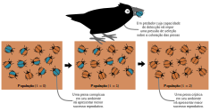
```

<br>

Ao modelar a seleção natural, a adaptabilidade (ou _fitness_) reprodutiva de um genótipo se refere à sua contribuição para (ou a probabilidade de) sobrevivência ($l$), fecundidade e fecundabilidade ($m$), fertilidade ($n$) e viabilidade ($o$) dos indivíduos daquele genótipo.

<br>

```{r bettlescycle, echo = FALSE, fig.align = 'center', out.width="600px", fig.cap="."}
knitr::include_graphics("figs/fitness_life_cylcle.svg")
```

<br>

Se considerarmos o potencial efeito desses parâmetros no sucesso repodutivo de cada genótipo formado pelos alelos $1$ e $2$ em uma dada geração $t$, teremos:

<br>

| Genótipo | Número de\n indivíduos| Sobrevivência | Fecundidade | Fertilidade | Viabilidade | 
| :---: | :---: | :---: | :---: | :---: | :---: |
| $D(11)$ | $p^2N_t$ | $\color{blue}{l_{11}}$ | $\color{green}{m_{11}}$ | $\color{goldenrod}{n_{11}}$ | $\color{red}{o_{11}}$ |
| $H(12)$ | $2pqN_t$ | $\color{blue}{l_{12}}$ | $\color{green}{m_{12}}$ | $\color{goldenrod}{n_{12}}$ |$\color{red}{o_{12}}$ | 
| $R(22)$ | $q^2N_t$ | $\color{blue}{l_{22}}$ | $\color{green}{m_{22}}$ | $\color{goldenrod}{n_{22}}$ |$\color{red}{o_{22}}$ |

<br>

Assim, o número esperado de indivíduos de um determinado genótipo na próxima geração, dado o seu sucesso reprodutivo será...

... para o genótipo homozigoto dominante $D(11)$:

$$ D_{t+1} = p^2 N_t \color{blue}{l_{11}} \color{green}{m_{11}} \color{goldenrod}{n_{11}} \color{red}{o_{11}}$$

<br>

... para o genótipo heterozigoto $H(12)$:

$$ H_{t+1} = 2pq N_t \color{blue}{l_{12}} \color{green}{m_{12}} \color{goldenrod}{n_{12}} \color{red}{o_{12}}$$

<br>

... e para o genótipo homozigoto recessivo $R(22)$:

$$ R_{t+1} = q^2 N_t \color{blue}{l_{22}} \color{green}{m_{22}} \color{goldenrod}{n_{22}} \color{red}{o_{22}}$$

<br>

E desta forma, a resultante do produto dos parâmetros $l$, $m$, $n$ e $o$ corresponderá ao valor da adaptabilidade reprodutiva absoluta ($W$) da cada genótipo, onde:

$$\color{blue}{l_{11} m_{11} n_{11} o_{11}} = \color{blue}{W_{11}}$$

$$ \color{green}{l_{12} m_{12} n_{12} o_{12}} = \color{green}{W_{12}}$$

$$ \color{red}{l_{22} m_{22} n_{22} o_{22}} = \color{red}{W_{22}}$$ 

<br>

## Adaptabilidade reprodutiva relativa

As medidas de adaptabilidade reprodutiva absoluta podem variar consideravelmente entre as diferentes linhagens evolutivas, sendo assim mais prático utilizar uma medida padronizada desses valores. 

Ao dividir a adaptabilidade reprodutiva absoluta  de cada genótipo pela adaptabilidade máxima observada entre todos os genótipos, convertemo-os assim em uma medida de adaptabilidade reprodutiva relativa ($w$), definidos como:

<br>

$$\color{blue}{w_{11}}= \frac{\color{blue}{l_{11} m_{11} n_{11} o_{11}}}{\max\left(l_{ij} m_{ij} n_{ij} o_{ij} \right)} = \frac{ \color{blue}{W_{11}}}{W_{\max}}$$

<br>

$$\color{green}{w_{12}}= \frac{ \color{green}{l_{12} m_{12} n_{12} o_{12}}}{\max\left(l_{ij} m_{ij} n_{ij} o_{ij} \right)} = \frac{ \color{green}{W_{12}}}{W_{\max}}$$

<br>

$$\color{red}{w_{22}}= \frac{ \color{red}{l_{22} m_{22} n_{22} o_{22}}}{\max\left(l_{ij} m_{ij} n_{ij} o_{ij} \right)} = \frac{ \color{red}{W_{22}}}{W_{\max}}$$

<br>

## Modelando uma geração de seleção

Dada adaptabilidade reprodutiva relativa de cada genótipo e a expectitiva de cruzamento ao acaso do princípio de Hardy-Weinberg, podemos definir a expectativa das frequências genotípicas após uma geração de seleção natural geração como sendo ... 

... para o alelo $1$:  

$$ 
\begin{aligned}
p_{t+1} 
&= \frac{p^2 N_t \color{blue}{w_{11}} + pq N_t \color{green}{w_{12}}}{p^2 N_t \color{blue}{w_{11}} + 2pq N_t \color{green}{w_{12}} + q^2 N_t \color{red}{w_{22}}} \\
\\
&= \frac{N_t \left( p^2 \color{blue}{w_{11}} + pq \color{green}{w_{12}} \right)}{N_t \left( p^2 \color{blue}{w_{11}} + 2pq \color{green}{w_{12}} + q^2 \color{red}{w_{22}}\right)} \\
\\
&= \frac{p^2 \color{blue}{w_{11}} + pq \color{green}{w_{12}}}{p^2 \color{blue}{w_{11}} + 2pq \color{green}{w_{12}} + q^2 \color{red}{w_{22}}}
\end{aligned}
$$
<br>

... e para o alelo $2$:  

$$ 
\begin{aligned}
q_{t+1} 
&= \frac{q^2 N_t \color{red}{w_{22}} + pq N_t \color{green}{w_{12}}}{p^2 N_t \color{blue}{w_{11}} + 2pq N_t \color{green}{w_{12}} + q^2 N_t \color{red}{w_{22}}} \\
\\
&= \frac{N_t \left( q^2 \color{red}{w_{22}} + pq \color{green}{w_{12}} \right)}{N_t \left( p^2 \color{blue}{w_{11}} + 2pq \color{green}{w_{12}} + q^2 \color{red}{w_{22}}\right)} \\
\\
&= \frac{q^2 \color{red}{w_{22}} + pq \color{green}{w_{12}}}{p^2 \color{blue}{w_{11}} + 2pq \color{green}{w_{12}} + q^2 \color{red}{w_{22}}}
\end{aligned}
$$

<br>

Assim, cada genótipo irá contribuir com genes para a próxima geração ponderadamente a sua adaptabilidade reprodutiva relativa, e a soma da contribuição ponderada de todos os genótipos é definida como a adaptabilidade reprodutiva média
da população ($\bar{w}$), de forma que:

<br>

$$\bar{w} = p^2 w_{11} + 2pq w_{12} +  q^2 w_{22}$$


<br>

Perceba que $\bar{w}$ irá diferir da proporção total da população antes da seleção toda vez que ($w<1$) para qualquer um dos genótipos, e a diferença entre esse total inicial e a adaptabilidade reprodutiva média ($1 - \bar{w}$) irá refletir a parcela da população que foi eliminada pela seleção. 

<br>

Desta forma, para cada genótipo, temos:

<br>

| Parâmetro | $D(11)$ | $H(12)$ | $R(22)$ | Total | 
| :--- | :---: | :---: | :---: | :---: | 
| Adaptabilidade \n reprodutiva relativa | $w_{11}$ | $w_{12}$ | $w_{22}$ | $-$ |
| Frequência ($t$) | $p^2$ | $2pq$ | $q^2$ | $1$ | 
| Contribuição ponderada | $p^2 \cdot w_{11}$ | $2pq \cdot w_{12}$ | $q^2 \cdot w_{22}$ | $\bar{w}$ |
| Frequência ($t+1$) | $\frac{p^2 \cdot w_{11}}{\bar{w}}$ | $\frac{2pq \cdot w_{12}}{\bar{w}}$ | $\frac{q^2 \cdot w_{22}}{\bar{w}}$ | $1$ |

<br>

Ao padronizar as contribuições genotípicas dos indivíduos, pode-se estimar as freqüências alélicas para a próxima geração como:

<br>

$$p_{t+1} = \frac{p^2 w_{11} + pq w_{12}}{\bar{w}}$$

<br>

$$q_{t+1} = \frac{q^2 w_{22} + pq w_{12}}{\bar{w}}$$

<br>

Assim, a cada geração de seleção natural, é necessário estimar a contribuição ponderada de cada genótipo para a geração seguinte, que dependerá das frequências alélicas que seguem evoluindo ao longo das gerações. E como a adaptabilidade reprodutiva média da população, que relativiza as frequências alélicas após uma geração de seleção, também irá mudar de geração para geração, um modelo geral para estimar as frequências alélicas em uma dada geração $t$ não é possível de ser estabelecido.

Contudo essa modelagem da seleção natural de uma geração para a outra pode ser repetido passo-a-passo por várias gerações, algoritmo esse que é facilmente calculado em uma planilha eletrônica (ver [aqui](link para a planilha)).

<br>

Modelos de seleção natural são melhor compreendidos usando uma medida conhecida como coeficiente de seleção ($s$), que é o oposto de adaptabilidade ($w$).

Como a adaptabilidade reprodutiva representa o sucesso reprodutivo de um genótipo, enquanto que o coeficiente de seleção corresponde a parcela dos indivíduos que não sobreviveram ou se reproduziram.

O valores de $w$ e $s$ podem também ser interpretados como:

<br>

- a probabilidade de um indivíduo de um dado genótipo de sobreviver e se reproduzir, ou de ser eliminado por seleção; ou

<br>

- a proporção dos alelos que serão passados para a próxima geração, ou que serão removidos do _pool_ gênico por seleção.

As duas medidas estão relacionadas, de forma que:

<br>

$$w+s=1$$
<br>

Assim, a adaptabilidade reprodutiva pode ser expressa em função do coeficiente de seleção, onde:

<br>

$$w=1-s$$
<br>

## Tipos de de seleção gênica

<br>

```{r HbS, echo = FALSE, fig.align = 'center', out.width="600px", fig.cap="Hemácias com traços falcêmicos, promovidos pelo alelo HbS da cadeia da beta-globina, apresentam maior resistência à infecções por malária. Este é um polimorfismo balanceado, no qual a seleção natural favorece uma frequência de alelo intermediária devido a um equilíbrio estável de contribuições de aptidão positivas (resistência a malária) e negativas (anemia) para os excessos médios dos alelos polimórficos."}
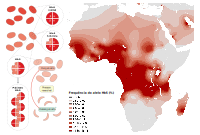
```

<br>

:::reference

Grosse et al 2011. doi: [10.1016/j.amepre.2011.09.013](https://doi.org/10.1016/j.amepre.2011.09.013)

Elguero et al 2015. doi: [10.1073/pnas.1505665112](https://doi.org/10.1073/pnas.1505665112)

Kato et al 2018. doi: [10.1038/nrdp.2018.10](https://doi.org/10.1038/nrdp.2018.10)

:::

<br>


A depender da adaptabilidade reprodutiva relativa de cada genótipo, quatro tipos de seleção gênica poderão ocorrer:

- [Seleção contra o recessivo][]

- [Seleção a favor do dominante][]

- [Seleção a favor do heterozigoto][]

- [Seleção contra o heterozigoto][]

Perceba que, independentemente dos genótipos favorecidos ou desvantajosos, a seleção natural irá promover o aumento da adaptabilidade reprodutiva média da população, e com o passar das gerações, $\bar{w} \to 1$.

<br>

### Seleção contra o recessivo 

Também chamada de **seleção negativa** ou **seleção purificadora**, esse tipo de seleção elimina
polimorfismos deletérios (tipicamente recessivos).

Neste tipo de seleção, a adaptabilidade reprodutiva dos genótipos é expressa como:

$$ \color{green}{w_{11} = w_{12} = 1}$$

$$ \color{red}{w_{22} = 1-s}$$


Em uma grande parte dos casos, envolve alelos letais ou estéreis ($s=1$).

Casos de forte seleção negativa produzem uma diminuição no nível de variação em torno do locus sob seleção. A eliminação incidental de alelos não deletérios devido a ligação genética com alelos deletérios é chamada
de seleção de fundo (do inglês, _backgound selection_; Charlesworth et al [1993](https://doi.org/10.1093/genetics/134.4.1289); Charlesworth [2012](https://doi.org/10.1534/genetics.111.134288), [2013](https://doi.org/10.1093/jhered/ess136)).

Na seleção contra o recessivo:

- a frequência  do alelo recessivo ($q$) diminui rapidamente nas primeiras gerações de seleção, e com o tempo, $q \to 0$.

- a quantidade de mudança evolutiva ($\Delta q$) é negativa ao longo das gerações, porque a frequência alélica $q$ está diminuindo, e com o tempo, ($\Delta q \to 0$); e

- a adaptabilidade reprodutiva média $\bar{w}$ da população aumenta a cada geração, e com o tempo, $\bar{w} \to 1$.

<br>

```{r negativeselection, echo = FALSE, warning = FALSE, fig.align = 'center', out.width = "800px", fig.cap="A frequência  do alelo recessivo (esquerda), a quantidade de mudança evolutiva (centro) e a adaptabilidade reprodutiva média (direita) na seleção contra o recessivo."} 
## Dependências
library("ggplot2")
library("latex2exp")
library("patchwork")

## Parâmetros
T <- 1:50           ## Gerações
q <- 0.5            ## Frequência inicial do alelo recessivo
w11 <- 1            ## Adaptabilidade reprodutiva do genótipo homozigoto dominante
w12 <- 1            ## Adaptabilidade reprodutiva do genótipo heterozigoto
w22 <- 0.5          ## Adaptabilidade reprodutiva do genótipo homozigoto recessivo
q0 <- rep(0.5,50)   ## Frequência do alelo recessivo ao longo das gerações
Dq <- rep(q0[2]-q0[1],49)   ## A mudança evolutiva ao longo das gerações
wbar <- rep(w11*(1-q0[1])^2 + w12*2*(q0[1]*(1-q0[1])) + w22*q0[1]^2,50)   ## A adaptabilidade reprodutiva média ao longo das gerações

## Modelos
for( t in 2:max(T)){
  q0[t] <- ( w22*q0[t-1]^2 + w12*(q0[t-1]*(1-q0[t-1])) ) / ( w11*(1-q0[t-1])^2 + w12*2*(q0[t-1]*(1-q0[t-1])) + w22*q0[t-1]^2 )
}

Dq[T] <- q0[T+1] - q0[T]

wbar[T] <- w11*(1-q0[T])^2 + w12*2*(q0[T]*(1-q0[T])) + w22*q0[T]^2


## Gráficos
data1401 <- data.frame(T, q0, Dq, wbar)
ggplot(data = data1401, aes(x = T)) +
  geom_line(aes(y = q0), color = "royalblue3", lwd = 1) +
  labs(x = "Geração", y = "Frequência do alelo recessivo") +
  xlim(0, 50) +
  ylim(0, 0.5) +
  annotate(geom='text', x=25, y=0.5, parse = TRUE, color="green4", label=TeX("$ w_{11} = w_{12} = 1$")) +
  annotate(geom='text', x=25, y=0.45, parse = TRUE, color="firebrick2", label=TeX("$w_{22} = 0.5$")) +
ggplot(data = data1401, aes(x = T)) +
  geom_line(aes(y = Dq), color = "deepskyblue3", lwd = 1) +
  labs(x = "Geração", y = "Mudança evolutiva") +
  xlim(0, 50) +
  ylim(-0.08, 0) +
ggplot(data = data1401, aes(x = T)) +
  geom_line(aes(y = wbar), color = "goldenrod", lwd = 1) +
  labs(x = "Geração", y = "Adaptabilidade reprodutiva média") +
  xlim(0, 50) +
  ylim(0.85, 1)
```

<br>

### Seleção a favor do dominante

Também chamada de **seleção positiva** ou **seleção direcional**, esse tipo de seleção favorece o
aumento de um determinado alelo na população (tipicamente dominante ou co-dominante).

Neste tipo de seleção, a adaptabilidade reprodutiva dos genótipos pode ser expressa como:

$$ \color{green}{w_{11} = 1}$$

$$ \color{goldenrod}{w_{12} = 1-hs}$$

$$ \color{red}{w_{22} = 1-s}$$

onde $h$ é o grau de dominância entre os alelos, de forma que o alelo $1$ será dominante quando $h=0$, o alelo $2$ será dominante quando $h=1$, e os alelos serão codominantes para todo $0<h<1$.

Perceba que em um locus gênico bialélico com dominãncia completa, a seleção contra o recessivo e a seleção a favor do dominante levarão praticamente ao mesmo tipo de seleção; contudo, em um locus multialélico, a seleção a favor do dominante irá favorecer um determinado alelo em detrimento de outros alelos dominantes e/ou codominantes, fazendo que a a frequência alélica mude em direção ao aumento daquele alelo mais vantajoso.

O aumento da frequência de alelos vantajosos arrasta com ele polimorfismos neutros que estão em regiões gênicas ligadas, promovendo um tipo especial de seleção de fundo conhecido como **carona genética** (do inglês, _genetic hitchhiking_; [Maynard-Smith & Haigh 1974](https://doi.org/10.1017/S0016672300014634), [Gillespie 2000](https://doi.org/10.1093/genetics/155.2.909)).

Casos de forte ou rápida seleção positiva são conhecidos como **varredura seletiva** (do inglês, _selective sweep_; ver também [Hermisson & Pennings 2005](https://doi.org/10.1534/genetics.104.036947) e [Pennings & Hermisson 2006](https://doi.org/10.1093/molbev/msj117)).

Assim, na seleção a favor do dominante:

- a frequência  do alelo dominante ($p$) aumenta rapidamente nas primeiras gerações de seleção, e com o tempo, $p \to 1$.

- a quantidade de mudança evolutiva ($\Delta p$) é positiva ao longo das gerações, porque a frequência alélica $p$ está aumentando, mas com o tempo, ($\Delta p \to 0$); e

- a adaptabilidade reprodutiva média $\bar{w}$ da população aumenta a cada geração, de forma que $\bar{w} \to 1$.

<br>

```{r positiveselection, echo = FALSE, warning = FALSE, fig.align = 'center', out.width = "800px", fig.cap="A frequência  do alelo dominate (esquerda), a quantidade de mudança evolutiva (centro) e a adaptabilidade reprodutiva média (direita) na seleção a favor do dominante."} 
## Dependências
library("ggplot2")
library("latex2exp")
library("patchwork")

## Parâmetros
T <- 1:50           ## Gerações
p <- 0.5            ## Frequência inicial do alelo dominante
w11 <- 1            ## Adaptabilidade reprodutiva do genótipo homozigoto dominante
w12 <- 0.75            ## Adaptabilidade reprodutiva do genótipo heterozigoto
w22 <- 0.5          ## Adaptabilidade reprodutiva do genótipo homozigoto recessivo
p0 <- rep(0.5,50)   ## Frequência do alelo recessivo ao longo das gerações
Dp <- rep(p0[2]-p0[1],49)   ## A mudança evolutiva ao longo das gerações
wbar <- rep(w11*p0[1]^2 + w12*2*p0[1]*(1-p0[1]) + w22*(1-p0[1])^2,50)   ## A adaptabilidade reprodutiva média ao longo das gerações

## Modelos
for( t in 2:max(T)){
  p0[t] <- ( w11*p0[t-1]^2 + w12*(p0[t-1]*(1-p0[t-1])) ) / ( w11*p0[t-1]^2 + w12*2*p0[t-1]*(1-p0[t-1]) + w22*(1-p0[t-1])^2)
}

Dp[T] <- p0[T+1] - p0[T]

wbar[T] <- w11*p0[T]^2 + w12*2*p0[T]*(1-p0[T]) + w22*(1-p0[T])^2


## Gráficos
data1402 <- data.frame(T, p0, Dq, wbar)
ggplot(data = data1402, aes(x = T)) +
  geom_line(aes(y = p0), color = "royalblue3", lwd = 1) +
  labs(x = "Geração", y = "Frequência do alelo dominante") +
  xlim(0, 50) +
  ylim(0.5, 1) +
  annotate(geom='text', x=25, y=0.60, parse = TRUE, color="green4", label=TeX("$ w_{11} = 1$")) +
  annotate(geom='text', x=25, y=0.55, parse = TRUE, color="goldenrod", label=TeX("$w_{12} = 0.75$")) +
  annotate(geom='text', x=25, y=0.50, parse = TRUE, color="firebrick2", label=TeX("$w_{22} = 0.5$")) +
ggplot(data = data1401, aes(x = T)) +
  geom_line(aes(y = Dp), color = "deepskyblue3", lwd = 1) +
  labs(x = "Geração", y = "Mudança evolutiva") +
  xlim(0, 50) +
  ylim(0, 0.08) +
ggplot(data = data1401, aes(x = T)) +
  geom_line(aes(y = wbar), color = "goldenrod", lwd = 1) +
  labs(x = "Geração", y = "Adaptabilidade reprodutiva média") +
  xlim(0, 50) +
  ylim(0.85, 1)
```

<br>


<br>

### Seleção a favor do heterozigoto 

Também chamada de **sobredominância**, ocorre quando heterozigotos têm uma aptidão maior do que os
homozigotos, de forma que a adaptabilidade reprodutiva dos genótipos sejam:

$$ \color{red}{w_{11} = 1-s_1}$$

$$ \color{green}{w_{12} = 1}$$

$$ \color{red}{w_{22} = 1-s_2}$$

Este processo promove a conservação de polimorfismos genéticos, impedindo que alelos sejam perdidos por deriva genética, sendo assim um processo de **seleção balanceadora** (do inglês, _balancing selection_) que leva a um equilíbrio estável das frequências alélicas.

A vantagem do heterozigoto é o principal mecanismo subjacente da **heterose** (do inglês, _heterosis_), ou "vigor híbrido", que é a função melhorada ou aumentada de qualquer qualidade biológica em uma prole híbrida, geralmente por conta do o mascaramento de alelos recessivos deletérios em linhagens puras ou isoladas.

<br>

```{r overdominance, echo = FALSE, warning = FALSE, fig.align = 'center', out.width = "800px", fig.cap="A frequência  do alelo dominante na seleção a favor do heterozigoto, mostrando o processo de seleção balanceadora estável."} 
## Dependências
library("ggplot2")
library("latex2exp")
library("patchwork")

## Parâmetros
T <- 1:50           ## Gerações
p <- 0.5            ## Frequência inicial do alelo dominante
w11 <- 0.75         ## Adaptabilidade reprodutiva do genótipo homozigoto dominante
w12 <- 1            ## Adaptabilidade reprodutiva do genótipo heterozigoto
w22 <- 0.75         ## Adaptabilidade reprodutiva do genótipo homozigoto recessivo
p0 <- rep(0.95,50)  ## Frequência do alelo dominante ao longo das gerações
p1 <- rep(0.75,50)  ## Frequência do alelo dominante ao longo das gerações
p2 <- rep(0.55,50)  ## Frequência do alelo dominante ao longo das gerações
p3 <- rep(0.45,50)  ## Frequência do alelo dominante ao longo das gerações
p4 <- rep(0.25,50)  ## Frequência do alelo dominante ao longo das gerações
p5 <- rep(0.05,50)  ## Frequência do alelo dominante ao longo das gerações

Dp <- rep(p0[2]-p0[1],49)   ## A mudança evolutiva ao longo das gerações
wbar <- rep(w11*p0[1]^2 + w12*2*p0[1]*(1-p0[1]) + w22*(1-p0[1])^2,50)   ## A adaptabilidade reprodutiva média ao longo das gerações

## Modelos
for( t in 2:max(T)){
  p0[t] <- ( w11*p0[t-1]^2 + w12*(p0[t-1]*(1-p0[t-1])) ) / ( w11*p0[t-1]^2 + w12*2*p0[t-1]*(1-p0[t-1]) + w22*(1-p0[t-1])^2)
  p1[t] <- ( w11*p1[t-1]^2 + w12*(p1[t-1]*(1-p1[t-1])) ) / ( w11*p1[t-1]^2 + w12*2*p1[t-1]*(1-p1[t-1]) + w22*(1-p1[t-1])^2)
  p2[t] <- ( w11*p2[t-1]^2 + w12*(p2[t-1]*(1-p2[t-1])) ) / ( w11*p2[t-1]^2 + w12*2*p2[t-1]*(1-p2[t-1]) + w22*(1-p2[t-1])^2)
  p3[t] <- ( w11*p3[t-1]^2 + w12*(p3[t-1]*(1-p3[t-1])) ) / ( w11*p3[t-1]^2 + w12*2*p3[t-1]*(1-p3[t-1]) + w22*(1-p3[t-1])^2)
  p4[t] <- ( w11*p4[t-1]^2 + w12*(p4[t-1]*(1-p4[t-1])) ) / ( w11*p4[t-1]^2 + w12*2*p4[t-1]*(1-p4[t-1]) + w22*(1-p4[t-1])^2)
  p5[t] <- ( w11*p5[t-1]^2 + w12*(p5[t-1]*(1-p5[t-1])) ) / ( w11*p5[t-1]^2 + w12*2*p5[t-1]*(1-p5[t-1]) + w22*(1-p5[t-1])^2)
}

## Gráficos
data1403 <- data.frame(T, p0, p1, p2, p3)
ggplot(data = data1403, aes(x = T)) +
  geom_line(aes(y = p0), color = "royalblue3", lwd = 1) +
  geom_line(aes(y = p1), color = "deepskyblue3", lwd = 1) +
  geom_line(aes(y = p2), color = "green4", lwd = 1) +
  geom_line(aes(y = p3), color = "goldenrod", lwd = 1) +
  geom_line(aes(y = p4), color = "chocolate", lwd = 1) +
  geom_line(aes(y = p5), color = "firebrick2", lwd = 1) +
  labs(x = "Geração", y = "Frequência do alelo dominante") +
  xlim(0, 50) +
  ylim(0, 1) +
  annotate(geom='text', x=25, y=1, parse = TRUE, color="firebrick2", label=TeX("$ w_{11} = w_{22} = 0.75$")) +
  annotate(geom='text', x=25, y=0.9, parse = TRUE, color="green4", label=TeX("$w_{12} = 1$"))
```

<br>

### Seleção contra o heterozigoto 

Também chamada de **subdominância**, ocorre quando heterozigotos têm uma aptidão menor do que os
homozigotos, de forma que a adaptabilidade reprodutiva dos genótipos sejam, por exemplo:

$$ \color{green}{w_{11} = 1}$$

$$ \color{red}{w_{12} = 1-s}$$

$$ \color{green}{w_{22} = 1}$$

Esse tipo de seleção também promove seleção balanceadora, mas que resulta em um equilíbrio instável das frequências alélicas.

Envolve muitas vezes polimorfismos adaptados a condições locais de diferentes subpopulações, e desta froma, hidridos, ao apresentar fenótipos intermediários, irão ter menor adaptabilidade nos ambientes dos parentais. 

O acúmulo dessas incompatibilidades ao longo do tempo pode levar à especiação, como previsto pelo modelo Bateson–Dobzhansky–Muller de isolamento pós-zigótico ([Orr 1996](https://doi.org/10.1093/genetics/144.4.1331)).

<br>

```{r underdominance, echo = FALSE, warning = FALSE, fig.align = 'center', out.width = "800px", fig.cap="A frequência  do alelo dominante na seleção contra o heterozigoto, mostrando o processo de seleção balanceadora instável."} 
## Dependências
library("ggplot2")
library("latex2exp")
library("patchwork")

## Parâmetros
T <- 1:50           ## Gerações
p <- 0.5            ## Frequência inicial do alelo dominante
w11 <- 1            ## Adaptabilidade reprodutiva do genótipo homozigoto dominante
w12 <- 0.75         ## Adaptabilidade reprodutiva do genótipo heterozigoto
w22 <- 1            ## Adaptabilidade reprodutiva do genótipo homozigoto recessivo
p0 <- rep(0.95,50)  ## Frequência do alelo dominante ao longo das gerações
p1 <- rep(0.75,50)  ## Frequência do alelo dominante ao longo das gerações
p2 <- rep(0.55,50)  ## Frequência do alelo dominante ao longo das gerações
p3 <- rep(0.45,50)  ## Frequência do alelo dominante ao longo das gerações
p4 <- rep(0.25,50)  ## Frequência do alelo dominante ao longo das gerações
p5 <- rep(0.05,50)  ## Frequência do alelo dominante ao longo das gerações

Dp <- rep(p0[2]-p0[1],49)   ## A mudança evolutiva ao longo das gerações
wbar <- rep(w11*p0[1]^2 + w12*2*p0[1]*(1-p0[1]) + w22*(1-p0[1])^2,50)   ## A adaptabilidade reprodutiva média ao longo das gerações

## Modelos
for( t in 2:max(T)){
  p0[t] <- ( w11*p0[t-1]^2 + w12*(p0[t-1]*(1-p0[t-1])) ) / ( w11*p0[t-1]^2 + w12*2*p0[t-1]*(1-p0[t-1]) + w22*(1-p0[t-1])^2)
  p1[t] <- ( w11*p1[t-1]^2 + w12*(p1[t-1]*(1-p1[t-1])) ) / ( w11*p1[t-1]^2 + w12*2*p1[t-1]*(1-p1[t-1]) + w22*(1-p1[t-1])^2)
  p2[t] <- ( w11*p2[t-1]^2 + w12*(p2[t-1]*(1-p2[t-1])) ) / ( w11*p2[t-1]^2 + w12*2*p2[t-1]*(1-p2[t-1]) + w22*(1-p2[t-1])^2)
  p3[t] <- ( w11*p3[t-1]^2 + w12*(p3[t-1]*(1-p3[t-1])) ) / ( w11*p3[t-1]^2 + w12*2*p3[t-1]*(1-p3[t-1]) + w22*(1-p3[t-1])^2)
  p4[t] <- ( w11*p4[t-1]^2 + w12*(p4[t-1]*(1-p4[t-1])) ) / ( w11*p4[t-1]^2 + w12*2*p4[t-1]*(1-p4[t-1]) + w22*(1-p4[t-1])^2)
  p5[t] <- ( w11*p5[t-1]^2 + w12*(p5[t-1]*(1-p5[t-1])) ) / ( w11*p5[t-1]^2 + w12*2*p5[t-1]*(1-p5[t-1]) + w22*(1-p5[t-1])^2)
}

## Gráficos
data1404 <- data.frame(T, p0, p1, p2, p3)
ggplot(data = data1404, aes(x = T)) +
  geom_line(aes(y = p0), color = "royalblue3", lwd = 1) +
  geom_line(aes(y = p1), color = "deepskyblue3", lwd = 1) +
  geom_line(aes(y = p2), color = "green4", lwd = 1) +
  geom_line(aes(y = p3), color = "goldenrod", lwd = 1) +
  geom_line(aes(y = p4), color = "chocolate", lwd = 1) +
  geom_line(aes(y = p5), color = "firebrick2", lwd = 1) +
  labs(x = "Geração", y = "Frequência do alelo dominante") +
  xlim(0, 50) +
  ylim(0, 1) +
  annotate(geom='text', x=25, y=0.55, parse = TRUE, color="firebrick2", label=TeX("$ w_{11} = w_{22} = 0.75$")) +
  annotate(geom='text', x=25, y=0.45, parse = TRUE, color="green4", label=TeX("$w_{12} = 1$"))
```

<br>

:::reference 

Bateson 1909. doi: [10.1017/CBO9780511693953.007](https://doi.org/10.1017/CBO9780511693953.007)

Dobzhansky 1934. doi: [10.1007/BF00374056](https://doi.org/10.1007/BF00374056)

Muller 1942. [Biology Symposium 6, 71–125](https://www.ucl.ac.uk/taxome/lit/muller%201942%20new%20enh.pdf)

:::

<br>

## Exercícios

### Exercício 1 -- Resistência a inseticidas

A resistência a inseticidas organofosfatados e carbamatados em espécies de mosquitos _Culex_ e _Anopheles_ pode ser mediada por quatro mutações independentes no gene da acetilcolinesterase (ace-1). As mutações, resultando em G119S (uma glicina, na posição 119, substituída por uma serina), tornam a enzima insensível à inibição por essses inseticidas ([Weill et al 2004](https://doi.org/10.1111/j.1365-2583.2004.00452.x)).

Desta forma, responda:

a. Que tipo de seleção essa variante mutante irá promover?

b. Se os mosquitos que possuem esse alelo de resistência pudessem sobreviver e se reproduzir 10 vezes mais do que os que possuem o alelo sensível, quanto tempo levaria para que a frequência do alelo mudasse de $p_{G119S} = 0.01$ para $p_{G119S} = 0.5$?

<br>

### Exercício 2 -- 

<br>

<!--chapter:end:14_selecao.Rmd-->

# Simulações em genética de populações

.\linebreak

## Capítulo 1

.\linebreak

### Exercício 1

xxx

.\linebreak

### Exercício 2

xxx

.\linebreak

### Exercício 3

xxx

<!--chapter:end:15_populus.Rmd-->

# Resolução dos Exercícios

.\linebreak

## Capítulo 1

.\linebreak

### Exercício 1

xxx

.\linebreak

### Exercício 2

xxx

.\linebreak

### Exercício 3

xxx

<!--chapter:end:16_resolucao.Rmd-->

